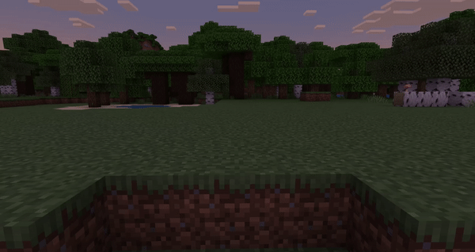
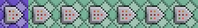
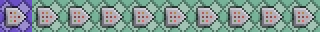
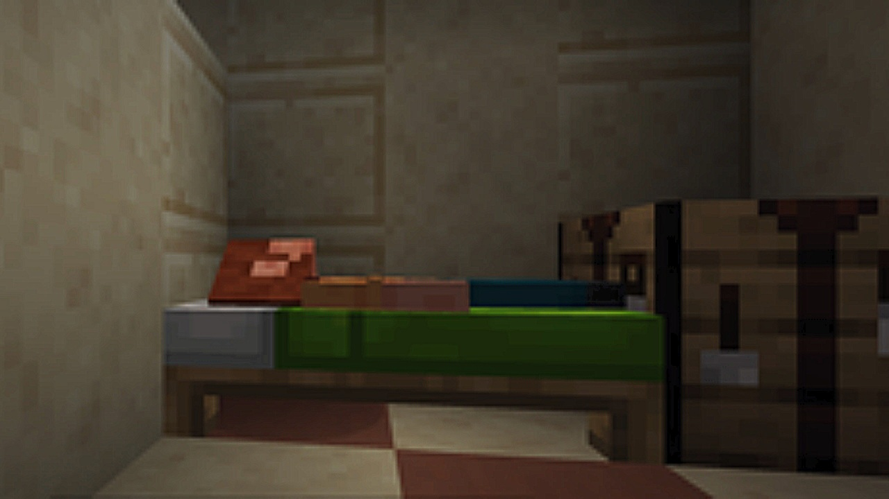
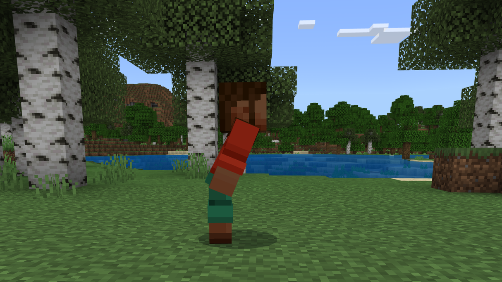
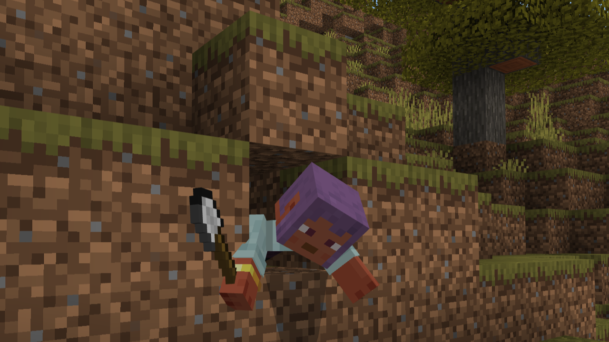
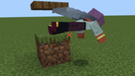
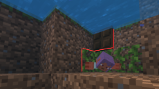
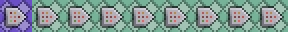

## 介绍

[来源：Bedrock Commands 社区 Discord](https://discord.gg/SYstTYx5G5)

[图片来源：非官方 Minecraft 维基 - ](https://minecraft.wiki/)**[CC BY-NC-SA 3.0](https://creativecommons.org/licenses/by-nc-sa/3.0/)**

这些命令技术允许你检测特定玩家/实体的“状态”，并随后执行你所需的命令。

> 注意：为了更高效和更高精度的方法，建议使用 [动画控制器](../animation-controllers/animation-controllers-intro.md)

## is_moving

此技术允许你检测目标是否在移动，即使是细微的移动也会被考虑。



:::warning 已知问题：

1. 在望远镜缩放或缓慢效果等级6或更高时，不考虑移动。
2. 跳跃会导致检测触发两次。
   :::

**命令：**

- 确保添加 `is_moving` 记分板目标：
    - `/scoreboard objectives add is_moving dummy`

<CodeHeader>BP/functions/states/player/is_moving.mcfunction</CodeHeader>

```yaml
## 移动检测
### 标记为未移动
execute as @a at @s positioned ~~10000~ if entity @e [type=leash_knot, r=0.1252] run scoreboard players set @s is_moving 0
### 标记为移动
execute as @a at @s positioned ~~10000~ unless entity @e [type=leash_knot, r=0.1252] run scoreboard players add @s is_moving 1

## 更新点
### 删除之前的点
execute as @e [type=leash_knot] at @s unless entity @s [y=-80, dy=9974] run kill @s
### 标记当前点
execute at @a positioned ~~10000~ run summon leash_knot ~~~

## 你的命令示例
execute as @a [scores={is_moving=0}] run say 我没有移动
execute as @a [scores={is_moving=1}] run say 我开始移动
execute as @a [scores={is_moving=1..}] run say 我仍在移动
```



你需要按照相同的顺序，并正确应用 `scores` 选择器参数，以满足你所需的命令。

**状态：**

- **`is_moving=0`** 目标**未**移动。
- **`is_moving=1`** 目标开始移动。（用于“触发”动作）
- **`is_moving=1..`** 目标仍在移动。（用于重复动作）

**每个命令的目的：**

- **命令 1：** 如果上方有一个牵引结实体，意味着他们未从前一个游戏刻的位置移动。将其标记为**未**移动（0）。
    - 牵引结是一个具有抗重力行为的原版实体，用于此系统的静态实体。
- **命令 2：** 如果上方**没有**牵引结实体，意味着他们已从前一个游戏刻的位置移动。通过增加分数将其标记为**移动**（1）。
    - 如果他们持续移动而不暂停，分数将不断增加。这允许我们每次他们开始移动时使用单次执行的命令。
- **命令 3：** 我们需要删除所有之前的“点”（杀死旧的牵引结）以最小化实体延迟。我们还将避免影响高度不在~10000范围内的任何牵引结。
    - 我们使用体积过滤器而不是简单的名称过滤器来实现，因为牵引结无法命名。
- **命令 4：** 我们将在玩家上方~10000区块位置召唤一个新的牵引结，以标记他们当前的位置，我们将在下一个游戏刻中在命令 1 和 2 中进行测试。（当此命令块链循环/重复时）
- **命令 5, 6, 7：** 这些是示例命令（针对每个状态），可以修改/扩展。

## 区分行走和短跑

如果你迫切需要**仅使用命令**单独检测行走和短跑，可以使用下面的技术。

:::warning 已知问题：
行走/短跑检测在有效果和附魔时可能无法按预期工作。
:::

<CodeHeader>BP/functions/states/player/is_moving.mcfunction</CodeHeader>

```yaml
## 移动检测
### 标记为未移动
execute as @a at @s positioned ~~10000~ if entity @e [type=leash_knot, r=0.1252] run scoreboard players set @s is_moving 0
### 标记为移动
execute as @a at @s positioned ~~10000~ unless entity @e [type=leash_knot, r=0.1252] run scoreboard players add @s is_moving 1

## 行走检测
### 标记为未行走
scoreboard players set @a is_walking 0
### 标记为行走
execute as @a at @s positioned ~~10000~ if entity @e [type=leash_knot, rm=0.21585, r=0.2805] run scoreboard players set @s is_walking 1

## 短跑检测
### 标记为未短跑
scoreboard players set @a is_sprinting 0
### 标记为短跑
execute as @a at @s positioned ~~10000~ if entity @e [type=leash_knot, rm=0.2806, r=0.9] run scoreboard players set @s is_sprinting 1

## 更新点
### 删除之前的点
execute as @e [type=leash_knot] at @s unless entity @s [y=-80, dy=9974] run kill @s
### 标记当前点
execute at @a positioned ~~10000~ run summon leash_knot ~~~

## 你的命令示例
execute as @a [scores={is_walking=0}] run say 我没有行走
execute as @a [scores={is_walking=1}] run say 我在行走
```



所有命令的功能与前述解释相同。唯一的区别在于行走/短跑检测命令中距离参数 `r` 和 `rm` 的值。

值的计算如下：
| 移动类型 | 平均速度 (米/秒<br>（区块每秒）) | 平均速度<br>（区块每游戏刻） |
| :---: | :---: | :---: |
| 行走 | 4.317 m/s | 4.317 / 20 = 0.21585 |
| 短跑 | 5.612 m/s | 5.612 / 20 = 0.28060 |
| 短跑跳跃 | 7.127 m/s | 7.127 / 20 = 0.35635 |

> 注意：由于速度变化，我们将无法正确使用行走/短跑检测的单次执行命令。因此，两者的命令将稍微简单一些。另请注意，行走时跳跃的速度在行走和短跑之间波动。

- **行走检测命令：**
    1. 默认情况下，玩家被标记为**未**行走（0）。
    2. 如果玩家的位移在 `0.21585` 和 `0.2805` 区块之间，则将玩家标记为行走（1）。
        - `0.2805` 稍低于短跑速度。
- **短跑检测命令：**
    1. 默认情况下，玩家被标记为**未**短跑（0）。
    2. 如果玩家的位移在 `0.2806` 和 `0.9` 区块之间，则将玩家标记为短跑（1）。
        - 如果你希望将短跑跳跃与短跑分开，尽管其速度波动，可以将值从 `0.9` 更改为 `0.35635`。

## is_sleeping

此技术允许你检测玩家是否在睡觉。



注意：睡觉时，玩家的碰撞盒减少到0.2区块。

**命令：**

- 确保添加 `is_sleeping` 记分板目标：
    - `/scoreboard objectives add is_sleeping dummy`

<CodeHeader>BP/functions/states/player/is_sleeping.mcfunction</CodeHeader>

```yaml
## 睡眠检测
### 标记为未睡眠
execute as @a at @s if entity @s [y=~0.3, dy=0] run scoreboard players set @s is_sleeping 0
### 标记为睡眠
execute as @a at @s unless entity @s [y=~0.3, dy=0] run scoreboard players add @s is_sleeping 1

## 你的命令示例
execute as @a [scores={is_sleeping=0}] run say 我没有睡觉
execute as @a [scores={is_sleeping=1}] run say 我开始睡觉
execute as @a [scores={is_sleeping=1..}] run say 我仍在睡觉
```


你需要按照相同的顺序，并正确应用 `scores` 选择器参数，以满足你所需的命令。

**状态：**

- **`is_sleeping=0`** 玩家**未**睡觉。
- **`is_sleeping=1`** 玩家开始睡觉。（用于“触发”动作）
- **`is_sleeping=1..`** 玩家仍在睡觉。（用于重复动作）

**每个命令的目的：**

- **命令 1：** 如果玩家的碰撞盒高于0.2区块，我们将其标记为**未**睡觉（0）。
- **命令 2：** 如果玩家的碰撞盒**不**高于0.2区块，我们将其标记为睡觉（1）通过增加分数。
    - 如果他们不停止睡觉，分数将不断增加。这允许我们每次他们开始睡觉时使用单次执行的命令。
- **命令 3, 4, 5：** 这些是示例命令（针对每个状态），可以修改/扩展。

## is_sneaking

此技术允许你检测玩家是否在潜行。



感谢在1.20.10中引入的短潜行平衡，它将玩家的碰撞盒减少到1.5区块，使仅使用命令进行正确的潜行检测成为可能，此前这需要附加包的帮助。

**命令：**

- 确保添加 `is_sneaking` 记分板目标：
    - `/scoreboard objectives add is_sneaking dummy`

<CodeHeader>BP/functions/states/player/is_sneaking.mcfunction</CodeHeader>

```yaml
## 潜行检测
### 标记为未潜行
execute as @a at @s if entity @s [y=~1.5, dy=0] run scoreboard players set @s is_sneaking 0
### 标记为潜行
execute as @a at @s unless entity @s [y=~1.5, dy=0] if entity @s [y=~0.7, dy=0] run scoreboard players add @s is_sneaking 1

## 你的命令示例
execute as @a [scores={is_sneaking=0}] run say 我没有潜行
execute as @a [scores={is_sneaking=1}] run say 我开始潜行
execute as @a [scores={is_sneaking=1..}] run say 我仍在潜行
```


你需要按照相同的顺序，并正确应用 `scores` 选择器参数，以满足你所需的命令。

**状态：**

- **`is_sneaking=0`** 玩家**未**潜行。
- **`is_sneaking=1`** 玩家开始潜行。（用于“触发”动作）
- **`is_sneaking=1..`** 玩家仍在潜行。（用于重复动作）

**每个命令的目的：**

- **命令 1：** 如果玩家的碰撞盒高于1.4区块，我们将其标记为**未**潜行（0）。
- **命令 2：** 如果玩家的碰撞盒**不**高于1.4区块，我们将其标记为潜行（1）通过增加分数。
    - 如果他们不停止潜行，分数将不断增加。这允许我们每次他们开始潜行时使用单次执行的命令。
    - 为防止在睡觉或爬行时误触发，我们还将要求他们的碰撞盒高于0.6区块。
- **命令 3, 4, 5：** 这些是示例命令（针对每个状态），可以修改/扩展。

## is_crawling

此技术允许你检测玩家是否在爬行。



注意：爬行时，玩家的碰撞盒减少到0.6区块。

:::warning 已知问题：
在水中游泳或使用鞘翅滑翔将被检测为爬行。
:::

**命令：**

- 确保添加 `is_crawling` 记分板目标：
    - `/scoreboard objectives add is_crawling dummy`

<CodeHeader>BP/functions/states/player/is_crawling.mcfunction</CodeHeader>

```yaml
## 爬行检测
### 标记为未爬行
execute as @a at @s if entity @s [y=~0.7, dy=0] run scoreboard players set @s is_crawling 0
### 标记为爬行
execute as @a at @s unless entity @s [y=~0.7, dy=0] if entity @s [y=~0.3, dy=0] run scoreboard players add @s is_crawling 1

## 你的命令示例
execute as @a [scores={is_crawling=0}] run say 我没有爬行
execute as @a [scores={is_crawling=1}] run say 我开始爬行
execute as @a [scores={is_sneaking=1..}] run say 我仍在爬行
```


你需要按照相同的顺序，并正确应用 `scores` 选择器参数，以满足你所需的命令。

**状态：**

- **`is_crawling=0`** 玩家**未**爬行。
- **`is_crawling=1`** 玩家开始爬行。（用于“触发”动作）
- **`is_crawling=1..`** 玩家仍在爬行。（用于重复动作）

**每个命令的目的：**

- **命令 1：** 如果玩家的碰撞盒高于0.6区块，我们将其标记为**未**爬行（0）。
- **命令 2：** 如果玩家的碰撞盒**不**高于0.6区块，我们将其标记为爬行（1）通过增加分数。
    - 如果他们不停止爬行，分数将不断增加。这允许我们每次他们开始爬行时使用单次执行的命令。
    - 为防止在睡觉时误触发，我们将要求他们的碰撞盒高于0.2区块。
- **命令 3, 4, 5：** 这些是示例命令（针对每个状态），可以修改/扩展。

## 区分爬行、滑翔和游泳

如果你迫切需要**仅使用命令**单独检测这三种状态，可以使用下面的技术。

:::warning 已知问题：

1. 在接触地面/天花板滑翔或直撞到墙壁时，将被检测为爬行。
2. 在没有相邻方块上下的情况下，穿戴鞘翅从方块的绝对角落爬行，将被检测为滑翔。
    - 
3. 在另一个含水方块下的含水方块中游泳，将被检测为爬行。
    - 

:::

<CodeHeader>BP/functions/states/player/is_crawling.mcfunction</CodeHeader>

```yaml
## 设置玩家状态
### 未滑翔
execute as @a at @s if entity @s [y=~0.7, dy=0] run scoreboard players set @s is_gliding 0
### 未爬行
execute as @a at @s if entity @s [y=~0.7, dy=0] run scoreboard players set @s is_crawling 0
### 未游泳
execute as @a at @s if entity @s [y=~0.7, dy=0] run scoreboard players set @s is_swimming 0

## 检测玩家状态
### 滑翔
execute as @a [hasitem={item=elytra,location=slot.armor.chest}] at @s unless entity @s [y=~0.7, dy=0] if entity @s [y=~0.3, dy=0] if block ~~1.01~ air if block ~~-0.01~ air rotated ~ 0 if block ^^1.01^-1 air if block ^^-0.01^-1 air if block ^^1.01^1 air if block ^^-0.01^1 air run scoreboard players add @s is_gliding 1
### 爬行
execute as @a [scores={is_gliding=0}] at @s unless entity @s [y=~0.7, dy=0] if entity @s [y=~0.3, dy=0] unless block ~~~ water unless block ~~1.01~ water run scoreboard players add @s is_crawling 1
### 游泳
execute as @a [scores={is_gliding=0,is_crawling=0}] at @s unless entity @s [y=~0.7, dy=0] if entity @s [y=~0.3, dy=0] run scoreboard players add @s is_swimming 1

## 你的命令示例
execute as @a [scores={is_swimming=0}] run say 我没有游泳
execute as @a [scores={is_crawling=1}] run say 我开始爬行
execute as @a [scores={is_gliding=1..}] run say 我仍在滑翔
```



**每个命令的目的：**

- **命令 1, 2, 3：** 如果玩家的碰撞盒高于0.6区块，我们将其标记为**未**滑翔/爬行/游泳（0）。
- **命令 4：** 如果玩家的碰撞盒**不**高于0.6区块，装备了鞘翅，并且其头部/胸部/脚下方没有方块，则将其标记为滑翔（1）通过增加分数。
    - 如果他们不停止滑翔，分数将不断增加。这允许我们每次他们开始滑翔时使用单次执行的命令。我们将对爬行/滑翔使用相同的方法。
    - 为防止在睡觉时误触发，我们还将要求他们的碰撞盒高于0.2区块。我们将对爬行/滑翔使用相同的方法。
- **命令 5：** 如果玩家的碰撞盒**不**高于0.6区块，且未滑翔，并且其上方/下方没有水块，则将其标记为爬行（1）通过增加分数。
- **命令 6：** 如果玩家的碰撞盒**不**高于0.6区块，且未滑翔或爬行，则将其标记为游泳（1）通过增加分数。
- **命令 7, 8, 9：** 这些是示例命令（针对每个状态），可以修改/扩展。

## 文件夹结构

如果你使用函数，你的文件夹结构可能如下所示：

<FolderView
	:paths="[
    'BP',
    'BP/functions',
    'BP/manifest.json',
    'BP/pack_icon.png',
    'BP/functions/states',
    'BP/functions/states/player',
    'BP/functions/states/player/is_moving.mcfunction',
    'BP/functions/states/player/is_sleeping.mcfunction',
    'BP/functions/states/player/is_crawling.mcfunction',
    'BP/functions/tick.json'
]"
></FolderView>