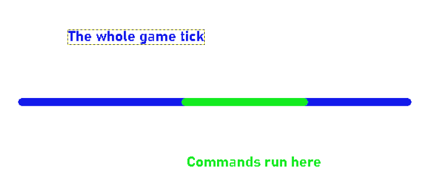

## 介绍

[来源于 Bedrock Commands 社区 Discord](https://discord.gg/SYstTYx5G5)

此系统将在玩家离开世界时运行你所需的命令。

> 注意：你无法使用目标选择器对离开的*玩家*执行命令。但是，你可以使用 [玩家加入时](../commands/on-player-join.md) 系统在他们重新加入时执行命令。

## 设置

*在聊天中输入：*

`/scoreboard objectives add total dummy`

如果你正在使用函数并希望在世界初始化时自动添加目标，请按照 [首次加载世界](../commands/on-first-world-load.md) 中概述的过程进行操作。

## 系统

<CodeHeader>BP/functions/events/player/on_leave.mcfunction</CodeHeader>

```yaml
## 实体计数器
### 重置当前玩家数量
scoreboard players reset NewPlayerCount total
### 获取当前玩家数量 
execute as @a run scoreboard players add NewPlayerCount total 1

## 获取差异（当前 - 之前）
scoreboard players operation newPlayerCount total -= playerCount total

## 在此处输入你的命令（示例）
### 如果差异为 -1 或更少则发送消息
execute if score newPlayerCount total matches ..-1 run say 一名玩家已离开世界

## 实体计数器
### 重置当前玩家数量
scoreboard players reset playerCount total
### 获取当前玩家数量（以便在下一个游戏刻检查差异）
execute as @a run scoreboard players add playerCount total 1
```


在这里，我们使用了 `/say` 命令作为示例，但你可以使用任何你喜欢的命令，并根据需要使用多个命令。

只需确保遵循给定的顺序，并正确应用 `/execute if score` 条件，如所示，以执行你所需的命令。

## 解释

- **` NewPlayerCount `** 当前游戏刻中世界中的玩家总数（在命令循环开始时）。
- **` PlayerCount `** 当前游戏刻中世界中的玩家总数（在命令循环结束时）。

由于 `PlayerCount` 仅在命令循环结束时更新，因此可以在下一个游戏刻的命令循环开始时使用它来检查与 `NewPlayerCount` 的差异。

该计数是使用 [实体计数器](../commands/entity-counter.md) 系统获得的。参考该页面可能有助于更好地理解此页面。当参考该页面时，你会注意到我们使用了目标名称 `total` 而不是 `count`。这是为了防止两个系统之间的冲突。

通过从 `NewPlayerCount` 总数中减去 `PlayerCount` 总数，我们将能够识别玩家数量是否：
- 减少 ` ..-1 `
- 增加 ` 1.. `
- 或者没有变化 ` 0 `

如果减少，我们知道有 1 名或更多玩家已离开游戏。
利用这一知识，我们可以在 `newPlayerCount` 的分数为 `-1` 或更少时运行我们所需的命令。
- 例如，如果有 10 名玩家且有人离开：
    - 这是 ` NewPlayerCount - PlayerCount `
    - 结果为 ` 9 - 10 = -1 `
    - 因此，我们将通过 ` ..-1 ` 检测到

- 首先获得 `NewPlayerCount` 总数，然后执行减法以运行你所需的命令，最后获得 `PlayerCount` 总数以便在下一个游戏刻使用。

:::tip
所有涉及命令方块链或函数的命令将按顺序一个接一个地运行，但所有操作仍然发生在同一刻，无论涉及多少命令。我们能够实现此系统是因为命令在游戏刻结束时运行，在所有事件（如玩家登录、登出、死亡等）发生后。


:::

## Tick JSON

如果你使用函数而不是命令方块，则必须将 `on_leave` 函数添加到 `tick.json` 中，以便循环并持续运行它。可以通过在每个字符串后添加逗号将多个文件添加到 `tick.json` 中。有关更多信息，请参考 [函数](../commands/mcfunctions.md#tick-json) 文档。

<CodeHeader>BP/functions/tick.json</CodeHeader>
```json
{
  "values": [
    "events/player/on_leave"
  ]
}
```

如果使用函数，你的包文件夹结构将如下所示：

<FolderView
	:paths="[
    'BP',
    'BP/functions',
    'BP/pack_icon.png',
    'BP/manifest.json',
    'BP/functions/events',
    'BP/functions/events/player',
    'BP/functions/events/player/on_leave.mcfunction',
    'BP/functions/tick.json'
]"
></FolderView>

:::info 注意：

记分板名称（在本例中为：'total'）可能会被其他人使用。在其后附加 `_ ` 和一组随机生成的字符将减少冲突的概率。类似的技术也可以用于 `.mcfunction` 文件名。例如：
- ` total_0fe678 `
- ` on_leave_0fe678.mcfunction `

:::