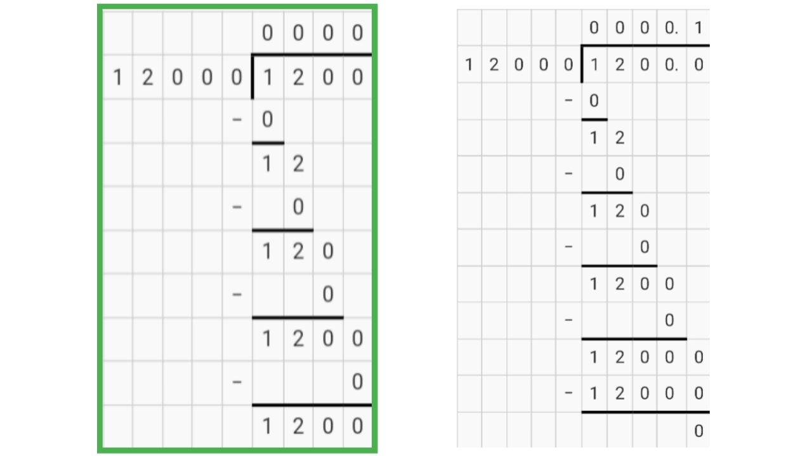

## 介绍

[来源于 Bedrock Commands 社区 Discord](https://discord.gg/SYstTYx5G5)

该系统允许您在精确的时间间隔内运行所需的命令，允许根据您的需求自定义延迟。

**一些示例：**

- 每 2 小时在聊天中发送一条消息。
- 每 10 分钟运行一次“清理延迟”功能。
- 每 30 秒给玩家施加“速度”效果。

该系统特别适用于管理您世界中的多个定时器。在使用命令方块时，您可以使用 [Tick Delay](../commands/intro-to-command-blocks.md#command-block-tick-delay) 选项来延迟命令的执行时间。然而，在使用函数时，您需要使用像这样的系统。

建议在使用命令方块时使用此系统，尤其是当您希望所有世界定时器同步运行时，即具有相同的开始时间。

## 设置

_在聊天中输入：_

<CodeHeader></CodeHeader>

```yaml
/scoreboard objectives add ticks dummy
/scoreboard objectives add events dummy
```

创建这些目标后，下一步是使用 `ticks` 目标定义每个重复事件的间隔。

为此，您首先需要知道在 Minecraft 中 1 秒大约等于 20 个游戏刻。基于此知识，您需要进行一些基本计算，以获得您想要定义的每个间隔的等效刻数。

<CodeHeader></CodeHeader>

```yaml
# 2h = 20(t) × 60(s) × 60(m) × 2(h) = 144000t
/scoreboard players set 2h ticks 144000

# 10m = 20(t) × 60(s) × 10(m) = 12000t
/scoreboard players set 10m ticks 12000

# 30s = 20(t) × 30(s) = 600t
/scoreboard players set 30s ticks 600
```

设置好计分板数据后，我们现在可以根据定义的间隔操作我们的定时器。

## 系统

<CodeHeader>BP/functions/scoreboards/world_timer.mcfunction</CodeHeader>

```yaml
## 世界定时器/时钟
### 增加 +1 刻
scoreboard players add Timer ticks 1
### 将当前经过的刻数应用于所有事件
scoreboard players operation * events = Timer ticks

## 聊天消息（每 2 小时）
scoreboard players operation ChatMessage events %= 2h ticks
execute if score ChatMessage events matches 0 run say Technoblade never dies!

## 清理延迟（每 10 分钟）
scoreboard players operation LagClear events %= 10m ticks
execute if score LagClear events matches 0 run function clear_lag

## 速度效果（每 30 秒）
scoreboard players operation SpeedEffect events %= 30s ticks
execute if score SpeedEffect events matches 0 run effect @a speed 10 2 true
```


在这里，我们提供了 3 个示例来展示如何实现它们，但您可以添加任何您喜欢的定时器，并根据需要添加多个定时器。

只需确保遵循给定的顺序，并正确应用 `/execute if score` 条件，如所示，以执行您所需的命令。

## 解释

**`events`** — 在这个目标上，我们标记所有我们希望在世界中重复的事件：

-   `ChatMessage`
-   `LagClear`
-   `SpeedEffect`

_注意：这 3 个都是目标中的虚拟玩家名称。_

**`ticks`** — 在这个目标上，我们定义所有事件的间隔，并运行我们的计分板定时器：

-   `2h` 间隔（静态分数：144000）
-   `10m` 间隔（静态分数：12000）
-   `30s` 间隔（静态分数：600）
-   `Timer` 时钟（变量分数：n+1）

_注意：这 4 个都是目标中的虚拟玩家名称。_

**命令 1：** 该命令每个刻给虚拟玩家名称 'Timer' 增加 +1 分数，表示游戏中已过去一个刻。这基本上是我们的计分板定时器/时钟，我们将用于我们世界中的所有重复事件。

**命令 2：** 在这里，我们使用 `*` 通配符选择器将 'Timer' 分数复制到所有事件。这将允许我们执行操作以确定是否已达到运行特定事件命令的间隔。例如：

-   如果 `Timer` 分数为 1200，则表示已经过去 1200 个游戏刻。
-   该命令使所有事件虚拟玩家名称（'ChatMessage'、'LagClear'、'SpeedEffect'）的分数也为 1200。

**命令 3：** 我们将使用 `%=` 模运算符检查我们的事件分数是否能被其对应的间隔整除，即余数是否等于 0。

-   聊天消息：`1200/144000`
    -   Q=0, R=1200 — _间隔未达到。_
-   清理延迟：`1200/12000`
    -   Q=0, R=1200 — _间隔未达到。_
-   速度效果：`1200/600`
    -   Q=2, R=0 — _间隔已达到。_
    -   因此，可以执行此事件的命令。

在这里，我们可以注意到前两个事件尚未发生，但第三个事件正在发生第二次。

:::info 注意：
在 Minecraft 中，计分板除法仅计算到整数，十进制值被忽略。

:::

**命令 4：** 从计算中获得的余数应用于相应事件的虚拟玩家名称。基于此知识，我们可以在其分数等于 `0` 时运行我们的命令。

其余命令遵循相同的结构，仅调整事件标签和间隔持续时间。

## 定义有限间隔的事件

要限制事件发生的次数，您需要创建一个新的目标 `intervals` 并定义该事件应发生的次数，如下所示。

<CodeHeader></CodeHeader>

```yaml
/scoreboard objectives add intervals dummy
/scoreboard players set ChatMessage intervals 5
/scoreboard players set SpeedEffect intervals 10
```

完成后，修改您的系统，如下所示。

<CodeHeader>BP/functions/scoreboards/world_timer.mcfunction</CodeHeader>

```yaml
## 世界定时器/时钟
### 增加 +1 刻
scoreboard players add Timer ticks 1
### 将当前时间应用于所有事件
scoreboard players operation * events = Timer ticks

## 聊天消息（每 10 分钟）
scoreboard players operation ChatMessage events %= 2h ticks
execute if score ChatMessage events matches 0 if score ChatMessage intervals matches 1.. run say Technoblade never dies!
execute if score ChatMessage events matches 0 if score ChatMessage intervals matches 1.. run scoreboard players remove ChatMessage intervals 1

## 速度效果（每 30 秒）
scoreboard players operation SpeedEffect events %= 30s ticks
execute if score SpeedEffect events matches 0 if score SpeedEffect intervals matches 1.. run effect @a speed 10 2 true
execute if score SpeedEffect events matches 0 if score SpeedEffect intervals matches 1.. run scoreboard players remove SpeedEffect intervals 1
```


## 在时间范围内执行命令

要在事件的间隔之间持续运行命令，您可以使用如下所示的技术。

<CodeHeader></CodeHeader>

```yaml
## 速度效果（每 30 秒） + 粒子（每刻）
scoreboard players operation SpeedEffect events %= 30s ticks
execute if score SpeedEffect intervals matches 1.. as @a at @s run particle minecraft:shulker_bullet ~~~
execute if score SpeedEffect events matches 0 if score SpeedEffect intervals matches 1.. run effect @a speed 10 2 true
execute if score SpeedEffect events matches 0 if score SpeedEffect intervals matches 1.. run scoreboard players remove SpeedEffect intervals 1
```

如第 3 行所示，要在计时器运行时运行命令，您只需去掉“if score”测试是否已达到间隔。相反，只需测试是否还有任何间隔以运行我们的命令。

假设我们将此事件的 `intervals` 设置为 `10`。那么玩家在 300 秒内也将拥有粒子轨迹，因为重复 30 秒的事件 10 次将总计 300 秒。

## 实体定时器

在某些情况下，例如实体消失事件，您需要为每个实体单独运行定时器，而不是同步定时器，这可能会导致事件触发得太早。在这种情况下，异步定时器可能会很有帮助。

假设我们想执行以下操作：

1. 在实体被召唤后 5 分钟内杀死所有名为“station”的实体。
2. 在此时间范围内在它们周围播放一个虾壳粒子。
3. 在前 10 秒内在它们周围播放一个火焰粒子。
4. 当计时器达到一半时向附近的玩家播放一个叮当声。
5. 如果附近有被动生物，则停止计时器。
6. 如果附近有敌对生物，则循环计时器。

<CodeHeader>BP/functions/scoreboards/entity_timer.mcfunction</CodeHeader>

```yaml
## 运行定时器
scoreboard players add @e [name=station, scores={ticks=0..}] ticks 1

# 在定时器运行时执行命令
execute as @e [name=station, scores={ticks=0..}] at @s run particle minecraft:shulker_bullet ~~~

# 在时间范围内执行命令
execute as @e [name=station, scores={ticks=0..200}] at @s run particle minecraft:basic_flame_particle ~~~

# 在精确间隔执行命令
execute as @e [name=station, scores={ticks=3600}] at @s run playsound note.pling @a [r=10]

# 停止定时器
execute as @e [name=station] at @s if entity @e [family=pacified, r=10, c=1] run scoreboard players set @s ticks -1

# 循环定时器
execute as @e [name=station, scores={ticks=6000}] at @s if entity @e [family=monster, r=10, c=1] run scoreboard players set @s ticks 0

# 定时器结束
kill @e [name=station, scores={ticks=6000}]
```


如所示，在完成时间范围时将分数设置为 `0` 将循环定时器。而将分数设置为 `-1` 将停止/禁用它。您仍然可以将分数设置为 `0` 以重新启动定时器。