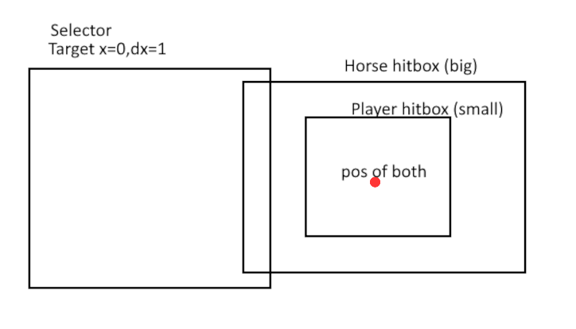
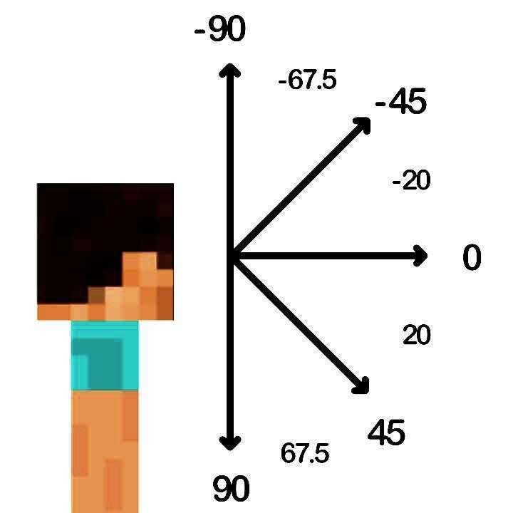
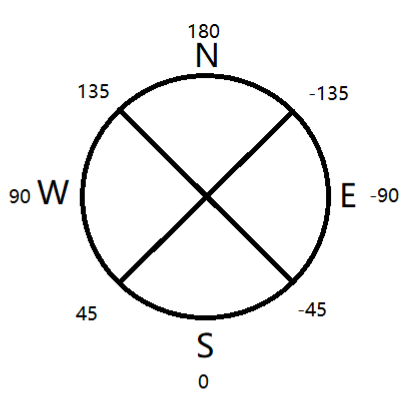

目标选择器用于命令中，以便在不明确设置目标（如玩家名称）的情况下，选择要执行命令的对象。目标选择器由选择器变量和可选的选择器参数组成。

## 选择器变量

选择器变量定义了要选择的实体的广泛列表。可供选择的选择器变量有六个：
-   `@a` - 选择所有玩家
-   `@p` - 选择最近的玩家
-   `@r` - 选择随机玩家
-   `@e` - 选择所有实体
-   `@s` - 选择执行者
-   `@initiator` - 选择与NPC互动的玩家

## 选择器参数

选择器参数可以缩小目标候选者的列表，以满足特定条件。要使用选择器参数，必须首先有一个选择器变量。要开始使用选择器参数，必须在所选目标选择器的末尾添加方括号 `[]`，例如：`kill @e[]`。可以通过用逗号分隔来使用多个选择器参数。

### 类型

根据标识符限制目标的选择。否定参数将选择没有该标识符的实体。此参数不能重复使用，除非被否定，因为给定实体只能有一个标识符。此参数可以与选择器 `@r` 一起使用，以随机选择实体。

-   `type=<identifier>`—仅包括具有给定标识符的实体。
-   `type=!<identifier>`—排除任何具有给定标识符的实体。

**示例：**

对所有猪施加浮空效果：
-   `/effect @e[type=pig] levitation`

杀死所有不是箭和雪球的实体：
-   `/kill @e[type=!arrow,type=!snowball]`

### 数量

限制所选实体的数量，遵循选择器排序规则。

选择器 `@a`、`@p` 和 `@e` 按距离递增排序，而 `@r` 随机排序。对于变量 `@p` 和 `@r`，此参数默认为 1。否定此参数会反转排序顺序；随机排序不能被否定。

-   `c=<count>`—选择最多 `<count>` 个实体。

**示例：**

从最近的五个玩家中清除石头：
-   `/clear @a[c=5] stone`

对最远的两个骷髅造成伤害：
-   `/damage @e[type=skeleton,c=-2] 2`

### 位置

改变选择器开始搜索的位置。它还修改距离和体积参数的位置。任何未定义的参数将默认为命令的当前位置。

可以使用[相对坐标](../commands/relative-coordinates.md#relative-coordinates)来定义相对于命令位置的偏移。

-   `x=<value>`、`y=<value>` 和 `z=<value>`—为目标选择器定义一个位置。

**示例：**

将最近的玩家传送到 (140, 64, -200) 的位置，向上十个区块：
-   `/teleport @p[x=140, y=64, z=-200] ~ ~10 ~`

### 距离

根据选择器与目标之间的球形距离限制目标的选择。此参数根据实体的脚进行选择。

-   `rm=<value>` 和 `r=<value>`—选择在最小和最大距离之间的实体，分别包括和不包括。

**示例：**

杀死距离在两到六个区块之间的所有鸡：
-   `/kill @e[type=chicken, rm=2, r=6]`

对在 (0, 100, 0) 一块范围内的所有玩家施加锋利附魔：
-   `/enchant @a[x=0, y=100, z=0, r=1] sharpness`

### 体积

限制目标选择在一个立方体体积内。共有三个参数，每个参数确定相应轴上的大小。如果至少定义了一个参数，任何剩余未定义的参数将被视为 0。此参数根据实体的脚进行选择。

计算两个位置之间体积的通用公式为：`dx = x2 - x1; dy = y2 - y1; dz = z2 - z1`。

-   `dx=<value>`、`dy=<value>` 和 `dz=<value>`—选择在给定边界框内的实体。

**示例：**

列出所有在 12x30x2 立方体内的实体：
-   `/say @e[dx=12, dz=30, dy=2]`

将“lobby”标签添加到在 (-400, 0, -350) 和 (-150, 256, 50) 之间的所有玩家：
-   `/tag @a[x=-400, y=0, z=-350, dx=250, dy=256, dz=400] add lobby`

将“warp”标签添加到在 (-1.5, 0, -2) 和 (1, 0, 1.5) 之间的所有实体：
-   `/tag @a[x=-1.5, y=0, z=-2, dx=2.5, dz=3.5] add warp`

/// info | 注意：

即使目标的碰撞箱仅部分包含在体积内，目标仍将被选中。

在这个可视化表示中，我们可以看到，碰撞箱较大的马被选中，而碰撞箱较小的玩家没有被选中，尽管他们站在同一个点上。

///

考虑到上述注意事项，如果我们想要精确检测位于某个 Y 级别（例如，Y=10）的玩家，而不是部分检测，我们可以使用以下命令：
-   `/execute as @a at @s if entity @s[y=10, r=1] unless entity @s[y=9, r=1] run say found player`

### 分数

根据分数值限制目标的选择。此参数表示为一个对象，具有一个记分板目标和一个值的键值对。该值可以表示一个数字范围，使用范围语法。分数的值可以被否定，以测试实体是否没有在该范围内的分数值。

-   `scores={<objective>=<value>}`—选择在给定目标下分数匹配给定值的实体。

范围语法如下：
-   `N..` 表示任何大于或等于 N 的数字。
-   `..N` 表示任何小于或等于 N 的数字。
-   `N..M` 表示任何在 N 和 M 之间的数字，包括 N 和 M。

**示例：**

将所有分数为十的玩家的“points”分数设置为 0：
-   `/scoreboard players set @p[scores={points=10}] points 0`

将“start”标签添加到“started”分数为 1 且“timer”分数为 20 或更少的盔甲架：
-   `/tag @e[type=armor_stand, scores={started=1, timer=..20}] add start`

### 名称

根据名称限制目标的选择。否定参数将选择名称不匹配的实体。

-   `name=<name>`—仅包括具有给定名称的实体。
-   `name=!<name>`—排除任何具有给定名称的实体。

**示例：**

列出所有名为 Shadow 的僵尸：
-   `/say @e[type=zombie, name="Shadow"]`

给所有既不是名为 Steve 也不是名为 Alex 的玩家增加一等级：
-   `/xp 1L @a[name=!Steve, name=!"Alex"]`

### 标签

根据标签限制目标的选择。此参数可以重复以测试多个标签，所有过滤器必须通过，实体才能被选中。否定此参数将选择没有该标签的实体。

-   `tag=<tag>`—仅包括具有给定标签的实体。
-   `tag=!<tag>`—排除任何具有给定标签的实体。

**示例：**

杀死所有带有“marked”标签且没有“exempt”标签的生物：
-   `/kill @e[tag=marked, tag=!exempt]`

### 家族

根据类型家族限制目标的选择。此参数可以重复以测试多个家族，所有过滤器必须通过，实体才能被选中。否定此参数将选择类型家族不匹配的实体。

-   `family=<family>`—仅包括具有给定类型家族的实体。
-   `family=!<family>`—排除任何具有给定类型家族的实体。

**示例：**

对所有“monster”家族的实体施加再生效果：
-   `/effect @e[family=monster] regeneration`

### 旋转

根据旋转限制目标的选择。旋转有两种类型：x 旋转，表示围绕 x 轴的垂直旋转；y 旋转，表示围绕 y 轴的水平旋转。x 旋转范围在 -90 到 90 之间（总共 180°），表示从向上看转到向下看；y 旋转范围在 -180 到 180 之间（总共 360°），从北开始并结束，顺时针环绕。

-   `rxm=<value>` 和 `rx=<value>`—选择 x 旋转在最小和最大值之间的实体，包括和不包括。
-   `rym=<value>` 和 `ry=<value>`—选择 y 旋转在最小和最大值之间的实体，包括和不包括。

_x 旋转图示由 @SpacebarNinja 分享：_

_y 旋转图示由 @SpacebarNinja 分享：_

**示例：**

对所有面朝或以上地平线的玩家施加失明效果，持续一秒：
-   `/effect @a[rx=0] blindness 1`（0 或更小）

对所有面朝南方的玩家造成伤害：
-   `/damage @a[rym=-45, ry=45] 1`

**所有朝向方向：**

| 朝向方向 | 范围 (`ry`, `rym`)            |
|----------|-------------------------------|
| 北       | `[ry=-135, rym=135]`          |
| 南       | `[ry=45, rym=-45]`            |
| 东       | `[ry=-45, rym=-135]`          |
| 西       | `[ry=135, rym=45]`            |
| 西北     | `[ry=180, rym=90]`            |
| 东北     | `[ry=-90, rym=-180]`          |
| 西南     | `[ry=90, rym=0]`              |
| 东南     | `[ry=0, rym=-90]`             |

### 等级

根据经验等级限制目标的选择。只有玩家可以拥有经验，因此这会过滤掉非玩家目标。

-   `lm=<amount>` 和 `l=<amount>`—选择经验等级在指定的最小和最大值之间的玩家，包括和不包括。

**示例：**

给所有经验等级为九或更少的玩家一个铁锭：
-   `/give @a[lm=9] iron_ingot`
 
给所有经验等级为十或更多的玩家一个金锭：
-   `/give @a[l=10] gold_ingot`

给所有经验等级在十到二十之间的玩家一个钻石：
-   `/give @a[lm=10, l=20] diamond`

### 游戏模式

根据游戏模式限制目标的选择。只有玩家可以使用游戏模式，因此这会过滤掉非玩家目标。否定参数将选择游戏模式不匹配的目标。

-   `m=<gamemode>`—根据游戏模式选择玩家。

**所有游戏模式值：**

| 游戏模式      | 值                          |
|----------------|-----------------------------|
| 生存           | `0`、`s`、`survival`        |
| 创造           | `1`、`c`、`creative`        |
| 冒险           | `2`、`a`、`adventure`       |
| 旁观者         | `spectator`                 |
| 默认           | `d`、`default`              |

**示例：**

列出所有处于创造模式的玩家：
-   `/say @a[m=creative]`

将游戏模式设置为创造模式，适用于既不在生存模式也不在冒险模式的玩家：
-   `/gamemode creative @a[m=!survival, m=!adventure]`

### 物品

根据玩家在其物品栏中拥有的物品限制目标的选择。此参数表示为一个对象或对象数组，最多包含以下参数之一：

-   `item=<string>`—要测试的物品的标识符，这是唯一的必需参数。此参数也可以接受自定义标识符。
-   `quantity=<int>`—要测试的物品数量。接受[范围](../commands/selectors.md#scores)作为值。此参数也可以被否定。
-   `data=<int>`—要测试的物品的数据值。默认为 -1。**当前不可用：** [MCPE-151920](https://bugs.mojang.com/browse/MCPE-151920)
-   `location=<string>`—物品应该位于的槽位。接受与 `/replaceitem` 命令中的 slotType 参数相同的参数。
-   `slot=<int>`—在“location”参数中使用的槽位索引，仅能与“location”一起使用。接受范围作为值。此参数可以被否定。

**示例：**

检查玩家的物品栏中是否有一把下界剑：
-   `/testfor @a[hasitem={item=netherite_sword}]`

为拥有四个或更多苹果的玩家清除 2 个苹果：
-   `/clear @a[hasitem={item=apple,quantity=4..}] apple 2`

检查玩家是否拥有两个木棍和两个钻石：
-   `/testfor @a[hasitem=[{item=diamond,quantity=2},{item=stick,quantity=2}]]`

检查玩家是否没有木棍：
-   `/testfor @a[hasitem=[{item=stick,quantity=0}]`
