:::warning
修改此页面上的原版表情符号和符号的纹理与Nintendo Switch平台不兼容！
:::

Minecraft有一堆硬编码的[私用区Unicode符号](https://en.wikipedia.org/wiki/Private_Use_Areas)，它会自动将其转换为类似表情符号的符号。
这些符号可以在任何普通字母可以使用的地方使用——符号、书籍、物品名称、聊天等。

下面你可以找到特定平台的表情符号以及通用符号。将“字母”列下的“方框”字符直接复制粘贴到Minecraft中。你也可以使用`/titleraw`或`/tellraw`命令中的输入键。

创建自定义表情符号的说明将在底部提供。

### HUD

| 名称   | 字母（复制/粘贴此） | Unicode | 图片                                              |
|--------|---------------------|---------|---------------------------------------------------|
| 食物   |                    | U+E100  | 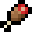  |
| 护甲   |                    | U+E101  | 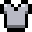 |
| 心脏   |                    | U+E10C  |  |

### 物品与方块

| 名称             | 字母（复制/粘贴此） | Unicode | 图片                                                          |
|------------------|---------------------|---------|---------------------------------------------------------------|
| 木镐             |                    | U+E108  | 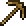 |
| 木剑             |                    | U+E109  | 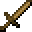   |
| 工作台           |                    | U+E10A  | 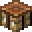 |
| 熔炉             |                    | U+E10B  | 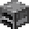        |

### 市场

| 名称      | 字母（复制/粘贴此） | Unicode | 图片                                                           |
|-----------|---------------------|---------|----------------------------------------------------------------|
| Minecoin  |                    | U+E102  |  |
| 代币      |                    | U+E105  |     |

### 背包

| 名称               | 字母（复制/粘贴此） | Unicode | 图片                                                             |
|--------------------|---------------------|---------|------------------------------------------------------------------|
| 制作开关开启       |                    | U+E0A0  | 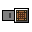  |
| 制作开关关闭       |                    | U+E0A1  | 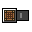 |

### 新触控

| 名称       | 字母（复制/粘贴此） | Unicode | 输入键                                         | 图片                                                    |
|------------|---------------------|---------|------------------------------------------------|---------------------------------------------------------|
| 跳跃       |                    | U+E014  | :tip_virtual_button_jump:                      | 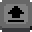     |
| 攻击       |                    | U+E015  | :tip_virtual_button_action_attack_or_destroy:  | 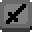   |
| 操纵杆     |                    | U+E016  | :tip_virtual_joystick:                         | 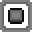 |
| 放置       |                    | U+E018  | :tip_virtual_button_action_build_or_use:       | 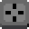    |
| 潜行       |                    | U+E019  | :tip_virtual_button_sneak:                     | 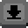    |
| 冲刺       |                    | U+E01A  | :tip_virtual_button_sprint:                    | 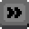   |
| 向上飞行   |                    | U+E01B  | :tip_virtual_button_fly_up:                    | 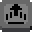   |
| 向下飞行   |                    | U+E01C  | :tip_virtual_button_fly_down:                  | 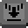 |
| 下车       |                    | U+E01D  | :tip_virtual_button_dismount:                  | 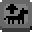 |

### 触控

| 名称             | 字母（复制/粘贴此） | Unicode | 输入键           | 图片                                                        |
|------------------|---------------------|---------|-------------------|-------------------------------------------------------------|
| 跳跃             |                    | U+E084  | :touch_jump:      | 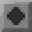           |
| 蹲下             |                    | U+E085  | :touch_sneak:     | 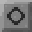         |
| 向上飞行         |                    | U+E086  | :touch_fly_up:    | 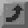         |
| 向下飞行         |                    | U+E087  | :touch_fly_down:  | 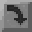       |
| 停止飞行         |                    | U+E088  | :touch_stop_flying: | 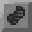  |
| 左箭头           |                    | U+E081  | :touch_left:      | 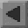     |
| 右箭头           |                    | U+E083  | :touch_right:     | 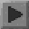    |
| 上箭头           |                    | U+E080  | :touch_forward:   | 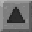       |
| 下箭头           |                    | U+E082  | :touch_back:      | 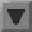     |
| 小跳跃           |                    | U+E059  | :tip_touch_jump:  |       |
| 小蹲下           |                    | U+E05A  | :tip_touch_sneak: |     |
| 小向上飞行       |                    | U+E05C  | :tip_touch_fly_up: |     |
| 小向下飞行       |                    | U+E05D  | :tip_touch_fly_down: |   |
| 小左箭头         |                    | U+E056  | :tip_touch_left:  |  |
| 小右箭头         |                    | U+E058  | :tip_touch_right: | |
| 小上箭头         |                    | U+E055  | :tip_touch_forward: | 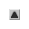    |
| 小下箭头         |                    | U+E057  | :tip_touch_back:  |   |
| 小背包           |                    | U+E05B  | :tip_touch_inventory: |   |

### 键盘与鼠标

| 名称               | 字母（复制/粘贴此） | Unicode | 输入键                   | 图片                                                              |
|--------------------|---------------------|---------|---------------------------|-------------------------------------------------------------------|
| 左键点击           |                    | U+E060  | :mouse_left_button:       | 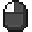      |
| 右键点击           |                    | U+E061  | :mouse_right_button:      | 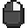     |
| 中键点击           |                    | U+E062  | :mouse_middle_button:     | 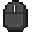    |
| 小左键点击         |                    | U+E070  | :light_mouse_left_button: | 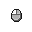 |
| 小右键点击         |                    | U+E071  | :light_mouse_right_button: |  |
| 小中键点击         |                    | U+E072  | :light_mouse_middle_button: |  |
| 小鼠标             |                    | U+E073  | :light_mouse_button:      |      |

### Xbox

| 名称               | 字母（复制/粘贴此） | Unicode | 图片                                                    |
|--------------------|---------------------|---------|---------------------------------------------------------|
| Y                  |                    | U+E003  | 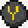   |
| B                  |                    | U+E001  | 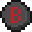   |
| A                  |                    | U+E000  | 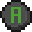   |
| X                  |                    | U+E002  | 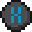   |
| 取消               |                    | U+E008  | 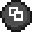       |
| 开始               |                    | U+E009  | 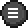      |
| LB（左肩键）        |                    | U+E004  | 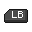 |
| RB（右肩键）        |                    | U+E005  | 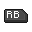|
| LT（左触发键）      |                    | U+E006  | 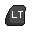 |
| RT（右触发键）      |                    | U+E007  | 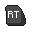|
| LS（左摇杆）         |                    | U+E00A  | 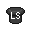   |
| RS（右摇杆）         |                    | U+E00B  | 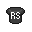  |
| 十字键上            |                    | U+E00C  | 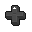      |
| 十字键右            |                    | U+E00F  | 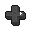   |
| 十字键下            |                    | U+E00E  | 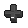    |
| 十字键左            |                    | U+E00D  | 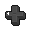    |

### 任天堂Switch

| 名称               | 字母（复制/粘贴此） | Unicode | 图片                                                             |
|--------------------|---------------------|---------|------------------------------------------------------------------|
| X                  |                    | U+E042  |          |
| A                  |                    | U+E040  | 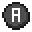         |
| B                  |                    | U+E041  | 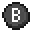         |
| Y                  |                    | U+E043  | 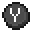         |
| +                  |                    | U+E049  |              |
| -                  |                    | U+E048  |             |
| L（左肩键）         |                    | U+E044  |       |
| R（右肩键）         |                    | U+E045  |      |
| ZL（左触发键）      |                    | U+E046  |      |
| RL（右触发键）      |                    | U+E047  |     |
| L（左摇杆）         |                    | U+E04A  |        |
| R（右摇杆）         |                    | U+E04B  |       |
| 十字键上            |                    | U+E04C  |           |
| 十字键右            |                    | U+E04F  |        |
| 十字键下            |                    | U+E04E  |         |
| 十字键左            |                    | U+E04D  |         |

### PlayStation (4/5)

| 名称               | 字母（复制/粘贴此） | Unicode | 图片                                                             |
|--------------------|---------------------|---------|------------------------------------------------------------------|
| 三角形             |                    | U+E023  |       |
| 圆圈               |                    | U+E021  |         |
| 叉叉               |                    | U+E020  |          |
| 方块               |                    | U+E022  |         |
| 选项/分享          |                    | U+E029  |  |
| 触控板             |                    | U+E028  |      |
| L1（左肩键）        |                    | U+E024  |    |
| R1（右肩键）        |                    | U+E025  |   |
| L2（左触发键）      |                    | U+E026  |   |
| R2（右触发键）      |                    | U+E027  |  |
| L3（左摇杆）         |                    | U+E02A  |     |
| R3（右摇杆）         |                    | U+E02B  |    |
| 十字键上            |                    | U+E02C  |        |
| 十字键右            |                    | U+E02F  |     |
| 十字键下            |                    | U+E02E  |      |
| 十字键左            |                    | U+E02D  |      |

### Oculus (Rift/Rift S)

| 名称               | 字母（复制/粘贴此） | Unicode | 图片                                                          |
|--------------------|---------------------|---------|---------------------------------------------------------------|
| 0                  |                    | U+E0E0  |       |
| B                  |                    | U+E0E2  |       |
| A                  |                    | U+E0E1  |       |
| Y                  |                    | U+E0EA  |       |
| X                  |                    | U+E0E9  |       |
| LG（左抓握键）       |                    | U+E0E3  |      |
| RG（右抓握键）       |                    | U+E0E4  |     |
| LT（左触发键）      |                    | U+E0E7  |   |
| RT（右触发键）      |                    | U+E0E8  |  |
| LS（左摇杆）         |                    | U+E0E5  |     |
| RS（右摇杆）         |                    | U+E0E6  |    |

### Windows MR（混合现实）

| 名称                    | 字母（复制/粘贴此） | Unicode | 图片                                                                               |
|-------------------------|---------------------|---------|------------------------------------------------------------------------------------|
| 菜单                    |                    | U+E0C2  |                             |
| Windows                 |                    | U+E0CD  |                          |
| 左触控板                |                    | U+E0C5  |                    |
| 左横向触控板            |                    | U+E0C6  |         |
| 左纵向触控板            |                    | U+E0C7  |           |
| 右触控板                |                    | U+E0C8  |                   |
| 右横向触控板            |                    | U+E0C9  |        |
| 右纵向触控板            |                    | U+E0CA  |          |
| LT（左触发键）          |                    | U+E0CB  |                     |
| RT（右触发键）          |                    | U+E0CC  |                    |
| LG（左抓握键）           |                    | U+E0C0  |                        |
| RG（右抓握键）           |                    | U+E0C1  |                       |
| LS（左摇杆）             |                    | U+E0C3  |                       |
| RS（右摇杆）             |                    | U+E0C4  |                      |

### 其他

| 名称              | 字母（复制/粘贴此） | Unicode | 图片                                                              |
|-------------------|---------------------|---------|-------------------------------------------------------------------|
| 准星              |                    | U+E017  |         |
| 代理              |                    | U+E103  |             |
| 沉浸式阅读器      |                    | U+E104  |  |
| 空心星星          |                    | U+E106  |       |
| 实心星星          |                    | U+E107  |        |

### 附加输入键

输入键可以用于自动检测玩家的输入，并可与`/titleraw`或`/tellraw`的`text`组件一起使用。

以下是默认键位绑定的结果。以下所有文本，包括“未分配”，都是字面意思，会向玩家显示该文本。

| 名称              | 输入键                       | 键盘与鼠标                                               | 触控                                                           | Xbox                                                        | 任天堂Switch                                               | PlayStation (4/5)                                               |
|-------------------|------------------------------|----------------------------------------------------------|---------------------------------------------------------------|-------------------------------------------------------------|------------------------------------------------------------|-----------------------------------------------------------------|
| 跳跃              | :_input_key.jump:            | SPACE                                                    |           |        |     |         |
| 潜行              | :_input_key.sneak:           | SHIFT                                                    |         |        |      |        |
| 冲刺              | :_input_key.sprint:          | CONTROL                                                  | 未分配                                                        |      |   |    |
| 前进              | :_input_key.forward:         | W                                                        |       | 未分配                                                       | 未分配                                                     | 未分配                                                        |
| 后退              | :_input_key.back:            | S                                                        |     | 未分配                                                       | 未分配                                                     | 未分配                                                        |
| 左移              | :_input_key.left:            | A                                                        |     | 未分配                                                       | 未分配                                                     | 未分配                                                        |
| 右移              | :_input_key.right:           | D                                                        |    | 未分配                                                       | 未分配                                                     | 未分配                                                        |
| 攻击              | :_input_key.attack:          |  | 未分配                                                        |  | | |
| 背包              | :_input_key.inventory:       | E                                                        | 未分配                                                        |        |      |      |
| 向左切换物品      | :_input_key.cycleItemLeft:   | 未分配                                                   | 未分配                                                        |     |   |   |
| 向右切换物品      | :_input_key.cycleItemRight:  | 未分配                                                   | 未分配                                                        |    |  |  |
| 使用              | :_input_key.use:             |  | 未分配                                                        |    |  |  |
| 丢弃              | :_input_key.drop:            | Q                                                        | 未分配                                                        |       |     |     |
| 代码构建器        | :_input_key.codeBuilder:     | 未分配                                                   | 未分配                                                        | 未分配                                                       | 未分配                                                     | 未分配                                                        |

## 自定义表情符号

/// warning
此方法官方未支持。在市场上使用需谨慎！
///

为了制作自定义表情符号，我们使用与预制表情符号非常相似的方法，不同之处在于我们用自己的内容覆盖微软的精灵表格！某些_字符槽_已经被上述表情符号占用，但我们可以使用空闲槽位。

请注意，以下文件已标注槽位信息：如果直接使用它们，现有表情符号上会添加数字。如果需要原始精灵表格，可以从系统上的原版资源中获取（不包括原版资源包下载中）。

开始之前，你应该下载精灵表格，并将它们移动到字体文件夹中。

每个字形目标提供两个精灵表格：一个准确反映原版，另一个版本带有十六进制信息，便于查找正确的字符。

### RP/font/glyph_E0.png

### RP/font/glyph_E1.png

_由@zheaEvyline共享的免费使用编辑样本glyph_E1.png：_

如果你想将现有原版物品添加到字形并在游戏中用作表情符号，可以使用@Minato创建的**[物品到字形网络工具](https://minato-mba.github.io/content/Items%20to%20Glyph.html)**轻松完成。

你的文件路径应如下所示：

<FolderView
	:paths="[
        'RP',
        'RP/font',
        'RP/font/glyph_E0.png',
        'RP/font/glyph_E1.png'
    ]"
></FolderView>

### 在游戏中使用表情符号

一旦你将自定义表情符号放入`glyph_E0.png`或`glyph_E1.png`，你需要获取其对应的字母/符号，以便复制粘贴到游戏中显示表情符号。

_你可以借助@NhanAZ制作的[字形网络工具](https://nhanaz.github.io/glyph/)获取字母/符号_

### 查找正确的十六进制

或者，你可以将表情符号的字符“代码”插入下面的转换器中，以获取其对应的字母/符号。

“代码”的前两个字符始终为`0x`。

接下来的两个字符是`E0`或`E1`，取决于你添加表情符号的文件。

接下来的两个字符是图像内部的位置，如`<行><列>`，每个字符都是十六进制数字。你可以通过参考上述图像找到这个数字。例如，`E0`中的右上角方块是`0F`，右下角是`FF`。

因此，完成后可能看起来像`0xE102`（`0x` + `E1` + `02`）。

将此代码复制到以下字段中，点击<kbd>转换</kbd>。右侧的符号可以复制粘贴到MC中。

<form>
<input id="hexValue" placeholder="Hex value" style="padding: 1em;margin: 0.5em;border-radius: 0.4rem; border: solid 1px rgb(38, 38, 38); outline: none;color: blue;"/>
<input id="result" placeholder="Result" readonly  style="padding: 1em;margin: 0.5em;border-radius: 0.4rem; border: solid 1px rgb(38, 38, 38); outline: none;color: blue;"/>
<a onclick="document.getElementById('result').value = String.fromCodePoint(parseInt(document.getElementById('hexValue').value, 16))" style="text-decoration: none; color: white; background: rgb(91, 33, 182); padding: 0.5em; border-radius: 0.4em; cursor: pointer;">转换</a>
</form>

### 表情符号定位

- 要将表情符号向上/向下定位，只需在其自己的表情符号槽内向上/向下移动。
- 要将表情符号向左或向右定位，只需在其一侧添加任何5-10%不透明度的像素（在其自己的槽内），与要移动的方向相反。
  - 例如：要将表情符号向右移动2个像素，请在其最左侧任何位置连接一个5-10%不透明的像素，并在该像素的左侧再添加一个。

_注：以下步骤仅适用于不适合其槽宽度的表情符号（小于其槽大小）。_

### 字形分隔空间

有时，如果将两个字形放在一起，之间会有几个空像素。唯一的解决方法是缩放字形（png文件）本身。例如：256×256 → 512×512