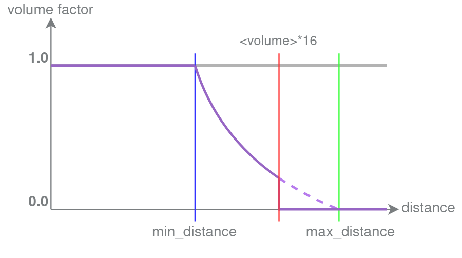

在基岩版中，我们可以添加自定义声音而不覆盖任何原版声音。这是通过将文件添加到资源包中实现的。

:::tip
学习声音的最佳方式是下载并尝试默认资源包。
:::

### 文件结构

当我们想要添加声音时，有两个主要文件需要编辑。请注意，`sound_definition`嵌套在`sounds`内部。

声音文件本身添加在`sounds`文件夹内，可以是以下任意格式。

<FolderView :paths="[
	'RP/sounds.json',
	'RP/sounds/sound_definitions.json',
	'RP/sounds/example.wav',
	'RP/sounds/example.ogg',
	'RP/sounds/example.fsb',
]"></FolderView>

## sound_definitions.json

`sound_definitions.json`是我们定义新声音短名称的地方。这应该被视为将`short-name`或`id`输入到物理声音路径。以下是一个示例`sound_definitions.json`，添加了一个名为`example.toot`的新小号声音：

<CodeHeader>RP/sounds/sound_definitions.json</CodeHeader>

```json
{
	"format_version": "1.14.0",
	"sound_definitions": {
		"example.toot": {
			"category": "neutral",
			"sounds": ["sounds/trumpet"]
		}
	}
}
```

以这种方式添加的声音可以通过`/playsound`触发。请注意，`playsound`不会自动纠正，因此您需要小心输入。

:::warning
通过文件路径引用的新文件，如声音，确实需要完全重启客户端才能加载。这意味着如果声音无法正常工作，您应该重启整个Minecraft客户端，而不仅仅是重新加载世界。
:::

### /playsound音量说明

游戏会将声音音量限制在最多1.0，然后与声音定义的音量相乘。

对于`/playsound`，声音的最大可听范围由`min(max_distance, max(volume * 16, 16))`给出。
如果声音定义中未给出`"max_distance"`，则等同于`playsound_volume * 16`。

根据距离近似声音衰减。实际图形可能不是线性的。



上图显示了**对于播放音量参数大于或等于1的声音的近似声音衰减因子**。请注意，playsound `<volume>`限制了声音的可听范围。
轴`distance`是声音听众（玩家）与声音源之间的距离。相应的`volume`轴的值是将playsound音量限制在1后，乘以声音定义的音量以获得您听到的声音的最终音量。可以写成这样的表达式：`final_volume = min(playsound_volume, 1) * graph_volume * sound_definition_volume`。

**注意：**可听声音音量的距离衰减不受命令中给定的音量参数的影响。

例如，`mob.ghast.affectionate_scream`设置了`"min_distance": 100.0`，但在使用音量为1的`/playsound`播放时，最多只能在16个方块的范围内听到。指定更大的音量值会增加可听范围。当使用足够大的音量听到更远的声音时，声音只有在超过100.0的距离后才会变得更安静。

要制作一个可以远距离听到但音量随距离持续下降的声音，可以添加例如`"volume": 0.01`并在playsound命令中使用较大的`<volume>`值。较高的`/playsound`音量将产生较大的可听范围（例如，音量为4时为64个方块，如上所述计算），而较低的音量将防止播放的声音过早限制在1.0。

### 顶级键

在上面的示例中，我展示了两个`顶级`字段：`category`和`sounds`。声音将在下面进一步讨论，但其他`顶级`键将在此处讨论：

#### 类别

类别由引擎内部使用，以决定每个声音的播放方式。我们可以利用不同的通道来获得其他效果。

| 类别     | 说明                                       |
|----------|--------------------------------------------|
| weather  |                                            |
| block    |                                            |
| bucket   |                                            |
| bottle   |                                            |
| ui       | 此类别中的声音将忽略范围限制             |
| player   |                                            |
| hostile  |                                            |
| music    |                                            |
| record   |                                            |
| neutral  |                                            |

#### min_distance

声音源之后，声音音量开始衰减的距离。默认值：0.0。必须是浮点数（例如1.0），否则该属性将被忽略。

#### max_distance

声音源之后，声音音量最小的距离（如果在范围内）。必须是浮点数（例如1.0），否则该属性将被忽略。

### 声音定义

在上面的示例中，我将`sounds`简单地显示为一个包含单一路径的列表。这适用于简单的声音，但功能不强。首先，我可以向列表中添加多个声音。这些声音在播放时将随机化：

<CodeHeader>RP/sounds/sound_definitions.json</CodeHeader>

```json
{
	"format_version": "1.14.0",
	"sound_definitions": {
		"example.toot": {
			"category": "neutral",
			"sounds": [
				"sounds/trumpet",
				"sounds/trumpet2",
				"sounds/trumpet3"
			]
		}
	}
}
```

此外，我们可以将每个声音定义为一个对象，而不是字符串。这使我们可以更精细地控制并解锁一些新设置。字符串/对象样式可以混合使用。

#### name

文件的路径，例如：`"sounds/music/game/creative/creative1"`

#### stream

限制声音在同一时间只能播放有限数量的实例。将导致游戏在播放时不将整个声音数据加载到内存中，而是分小部分加载，从而使用更少的内存。适合于提高声音密集型世界的性能。

#### volume

声音的播放音量，从`0.0`到`1.0`。声音不能比最初编码的音量更响。默认设置为`1.0`。
自定义资源包中的声音可以具有大于1.0的有效值。

#### load_on_low_memory

强制加载声音，即使在接近低内存时。自1.16.0起，"load_on_low_memory"已被弃用。

#### pitch

声音的音调（听起来多低/高）。应为正值。例如，`2.3`将使声音以2.3倍的速度播放，从而音调更高。默认设置为`1.0`。

#### is3D

`true`使声音具有方向性。默认情况下，所有声音设置为`true`。对于`music`和`ui`声音被忽略。只有`false`的声音会播放立体声。

#### interruptible

默认设置为`true`。

### weight

如果列表中有多个声音，则播放的声音是随机选择的。`"weight"`（整数值，如5）将给出该声音从列表中被选择的相对机会。例如，如果列表中有两个声音，一个的`"weight": 10`，另一个的`"weight": 2`，则第一个声音的播放概率大约是第二个的5倍（准确地说：`10 / (10 + 2) = 83.3%`的机会对比`2 / (10 + 2) = 16.7%`的机会）。默认设置为`1`。

### 示例

以下是一个包含这些选项的更现实的示例：

<CodeHeader>RP/sounds/sound_definitions.json#sound_definitions</CodeHeader>

```json
"block.beehive.drip": {
    "category": "block",
    "max_distance": 8,
    "sounds": [
        {
            "name": "sounds/block/beehive/drip1",
            "load_on_low_memory": true
        },
        "sounds/block/beehive/drip2",
        "sounds/block/beehive/drip3",
        "sounds/block/beehive/drip4"
    ]
}
```

## sounds.json

如果我们希望声音自动播放，可以将它们添加到`sounds.json`文件中。这将声音定义直接绑定到游戏事件，并使其在不需要通过`/playsound`触发的情况下播放。

声音可以添加到各种类别中：

| 类别                    | 说明                                                               |
|-------------------------|--------------------------------------------------------------------|
| individual_event_sounds | 包含像信标激活、箱子关闭或爆炸等声音                             |
| block_sounds            | 包含方块的击打、踩踏和破坏声音                                     |
| entity_sounds           | 包含实体的死亡、环境、受伤等声音（包括自定义声音！）             |
| interactive_sounds      | 正在开发中                                                         |

### 添加实体声音

我假设声音可以添加到其他类别中，但我个人只在`entities`类别中添加声音。实体声音在实体生命周期的各个点自动播放。

常见事件：

| 事件          | 说明                                                      |
|---------------|-----------------------------------------------------------|
| ambient       | 随机播放，例如咕哝声、咯咯声或恶魂的声音                   |
| hurt          | 受伤时播放                                              |
| death         | 死亡时播放                                              |
| step          | 实体在地面上移动时播放                                  |
| fall.big      | 从高处跌落到地面时播放                                  |
| fall.small    | 从低处跌落到地面时播放                                  |
| splash        | 在水中溅起水花时播放                                    |
| attack        | 进行近战攻击时播放                                      |
| shoot         | 发射弹药时播放                                          |
| cast.spell    | 开始召唤时播放                                          |
| prepare.attack| 完成召唤时播放                                          |
| roar          | 咆哮时播放                                              |

还有许多声音事件，_很可能_会自动触发，但我没有详细信息，例如：

| 未知类别       |
|----------------|
| breathe        |
| splash         |
| swim           |
| ambient.in.water|
| death.in.water  |
| jump           |
| eat            |
| hurt.in.water  |
| mad            |
| stare          |
| sniff          |
| sleep          |
| spit           |
| warn           |
| scream         |

### 示例

<CodeHeader>RP/sounds.json</CodeHeader>

```json
{
	"entity_sounds": {
		"entities": {
			"wiki:elephant": {
				"volume": 1,
				"pitch": [0.9, 1.0],
				"events": {
					"step": {
						"sound": "elephant.step",
						"volume": 0.18,
						"pitch": 1.1
					},
					"ambient": {
						"sound": "elephant.trumpet",
						"volume": 0.11,
						"pitch": 0.9
					}
				}
			}
		}
	}
}
```

## 将声音添加到动画中

在动画中播放的声音基于RP实体文件中的`short-name`定义。

以下示例显示了播放与动画同步的翅膀拍打声音。

<CodeHeader>RP/entities/dragon.json#minecraft:client_entity/description</CodeHeader>

```json
"sound_effects": {
    "wing_flap": "wiki.dragon.wing_flap" //其中wiki.dragon.roar是sound_definitions中定义的声音
}
```

<CodeHeader>RP/animations/dragon.json#animations/animation.dragon.flying</CodeHeader>

```json
"sound_effects": {
    "3.16": {
        "effect": "wing_flap"
    }
}
```

## 将声音添加到动画控制器

您可以在动画控制器中播放声音，方式与动画相似。

以下示例显示了播放与动画控制器同步的爆炸声音。

<CodeHeader>RP/entities/custom_tnt.json#minecraft:client_entity/description</CodeHeader>

```json
"sound_effects": {
    "explosion": "wiki.custom_tnt.explosion" //其中wiki.custom_tnt.explosion是sound_definitions中定义的声音，就像动画声音一样。
}
```

<CodeHeader>RP/animation_controllers/custom_tnt.animation_controllers.json#controller.animation.custom_tnt</CodeHeader>

```json
"states":{
    "default":{
        "transitions":[
            {
                "explode_state":"q.mark_variant == 1"
            }
        ]
    },
    "explode_state":{
        "sound_effects":[
            {
                "effect":"explosion"
            }
        ],
        "transitions":[
            {
                "default":"q.mark_variant == 0"
            }
        ]
    }
}
```