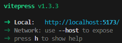
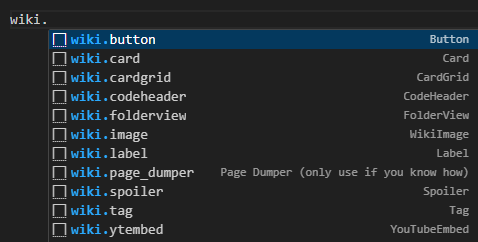

现在你已经在本地设置了 Wiki，你可以直接在设备上编辑文件。如果你不知道如何使用 VSCode，微软自己有一些非常好的视频教程 [这里](https://code.visualstudio.com/docs)。

为了让我们的页面看起来更漂亮，我们有许多优秀的工具，你可以用来突出显示部分内容、插入组件、插入图片等！

## 页面设置

每个页面由两部分组成：frontmatter 和内容。

在 frontmatter 中，你编写关于文章的最重要的信息。

```md
---
title: 如何为我们的 Wiki 贡献
description: 进行你的第一次贡献！
mentions:
    - TheItsNameless
---

大量内容！
```

### Frontmatter

| 字段               | 必填 | 默认值 | 描述                                                                                                                                                                                                                                                                                       |
| ------------------ | :--: | :----: | ------------------------------------------------------------------------------------------------------------------------------------------------------------------------------------------------------------------------------------------------------------------------------------------ |
| `title`            | 是   | 无     | 页面标题，将显示为主内容前的一级标题，并在发布到某处时作为链接嵌入显示。                                                                                                                                                                                                                                 |
| `description`      | 否   | 无     | 页面描述，将在发布到某处时作为链接嵌入显示。此处**不允许**使用 `:`、`"` 符号。                                                                                                                                                                                                                           |
| `category`         | 否   | 无     | 在侧边栏中显示该页面链接的类别。可用类别列在章节的 `index.md` 文件中。你也可以在那里添加新类别。                                                                                                                                                                                                           |
| `tags`             | 否   | `[]`   | 将在页面顶部显示的标签列表。有些标签会在侧边栏显示，如“指南”或“信息”。如果页面位于某个使标签冗余的章节或类别中，则不应在标签列表中包含该标签。例如，如果页面位于“教程”类别中，则不需要“指南”标签。                                                                               |
| `nav_order`        | 否   | 无     | 文章在侧边栏中显示的顺序。数字越小，顺序越前。所有设置了 `nav_order` 的页面将显示在未设置 `nav_order` 的页面之前。                                                                                                                                                                                                  |
| `outline_depth`    | 否   | `3`    | 页面大纲中应显示的最大标题级别。可以从默认值减少以隐藏重复的标题，或增加以在具有更多层级的页面中显示标题，便于导航。                                                                                                                                                                                            |
| `show_contributors`| 否   | `true` | 是否在页面末尾显示提供的 `mentions` 列表。                                                                                                                                                                                                                                                               |
| `show_edit_link`   | 否   | `true` | 是否显示一个链接，指向 GitHub 仓库中的页面。                                                                                                                                                                                                                                                              |
| `show_outline`     | 否   | `true` | 是否为页面生成标题链接列表。                                                                                                                                                                                                                                                                           |
| `hidden`           | 否   | `false`| 页面是否应从侧边栏隐藏。此选项应用于不再支持但仍可通过直接链接访问的内容。                                                                                                                                                                                                                             |
| `mentions`         | 否   | `[]`   | 所有为该页面做出贡献的 GitHub 用户名。获得应有的荣誉！确保你在编辑的任何页面中添加你的用户名。                                                                                                                                                                                                                 |

标题是必填项，因为它是左侧栏中显示的名称。Mentions 不是必需的，但如果每个人都知道他们正在阅读的精彩文章的作者，那将会很好！

#### 可用类别

章节中可用类别的列表可以在章节的 `index.md` 文件中找到，以及颜色和排序信息。你也可以在那里添加新类别。

以下是大多数章节中你可以使用的一些常见类别，请查看页面侧边栏以了解其他类别：

-   一般
-   教程
-   文档

#### 可用标签

标签在 `docs/.vitepress/tags.ts` 文件中定义。如果你想添加新标签，应该前往那里！

如果你只是寻找现有标签，以下是本 Wiki 当前支持的标签列表：

-   <Tag name="beginner" />
-   <Tag name="beta" />
-   <Tag name="deprecated" />
-   <Tag name="easy" />
-   <Tag name="experimental" />
-   <Tag name="expert" />
-   <Tag name="guide" />
-   <Tag name="help" />
-   <Tag name="info" />
-   <Tag name="intermediate" />
-   <Tag name="method" />
-   <Tag name="outdated" />
-   <Tag name="scripting" />
-   <Tag name="system" />

### 内容

在 frontmatter 之后，你编写页面的主要内容。页面内容使用 Markdown 编写，并可利用自定义 [组件](#working-with-components) 来增强内容并使其与 Wiki 的其他部分保持一致。

这些组件可以用于添加按钮、隐蔽内容或代码块等。也可以使用一些 HTML，但我们只推荐高级用户使用，并且不会在我们的指南中涵盖。

/// tip | 页面标题
每个人第一次做的一个常见错误是在页面内容中重复页面标题作为一级标题。
你绝不应这样做，因为 frontmatter 中给定的标题将自动放置在页面顶部，并且在单个页面中有多个一级标题是无效的。
///

## Wiki 附加包

有时我们需要在指南之后提供模板/示例包。为此，我们使用一个单独的 GitHub 仓库：[wiki-addon](https://github.com/Bedrock-OSS/wiki-addon)。
请将你的包添加到那里。这有助于我们维护所有附加包并保持其最新。

## 在本地查看 Wiki

很难知道你的文章完成并发布后会是什么样子。为此，你可以在自己的设备上运行该网站的一个版本！

在 VSCode 中，点击顶部菜单栏中的 `终端`，然后在下拉菜单中点击 `新建终端`。

/// info | 安装依赖
**第一次**本地查看 Wiki 时，你需要运行 `npm install` 并等待其完成，以确保一切设置正确。
///

要在本地查看 Wiki，请输入 `npm run dev` 并按回车，等待加载完成。当你看到以下内容时，表示已准备就绪：



将光标悬停在显示 `http://localhost:5173/` 的部分，按住 `Ctrl` 并左键点击。
你的浏览器将打开一个新标签页，显示本地版本的 Wiki。

完成！每当你在 VSCode 中更改并保存文件时，浏览器中的内容将自动更新。

## 查看构建后的页面

上述工具显示了构建后的 Wiki 将如何显示。
但有时会出现一些只有在 `build` 页面时才会出现的错误。

构建页面意味着将每个 Markdown 文件编译为 HTML 页面，这些页面将托管在我们的服务器上。
如果你仅使用 `npm run dev`，则页面不会以这种方式编译，可能会出现开发者视图中未显示的错误。

要构建页面，请按照上述过程操作，但在需要输入 `npm run dev` 的步骤中，改为输入 `npm run build` 来构建页面。

/// tip
使用 `npm run build` 时，node 将编译 Wiki 中的**所有**页面，即使是一些**非常**大的页面。
如果你没有编辑以下任何页面，你应该运行 `npm run fastbuild`，它会构建除这些页面之外的所有页面。

```json
[
    "entities/vanilla-usage-components.md",
    "entities/vanilla-usage-spawn-rules.md",
    "entities/vuc-full.md",
    "entities/vusr-full.md"
]
```

///

这可能需要一段时间。如果过程在没有任何错误的情况下完成，你可以通过运行 `npm run preview` 来查看构建后的 Wiki。
然后，打开终端中提供的链接，即完成！

## 使用 Markdown

Wiki 使用 Markdown，一种强大的文本格式化语法。
要了解更多关于 Markdown 的信息，请访问官方的 [Markdown 指南](https://www.markdownguide.org/basic-syntax)！

我们不会教授你整个 Markdown 语言，但有一些需要注意的事项！

### 容器

容器用于向用户传达或警告一些非常重要的信息。有四种类型的容器：`info`、`tip`、`warning` 和 `danger`。

通过输入三个冒号和容器类型来创建容器。
然后，你可以编写内容，并在最后输入三个冒号来关闭容器。

```md
/// info
这里是一些信息
///

/// tip
这里是一个提示
///

/// warning
这里是一个警告
///

/// danger
这里是一个危险区域
///

/// details
这里是一些必要的细节
///
```

/// info
这里是一些信息
///

/// tip
这里是一个提示
///

/// warning
这里是一个警告
///

/// danger
这里是一个危险区域
///

/// details
这里是一些必要的细节
///

**不推荐**使用 `details` 容器。
该容器样式不正确且不太需要。

你还可以为容器添加标题：

```md
/// danger | 停止！
这里是一个危险区域
///
```

/// danger | 停止！
这里是一个危险区域
///

### 链接

如果你想引用另一个网站，例如微软文档，你可以使用链接。

在 Markdown 中链接某物，你可以直接写出整个链接：

https://bedrock.dev

或显示其他文本代替链接：

[点击这里！](https://bedrock.dev)

#### 链接到 Wiki 外部的资源

要链接到另一个资源，只需复制整个链接 URL（包括前面的 https 部分）并将其粘贴在圆括号内：

```md
[官方创建者文档](https://learn.microsoft.com/minecraft/creator/)
```

[官方创建者文档](https://docs.microsoft.com/de-de/minecraft/creator/)

---

#### 链接到 Wiki 内的其他页面

你可以创建链接，重定向到 Wiki 内的其他页面。这些称为“相对”链接。

```md
[重定向到贡献页面](/contribute)
```

[重定向到贡献页面](/contribute)

---

```md
[JSON 数组](./guide/understanding-json.md#arrays)
```

[JSON 数组](./guide/understanding-json.md#arrays)

---

```md
[跳转到使用 Markdown 的标题](#working-with-markdown)
```

[跳转到使用 Markdown 的标题](#working-with-markdown)

---

要重定向到另一个页面，只需在 `docs` 文件夹内的文件浏览器中查找。
要链接到直接在此文件夹内的页面，你可以只写 `/页面名`，例如 `/contribute` 链接到贡献页面。
每个位于文件夹内的页面必须通过写入文件夹名称、斜杠，然后是页面名称（不带 `.md` 扩展名）来访问，例如 `/blocks/block-materials`。

/// warning
**切勿**使用绝对链接链接到我们 Wiki 内的页面。确保你的链接中**不包含** `wiki.bedrock.dev`。
///

### 列表

#### 无序列表

常规的项目符号列表。

```md
-   这是
-   一个
-   列表
```

-   这是
-   一个
-   列表

---

#### 有序列表

代替项目符号的连续数字列表。

```md
1.  这是
2.  一个
3.  列表
```

1. 这是
2. 一个
3. 列表

---

#### 选中列表

每个项可以是选中或未选中的列表。方括号中间的 `x` 表示该项已选中。

```md
-   [x] 这是
-   [x] 一个
-   [ ] 列表
-   [x] 项目
```

-   [x] 这是
-   [x] 一个
-   [ ] 列表
-   [x] 项目

## 使用组件

我们的 Wiki 使用特殊的 Vue 组件，你可以用来添加按钮、隐蔽内容、代码块等。

/// tip | 代码片段
我们有这些组件的代码片段。要查看它们，请在 Markdown 文件中开始输入 `wiki.`，然后按 `Ctrl + Space`。


///

### 强调颜色

一些组件支持 `color` 属性，可用于增加视觉效果！
以下是 Wiki 当前支持的颜色值：

-   <Label color="red">红色</Label>
-   <Label color="orange">橙色</Label>
-   <Label color="yellow">黄色</Label>
-   <Label color="green">绿色</Label>
-   <Label color="blue">蓝色</Label>

### 按钮

按钮的作用类似于链接，但对用户来说更显眼。

```md
<Button link="/">
    主页
</Button>
```

<Button link="/">主页</Button>

也可以指定颜色，使你的按钮更加突出！

```md
<Button link="https://youtube.com" color="red">
    YouTube
</Button>
```

<Button link="https://youtube.com" color="red">
    YouTube
</Button>

| 属性   | 必填 | 类型                          | 说明                                                                                                                                                                   |
| ------ | ---- | ----------------------------- | ---------------------------------------------------------------------------------------------------------------------------------------------------------------------- |
| link   | 是   | String                        | 点击按钮时重定向的链接，你也可以链接到 Wiki 文件以供下载。如果是图片，请在链接值后添加 `download`。                                                                           |
| color  | 否   | [AccentColor](#accent-colors) | 定义按钮的强调颜色。默认情况下，按钮将使用链接中看到的基础 Wiki 强调颜色。                                                                                              |

两个 `Button` 标签之间的文本是按钮上显示的文本。

链接可以是外部网站，也可以是我们 Wiki 中的页面。对于后一种情况，请使用相对链接，如我们 [链接部分](/contribute-style#linking-to-other-pages-in-the-wiki) 中所述。

### 卡片

使用卡片，你可以创建带有图片和包含链接的文本的华丽框！

卡片还可以在两个 `Card` 标签之间定义内容。

```md
<Card image="/assets/images/homepage/wikilogo.png" title="标题" link="https://google.com">

这是一些 _内容_。

</Card>
```

<Card image="/assets/images/homepage/wikilogo.png" title="标题" link="https://google.com">

这是一些 _内容_。

</Card>

| 属性 | 必填 | 类型   | 说明                                  |
| ---- | ---- | ------ | ------------------------------------- |
| image| 是   | String | 显示在标题左侧的图片链接。              |
| title| 是   | String | 显示在内容上方的标题。                  |
| link | 否   | String | 点击标题时重定向的链接                  |

不要过度使用它们！它们看起来很酷，但有人可能会过多关注它们而忽略文章的其他重要部分。

### 卡片网格

用于以网格布局显示多个卡片。

```md
<CardGrid>
<Card image="/assets/images/homepage/wikilogo.png" title="标题 1" link="https://google.com">

这是一些 _内容_。

</Card>
<Card image="/assets/images/homepage/wikilogo.png" title="标题 2" link="https://google.com">

这是一些 _内容_。

</Card>
<Card image="/assets/images/homepage/wikilogo.png" title="标题 3" link="https://google.com">

这是一些 _内容_。

</Card>
</CardGrid>
```

<CardGrid>
<Card image="/assets/images/homepage/wikilogo.png" title="标题 1" link="https://google.com">

这是一些 _内容_。

</Card>
<Card image="/assets/images/homepage/wikilogo.png" title="标题 2" link="https://google.com">

这是一些 _内容_。

</Card>
<Card image="/assets/images/homepage/wikilogo.png" title="标题 3" link="https://google.com">

这是一些 _内容_。

</Card>
</CardGrid>

### 代码头

代码头用于美化包裹代码块，使用户可以轻松复制其中的代码。你还可以添加一些文本，例如文件路径，以便用户确切知道将此代码放置在哪里。
记得格式化 JSON。你可以使用 [这个](https://jsonformatter.curiousconcept.com) 工具。

````json
```json title="BP/blocks/example.json"
{
    "some": "json"
}
```
````

```json title="BP/blocks/example.json"
{
    "some": "json"
}
```

文件路径放在两个 HTML 标签之间。描述文件路径时，请确保遵循我们的 [风格指南](./meta/style-guide.md)：

-   如果你在 Behavior-Pack 内链接，请在所有其他文件前加上 `BP`：

    ✔️ `BP/blocks/example.json`

    ❌ `YourBehaviorPack/blocks/example.json`

-   同样，对于 Resource-Pack，请在所有其他文件前加上 `RP`：

    ✔️ `RP/manifest.json`

    ❌ `YourResourcePack/manifest.json`

在关闭标签的下一行，你必须开始一个代码块来使用此组件，如上例所示。

### 文件夹视图

文件夹视图可用于显示文件的设置，例如在我们的 [项目设置](./guide/project-setup.md) 指南中。

```md
<FolderView :paths="[
    'com.mojang/development_resource_packs/guide_RP/texts/en_US.lang',
    'com.mojang/development_resource_packs/guide_RP/manifest.json',
    'com.mojang/development_resource_packs/guide_RP/pack_icon.png',
    'com.mojang/development_behavior_packs/guide_BP/texts/en_US.lang',
    'com.mojang/development_behavior_packs/guide_BP/manifest.json',
    'com.mojang/development_behavior_packs/guide_BP/pack_icon.png',
]" />
```

<FolderView :paths="[
    'com.mojang/development_resource_packs/guide_RP/texts/en_US.lang',
    'com.mojang/development_resource_packs/guide_RP/manifest.json',
    'com.mojang/development_resource_packs/guide_RP/pack_icon.png',
    'com.mojang/development_behavior_packs/guide_BP/texts/en_US.lang',
    'com.mojang/development_behavior_packs/guide_BP/manifest.json',
    'com.mojang/development_behavior_packs/guide_BP/pack_icon.png',
]" />

| 属性 | 必填 | 类型             | 说明                                                                                     |
| ---- | ---- | ---------------- | ---------------------------------------------------------------------------------------- |
| paths| 是   | 字符串数组       | 表示所有应显示的文件和文件夹。前导 `:` 是必需的。                                       |

`paths` 属性是一个包含所有单独文件路径的列表的数组。每个文件路径必须完整书写，并用单引号包裹。

/// warning
记住不要在列表中放入任何空行！这会在编译页面时引发错误。
///

### 标签

标签是一种 [Label](#label) 类型，根据其 frontmatter 默认显示在页面顶部。
如果你想在页面的某个位置手动包含一个标签，使用此组件优于常规标签。

```md
<Tag name="beginner" />
```

<Tag name="beginner" />

| 属性 | 必填 | 类型                       | 说明                        |
| ---- | ---- | -------------------------- | --------------------------- |
| name | 是   | [TagName](#available-tags) | 要显示的标签名称。          |

### WikiImage

默认的添加图片方法如下：
``
WikiImage 是在文章中添加图片的替代方法，提供比常规 Markdown 图片更多的参数，包括像素渲染。
请注意，图片位于 `docs/public/assets/images/` 文件夹中，但组件中定义的路径不包括 `docs/public`。

```md
<WikiImage
    src="/assets/images/homepage/wikilogo.png"
    alt="替代文本"
    width="420"
    pixelated
/>
```

<WikiImage
    src='/assets/images/homepage/wikilogo.png'
    alt='替代文本'
    pixelated
    width=420
/>

| 属性     | 必填 | 类型    | 说明                                                                                                       |
| -------- | ---- | ------- | ---------------------------------------------------------------------------------------------------------- |
| src      | 是   | String  | 要显示的图片链接。                                                                                           |
| alt      | 是   | String  | 浏览器无法加载图片时显示的文本，以及用于辅助功能的文本，例如屏幕阅读器。                                       |
| width    | 否   | String  | 图片的宽度。如果只包含宽度，高度将自动缩放。                                                                   |
| height   | 否   | String  | 图片的高度。如果只包含高度，宽度将自动缩放。                                                                   |
| pixelated| 否   | Boolean | 图片是否应像素化显示。                                                                                       |

### YouTubeEmbed

根据视频 ID 将 YouTube 视频嵌入页面。

```md
<YouTubeEmbed id="dQw4w9WgXcQ" />
```

<YouTubeEmbed id="dQw4w9WgXcQ" />

| 属性 | 必填 | 类型   | 说明                        |
| ---- | ---- | ------ | --------------------------- |
| id   | 是   | String | 要显示的视频的 ID。          |

### 换行

**始终记得在组件前后添加换行！**

错误：

````
-   一
-   二
<CodeHeader>BP/blocks/example.json</CodeHeader>
```json
{
    "some": "json"
}
```
````

正确：

````md
-   一
-   二

```json title="BP/blocks/example.json"
{
    "some": "json"
}
```
````

## 格式指南

每个人都喜欢阅读格式完美且一致的 Wiki。

不过，很难实现这一点。而且我们不需要完全一致格式的 Wiki。但如果每个人都努力遵循这些简单规则，所有用户在阅读我们的 Wiki 时会有更好的体验！

### 一般规则

1.  对于命名包、文件夹等，请参阅我们的 [风格指南](./meta/style-guide.md)。

### 标题大小写

标题大小写是一种在页面标题和标题中必须使用的大小写风格。

1. 大多数单词应无论长度如何都要大写。
2. 冠词（a, an, the）、并列连词（and, but, or）和介词（in, on, at, of, to）不应大写，除非满足以下任何条件：
    - 它们是标题的第一个或最后一个单词。
    - 它们构成名词的一部分（例如 add-**_on_**）。

一些例子：

-   `欢迎来到 Wiki！`
-   `你的第一个附加包`
-   `它是如何工作的`

### 标题

1.  不要使用一级标题。你的页面以一个一级标题开始，该标题与 Front Matter 中书写的标题相同。
2. 尽量避免使用超过四级的标题。它们不会出现在右侧边栏（只有二级标题会出现在那里），且样式不正确。
3. 使用 `标题大小写` 风格。
4. 不要在标题中使用 `:`！

一些例子：

-   ✔️ `## 一个页面`
    
    ❌ `# 一个页面`

-   ✔️ `### 其他层级`
    
    ❌ `###### 其他层级`

-   ✔️ `## 我的文章`
    
    ❌ `## 我的文章:`

-   ✔️ `## 下一步`
    
    ❌ `## 下一步:`

### JSON 代码

1.  使用代码头，除非不合逻辑或不可能。
2.  完全展开 JSON 代码以提高可读性，即“美化代码”。
    -   不要展开 `.geo.json` 文件，因为它会太长。
3.  如果代码太长或不必要，请将其包装在隐蔽组件中。
4.  使用 `RP` 和 `BP` 作为根文件夹。
5.  添加注释，但不要太多。

在 JSON 内部的注释中描述最重要的内容，可以在代码之后描述其他组件。同时，遵循我们的注释风格。
示例：

```json title="BP/items/copper_coin.json"
{
    "format_version": "1.21.40",
    "minecraft:item": {
        "description": {
            // 描述具有组件的对象。
            "identifier": "wiki:copper_coin",
            "menu_category": {
                "category": "construction"
            }
        },
        "components": {
            "minecraft:max_stack_size": 64, // 值/组件的简短描述。
            // 对下一行使用的特定组件（图标和闪光）进行注释。
            "minecraft:icon": "copper_coin",
            "minecraft:glint": 3.5
        }
    }
}
```

-   `minecraft:max_stack_size`
    
    ...

-   `minecraft:icon`
    
    ...

### Markdown 格式

本节仅针对你的 Markdown 文件的可读性。它不会在 Wiki 中可见。

1.  如果使用无序列表，在 `-` 后使用 3 个空格。
2.  美化 Markdown 表格。使用空格和 `-` 将所有行扩展到相同长度。在每个单元格内容前后使用一个空格。
3.  避免使用原始 HTML 标签，尽管它们是支持的。你可以在确实需要时使用它们，但仅在绝对无法避免的情况下使用。
    如果你有一个可能对所有人有用的新组件的想法，请告诉我们，也许我们会添加它！

/// tip | PRETTIER

上述步骤如果你安装了 [Prettier](https://marketplace.visualstudio.com/items?itemName=esbenp.prettier-vscode) 扩展（强烈推荐），将会自动完成。

///

✔️

```md
-   列表
```

❌

```
- 列表
```

---

✔️

```md
| 一些数据 | 更多数据 |
| -------- | -------- |
| 这里      | 还有这里  |
```

❌

```
| 一些数据 | 更多数据 |
|----|---------|
| 这里      | 还有这里|
```

---

✔️

```md

```

```md
<WikiImage src="/my/image.png" alt="替代文本" />
```

❌

```md

```

---

✔️

```md
`代码`
```

❌

```md
    代码
```

你可以这样在文本前添加空格：

```md
> 文本
```

> 文本

---

有时你需要在 Markdown 中为其他贡献者注释某些内容。

```md
<!-- 注释！👀 --> ‹- 它在这里！
```

<!-- 注释！👀 --> ‹- 它在这里！