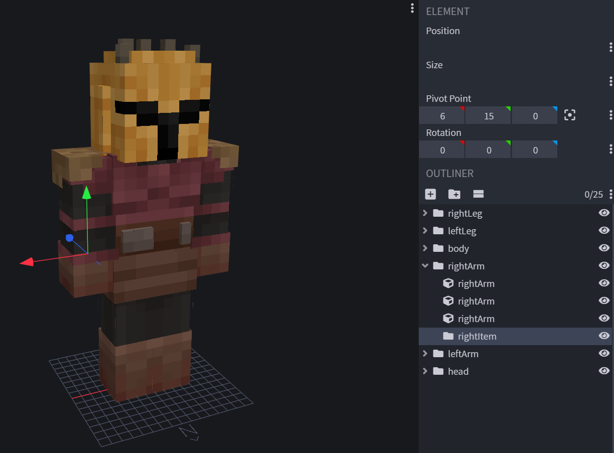
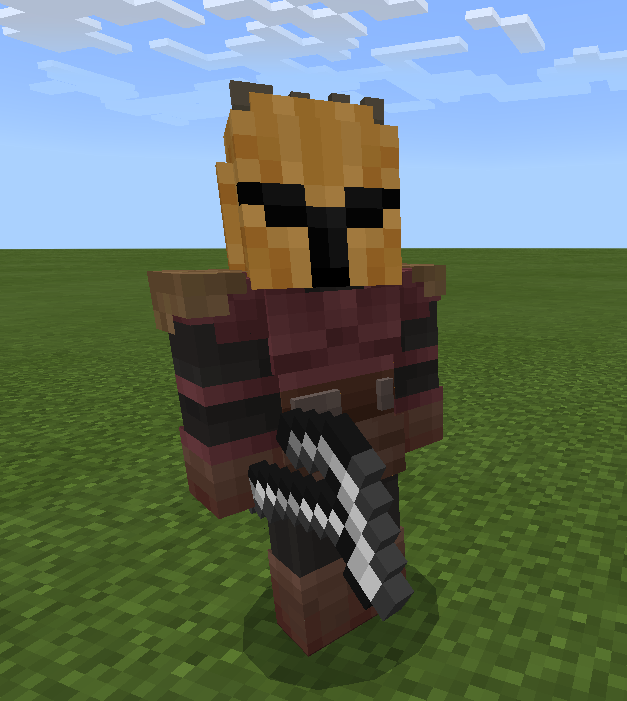

::: tip
本教程假设您对实体、掉落表和Blockbench有基本的了解。
:::

在本教程中，您将学习如何让实体手中持有物品。我将使用一个自定义的`mandalorian_armorer`实体和一个自定义的`hammer`物品作为示例。

## 模型

首先，您需要在Blockbench中创建一个名为`rightArm`的映射。在这个映射中，需要有一个名为`rightItem`的子映射。
现在设置这个子映射的支点位置，使其位于您希望实体持有物品的位置。



## 行为包部分

接下来，您需要在实体的组件列表中添加一个`minecraft:equipment`组件，并添加一个包含所需物品的掉落表。

在我们的示例中，它将如下所示：

<CodeHeader>BP/entity/mandolorian.json#components</CodeHeader>

```json
"minecraft:equipment": {
    "table": "loot_tables/entities/gear/mandolorian.json"
}
```

## 掉落表

最后，为您的实体添加掉落表。它需要位于行为包中的`loot_tables/entities/<your_loot_table_name>.json`。在我们的案例中，它被称为`mandolorian.json`。

:::warning
这与实体死亡时掉落的物品掉落表不同。因此，请确保它有一个不同的名称。
:::

要让实体始终持有相同的物品，请添加以下掉落表：

<CodeHeader>BP/loot_tables/entities/gear/mandolorian.json</CodeHeader>

```json
{
	"pools": [
		{
			"rolls": 1,
			"entries": [
				{
					"type": "item",
					"name": "dd:hammer",
					"weight": 1
				}
			]
		}
	]
}
```

如果一切顺利，您将得到如下所示的结果：



## 常见问题

- 持有的物品未显示

您的实体包含多个几何变体。