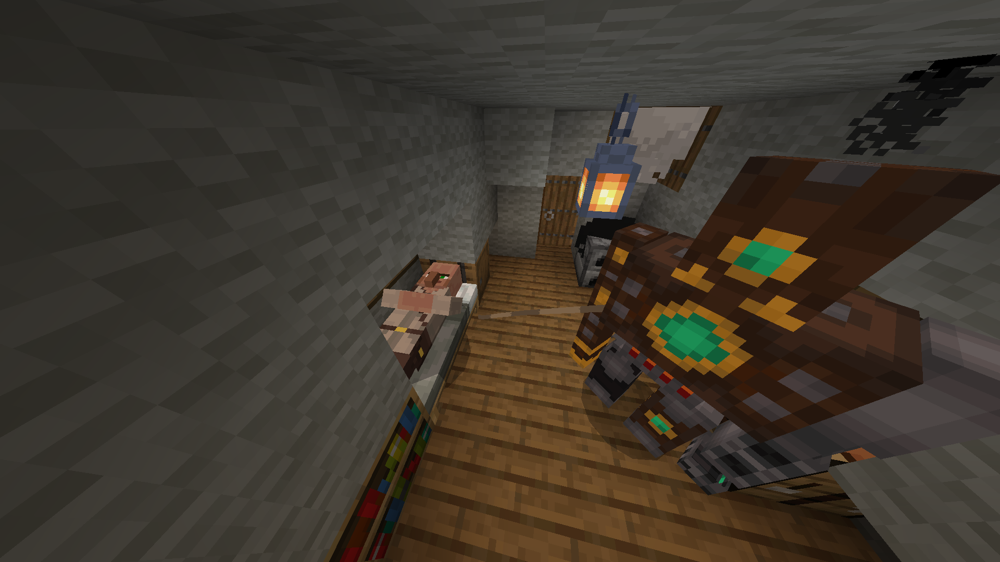

本教程将解释如何让实体进入睡眠状态。

## 在床上睡觉

该行为受到村民的启发。

### 特性

- 实体在夜间睡觉，并在白天醒来。
- 与实体互动会使其醒来，过一段时间后会再次入睡。
- 如果实体受到伤害，它会醒来。

### 行为包

在本节中，将讨论行为包组件。

#### 组件

让我们从一些基本组件开始，这些组件需要添加到你的实体中。

<CodeHeader>BP/entities/sleeping_entity.json#components</CodeHeader>

```json
"minecraft:dweller": {
    "dwelling_type": "village",
    "dweller_role": "inhabitant",
    "can_find_poi": true
}
```

未记录，实体能够入睡所需。

<CodeHeader>BP/entities/sleeping_entity.json#components</CodeHeader>

```json
"minecraft:environment_sensor": {
    "triggers": [
        {
            "filters": {
                "test": "is_daytime",
                "value": false
            },
            "event": "sleep"
        }
    ]
}
```

该组件是实体理解何时入睡所必需的。
如果不是白天，则会触发事件。

:::warning
你需要一些基本的导航组件，以便你的实体能够移动到床上。
:::

#### 组件组

现在你需要为你的实体添加一些组件组。

<CodeHeader>BP/entities/sleeping_entity.json#component_groups</CodeHeader>

```json
"sleeping": {
    "minecraft:behavior.sleep": {
        "priority": 0,
        "goal_radius": 1.5,
        "speed_multiplier": 1.25,
        "sleep_collider_height": 0.3,
        "sleep_collider_width": 1,
        "sleep_y_offset": 0.6,
        "timeout_cooldown": 10
    },
    "minecraft:damage_sensor": {
        "triggers": {
            "on_damage": {
                "event": "wake_up"
            }
        }
    },
    "minecraft:environment_sensor": {
        "triggers": [
            {
                "filters": {
                    "test": "is_daytime",
                    "value": true
                },
                "event": "wake_up"
            }
        ]
    },
    "minecraft:interact": {
        "interactions": [
            {
                "on_interact": {
                    "filters": {
                        "all_of": [
                            {
                                "test": "is_family",
                                "subject": "other",
                                "value": "player"
                            }
                        ]
                    },
                    "event": "woken_up"
                }
            }
        ]
    }
}
```

- `minecraft:behavior.sleep`

确定睡眠细节，优先级需要设置为`0`（权重最大）。

- `minecraft:damage_sensor`

如果你希望实体在受到攻击时醒来，请添加此组件。

- `minecraft:environment_sensor`

在白天时触发`wake_up`事件。

- `minecraft:interact`

这使得玩家能够在不伤害实体的情况下将其唤醒。

<CodeHeader>BP/entities/sleeping_entity.json#component_groups</CodeHeader>

```json
"sleep_timer": {
    "minecraft:timer": {
        "time": 15,
        "time_down_event": {
            "event": "sleep_again"
        }
    }
}
```

该组件组是实体在被唤醒后（经过一段延迟）再次入睡所必需的。

#### 事件

在这里你将找到所有需要的事件。
我认为不需要解释。

<CodeHeader>BP/entities/sleeping_entity.json#events</CodeHeader>

```json
"sleep": {
    "add": {
        "component_groups": [
            "sleeping"
        ]
    }
},
"wake_up": {
    "remove": {
        "component_groups": [
            "sleeping"
        ]
    }
},
"woken_up": {
    "remove": {
        "component_groups": [
            "sleeping"
        ]
    },
    "add": {
        "component_groups": [
            "sleep_timer"
        ]
    }
},
"sleep_again": {
    "add": {
        "component_groups": [
            "sleeping"
        ]
    },
    "remove": {
        "component_groups": [
            "sleep_timer"
        ]
    }
}
```

### 资源包

别忘了你需要为你的实体添加睡眠动画和控制器！

#### 动画

只需复制/粘贴即可。

<CodeHeader>RP/animations/sleeping_entity.animation.json</CodeHeader>

```json
{
	"format_version": "1.8.0",
	"animations": {
		"animation.sleeping_entity.sleep": {
			"loop": "hold_on_last_frame",
			"animation_length": 0.5,
			"bones": {
				"body": {
					"rotation": {
						"0.0": [0, 0, 0],
						"0.5": [-90, 0, 0]
					},
					"position": [0, 2, -15]
				}
			}
		}
	}
}
```

#### 动画控制器

如果需要，再次复制/粘贴即可。

<CodeHeader>RP/animations_controllers/ac.sleeping_entity.sleep.json</CodeHeader>

```json
{
	"format_version": "1.10.0",
	"animation_controllers": {
		"controller.animation.sleeping_entity.sleep": {
			"initial_state": "default",
			"states": {
				"default": {
					"transitions": [
						{
							"sleep": "q.is_sleeping"
						}
					]
				},
				"sleep": {
					"animations": ["sleeping"],
					"transitions": [
						{
							"default": "!q.is_sleeping"
						}
					]
				}
			}
		}
	}
}
```

请注意，你需要在客户端实体中定义动画，如下所示：

`"sleeping": "animation.sleeping_entity.sleep"`

### 结果



## 小憩

该行为受到狐狸的启发。

### 特性

- 实体在感到安全、远离生物或天气不是雷暴时会睡觉。
- 接近实体会使其醒来，除非是信任的或潜行的玩家，或者是属于`sleeping_entity`家族组的其他实体。
- 如果实体受到伤害，它会醒来。

### 行为包

在本节中，将讨论行为包组件。

#### 组件

对于此行为，你只需要一个组件：

<CodeHeader>BP/entities/sleeping_entity.json#components</CodeHeader>

```json
"minecraft:behavior.nap": {
    "priority": 8,
    "cooldown_min": 2.0,
    "cooldown_max": 7.0,
    "mob_detect_dist": 12.0,
    "mob_detect_height": 6.0,
    "can_nap_filters": {
        "all_of": [
            {
                "test": "in_water",
                "subject": "self",
                "operator": "==",
                "value": false
            },
            {
                "test": "on_ground",
                "subject": "self",
                "operator": "==",
                "value": true
            },
            {
                "test": "is_underground",
                "subject": "self",
                "operator": "==",
                "value": true
            },
            {
                "test": "weather_at_position",
                "subject": "self",
                "operator": "!=",
                "value": "thunderstorm"
            }
        ]
    },
    "wake_mob_exceptions": {
        "any_of": [
            {
                "test": "trusts",
                "subject": "other",
                "operator": "==",
                "value": true
            },
            {
                "test": "is_family",
                "subject": "other",
                "operator": "==",
                "value": "sleeping_entity"
            },
            {
                "test": "is_sneaking",
                "subject": "other",
                "operator": "==",
                "value": true
            }
        ]
    }
}
```

如果你还想使用信任机制，请添加：

<CodeHeader>BP/entities/sleeping_entity.json#components</CodeHeader>

```json
"minecraft:trust": {}
```

### 资源包

在我们的资源包中，当实体开始睡觉时，你可以运行一个动画。

<CodeHeader>RP/animations_controllers/ac.sleeping_entity.sleep.json</CodeHeader>

```json
{
	"format_version": "1.10.0",
	"animation_controllers": {
		"controller.animation.sleeping_entity.sleep": {
			"initial_state": "default",
			"states": {
				"default": {
					"transitions": [
						{
							"sleep": "q.is_sleeping"
						}
					]
				},
				"sleep": {
					"animations": ["sleeping"],
					"transitions": [
						{
							"default": "!q.is_sleeping"
						}
					]
				}
			}
		}
	}
}
```

最后，你需要为你的实体创建并注册一个睡眠动画。如果你不知道如何做，可以查看[BlockBench页面](../guide/blockbench.md#animating)。