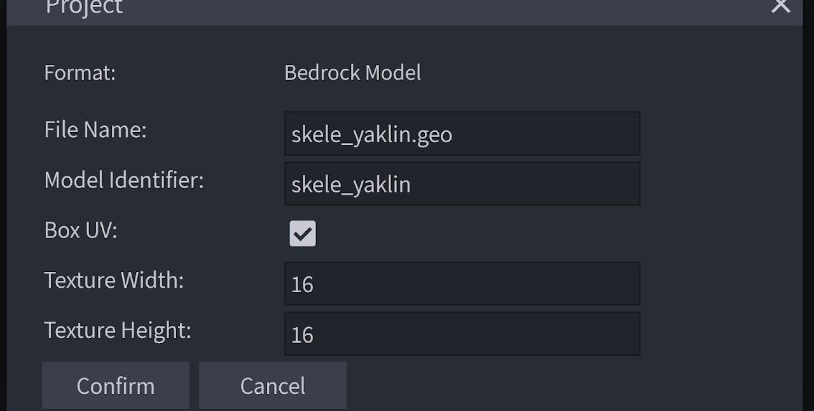
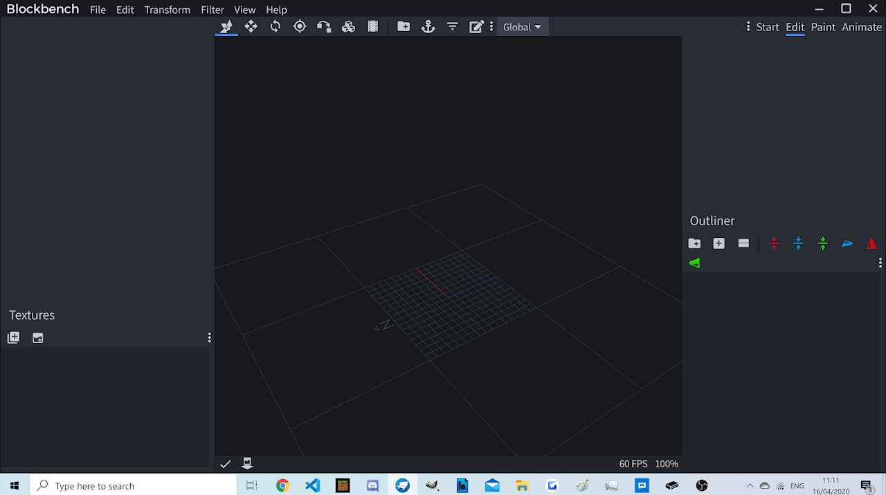
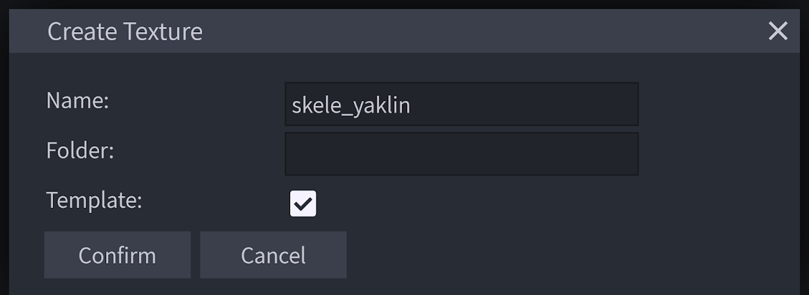
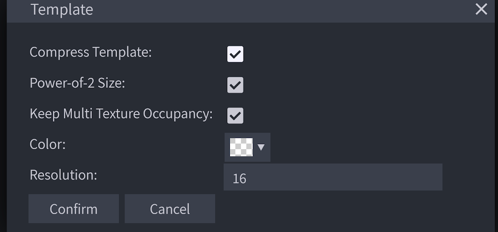
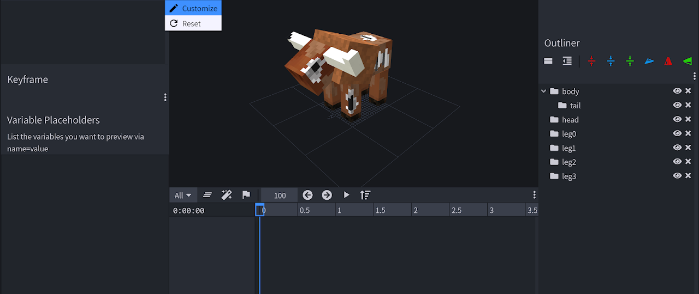
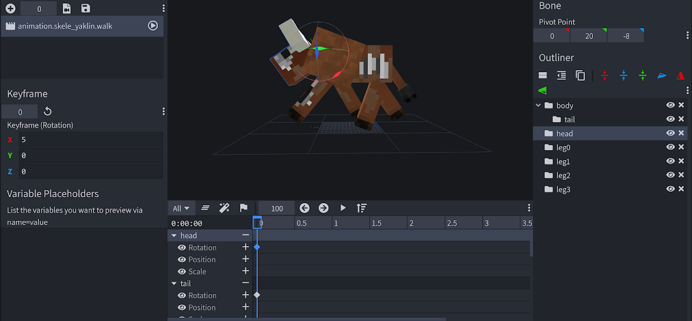
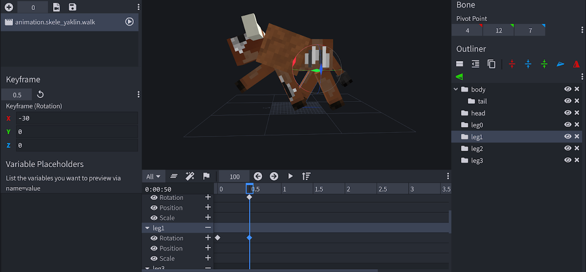
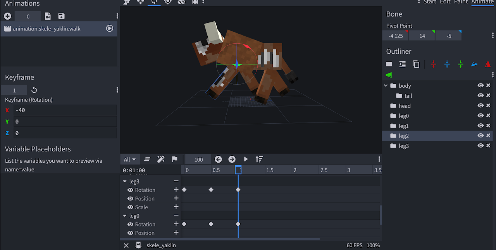

# Blockbench：建模、纹理和动画

/// details-info | 署名信息
- 该页面翻译自[https://wiki.bedrock.dev/guide/blockbench.html](https://wiki.bedrock.dev/guide/blockbench.html)
- 该页面仓库地址为[https://github.com/Bedrock-OSS/bedrock-wiki/blob/wiki/docs/guide/blockbench.md](https://github.com/Bedrock-OSS/bedrock-wiki/blob/wiki/docs/guide/blockbench.md)
- 该页面的版本为<!-- md:samp Bedrock-OSS/bedrock-wiki@60593ceb65e7bf8258290ccaa1d1bbd610062a0d -->
- 该页面的作者有：
    - <!-- md:samp @KaiFireborn -->
    - <!-- md:samp @SirLich -->
    - <!-- md:samp @Dreamedc2015 -->
    - <!-- md:samp @SmokeyStack -->
    - <!-- md:samp @sermah -->
    - <!-- md:samp @cda94581 -->
    - <!-- md:samp @TheItsNameless -->
    - <!-- md:samp @ThijsHankelMC -->
    - <!-- md:samp @MedicalJewel105 -->
    - <!-- md:samp @ChibiMango -->
    - <!-- md:samp @smell-of-curry -->
///

Blockbench是一款免费的软件，旨在实现Minecraft的建模、纹理和动画功能。它可在移动浏览器、Windows 10和macOS上使用。请访问[blockbench.net](https://blockbench.net/)进行安装。

## 建模

让我们开始吧。

1. 打开Blockbench。
2. 选择*文件 > 新建 > 基岩版模型*。这很重要，因为Minecraft基岩版无法读取Java版模型。
3. 会弹出一个如下所示的界面。

  

  -   `"文件名："`不言自明。我的文件将生成为"skele_yaklin.geo.json"。
  -   `"模型标识符："`是模型标识符（不需要命名空间），稍后将定义此ID的短名称。
  -   `"箱型UV"`必须勾选，以便自动进行UV编辑和展开以便纹理处理。
  -   `"纹理高度"`和`"纹理宽度"`定义模型纹理的分辨率。

4. 点击确认。你将看到如下界面：

  

  -   你可以看到许多工具：移动、调整大小、旋转等。
  -   你可以在右下角的菜单中添加骨骼和立方体。立方体可以独立旋转；骨骼将携带其中的所有内容。

5. 现在，你准备好创建你的模型了！有关建模的更深入教程，请查看下面Everbloom Studio的视频。

<YouTubeEmbed id="XqzxL_-XjA0" />

<YouTubeEmbed id="j7ISUImhgpc" />

## 纹理

现在你已经有了模型，让我们开始纹理处理吧！

1.  在左下角面板中，点击“创建纹理”。
2.  在“名称:”下写下你的图像文件名。我的将导出为`ghost.png`。勾选“模板:”以创建模板纹理，这样会更容易处理。
  
3.  检查所有内容，并将分辨率更改为你在第一步中设置的分辨率。
  
4.  转到右上角的“绘画”并绘制你的纹理。

## 动画

一旦你的模型和纹理完成，你就可以开始动画制作了。转到右上角的“动画模式”。

你可能想将“导出动画”和“导入动画”添加到工具栏中，你可以通过如下图所示的方式：


1.  点击“添加动画”[右上角的加号图标]并命名为`animation.{yourEntityName}.move`。
  在时间轴的0处创建你的行走动画的第一帧，通过移动腿部。
  
2.  在时间轴的0.5处创建第二帧。
  
3.  最后，通过将时间轴光标放在1.0处并选择第一帧，然后使用ctrl+c和ctrl+v复制第一帧到第三帧。
4.  右键单击动画并勾选“循环”，使动画循环播放。
  

## 保存你的工作

现在我们的模型、纹理和行走动画都完成了，你可以保存你的工作。

转到*文件 > 保存模型*或*文件 > 导出基岩版几何*。将模型保存到`RP/models/entity`，将纹理保存到`RP/textures/entity/`，将动画保存到`RP/animations`。恭喜你！你成功创建了第一个实体的视觉效果！你可以在下面查看文件示例。

_同时，为什么不升级你自己独特实体的视觉效果，或者创建另一个呢？_

/// details-info | 显示代码

```json title="RP/models/entity/ghost.geo.json"
{
  "format_version": "1.12.0",
  "minecraft:geometry": [
    {
      "description": {
        "identifier": "geometry.ghost",
        "texture_width": 64,
        "texture_height": 64,
        "visible_bounds_width": 3,
        "visible_bounds_height": 3.5,
        "visible_bounds_offset": [0, 1.25, 0]
      },
      "bones": [
        { "name": "root", "pivot": [0, 3, 0] },
        {
          "name": "body",
          "parent": "root",
          "pivot": [0, 4.625, 0],
          "cubes": [
            {
              "origin": [-4, 3, -4],
              "size": [8, 13, 8],
              "uv": [0, 20]
            }
          ]
        },
        {
          "name": "leftArm",
          "parent": "body",
          "pivot": [4.6, 15.5, 0.5],
          "cubes": [
            {
              "origin": [4.1, 7, -1],
              "size": [3, 9, 3],
              "uv": [32, 32]
            }
          ]
        },
        {
          "name": "rightArm",
          "parent": "body",
          "pivot": [-4.5, 15.5, 0.5],
          "cubes": [
            {
              "origin": [-7.1, 7, -1],
              "size": [3, 9, 3],
              "uv": [32, 20]
            }
          ]
        },
        {
          "name": "head",
          "parent": "body",
          "pivot": [0, 16, 0],
          "cubes": [
            {
              "origin": [-5, 16, -5],
              "size": [10, 10, 10],
              "uv": [0, 0]
            }
          ]
        }
      ]
    }
  ]
}
```

```json title="RP/animations/ghost.a.animations.json"
{
  "format_version": "1.8.0",
  "animations": {
    "animation.ghost.idle": {
      "loop": true,
      "animation_length": 3,
      "bones": {
        "body": {
          "rotation": { "0.0": [10, 0, 0], "3.0": [10, 0, 0] },
          "position": {
            "0.0": [0, 0, 0],
            "1.5": [0, 1, 0],
            "3.0": [0, 0, 0]
          }
        },
        "leftArm": {
          "rotation": {
            "0.0": [-10, 0, 0],
            "1.5": [-5, 0, 0],
            "3.0": [-10, 0, 0]
          }
        },
        "rightArm": {
          "rotation": {
            "0.0": [-10, 0, 0],
            "1.5": [-5, 0, 0],
            "3.0": [-10, 0, 0]
          }
        },
        "head": {
          "rotation": {
            "0.0": [-7.5, 0, 0],
            "1.5": [-2.5, 0, 0],
            "3.0": [-7.5, 0, 0]
          }
        }
      }
    },
    "animation.ghost.attack": {
      "animation_length": 0.75,
      "bones": {
        "body": {
          "rotation": {
            "0.0": [10, 0, 0],
            "0.2917": [10, 15, 0],
            "0.5": [22.5, -12.5, 0],
            "0.75": [10, 0, 0]
          },
          "position": {
            "0.0": [0, 0, 0],
            "0.2917": [0, 0, 3],
            "0.5": [0, 0, -3],
            "0.75": [0, 0, 0]
          }
        },
        "leftArm": {
          "rotation": { "0.0": [-10, 0, 0], "0.75": [-10, 0, 0] }
        },
        "rightArm": {
          "rotation": {
            "0.0": [-10, 0, 0],
            "0.2083": [-10, 0, 0],
            "0.2917": [-10, 62.5, 117.5],
            "0.5": [-80, -17.5, 22.5],
            "0.75": [-10, 0, 0]
          }
        },
        "head": {
          "rotation": { "0.0": [-7.5, 0, 0], "0.75": [-7.5, 0, 0] }
        }
      }
    },
    "animation.ghost.move": {
      "loop": true,
      "animation_length": 1,
      "bones": {
        "body": {
          "rotation": {
            "0.0": [15, 0, 0],
            "0.25": [15, -2.5, 0],
            "0.5": [15, 0, 0],
            "0.75": [15, 2.5, 0],
            "1.0": [15, 0, 0]
          },
          "position": [0, 0, 0]
        },
        "leftArm": {
          "rotation": {
            "0.0": [15, 0, 0],
            "0.5": [20, 0, 0],
            "1.0": [15, 0, 0]
          }
        },
        "rightArm": {
          "rotation": {
            "0.0": [15, 0, 0],
            "0.5": [20, 0, 0],
            "1.0": [15, 0, 0]
          }
        },
        "head": {
          "rotation": {
            "0.0": [-12.5, 0, 0],
            "0.5": [-15, 0, 0],
            "1.0": [-12.5, 0, 0]
          }
        }
      }
    }
  }
}
```

///

## 你所学到的

-   [x] 如何在Blockbench中创建实体
-   [x] 如何使用Blockbench对你的实体进行建模、纹理和动画制作