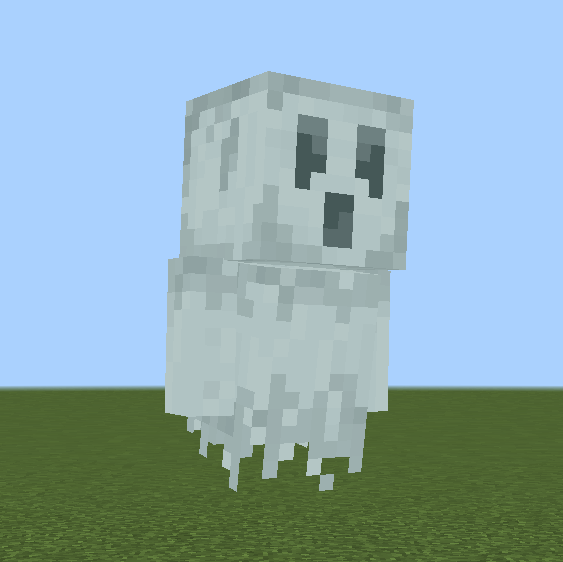

# 创建自定义实体

/// details-info | 署名信息
- 该页面翻译自[https://wiki.bedrock.dev/guide/custom-entity.html](https://wiki.bedrock.dev/guide/custom-entity.html)
- 该页面仓库地址为[https://github.com/Bedrock-OSS/bedrock-wiki/blob/wiki/docs/guide/custom-entity.md](https://github.com/Bedrock-OSS/bedrock-wiki/blob/wiki/docs/guide/custom-entity.md)
- 该页面的版本为<!-- md:samp Bedrock-OSS/bedrock-wiki@60593ceb65e7bf8258290ccaa1d1bbd610062a0d -->
- 该页面的作者有：
  - <!-- md:samp @ThijsHankelMC -->
  - <!-- md:samp @TheItsNameless -->
  - <!-- md:samp @SmokeyStack -->
  - <!-- md:samp @MedicalJewel105 -->
  - <!-- md:samp @SirLich -->
  - <!-- md:samp @ChibiMango -->
  - <!-- md:samp @smell-of-curry -->
  - <!-- md:samp @Hatchibombotar -->
  - <!-- md:samp @Sephodious -->
  - <!-- md:samp @LeGend077 -->
  - <!-- md:samp @Ascent817 -->
  - <!-- md:samp @BaHuu -->
  - <!-- md:samp @Sprunkles317 -->
  - <!-- md:samp @ThomasOrs -->
  - <!-- md:samp @QuazChick -->
///

与自定义物品类似，我们也可以创建具有许多与游戏中原版实体相似机制的自定义实体。这些实体可以非常强大，允许你制作自己的动物，这些动物可以被繁殖和驯服，或者成为攻击任何它看到的目标的攻击性生物。

在这里，我们将创建一个鬼魂实体，该实体会漂浮，攻击玩家并在死亡时掉落我们的灵异物质物品。

{ width=150 }

就像物品一样，实体由两部分组成：

-   视觉效果（纹理、名称、动画、声音）
-   行为（移动、攻击）

但不同的是，我们将需要两个主要文件，一个称为*服务端*文件，一个称为*客户端*文件，分别位于我们的BP和RP中。
我们还需要额外的文件来描述实体的几何体及其动画，但我们将在后面的章节中介绍。

首先，我们将介绍如何创建一个实体并定义其行为。接下来，我们将学习如何添加视觉效果。

## 实体行为

与物品类似，我们需要一个文件来告诉我们的实体如何执行行为，该文件将一个标识符指向定义行为的特定组件。这个文件将与我们的物品行为文件非常相似，只是包含了更多的组件。

我们在BP中的`BP/entities/`文件夹下定义我们的服务端文件。我们将此文件命名为`ghost.se.json`。这里的`.se`代表*服务端实体*。这是为了清晰，并在[样式指南](../meta/style-guide.md)中推荐使用。

以下是文件的基本概述：

```json title="BP/entities/ghost.se.json"
{
  "format_version": "1.16.0",
  "minecraft:entity": {
    "description": {...},
    "components": {...}
  }
}
```

就像物品一样，我们有我们的格式版本，这里我们使用`minecraft:entity`因为这是一个实体文件。从现在起，我们将不再讨论格式版本，并直接建议使用我们提供的版本示例。

对于实体，在`description`下我们有更多的信息：

```json title="BP/entities/ghost.se.json#minecraft:entity"
"description": {
  "identifier": "wiki:ghost",
  "is_summonable": true,
  "is_spawnable": true,
  "is_experimental": false
}
```

`identifier`键起到相同的作用，用于指向我们正在谈论的实体。
其他键决定了我们如何将实体添加到世界中：

-   `is_summonable`：是否可以使用`/summon`命令召唤。
-   `is_spawnable`：是否可以使用刷怪蛋或生成规则在世界中生成。
-   `is_experimental`：实体是否是实验性的（如果是，则只能添加到实验世界中）。

我们建议保持这些设置不变，因为任何更改都会使在游戏中测试你的实体变得更困难。

### 组件

实体的行为比物品多得多，因此我们需要为其定义更多的组件。
我们将把将要使用的组件类型分为几类，然后再详细查看它们。
有关实体中组件的更多信息，你可以查看我们的[页面](../entities/entity-intro-bp.md)。

### 属性组件

这些是你通常会在每个实体上拥有的组件。这些组件定义了实体的一些核心属性。

```json title="BP/entities/ghost.se.json#minecraft:entity#components"
"minecraft:type_family": {
  "family": ["ghost", "monster"]
},
"minecraft:health": {
  "value": 20,
  "max": 20
},
"minecraft:attack": {
  "damage": 3
},
"minecraft:movement": {
  "value": 0.2
},
"minecraft:collision_box": {
  "width": 0.8,
  "height": 1.8
},
"minecraft:loot": {
  "table": "loot_tables/entities/ghost.json"
},
```

组件`minecraft:health`、`minecraft:attack`和`minecraft:movement`都是直截了当的，分别设置实体的生命值、攻击伤害和移动速度。实体的碰撞箱是实体与方块或其他实体互动或碰撞的范围。这是通过`minecraft:collision_box`定义的，该箱体将被放置在实体的中间位置。

`minecraft:type_family`为实体添加了族标签。族标签用于将类似类别的实体分组。例如，`monster`包含僵尸、骷髅和苦力怕。这使我们能够选择所有具有`monster`标签的实体。

`minecraft:loot`定义了实体死亡时将掉落的战利品表的路径。我们将在后面的章节中使用此路径创建该战利品表。

### 移动组件

为了让实体移动，我们需要定义两件事，*如何*移动和*可以移动到哪里*。这分别使用`movement`和`navigation`组件来定义。

如果你希望实体能够移动，你将始终需要一个`movement`和`navigation`组件。

```json title="BP/entities/ghost.se.json#minecraft:entity#components"
"minecraft:physics": {},
"minecraft:jump.static": {},
"minecraft:movement.basic": {},
"minecraft:navigation.walk": {
  "can_walk": true,
  "avoid_sun": true,
  "can_pass_doors": true,
  "can_open_doors": true
}
```

`minecraft:physics`用于在你的实体上应用重力和碰撞。注意：你不能通过使用组件组更改此组件。
`minecraft:jump.static`允许你的实体跳跃过方块以便通行。几乎每个实体都使用这两个组件。

有几种不同类型的移动组件，允许不同类型的移动，例如海豚使用的`minecraft:movement.swim`，鹦鹉使用的`minecraft:movement.fly`，蜂蜜使用的`minecraft:movement.hover`。
`minecraft:movement.basic`组件允许我们的实体通过在方块上移动来行走。为了让我们的实体看起来像是在漂浮，我们将使用我们自己的几何体模型。

`navigation`组件是一个寻路器，定义我们允许实体遵循的路径。例如骷髅会尽量不在阳光下行走，因此它们的路径不会选择会将它们置于阳光下的路径。此外，鹦鹉可以飞行，因此它们可以进入空中寻路，不像步行生物那样受限。

这些组件具有许多不同的设置，允许有趣的寻路。我们选择的设置允许我们的鬼魂在地面上行走，避免进入阳光，穿过门口并打开门。

### 行为组件

虽然我们已经定义了实体*如何*做事，但我们尚未定义*何时*或*做什么*。这就是`.behavior`组件的作用。这些组件定义了实体将执行的具体动作。
例如，村民会尝试繁殖，因此它们具有`minecraft:behavior.breed`组件，驯服的狼会跟随它们的主人，因此它们具有`minecraft:behavior.follow_owner`组件。

我们希望我们的鬼魂能够闲逛和四处张望，靠近时以玩家为目标，然后攻击他们。以下是我们使用的组件：

```json title="BP/entities/ghost.se.json#minecraft:entity#components"
// 允许随机移动和四处张望
"minecraft:behavior.random_stroll": {...},
"minecraft:behavior.random_look_around": {...},
"minecraft:behavior.look_at_player": {...},
// 允许目标选择
"minecraft:behavior.hurt_by_target": {...},
"minecraft:behavior.nearest_attackable_target": {...},
// 允许攻击
"minecraft:behavior.delayed_attack": {...}
```

第一个组件，`minecraft:behavior.random_stroll`允许我们的实体定期选择附近的一个随机点进行路径规划。此路径是使用我们的`navigation`组件创建的，然后移动类型由我们的`movement`组件定义。

接下来的两个组件允许我们的实体随机四处张望，并在玩家在范围内时看向玩家。

对于攻击，为了让我们的实体攻击，它需要一个`target`。两个行为`minecraft:behavior.hurt_by_target`和`minecraft:behavior.nearest_attackable_target`将使实体以任何伤害它的实体为目标，并以范围内的最近敌人为目标。

最后，`minecraft:behavior.delayed_attack`是我们的实体实际攻击目标的方式。

每个这些行为都有进一步的设置来调整我们想要的确切行为。

```json title="BP/entities/ghost.se.json#minecraft:entity#components"
"minecraft:behavior.random_stroll": {
  "priority": 6,
  "speed_multiplier": 1
},
"minecraft:behavior.random_look_around": {
  "priority": 7
},
"minecraft:behavior.look_at_player": {
  "priority": 7,
  "look_distance": 6,
  "probability": 0.02
},
"minecraft:behavior.hurt_by_target": {
  "priority": 1
},
"minecraft:behavior.nearest_attackable_target": {
  "priority": 2,
  "within_radius": 25,
  "reselect_targets": true,
  "entity_types": [
    {
      "filters": {
        "any_of": [
          {
            "test": "is_family",
            "subject": "other",
            "value": "player"
          }
        ]
      },
      "max_dist": 35
    }
  ]
},
"minecraft:behavior.delayed_attack": {
  "priority": 0,
  "attack_once": false,
  "track_target": true,
  "require_complete_path": false,
  "random_stop_interval": 0,
  "reach_multiplier": 1.5,
  "speed_multiplier": 1,
  "attack_duration": 0.75,
  "hit_delay_pct": 0.5
}
```

有关这些选项的更多详细信息，你可以在官方文档[bedrock.dev](https://bedrock.dev/docs/stable/Entities)中阅读。

#### 优先级

所有行为都包含一个`priority`字段。此字段用于在可以运行多个行为时决定运行哪个行为。

当实体选择要做什么时，它会从最低优先级到最高优先级搜索其所有行为，并选择第一个可以执行的行为。因此，你需要将重要的行为如`minecraft:behavior.nearest_attackable_target`的优先级设置低于如`minecraft:behavior.look_at_player`之类的行为。如果`look_at_player`行为优先级较低，则当玩家靠近时，它总是首先运行此行为，实体将永远不会攻击。

通常，重要的行为优先级为`0`或`1`。

### 完整的实体服务端文件

/// details-info | 完整的ghost.se.json

```json title="BP/entities/ghost.se.json"
{
  "format_version": "1.16.0",
  "minecraft:entity": {
    "description": {
      "identifier": "wiki:ghost",
      "is_summonable": true,
      "is_spawnable": true,
      "is_experimental": false
    },
    "components": {
      "minecraft:type_family": {
        "family": ["ghost", "monster"]
      },
      "minecraft:health": {
        "value": 20,
        "max": 20
      },
      "minecraft:attack": {
        "damage": 3
      },
      "minecraft:movement": {
        "value": 0.2
      },
      "minecraft:collision_box": {
        "width": 0.8,
        "height": 1.8
      },
      "minecraft:loot": {
        "table": "loot_tables/entities/ghost.json"
      },
      "minecraft:physics": {},
      "minecraft:jump.static": {},
      "minecraft:movement.basic": {},
      "minecraft:navigation.walk": {
        "can_walk": true,
        "avoid_sun": true,
        "can_pass_doors": true,
        "can_open_doors": true
      },

      "minecraft:behavior.random_stroll": {
        "priority": 6,
        "speed_multiplier": 1
      },
      "minecraft:behavior.random_look_around": {
        "priority": 7
      },
      "minecraft:behavior.look_at_player": {
        "priority": 7,
        "look_distance": 6,
        "probability": 0.02
      },
      "minecraft:behavior.hurt_by_target": {
        "priority": 1
      },
      "minecraft:behavior.nearest_attackable_target": {
        "priority": 2,
        "within_radius": 25,
        "reselect_targets": true,
        "entity_types": [
          {
            "filters": {
              "any_of": [
                {
                  "test": "is_family",
                  "subject": "other",
                  "value": "player"
                }
              ]
            },
            "max_dist": 35
          }
        ]
      },
      "minecraft:behavior.delayed_attack": {
        "priority": 0,
        "attack_once": false,
        "track_target": true,
        "require_complete_path": false,
        "random_stop_interval": 0,
        "reach_multiplier": 1.5,
        "speed_multiplier": 1,
        "attack_duration": 0.75,
        "hit_delay_pct": 0.5
      }
    }
  }
}
```

///

至此，我们完成了实体行为文件。

更复杂的实体还可以具有不同的*状态*，根据其所在的状态不同行为。例如，野生狼会自由行走，但一旦被驯服，它会跟随玩家。一个*事件*（被驯服）导致狼改变*状态*。此功能允许我们创建在发生不同事件时执行不同动作的动态实体。你可以在我们的指南[这里](../entities/entity-intro-bp.md)中了解更多。

如果你打开世界并尝试使用`/summon wiki:ghost`召唤你的实体，它应该会像我们预期的那样行为，但地面上只有一个阴影。你可能还会看到它的名称作为翻译键，类似于我们物品的情况。

接下来，我们将学习如何创建我们的资源或者说客户端文件以及如何分配我们的纹理、几何体和动画。

## 实体资源

将视觉效果应用于实体与物品非常不同。由于实体往往有更多的部件，我们有一个专门的文件用于定义资源。这称为实体*客户端文件*，我们将其命名为`ghost.ce.json`。这些文件位于文件夹`RP/entity/`中。

在本节中，我们将使用为我们的鬼魂实体创建的示例资源来演示如何将它们添加到实体中。在指南的下一部分，我们将解释如何使用专用的3D编辑器Blockbench创建你自己的实体几何体和动画。

### 模型

我们实体的“模型”是实体的几何形状，也称为“几何体”。这描述了实体的形状，例如猪是一个带有四条腿和头部的盒子，而鸡有两条腿、一个头部和翅膀。几何体作为JSON文件存储在`RP/models/entity/`中，我们的文件将命名为`ghost.geo.json`。

此文件由Blockbench自动为我们生成，因此无需手动学习其语法。因此，我们在查看该文件时不会详细介绍。它存储了关于模型中每个块的数据，如大小、位置和旋转。

```json title="RP/models/entity/ghost.geo.json"
{
  "format_version": "1.12.0",
  "minecraft:geometry": [
    {
      "description": {
        "identifier": "geometry.ghost",
        "texture_width": 64,
        "texture_height": 64,
        "visible_bounds_width": 3,
        "visible_bounds_height": 3.5,
        "visible_bounds_offset": [0, 1.25, 0]
      },
      "bones": [
        { "name": "root", "pivot": [0, 3, 0] },
        {
          "name": "body",
          "parent": "root",
          "pivot": [0, 4.625, 0],
          "cubes": [
            {
              "origin": [-4, 3, -4],
              "size": [8, 13, 8],
              "uv": [0, 20]
            }
          ]
        },
        {
          "name": "leftArm",
          "parent": "body",
          "pivot": [4.6, 15.5, 0.5],
          "cubes": [
            {
              "origin": [4.1, 7, -1],
              "size": [3, 9, 3],
              "uv": [32, 32]
            }
          ]
        },
        {
          "name": "rightArm",
          "parent": "body",
          "pivot": [-4.5, 15.5, 0.5],
          "cubes": [
            {
              "origin": [-7.1, 7, -1],
              "size": [3, 9, 3],
              "uv": [32, 20]
            }
          ]
        },
        {
          "name": "head",
          "parent": "body",
          "pivot": [0, 16, 0],
          "cubes": [
            {
              "origin": [-5, 16, -5],
              "size": [10, 10, 10],
              "uv": [0, 0]
            }
          ]
        }
      ]
    }
  ]
}
```

我们需要的重要信息是`identifier`，我们将使用它来引用我们的几何文件，这里是`geometry.ghost`。

### 纹理

我们的实体现在有了形状，但它还需要纹理。此纹理也可以在Blockbench中创建，只是一个`.png`文件。

`RP/textures/entity/ghost.png`


[在此处下载纹理](https://raw.githubusercontent.com/Bedrock-OSS/wiki-addon/main/ma-guide/guide_RP/textures/entity/ghost.png){ .md-button download }

你可能还记得，当我们制作物品时，我们为纹理分配了一个短名称以供后续引用。我们将在实体文件中为实体执行类似的操作，因此请确保保留纹理的文件路径。

### 动画

动画可以使我们的实体更具生命力，并以不同的方式移动。我们可以为一个实体创建任意数量的动画，并且我们还可以使用*动画控制器*在不同类型的情况下触发它们，我们将在下一节中介绍。

根据你的实体，你可能需要不同的动画。对于我们的鬼魂，我们将拥有`idle`、`attack`和`move`动画。这些文件也在Blockbench中自动创建，因此我们不会详细查看。

一个动画文件可以包含一个或多个动画。我们的动画都在一个名为`ghost.a.json`的文件中，位于`RP/animations/`下。

```json title="RP/animations/ghost.a.json"
{
  "format_version": "1.8.0",
  "animations": {
    "animation.ghost.idle": {...},
    "animation.ghost.attack": {...},
    "animation.ghost.move": {...}
  }
}
```

每个动画由键定义，因此这里我们的三个动画标识符是`animation.ghost.idle`、`animation.ghost.attack`和`animation.ghost.move`。

/// tip | 注意
如果你的一个实体有多个动画文件，请考虑将它们全部移到同一个文件中，以保持你的文件夹易于阅读和导航。
如果不这样做，请确保在实体文件中引用动画时，使用动画标识符而非文件名。
///

/// details-info | 完整的动画文件

```json title="RP/animations/ghost.a.json"
{
  "format_version": "1.8.0",
  "animations": {
    "animation.ghost.idle": {
      "loop": true,
      "animation_length": 3,
      "bones": {
        "body": {
          "rotation": { "0.0": [10, 0, 0], "3.0": [10, 0, 0] },
          "position": {
            "0.0": [0, 0, 0],
            "1.5": [0, 1, 0],
            "3.0": [0, 0, 0]
          }
        },
        "leftArm": {
          "rotation": {
            "0.0": [-10, 0, 0],
            "1.5": [-5, 0, 0],
            "3.0": [-10, 0, 0]
          }
        },
        "rightArm": {
          "rotation": {
            "0.0": [-10, 0, 0],
            "1.5": [-5, 0, 0],
            "3.0": [-10, 0, 0]
          }
        },
        "head": {
          "rotation": {
            "0.0": [-7.5, 0, 0],
            "1.5": [-2.5, 0, 0],
            "3.0": [-7.5, 0, 0]
          }
        }
      }
    },
    "animation.ghost.attack": {
      "animation_length": 0.75,
      "bones": {
        "body": {
          "rotation": {
            "0.0": [10, 0, 0],
            "0.2917": [10, 15, 0],
            "0.5": [22.5, -12.5, 0],
            "0.75": [10, 0, 0]
          },
          "position": {
            "0.0": [0, 0, 0],
            "0.2917": [0, 0, 3],
            "0.5": [0, 0, -3],
            "0.75": [0, 0, 0]
          }
        },
        "leftArm": {
          "rotation": { "0.0": [-10, 0, 0], "0.75": [-10, 0, 0] }
        },
        "rightArm": {
          "rotation": {
            "0.0": [-10, 0, 0],
            "0.2083": [-10, 0, 0],
            "0.2917": [-10, 62.5, 117.5],
            "0.5": [-80, -17.5, 22.5],
            "0.75": [-10, 0, 0]
          }
        },
        "head": {
          "rotation": { "0.0": [-7.5, 0, 0], "0.75": [-7.5, 0, 0] }
        }
      }
    },
    "animation.ghost.move": {
      "loop": true,
      "animation_length": 1,
      "bones": {
        "body": {
          "rotation": {
            "0.0": [15, 0, 0],
            "0.25": [15, -2.5, 0],
            "0.5": [15, 0, 0],
            "0.75": [15, 2.5, 0],
            "1.0": [15, 0, 0]
          },
          "position": [0, 0, 0]
        },
        "leftArm": {
          "rotation": {
            "0.0": [15, 0, 0],
            "0.5": [20, 0, 0],
            "1.0": [15, 0, 0]
          }
        },
        "rightArm": {
          "rotation": {
            "0.0": [15, 0, 0],
            "0.5": [20, 0, 0],
            "1.0": [15, 0, 0]
          }
        },
        "head": {
          "rotation": {
            "0.0": [-12.5, 0, 0],
            "0.5": [-15, 0, 0],
            "1.0": [-12.5, 0, 0]
          }
        }
      }
    }
  }
}
```

///

### 动画控制器

我们有了动画，但我们的实体不知道何时播放它们。这就是动画控制器的用途。动画控制器的核心就是*控制*动画的播放方式。
动画控制器由*状态*和*状态之间的转移*组成。这允许我们在实体处于某些状态时播放特定动画，并在满足某些条件时在状态之间转移。

例如，当一个实体在移动时，转移到移动状态并播放`move`动画。或者当实体在攻击时，转移到攻击状态并播放`attack`动画。

让我们看看我们的攻击动画控制器。

```json title="RP/animation_controllers/ghost.ac.json#animation_controllers"
"controller.animation.ghost.attack": {
  "states": {
    "default": {
      "transitions": [
        {
          "attacking": "q.is_delayed_attacking"
        }
      ]
    },
    "attacking": {
      "blend_transition": 0.2,
      "animations": ["attack"],
      "transitions": [
        {
          "default": "!q.is_delayed_attacking"
        }
      ]
    }
  }
}
```

你可以看到我们有两个状态，`default`和`attacking`。我们的实体开始于默认状态。

你可以在`transitions`下看到有一个条件，当条件为真时会将实体转移到某个状态。

```json title=""
{
  "attacking": "q.is_delayed_attacking"
}
```

这里，`attacking`是将要转移到的状态，`q.is_delayed_attacking`是需要为真的条件以便发生转移。
此条件称为*查询*。这些查询可以告诉我们有关实体的事情，例如它是否正在攻击或移动。查询`q.is_delayed_attacking`在实体执行攻击行为时将返回`true`。

当实体处于`attacking`状态时，它还有一个转移回默认状态。现在条件是`!q.is_delayed_attacking`。这里的`!`表示*非*，因此它将返回`q.is_delayed_attacking`的相反结果（如果`q.is_delayed_attacking`返回`true`，则`!q.is_delayed_attacking`返回`false`）。

此状态还具有`animations`。这些是在此状态下始终播放的动画。注意，我们在此处使用了动画的*短名称*，稍后将在实体文件中引用。如果不这样做，动画将不会播放。
还有`blend_transition`键，它允许动画彼此缓慢淡入淡出。较大的数字意味着更长的转移时间。

我们还可以为我们的`move`和`idle`动画制作一个类似的控制器。

```json title="RP/animation_controllers/ghost.ac.json#animation_controllers"
"controller.animation.ghost.walk": {
  "initial_state": "standing",
  "states": {
    "standing": {
      "blend_transition": 0.2,
      "animations": ["idle"],
      "transitions": [
        {
          "moving": "q.modified_move_speed > 0.1"
        }
      ]
    },
    "moving": {
      "blend_transition": 0.2,
      "animations": ["move"],
      "transitions": [
        {
          "standing": "q.modified_move_speed < 0.1"
        }
      ]
    }
  }
}
```

这遵循了类似的模式，并有所补充。
我们现在有`initial_state`，它告诉控制器从哪个状态开始。如果未列出，则将从`default`状态开始。
你还会注意到我们的查询看起来略有不同。在这里，查询`q.modified_move_speed`返回一个数值，因此为了使最终结果返回一个布尔值（即true或false），我们查看该值是否高于或低于`0.1`。有关动画控制器的更详细信息，你可以阅读[这里](../animation-controllers/animation-controllers-intro.md)。

现在我们有了动画控制器，我们可以将它们添加到我们的动画控制器文件中。与动画类似，键是我们动画控制器的标识符；`controller.animation.ghost.attack`和`controller.animation.ghost.walk`。

我们的文件将命名为`ghost.ac.json`，并将放置在`RP/animation_controllers/`中。

```json title="RP/animation_controllers/ghost.ac.json"
{
  "format_version": "1.12.0",
  "animation_controllers": {
    "controller.animation.ghost.attack": {
      "states": {
        "default": {
          "transitions": [
            {
              "attacking": "q.is_delayed_attacking"
            }
          ]
        },
        "attacking": {
          "blend_transition": 0.2,
          "animations": ["attack"],
          "transitions": [
            {
              "default": "!q.is_delayed_attacking"
            }
          ]
        }
      }
    },
    "controller.animation.ghost.walk": {
      "initial_state": "standing",
      "states": {
        "standing": {
          "blend_transition": 0.2,
          "animations": ["idle"],
          "transitions": [
            {
              "moving": "q.modified_move_speed > 0.1"
            }
          ]
        },
        "moving": {
          "blend_transition": 0.2,
          "animations": ["move"],
          "transitions": [
            {
              "standing": "q.modified_move_speed < 0.1"
            }
          ]
        }
      }
    }
  }
}
```

至此，我们已经为实体创建了所有需要的资源。我们现在将创建我们的实体文件。

### 实体客户端文件

客户端文件包含对实体视觉组件的所有引用。
我们的客户端文件将位于`RP/entity/`中，我们将此文件命名为`ghost.ce.json`。此文件将在`description`键下包含所有信息。我们从熟悉的格式开始：

```json title="RP/entity/ghost.ce.json"
{
  "format_version": "1.10.0",
  "minecraft:client_entity": {
    "description": {
      "identifier": "wiki:ghost"
    }
  }
}
```

我们使用与行为文件相同的标识符，以指向正确的实体。

首先，我们需要在文件中定义实体的视觉效果，以便知道我们使用了哪些模型和纹理。我们还需要对动画和动画控制器执行相同的操作。

#### 渲染控制器

为了显示我们的实体，它需要被*渲染*。为此，它需要材质、纹理和几何体。我们已经制作了纹理和几何体。材质定义了如何显示我们的纹理。例如，骷髅使用材质允许透明，末影人使用材质使其眼睛发光。

由于我们的鬼魂具有一定的透明度，我们需要一个能够正确渲染它的材质。幸运的是，Minecraft有许多预制的材质供我们使用，例如允许透明的`entity_alphatest`。你可以创建自己的材质，但请注意这非常高级。如果你感兴趣，可以从[这里](../documentation/materials.md)开始。

为了使用这些资源，我们需要在实体文件中用短名称定义它们。这与我们在`item_texture.json`文件中为物品分配短名称类似，只是在这里我们在实体客户端文件中进行。以下是布局。

```json title="RP/entity/ghost.ce.json"
{
  "format_version": "1.10.0",
  "minecraft:client_entity": {
    "description": {
      "identifier": "wiki:ghost",
      "materials": {
        "default": "entity_alphatest"
      },
      "textures": {
        "default": "textures/entity/ghost"
      },
      "geometry": {
        "default": "geometry.ghost"
      }
    }
  }
}
```

在每个类别下，我们为每个资源分配了短名称`default`，确保使用正确的路径和标识符。我们可以定义多个这样的短名称，尽管这更为高级。现在，我们可以使用这些短名称引用我们的资源。

为了渲染这些资源，我们需要告诉游戏渲染哪些资源。这由*渲染控制器*控制。控制器告诉游戏为实体渲染哪个几何体、材质和纹理，使我们能够在游戏中看到它。

渲染控制器在一个单独的文件中定义，并使用我们在实体文件中定义的短名称。
该文件命名为`ghost.rc.json`，位于`RP/render_controllers/`中：

```json title="RP/render_controllers/entity/ghost.rc.json"
{
  "format_version": "1.10.0",
  "render_controllers": {
    "controller.render.ghost": {
      "geometry": "geometry.default",
      "materials": [
        {
          "*": "material.default"
        }
      ],
      "textures": ["texture.default"]
    }
  }
}
```

这遵循了与动画控制器和动画文件类似的结构，我们的渲染控制器标识符为`controller.render.ghost`。
这告诉游戏应该渲染具有短名称`default`的资源。渲染控制器还可以允许你为模型的不同部分显示不同的纹理或应用不同的材质。在`materials`下，我们使用`"*"`表示将此材质应用于模型中的所有*骨骼*（即模型中的每个立方体）。有关渲染控制器的更多信息，你可以查看我们的[页面](../entities/render-controllers.md)。

/// tip
如果你能保持短名称的一致性，实际上可以为多个实体引用相同的渲染控制器。
///

现在要告诉你的实体使用此渲染控制器，我们将其添加到实体文件中，如下所示：

```json title="RP/entity/ghost.ce.json#description"
"render_controllers": ["controller.render.ghost"]
```

至此，我们的实体文件应该如下所示。

```json title="RP/entity/ghost.ce.json"
{
  "format_version": "1.10.0",
  "minecraft:client_entity": {
    "description": {
      "identifier": "wiki:ghost",
      "materials": {
        "default": "entity_alphatest"
      },
      "textures": {
        "default": "textures/entity/ghost"
      },
      "geometry": {
        "default": "geometry.ghost"
      },
      "render_controllers": ["controller.render.ghost"]
    }
  }
}
```

现在，如果我们将实体生成到世界中，我们应该能够目视到它。

#### 脚本

现在让我们添加我们的动画。与其他资源一样，我们需要为它们定义短名称。请记住，我们还需要为我们的动画控制器定义短名称。

```json title="RP/entity/ghost.ce.json#description"
"animations": {
  "walk_controller": "controller.animation.ghost.walk",
  "attack_controller": "controller.animation.ghost.attack",
  "attack": "animation.ghost.attack",
  "idle": "animation.ghost.idle",
  "move": "animation.ghost.move"
}
```

你会记得，这些是我们在动画控制器中使用的短名称；任何我们想在动画控制器中使用的动画，都必须在实体客户端文件中用短名称定义。

现在我们已经引用了动画和动画控制器，我们需要决定实体何时运行它们。这是通过`scripts`完成的：

```json title="RP/entity/ghost.ce.json#description"
"scripts": {
  "animate": [
    "walk_controller",
    "attack_controller"
  ]
}
```

在这里，`scripts`告诉实体在特定时间执行某些动作。`animate`键将每个刻运行引用的任何动画或控制器。这意味着每个刻我们的动画控制器将检查是否需要转换到新状态，并执行它们所在状态中的任何动画。

至此，我们的动画应该能够正常工作。

#### 刷怪蛋

完成实体客户端文件的最后一步是为我们的实体创建一个刷怪蛋。幸运的是，我们的文件可以通过`spawn_egg`键为我们生成一个。

```json title="RP/entity/ghost.ce.json#description"
"spawn_egg": {
  "overlay_color": "#bdd1d1",
  "base_color": "#9fb3b3"
}
```

这将生成一个刷怪蛋，使用时将召唤我们的实体。它使用`base_color`和`overlay_color`中的十六进制代码为刷怪蛋着色。如果你想为刷怪蛋使用自定义图标，请使用`texture`键，并放入你想要的纹理的短名称。按照物品教程中的方法为物品定义纹理短名称。

```json
"spawn_egg": {
  "texture": "texture_shortname"
}
```

至此，我们完成了实体客户端文件。

/// details-info | 完整的ghost.ce.json

```json title="RP/entity/ghost.ce.json"
{
  "format_version": "1.10.0",
  "minecraft:client_entity": {
    "description": {
      "identifier": "wiki:ghost",
      "materials": {
        "default": "entity_alphatest"
      },
      "textures": {
        "default": "textures/entity/ghost"
      },
      "geometry": {
        "default": "geometry.ghost"
      },
      "scripts": {
        "animate": ["walk_controller", "attack_controller"]
      },
      "animations": {
        "walk_controller": "controller.animation.ghost.walk",
        "attack_controller": "controller.animation.ghost.attack",
        "attack": "animation.ghost.attack",
        "idle": "animation.ghost.idle",
        "move": "animation.ghost.move"
      },
      "spawn_egg": {
        "overlay_color": "#bdd1d1",
        "base_color": "#9fb3b3"
      },
      "render_controllers": ["controller.render.ghost"]
    }
  }
}
```

///

### 实体名称

最后的步骤是将实体的名称添加到语言文件中。你可能还注意到，如果你创建了刷怪蛋，它也会有一个名称的翻译键；我们也将添加此项。在`en_US.lang`中，确保为实体和实体刷怪蛋项添加名称。它们应类似于：

```lang title="RP/texts/en_US.lang"
entity.wiki:ghost.name=Ghost
item.spawn_egg.entity.wiki:ghost.name=Ghost
```

## 概述

完成！你的实体现在应该在Minecraft中显示，完整的所有行为和视觉效果，包括动画！你应该能够使用`/summon`召唤你的实体，或在创意菜单中找到刷怪蛋。

你的文件夹结构应如下所示：

<FolderView :paths="[
  'RP/animations/ghost.a.json',
  'RP/animation_controllers/ghost.ac.json',
  'RP/entity/ghost.ce.json',
  'RP/models/entity/ghost.geo.json',
  'RP/render_controllers/ghost.rc.json',
  'RP/textures/entity/ghost.png',
  'RP/textures/items/ectoplasm.png',
  'RP/textures/item_texture.json',
  'RP/texts/en_US.lang',
  'RP/texts/languages.json',
  'RP/manifest.json',
  'RP/pack_icon.png',
  'BP/entities/ghost.se.json',
  'BP/items/ectoplasm.json',
  'BP/texts/en_US.lang',
  'BP/texts/languages.json',
  'BP/manifest.json',
  'BP/pack_icon.png',
]"></FolderView>

/// details-info | 完整的ghost.se.json

```json title="BP/entities/ghost.se.json"
{
  "format_version": "1.16.0",
  "minecraft:entity": {
    "description": {
      "identifier": "wiki:ghost",
      "is_summonable": true,
      "is_spawnable": true,
      "is_experimental": false
    },
    "components": {
      "minecraft:type_family": {
        "family": ["ghost", "monster"]
      },
      "minecraft:health": {
        "value": 20,
        "max": 20
      },
      "minecraft:attack": {
        "damage": 3
      },
      "minecraft:movement": {
        "value": 0.2
      },
      "minecraft:collision_box": {
        "width": 0.8,
        "height": 1.8
      },
      "minecraft:loot": {
        "table": "loot_tables/entities/ghost.json"
      },
      "minecraft:physics": {},
      "minecraft:jump.static": {},
      "minecraft:movement.basic": {},
      "minecraft:navigation.walk": {
        "can_walk": true,
        "avoid_sun": true,
        "can_pass_doors": true,
        "can_open_doors": true
      },

      "minecraft:behavior.random_stroll": {
        "priority": 6,
        "speed_multiplier": 1
      },
      "minecraft:behavior.random_look_around": {
        "priority": 7
      },
      "minecraft:behavior.look_at_player": {
        "priority": 7,
        "look_distance": 6,
        "probability": 0.02
      },
      "minecraft:behavior.hurt_by_target": {
        "priority": 1
      },
      "minecraft:behavior.nearest_attackable_target": {
        "priority": 2,
        "within_radius": 25,
        "reselect_targets": true,
        "entity_types": [
          {
            "filters": {
              "any_of": [
                {
                  "test": "is_family",
                  "subject": "other",
                  "value": "player"
                }
              ]
            },
            "max_dist": 35
          }
        ]
      },
      "minecraft:behavior.delayed_attack": {
        "priority": 0,
        "attack_once": false,
        "track_target": true,
        "require_complete_path": false,
        "random_stop_interval": 0,
        "reach_multiplier": 1.5,
        "speed_multiplier": 1,
        "attack_duration": 0.75,
        "hit_delay_pct": 0.5
      }
    }
  }
}
```

///

/// details-info | 完整的ghost.ce.json

```json title="RP/entity/ghost.ce.json"
{
  "format_version": "1.10.0",
  "minecraft:client_entity": {
    "description": {
      "identifier": "wiki:ghost",
      "materials": {
        "default": "entity_alphatest"
      },
      "textures": {
        "default": "textures/entity/ghost"
      },
      "geometry": {
        "default": "geometry.ghost"
      },
      "scripts": {
        "animate": ["walk_controller", "attack_controller"]
      },
      "animations": {
        "walk_controller": "controller.animation.ghost.walk",
        "attack_controller": "controller.animation.ghost.attack",
        "attack": "animation.ghost.attack",
        "idle": "animation.ghost.idle",
        "move": "animation.ghost.move"
      },
      "spawn_egg": {
        "overlay_color": "#bdd1d1",
        "base_color": "#9fb3b3"
      },
      "render_controllers": ["controller.render.ghost"]
    }
  }
}
```

///

/// details-info | 完整的ghost.geo.json

```json title="RP/models/entity/ghost.geo.json"
{
  "format_version": "1.12.0",
  "minecraft:geometry": [
    {
      "description": {
        "identifier": "geometry.ghost",
        "texture_width": 64,
        "texture_height": 64,
        "visible_bounds_width": 3,
        "visible_bounds_height": 3.5,
        "visible_bounds_offset": [0, 1.25, 0]
      },
      "bones": [
        { "name": "root", "pivot": [0, 3, 0] },
        {
          "name": "body",
          "parent": "root",
          "pivot": [0, 4.625, 0],
          "cubes": [
            {
              "origin": [-4, 3, -4],
              "size": [8, 13, 8],
              "uv": [0, 20]
            }
          ]
        },
        {
          "name": "leftArm",
          "parent": "body",
          "pivot": [4.6, 15.5, 0.5],
          "cubes": [
            {
              "origin": [4.1, 7, -1],
              "size": [3, 9, 3],
              "uv": [32, 32]
            }
          ]
        },
        {
          "name": "rightArm",
          "parent": "body",
          "pivot": [-4.5, 15.5, 0.5],
          "cubes": [
            {
              "origin": [-7.1, 7, -1],
              "size": [3, 9, 3],
              "uv": [32, 20]
            }
          ]
        },
        {
          "name": "head",
          "parent": "body",
          "pivot": [0, 16, 0],
          "cubes": [
            {
              "origin": [-5, 16, -5],
              "size": [10, 10, 10],
              "uv": [0, 0]
            }
          ]
        }
      ]
    }
  ]
}
```

///

/// details-info | 完整的ghost.a.json

```json title="RP/animations/ghost.a.json"
{
  "format_version": "1.8.0",
  "animations": {
    "animation.ghost.idle": {
      "loop": true,
      "animation_length": 3,
      "bones": {
        "body": {
          "rotation": { "0.0": [10, 0, 0], "3.0": [10, 0, 0] },
          "position": {
            "0.0": [0, 0, 0],
            "1.5": [0, 1, 0],
            "3.0": [0, 0, 0]
          }
        },
        "leftArm": {
          "rotation": {
            "0.0": [-10, 0, 0],
            "1.5": [-5, 0, 0],
            "3.0": [-10, 0, 0]
          }
        },
        "rightArm": {
          "rotation": {
            "0.0": [-10, 0, 0],
            "1.5": [-5, 0, 0],
            "3.0": [-10, 0, 0]
          }
        },
        "head": {
          "rotation": {
            "0.0": [-7.5, 0, 0],
            "1.5": [-2.5, 0, 0],
            "3.0": [-7.5, 0, 0]
          }
        }
      }
    },
    "animation.ghost.attack": {
      "animation_length": 0.75,
      "bones": {
        "body": {
          "rotation": {
            "0.0": [10, 0, 0],
            "0.2917": [10, 15, 0],
            "0.5": [22.5, -12.5, 0],
            "0.75": [10, 0, 0]
          },
          "position": {
            "0.0": [0, 0, 0],
            "0.2917": [0, 0, 3],
            "0.5": [0, 0, -3],
            "0.75": [0, 0, 0]
          }
        },
        "leftArm": {
          "rotation": { "0.0": [-10, 0, 0], "0.75": [-10, 0, 0] }
        },
        "rightArm": {
          "rotation": {
            "0.0": [-10, 0, 0],
            "0.2083": [-10, 0, 0],
            "0.2917": [-10, 62.5, 117.5],
            "0.5": [-80, -17.5, 22.5],
            "0.75": [-10, 0, 0]
          }
        },
        "head": {
          "rotation": { "0.0": [-7.5, 0, 0], "0.75": [-7.5, 0, 0] }
        }
      }
    },
    "animation.ghost.move": {
      "loop": true,
      "animation_length": 1,
      "bones": {
        "body": {
          "rotation": {
            "0.0": [15, 0, 0],
            "0.25": [15, -2.5, 0],
            "0.5": [15, 0, 0],
            "0.75": [15, 2.5, 0],
            "1.0": [15, 0, 0]
          },
          "position": [0, 0, 0]
        },
        "leftArm": {
          "rotation": {
            "0.0": [15, 0, 0],
            "0.5": [20, 0, 0],
            "1.0": [15, 0, 0]
          }
        },
        "rightArm": {
          "rotation": {
            "0.0": [15, 0, 0],
            "0.5": [20, 0, 0],
            "1.0": [15, 0, 0]
          }
        },
        "head": {
          "rotation": {
            "0.0": [-12.5, 0, 0],
            "0.5": [-15, 0, 0],
            "1.0": [-12.5, 0, 0]
          }
        }
      }
    }
  }
}
```

///

/// details-info | 完整的ghost.ac.json

```json title="RP/animation_controllers/ghost.ac.json"
{
  "format_version": "1.12.0",
  "animation_controllers": {
    "controller.animation.ghost.attack": {
      "states": {
        "default": {
          "transitions": [
            {
              "attacking": "q.is_delayed_attacking"
            }
          ]
        },
        "attacking": {
          "blend_transition": 0.2,
          "animations": ["attack"],
          "transitions": [
            {
              "default": "!q.is_delayed_attacking"
            }
          ]
        }
      }
    },
    "controller.animation.ghost.walk": {
      "initial_state": "standing",
      "states": {
        "standing": {
          "blend_transition": 0.2,
          "animations": ["idle"],
          "transitions": [
            {
              "moving": "q.modified_move_speed > 0.1"
            }
          ]
        },
        "moving": {
          "blend_transition": 0.2,
          "animations": ["move"],
          "transitions": [
            {
              "standing": "q.modified_move_speed < 0.1"
            }
          ]
        }
      }
    }
  }
}
```

///

/// details-info | 完整的ghost.rc.json

```json title="RP/render_controllers/entity/ghost.rc.json"
{
  "format_version": "1.10.0",
  "render_controllers": {
    "controller.render.ghost": {
      "geometry": "geometry.default",
      "materials": [
        {
          "*": "material.default"
        }
      ],
      "textures": ["texture.default"]
    }
  }
}
```

///

## 你的进度至此

-   [x] 设置你的包
-   [x] 创建一个自定义物品
-   [x] 创建一个自定义实体
    - [x] 如何格式化物品的行为和资源文件
    - [x] 如何设置实体的纹理
    - [x] 如何使用模型、动画和动画控制器使你的实体更具吸引力
-   [ ] 创建实体的战利品、生成规则和自定义配方