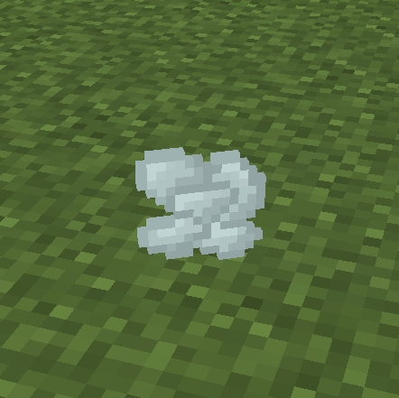

# 创建自定义物品

/// details-info | 署名信息
- 该页面翻译自[https://wiki.bedrock.dev/guide/custom-item.html](https://wiki.bedrock.dev/guide/custom-item.html)
- 该页面仓库地址为[https://github.com/Bedrock-OSS/bedrock-wiki/blob/wiki/docs/guide/custom-item.md](https://github.com/Bedrock-OSS/bedrock-wiki/blob/wiki/docs/guide/custom-item.md)
- 该页面的版本为<!-- md:samp Bedrock-OSS/bedrock-wiki@60593ceb65e7bf8258290ccaa1d1bbd610062a0d -->
- 该页面的作者有：
  - <!-- md:samp @KaiFireborn -->
  - <!-- md:samp @SirLich -->
  - <!-- md:samp @cda94581 -->
  - <!-- md:samp @TheItsNameless -->
  - <!-- md:samp @MedicalJewel105 -->
  - <!-- md:samp @ChibiMango -->
  - <!-- md:samp @TheDoctor15 -->
  - <!-- md:samp @SmokeyStack -->
  - <!-- md:samp @unickorn -->
  - <!-- md:samp @Sprunkles317 -->
  - <!-- md:samp @ThomasOrs -->
  - <!-- md:samp @davedavis -->
  - <!-- md:samp @QuazChick -->
///

在Minecraft中，我们可以创建自定义物品，这些物品可以像普通物品一样被掉落、交易、合成和使用。这个系统具有很大的灵活性，包括制作食物、燃料和工具的能力。

在本教程中，我们将学习如何创建一个简单的“灵异物质”物品，稍后我们将把它用作我们幽灵实体的掉落物。

{ width=150 }

从概念上讲，物品由两个部分组成：

-   视觉效果（纹理、名称）
-   行为（物品的行为方式）

首先，我们将学习如何创建一个新的简单物品并定义其行为。在下一部分中，我们将为该物品分配一个纹理，以便在游戏中查看。

## 物品行为

要制作一个物品，我们需要一种方法来识别它并定义我们希望它的行为。为此，我们将创建一个文件，告诉Minecraft将特定行为应用于我们选择的特定物品。

在本节结束时，我们将完全定义我们物品的行为。

### 组件

不同的物品有不同的行为；你可以吃猪排，附魔物品会发光，鸡蛋只能堆叠到16个。这些都是物品行为的例子。
我们可以通过使用行为组件来定义我们的自定义物品的行为。

/// details-info | 示例组件

```json title="BP/items/example.json/components/"
"minecraft:food":
"minecraft:glint": true,
"minecraft:max_stack_size": 16
```

///

组件包含信息，告诉游戏我们的物品应该做什么。例如，组件[`minecraft:glint`](../items/item-components.md#glint)决定物品是否应该具有附魔光泽，因此将其设置为`true`将应用该效果。
所有组件都有一个附加的`value`，我们可以编辑它以获得所需的行为。

对于我们的灵异物质，我们将其堆叠大小设置为16，类似于鸡蛋。为此，我们使用组件[`minecraft:max_stack_size`](../items/item-components.md#max-stack-size)并将其值设置为`16`。

### 标识符

为了让游戏将正确的组件应用于正确的物品，我们需要能够告诉游戏哪个物品是我们的。我们通过为我们的物品定义一个标识符来做到这一点。

标识符是该物品的唯一名称。对于原版Minecraft的鸡蛋，其标识符为`minecraft:egg`。标识符由两个部分组成：

-   命名空间（`minecraft`）
-   ID（`egg`）

命名空间是唯一的，你将在整个项目中使用它。这是为了减少如果有人向你的游戏添加两个包而都添加了灵异物质物品时可能出现的问题；命名空间减少了标识符相同的可能性。
Minecraft使用的命名空间是`minecraft`。你的命名空间应该是唯一的，例如作者的首字母缩写或包名称的缩写。在我们的示例中，我们将使用命名空间`wiki`；有关创建命名空间的更多信息，请查看我们的页面[这里](../concepts/namespaces.md)。

ID是物品的简短信息名称。在这里我们将使用`ectoplasm`。

因此，我们的自定义标识符变为`wiki:ectoplasm`。请注意，我们使用冒号`:`来分隔命名空间和ID。当我们想引用我们的物品时，我们将使用这个标识符，例如使用`/give`命令。

### 物品文件

现在我们有了组件和标识符，我们可以开始定义我们的物品。我们通过在行为包中创建一个物品定义文件来定义物品。这是我们将放置所有信息的地方。

所有物品定义都放在`BP/items/`中。文件的名称不会影响任何内容，但为了方便导航，建议将其命名为你的ID。
我们将创建一个文件`BP/items/ectoplasm.json`。以下是文件的基本布局：

```json title="BP/items/ectoplasm.json"
{
  "format_version": "1.21.40",
  "minecraft:item": {
    "description": { ... },
    "components": { ... }
  }
}
```

你包中的大多数文件将有两个顶级定义，`"format_version"`和`"minecraft:<file_type>"`。
格式版本定义Minecraft将使用哪个版本的附加包系统来读取此文件。对于我们的物品，我们将使用`1.21.40`以允许我们使用最新的功能。有关格式版本的更多信息，请查看[这里](../guide/format-version.md)。

第二个定义定义了这是什么类型的文件。在我们的例子中，由于这是一个物品定义，因此它是`minecraft:item`。在这里我们将放置所有信息。这里将始终包含一个`description`键。

让我们更详细地看一下`"description"`：

```json title="ectoplasm.json/minecraft:item/"
"description": {
  "identifier": "wiki:ectoplasm",
  "menu_category": {
    "category": "items"
  }
},
```

描述键包含`identifier`和任何其他所需的信息。`identifier`允许文件知道将组件应用于哪个物品。
`category`键定义物品将在创造模式物品栏/配方书的哪个标签中显示。可以选择四个标签：“construction”、“equipment”、“items”和“nature”。如果这里未包含此键，则物品将不会显示在创造模式物品栏中，但你仍然可以通过使用`/give`获取该物品。

现在我们可以在`components`下实际定义我们物品的行为。在这里，我们简单地放置任何我们希望物品具有的组件。
这将是我们的`"minecraft:max_stack_size"`组件。有关其他可以使用的组件，请查看我们更深入的物品指南[这里](../items/item-components.md)。

```json title="ectoplasm.json/minecraft:item/"
"components": {
  "minecraft:max_stack_size": 16
}
```

至此，我们已经完全定义了物品的行为。这是你当前文件的样子。

```json title="BP/items/ectoplasm.json"
{
  "format_version": "1.21.40",
  "minecraft:item": {
    "description": {
      "identifier": "wiki:ectoplasm",
      "menu_category": {
        "category": "items"
      }
    },
    "components": {
      "minecraft:max_stack_size": 16
    }
  }
}
```

如果你打开一个包含你的附加包的世界，你的物品应该在正确的菜单中，但是不可见的，并且有一个奇怪的名称。

这是因为我们还没有定义视觉效果。不过，你应该看到它的堆叠效果是正常的。在下一部分中，我们将定义物品的纹理并将其分配给我们的物品。

## 物品视觉效果

现在我们有了一个可以工作的物品，我们想为它添加纹理和名称。

纹理存储在资源包中的`RP/textures`目录下，作为图像。为了让Minecraft知道在何处使用哪个纹理，我们需要为其分配一个短名称，以便我们可以访问它。

### 纹理

首先，我们需要一个物品的纹理。对于我们的灵异物质，我们将使用这个图像。


[在这里下载纹理](https://raw.githubusercontent.com/Bedrock-OSS/wiki-addon/86b0380310d3d5748a43a4be1f93d4c59668e4bf/guide/guide_RP/textures/items/ectoplasm.png){ .md-button download }

所有物品纹理存储在`RP/textures/items/`中。从这里，你可以创建任何你想要的子目录。
最好将纹理图像文件命名为物品的*id*，在我们的情况下，它将是`ectoplasm.png`。
建议将图像保存为`.png`格式，大小为`16x16`，尽管Minecraft也接受其他格式，如`.jpg`或`.tga`。

你的文件夹结构应该如下所示：

<div class="treeview" markdown>
- {{file|RP|folder}}
    - {{file|textures|folder}}
        - {{file|items|folder}}
            - {{file|ectoplasm.png}}
</div>

### 短名称

短名称本质上是分配给纹理文件夹路径的名称，因此每当我们想在某处使用纹理时，我们将使用其短名称，而不是其文件夹路径。

所有物品短名称存储在一个名为`item_texture.json`的文件中，该文件位于`RP/textures`中。它包含短名称及其分配的纹理的列表。

```json title="RP/textures/item_texture.json"
{
  "resource_pack_name": "Ghostly Guide",
  "texture_name": "atlas.items",
  "texture_data": { ... }
}
```

在这里，我们有三个顶级定义，`texture_data`是我们将定义短名称的地方，另外两个定义了这个文件的类型。
`resource_pack_name`只是我们资源包的名称，`texture_name`是这是什么类型的纹理文件。由于这是针对*物品*的，因此这将始终设置为`atlas.items`。

在`texture_data`下是我们的物品短名称定义列表。一个示例定义如下所示：

```json title="RP/textures/item_texture.json/texture_data"
"wiki.ectoplasm": {
  "textures": "textures/items/ectoplasm"
}
```

在这里，`wiki.ectoplasm`是我们的短名称，而在`textures`下，我们有物品的路径。请注意，这是相对于资源包的，并且不包括文件扩展名。你的短名称应该简短且唯一。我们建议将其设置为分配给物品的命名空间和ID。

现在每当我们想引用我们的图像时，我们将使用短名称`wiki.ectoplasm`。

### 图标

要最终将纹理应用于我们的物品，我们将`minecraft:icon`组件添加到我们的物品定义中，并将其值设置为我们的短名称。

```json title="ectoplasm.json/minecraft:item/"
"components": {
  "minecraft:max_stack_size": 16,
  "minecraft:icon": "wiki.ectoplasm"
}
```

现在你的纹理应该出现在你的物品上。

### 物品名称

最后要添加的是物品的名称。目前它将显示为`item.wiki:ectoplasm`。这是物品名称的翻译键，用于实现[本地化](../concepts/text-and-translations.md)。要设置它，我们只需在语言文件中定义它。

我们在创建`RP`和`BP`时已经创建了这些文件，因此我们只需向其中添加内容。

``` title="RP/texts/en_US.lang"
item.wiki:ectoplasm=灵异物质
```

现在，当你进入你的世界时，你的物品应该有一个名称。

## 概述

现在你的第一个自定义物品，灵异物质，已经完成！如果一切顺利，物品现在应该可以通过游戏中的`/give`命令获得，并且出现在你的创造模式物品栏中。

你的文件夹结构应该如下所示：

<div class="treeview" markdown>
- {{file|RP|folder}}
    - {{file|textures|folder}}
        - {{file|item_texture.json}}
        - {{file|items|folder}}
            - {{file|ectoplasm.png}}
    - {{file|texts|folder}}
        - {{file|en_US.lang}}
        - {{file|languages.json}}
    - {{file|manifest.json}}
    - {{file|pack_icon.png}}
- {{file|BP|folder}}
    - {{file|items|folder}}
        - {{file|ectoplasm.json}}
    - {{file|texts|folder}}
        - {{file|en_US.lang}}
        - {{file|languages.json}}
    - {{file|manifest.json}}
    - {{file|pack_icon.png}}
</div>

/// details-info | 完整的ectoplasm.json

```json title="BP/items/ectoplasm.json"
{
  "format_version": "1.21.40",
  "minecraft:item": {
    "description": {
      "identifier": "wiki:ectoplasm",
      "menu_category": {
        "category": "items"
      }
    },
    "components": {
      "minecraft:max_stack_size": 16,
      "minecraft:icon": "wiki.ectoplasm"
    }
  }
}
```

///

/// details-info | 完整的item_texture.json

```json title="RP/textures/item_texture.json"
{
  "resource_pack_name": "Ghostly Guide",
  "texture_name": "atlas.items",
  "texture_data": {
    "wiki.ectoplasm": {
      "textures": "textures/items/ectoplasm"
    }
  }
}
```

///

如果你遇到一些问题，请查看[故障排除页面](/items/troubleshooting-items)。如果这没有帮助，请将你的结果与[示例文件](https://github.com/Bedrock-OSS/wiki-addon/tree/main/guide)进行比较。

## 你目前的进展

-   [x] 设置你的包
-   [x] 创建自定义物品
-   [x] 如何格式化物品的行为和资源文件
-   [x] 组件是什么以及如何使用它们
-   [x] 如何设置物品的纹理
-   [ ] 创建自定义实体
-   [ ] 创建实体的掉落、生成规则和自定义配方
