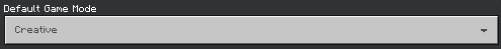
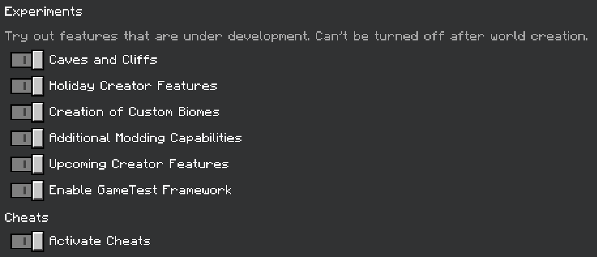

## 工具

在安卓平台上找到制作附加包的好应用并不容易，但我们尽力为你收集了适用于Google Play的应用。
在安卓上进行开发，你需要组合使用以下三个应用程序。

1. 如果你的设备运行的是安卓12或更高版本，需要一个可以创建ZIP归档的文件管理器。
2. 一个代码编辑器（任何文本编辑器都可以，但只有代码编辑器会显示语法高亮）。
3. 一个图像编辑器（没有设备自带能精确到像素的编辑器）。

### 文件管理器

这些文件管理器已知支持ZIP归档和对 `Android/data` 文件夹的只读访问：

1. [**X-Plore**](https://play.google.com/store/apps/details?id=com.lonelycatgames.Xplore) - 一个功能强大的文件管理器，具有双窗格树视图、内置文本编辑器（非代码）、多种文件压缩格式（ZIP、7zip、RAR等）等功能。在已root的设备上，X-Plore可以编辑 `Android/data` 和根目录。
2. [**Total Commander**](https://play.google.com/store/apps/details?id=com.ghisler.android.TotalCommander) - 相较于X-Plore，初始功能不如强大，但包含一些相同的功能，包括双窗格、ZIP和RAR归档，以及对 `Android/data` 的只读访问。Total Commander具有列表视图而非树视图，并且许多其他功能需要插件（来自Google Play的应用）才能使用。

### 代码编辑器

1. **Acode:** [免费版](https://play.google.com/store/apps/details?id=com.foxdebug.acodefree)包含广告，可以在不付费的情况下关闭。支持使用个人访问令牌的GitHub集成、FTP/SFTP、支持100多种语言的语法高亮（包括JSON）、多文件编辑的标签视图、数十种主题等。该应用是开源的，并有一个[付费版](https://play.google.com/store/apps/details?id=com.foxdebug.acode)，允许更深入的主题自定义。

:::info
Acode是目前在安卓上唯一一个积极开发的强大代码编辑器。其他编辑器功能非常有限或已被放弃，从Google Play商店消失。如果你知道有其他代码应用，可以为本指南做贡献。
:::

### 图像编辑器

1. [**Pocket Paint**](https://play.google.com/store/apps/details?id=org.catrobat.paintroid) - 轻量级编辑器，具备创建任何附加包所需的基本功能。该应用易于使用，允许覆盖导入其他图像。支持保存为JPG（压缩）、PNG（无损，支持透明）和ORA（多层图像）。该应用是开源的。
2. [**Pixly**](https://play.google.com/store/apps/details?id=com.meltinglogic.pixly&hl=en) - 非常轻量，无广告或应用内购买。工具丰富，刷子可自定义，能够内部或外部保存调色板。
3. [**Pixel Art editor**](https://play.google.com/store/apps/details?id=net.spc.app.pixelarteditor&hl=en) - 一个简单的轻量级应用。如果你只需要绘制一些纹理占位符，这是最好的选择。

## 工作区

:::tip
在本指南的此版本中，“BP”指的是你的行为包文件夹，“RP”指的是你的资源包文件夹。对于文件或目录中的位置，`../<current location>` 表示“从上一个位置”后跟添加的空格（例如：`/one/two/three/file.txt` 将缩短为 `../three/file.txt`）

如果你的设备已root，你可以直接使用 `/Android/data/com.mojang.minecraftpe/files/games/com.mojang` 进行主要项目设置，使用开发行为包和资源包文件夹。否则，请按以下步骤操作。
:::

在开始之前，你需要一个工作区。使用文件管理器，导航到你的内部存储（在大多数情况下，是 `/`。在其他情况下，会显示完整路径（例如：`/storage/emulated/0/`）。两者皆可），并创建一个包含你的包的文件夹。例如，我们的完整目录是 `/Minecraft Packs/MyFirstAddon`。从这里，你需要为你的行为包和资源包分别创建文件夹（例如：`../MyFirstAddon/addonBP` 和 `../MyFirstAddon/addonRP`）。

现在你已经设置好了工作区，代码编辑器应该有办法打开一个文件夹作为工作区。在本指南中，我们将使用Acode。

1. 打开Acode。
2. 点击文件浏览按钮（左上角的三个条），然后选择“打开文件夹”
3. 点击“添加存储”，然后选择“选择文件夹”
4. 这应该会打开你的设备文件浏览器。导航到你的项目主文件夹（对我们来说是 `/Minecraft Packs`），然后点击“使用此文件夹”。如果设备询问你是否允许Acode访问，请点击“允许”。
5. 你现在应该回到Acode。点击“确定”，你的文件夹现在应该在列表中。点击它，然后在屏幕底部点击“选择文件夹”。
6. 现在，当你打开文件浏览器（左上角的三个条）时，你应该能在列表中看到你的文件夹。你现在可以快速访问你的附加包的行为包和资源包文件夹。文件浏览器使用树视图显示你的活动工作区。

:::tip
你可以通过长按想要创建项目的文件夹，在文件浏览器中创建新文件和文件夹。
:::

## BP & RP 清单

:::warning
从现在开始，所有文件和文件夹都有非常具体的名称，除非另有说明。文件和/或文件夹命名错误是导致错误的常见原因。请确保按照提供的示例仔细检查你的工作。如果提到的文件或文件夹尚未创建，请在适当的目录中创建它。

在文件管理器或某些文本或代码应用程序中创建新文件时，`.txt` 扩展名会自动添加到文件名末尾。为确保我们的文件按预期工作，请务必删除 `.txt`。与名称一样，错误的文件扩展名也是导致错误的常见原因。如果你使用Acode，你会注意到 `untitled.txt` 被完全高亮显示，而不仅仅是 `untitled`。这是命名编程语言文件的常见做法。
:::

清单文件是Minecraft用来识别你的附加包的文件。每个附加包都有一个（且仅有一个）清单。具有正确格式化清单的文件夹将在Minecraft中显示。在开始添加内容之前，我们将确保我们的“最小”包是可见的。清单使用 `JSON` 编程语言编写。如果你不熟悉JSON，可以在[这里](../guide/understanding-json.md)了解更多。

在你的附加包的行为包文件夹中创建一个名为 `manifest.json` 的新文本文件。首先，将以下代码复制并粘贴到 `manifest.json` 文件中。创建这些文件后，将提供清单文件的完整分解。

<codeHeader>BP/manifest.json</codeHeader>

```json
{
    "format_version": 2,
    "header": {
        "name": "pack.name",
        "description": "pack.description",
        "uuid": "...",
        "version": [0, 0, 1],
        "min_engine_version": [1, 16, 0]
    },
    "modules": [
        {
            "type": "data",
            "uuid": "...",
            "version": [0, 0, 1]
        }
    ]
}
```

现在在你的附加包的资源包文件夹中创建另一个 `manifest.json` 文件。再次，将以下代码复制并粘贴到新文件中。

<codeHeader>RP/manifest.json</codeHeader>

```json
{
	"format_version": 2,
	"header": {
		"name": "pack.name",
		"description": "pack.description",
		"uuid": "...",
		"version": [0, 0, 1],
		"min_engine_version": [1, 16, 0]
	},
	"modules": [
		{
			"type": "resources",
			"uuid": "...",
			"version": [0, 0, 1]
		}
	]
}
```

## 清单分解

-   `format_version` 定义了你的清单所使用的语法版本。版本2是最新的稳定版本。始终使用此版本。
-   `name` 是你的包的名称。我们将在“代码形式”中定义它，以便稍后可以轻松翻译成其他语言，如果你创建了包含多种语言的包。
-   `description` 是关于你的包的简短描述，会显示在游戏中 `name` 下方。这也将在稍后的“代码形式”中定义。
-   `uuid` 是必需的，用于帮助识别你的包与其他包，并且将在下面有自己的分解。一旦解释完毕，你需要用生成的UUID替换所有 `...`。
-   `version` 字面意思是你的附加包的版本。完成你的附加包后，你可以随时将其更改为 `[1, 0, 0]`。然而，在移动设备上进行更改时，使用热修复位置会更容易。
-   `min_engine_version` 告诉Minecraft你的包需要的最低版本。例如，如果你的包有一个涉及混凝土的制作配方，你的包在Minecraft 1.5上无法运行，因为该版本没有混凝土。
-   在 `modules` 下，你有 `type` 字段。这个字段告诉Minecraft你的包是什么类型。所以BP中的 `data` 告诉游戏这是一个行为包，RP中的 `resources` 告诉游戏这是一个资源包。

## UUID 分解

UUID，或**通用唯一标识符**，既用于识别你的包以供其他程序（例如Minecraft）使用，也用于将你的包与别人相同程序的包区分开来。版本4 UUID（UUID-4）通常的格式是 `xxxxxxxx-xxxx-xxxx-xxxx-xxxxxxxxxxxx`，由随机的字母和数字组成。例如：`5c830391-0937-44d6-9774-406de66b6984`。

你 **绝不能** 两次使用相同的UUID！使用[在线UUID生成工具](https://www.uuidgenerator.net/version4)生成你的清单文件所需的UUID。每个清单文件使用两个不同的UUID。因此，为确保你的包能正确工作，获取4个不同的UUID来替换两个清单中的所有 `...`。完成后，每个UUID条目应如下所示：`"uuid": "5c830391-0937-44d6-9774-406de66b6984"`

## 包图标

注意其他包有图标吗？它是一个图像文件，可以快速识别你的附加包在游戏中的外观。你有一个低分辨率的方形PNG图像吗？你可以使用它！否则，你可以使用这个示例图标。

<WikiImage src="../assets/images/guide/project-setup/pack_icon.png" alt="Pack Icon" pixelated />

<Button link="../assets/images/guide/project-setup/pack_icon.png" download>
    下载图像
</Button>

你必须在行为包和资源包中各放置一份所需的图像。为了使图像能被正确读取，名称必须是 `pack_icon.png`。

## 语言文件

还记得我们之前说过会在代码形式中定义包的名称和描述吗？现在是时候做这最后一步来设置你的附加包。你需要创建4个新文件和2个新文件夹（每个包2个文件和1个文件夹）。你可以在[这里](../concepts/text-and-translations.md)了解更多关于Minecraft处理本地化的信息。你也可以使用 `§` 符号来格式化你的定义。你可以在[这里](https://htmlcolorcodes.com/minecraft-color-codes/)查看颜色和格式的列表。如果使用任何格式化，请确保在更改格式时使用 `§r` 重置：`§kl My pack l` 将使 “My pack” 无法读取，而 `§kl §rMy pack §kl` 可以正确读取。

<codeHeader>BP/texts/en_US.lang</codeHeader>

```
pack.name=§2我的 §l第一个 §r§2附加包的行为包！
pack.description=这个附加包由Wiki贡献者制作！
```

<codeHeader>BP/texts/languages.json</codeHeader>

```json
["en_US"]
```

<codeHeader>RP/texts/en_US.lang</codeHeader>

```
pack.name=§2我的 §l第一个 §r§2附加包的资源包！
pack.description=这个附加包由Wiki贡献者制作！
```

<codeHeader>RP/texts/languages.json</codeHeader>

```json
["en_US"]
```

## 导入你的附加包

现在你的附加包拥有所有所需的内容，我们需要将其导入到Minecraft中。为此，我们需要创建一个扩展名为 `.mcaddon` 的文件。

1. 打开你喜欢的文件管理器，导航到包含你的行为包和资源包的文件夹。
2. 使用多选，选择两个包并创建一个ZIP文件。
3. 当被要求输入文件名时，确保将 `.zip` 更改为 `.mcaddon`。
   
4. 当文件管理器完成后，它应该是一个以Minecraft为图标的 `MCADDON` 文件。点击此文件应启动Minecraft。

如果操作正确，Minecraft将为两个包显示一个横幅。首先显示的是 `正在导入...`。之后应显示 `成功导入 "<你的包名称>"`。你也可以进入 `设置 > 存储` 来验证你的包是否已导入。如果你没有看到任何一个包，请查看我们的[故障排除指南](../guide/troubleshooting.md)。

## 开启内容日志

:::warning
内容日志是调试附加包时最有用的工具。请勿跳过此步骤。
:::


内容日志是一个极其重要的调试工具，你应该始终开启。

在 `设置 > 创作者` 中打开两个内容日志设置。这将在你进入应用了附加包的世界时显示附加包中的任何错误。你也可以通过按 `ctrl+h` 在游戏内打开内容日志GUI。了解更多关于内容日志的信息，请访问[这里](../guide/troubleshooting.md)。

## 创建你的测试世界

现在我们创建一个世界来测试你的新附加包！

1. 点击 “**创建新世界**”；
2. 确保以下设置已正确配置。

    
    

3. 现在激活你的行为包和资源包。你可以通过选择这些包并点击“应用”来完成。
4. 现在点击 “**创建**”！

## 最后备注

**完成本页后，你的项目应如下所示：**

请记住，未来我们将用 `RP` 代表 `com.mojang/development_resource_packs/guide_RP/`，用 `BP` 代表 `com.mojang/development_behavior_packs/guide_BP/`。

<FolderView :paths="[
	'com.mojang/development_resource_packs/guide_RP/manifest.json',
	'com.mojang/development_resource_packs/guide_RP/pack_icon.png',
	'com.mojang/development_resource_packs/guide_RP/texts/en_US.lang',
	'com.mojang/development_resource_packs/guide_RP/texts/languages.json',
	'com.mojang/development_behavior_packs/guide_BP/manifest.json',
	'com.mojang/development_behavior_packs/guide_BP/pack_icon.png',
	'com.mojang/development_behavior_packs/guide_BP/texts/en_US.lang',
	'com.mojang/development_behavior_packs/guide_BP/texts/languages.json',
]"></FolderView>

## 你所学到的

:::tip 你所学到的：

-   了解 `com.mojang` 文件夹的位置及其包含内容
-   如何设置你的移动工作区
-   什么是 `manifest.json` 文件
-   什么是UUID以及如何使用它们
-   如何为你的附加包创建图标
-   什么是 `.lang` 文件

:::

## 你迄今为止的进度

-   [x] 设置你的包
-   [ ] 创建自定义物品
-   [ ] 创建自定义实体
-   [ ] 创建自定义区块