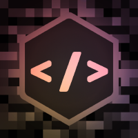
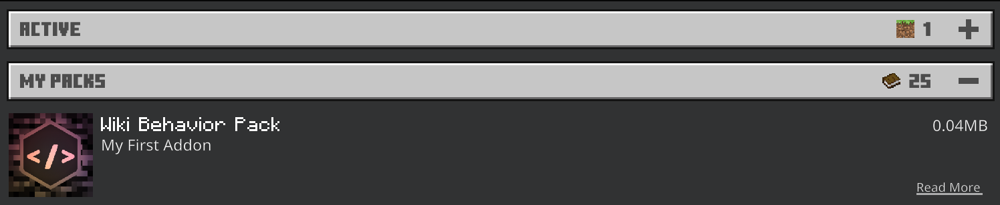
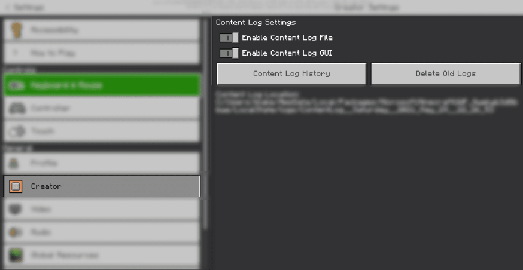
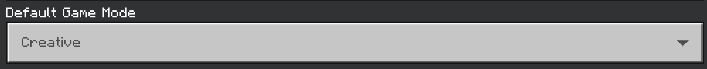
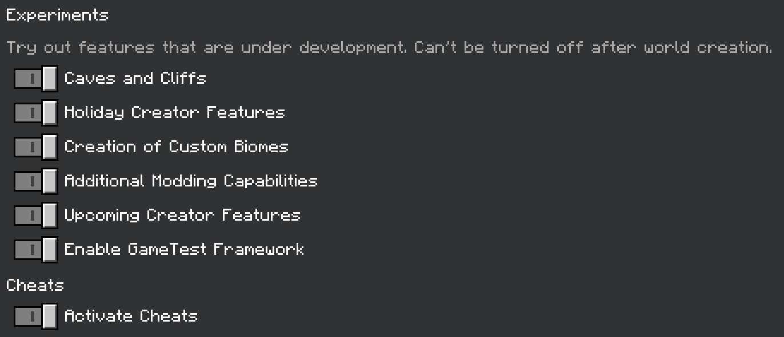

# 项目设置

/// details-info | 署名信息
- 该页面翻译自[https://wiki.bedrock.dev/guide/project-setup.html](https://wiki.bedrock.dev/guide/project-setup.html)
- 该页面仓库地址为[https://github.com/Bedrock-OSS/bedrock-wiki/blob/wiki/docs/guide/project-setup.md](https://github.com/Bedrock-OSS/bedrock-wiki/blob/wiki/docs/guide/project-setup.md)
- 该页面的版本为<!-- md:samp Bedrock-OSS/bedrock-wiki@60593ceb65e7bf8258290ccaa1d1bbd610062a0d -->
- 该页面的作者有：
    - <!-- md:samp @SirLich -->
    - <!-- md:samp @sovledDev -->
    - <!-- md:samp @Joelant05 -->
    - <!-- md:samp @Dreamedc2015 -->
    - <!-- md:samp @BlueFrog130 -->
    - <!-- md:samp @sermah -->
    - <!-- md:samp @cda94581 -->
    - <!-- md:samp @MedicalJewel105 -->
    - <!-- md:samp @TheItsNameless -->
    - <!-- md:samp @ThijsHankelMC -->
    - <!-- md:samp @TheHyperWhale -->
    - <!-- md:samp @stirante -->
    - <!-- md:samp @ChibiMango -->
    - <!-- md:samp @Etanarvazac -->
    - <!-- md:samp @retr0cube -->
    - <!-- md:samp @ThomasOrs -->
    - <!-- md:samp @lescx -->
///

## 介绍

本页面将指导你走完创建第一个“能用的”附加包并在游戏中查看它的所有步骤。如果你是在安卓设备上进行的，请遵循以下替代指南：

[安卓指南](./project-setup-android.md){ .md-button }

## com.mojang文件夹

`com.mojang`文件夹是Minecraft存储数据的特殊文件夹（附加包、世界、玩家信息等）。Minecraft能够识别这个位置，我们访问或创建的所有文件都会放置在这个文件夹中的某个位置！

你应该在桌面或移动设备上创建一个指向`com.mojang`文件夹的快捷方式，以便随时轻松访问。`com.mojang`文件夹的确切位置将取决于你的设备操作系统。

### Windows

在Windows上，`com.mojang`文件夹位于你的应用数据文件夹内。

_提示：你可以在搜索栏中输入`%appdata%`直接跳转到`C:\Users\<USERNAME>\AppData\`文件夹。_

`C:\Users\<USERNAME>\AppData\Local\Packages\Microsoft.MinecraftUWP_8wekyb3d8bbwe\LocalState\games\com.mojang`

### 安卓

安卓11或更早版本：`手机 > games > com.mojang`

安卓12及更新版本：`手机 > Android > data > com.mojang.minecraftpe > files > games > com.mojang`

### ChromeOS

在你能看到`com.mojang`文件夹之前，请确保在Minecraft设置中将`文件存储位置`更改为`外部`：

- 进入`Minecraft设置`。
- 导航到`设置 > 常规 > 存储`。
- 将`文件存储位置`更改为`外部`。

之后，你可以在安卓子系统中访问`com.mojang`文件夹：

`我的文件 > Play文件 > Android > data > com.mojang.minecraftpe > files > games > com.mojang`

### iOS

`我的设备 > Minecraft > games > com.mojang`

### 开发状态下的包

我们将在`development_behavior_packs`和`development_resource_packs`中开发我们的附加包。当你在这些文件夹中进行更改时，可以*退出并重新进入应用了这些包的世界*，以自动重新加载内容。这使你能够快速测试你的附加包，而无需重新加载整个Minecraft。

另一方面，`resource_packs`和`behavior_packs`通常包含稳定版本的附加包，这包括通过`.mcpack`导入的附加包。我们现在可以忽略这些文件夹。

## 你的工作区

/// tip | 提示
在本指南中，BP指的是你在`development_behavior_packs`中创建的文件夹（“行为包”），RP指的是你在`development_resource_packs`中创建的文件夹（“资源包”）。
///

首先，你需要在合适的位置创建正确的文件夹并设置你的工作区。
_本指南其余部分假设你使用的是VSCode。你也可以使用其他编辑器。_

现在让我们在Visual Studio Code中创建你的第一个附加包工作区。

1. 打开VSCode（_Visual Studio Code，代码编辑器_）
2. 在`development_resource_packs`中创建一个名为`your_pack_name_RP`的文件夹。**我将把这个文件夹称为`RP`**
3. 在`development_behavior_packs`中创建一个名为`your_pack_name_BP`的文件夹。**我将把这个文件夹称为`BP`**。
4. 转到`文件 > 将文件夹添加到工作区...`并选择`BP`。对`RP`也执行相同操作。
5. 按`文件 > 将工作区另存为...`将工作区文件保存到桌面。每当你在附加包上工作时，只需双击打开工作区，即可快速访问BP和RP文件夹。

## BP清单

/// tip | 创建文件
在本指南中，你将经常被指示创建具有特定名称的文件，并放置在特定文件夹中。如果文件夹尚不存在，请创建它！
///

清单是一个文件，用于识别你的包。每个包都有一个清单。一个格式正确的清单文件夹将能够显示在Minecraft中，我们认为这是在添加其他内容之前的“最小”版本的包。

清单文件是用`json`编写的。如果你对此不熟悉，可以在[这里](https://www.json.org/)了解更多关于json的信息。

首先，在你的BP文件夹中右键单击该文件夹并选择`新建文件`。将文件命名为`manifest.json`。最一开始，你可以将以下代码复制粘贴到文件中。

```json title="BP/manifest.json"
{
  "format_version": 2,
  "header": {
    "name": "pack.name",
    "description": "pack.description",
    "uuid": "...",
    "version": [1, 0, 0],
    "min_engine_version": [1, 16, 0]
  },
  "modules": [
    {
      "type": "data",
      "uuid": "...",
      "version": [1, 0, 0]
    }
  ]
}
```

### 清单解释

- `format_version`定义你使用的清单语法版本。版本2是最新的稳定版本；请使用它。

- `name`是你的行为包的名称。`description`将显示在游戏中名称的下方。我们以“代码形式”定义这些文件，以便稍后可以将其翻译成其他语言。有关本地化的更多信息，请查看[这里](../concepts/text-and-translations.md)。

- `UUID`字段是**必需的**，将在下面详细讨论。

- `version`定义你的附加包的版本。当你在安装了旧版本的设备上导入一个更新版本的附加包时，新版本将覆盖旧版本。如果你的附加包位于`development_*_packs`文件夹中并仅打算在私人世界中使用它们，则无需每次修改都更改版本。

- `min_engine_version`定义能够读取你的附加包的最低Minecraft客户端版本。这里指定的数字应与当前游戏的版本号匹配，除非你计划与旧版本进行向后兼容。

- 在`modules`中，`type`被定义为`data`。这使你的包成为一个*行为包*。

### UUID解释

UUID（_通用唯一标识符_）用于识别你的包，以便其他程序（在此情况下是Minecraft）可以读取。它的格式类似于：`5c830391-0937-44d6-9774-406de66b6984`

**绝不要重复使用相同的UUID。**你可以在[这里](https://www.uuidgenerator.net/version4)生成自己的UUID，或者如果你使用VSCode，可以安装[这个](https://marketplace.visualstudio.com/items?itemName=netcorext.uuid-generator)扩展。许多其他工具如*bridge.*会自动生成UUID。每个清单文件都应使用不同的UUID。

为了确保你的附加包能够正常工作，你应该生成两个新的UUID，并将其粘贴到BP的`manifest.json`文件中的每个`"..."`位置。当你完成后，它应该看起来像这样：

`"uuid": "5c830391-0937-44d6-9774-406de66b6984"`

## RP清单

下一步是为RP创建`manifest.json`。资源包清单的格式与BP清单几乎相同，唯一的区别是`type`为`resources`，这标记该包为*资源包*。

将以下代码复制到你新创建的`RP/manifest.json`中，并插入你自己的UUID。

```json title="RP/manifest.json"
{
  "format_version": 2,
  "header": {
    "name": "pack.name",
    "description": "pack.description",
    "uuid": "...",
    "version": [1, 0, 0],
    "min_engine_version": [1, 16, 0]
  },
  "modules": [
    {
      "type": "resources",
      "uuid": "...",
      "version": [1, 0, 0]
    }
  ]
}
```

## 包图标

包图标是一个图像文件，用于标识你的附加包在游戏中的外观。如果你有一个低分辨率的正方形图像，可以使用它。否则，请下载并使用这个示例图标：

{ align=left style="image-rendering: pixelated;" }

[下载图像](../assets/images/guide/project-setup/pack_icon.png){ .md-button download }

你应该将所需图像的副本放入RP和BP中。图像需要命名为`pack_icon.png`

## 语言文件

最后一步是为你的附加包设置语言支持。你需要为RP和BP创建一个语言文件。你可以在[这里](https://minecraft.fandom.com/wiki/Language)了解更多关于Minecraft如何处理本地化的信息。

```lang title="RP/texts/en_US.lang"
pack.name=Wiki资源包
pack.description=一个幽灵指南
```

```lang title="BP/texts/en_US.lang"
pack.name=Wiki行为包
pack.description=一个幽灵指南
```

```json title="RP/texts/languages.json"
["en_US"]
```

```json title="BP/texts/languages.json"
["en_US"]
```

## 检查你的工作

如果你做的一切正确，你的包现在应该在Minecraft中显示！如果你没有看到你的包，你应该遵循[故障排除指南](../guide/troubleshooting.md)。



## 开启内容日志

/// warning | 内容日志
内容日志是你调试附加包时最有用的工具。请不要跳过这一步！
///



内容日志是一个极其重要的调试工具，你应该始终保持开启。

在`设置 > 创建者`中打开两个内容日志设置。这将在你进入应用了该附加包的世界时显示任何错误。你可以通过按++ctrl+h++或在创建者设置面板中按`内容日志历史`打开内容日志GUI。了解更多关于内容日志的信息，请查看[这里](../guide/troubleshooting.md)。

## 创建你的测试世界

现在我们创建一个世界来测试你的新附加包！

1. 点击“**创建新世界**”；

2. 确保以下设置已设置。

    
    

3. 现在激活你的行为包和资源包。你可以通过选择这些包并点击“应用”来做到这一点。

4. 现在点击“**创建**”！

---

## 概述

**完成本页面后，你的项目应该如下所示：**

请记住，在以后，我们将把`com.mojang/development_behavior_packs/guide_RP/`表示为`RP`，将`com.mojang/development_behavior_packs/guide_BP/`表示为`BP`。

<div class="treeview" markdown>
- {{file|com.mojang|folder}}
    - {{file|development_resource_packs|folder}}
        - {{file|guide_RP|folder}}
            - {{file|manifest.json}}
            - {{file|pack_icon.png}}
            - {{file|texts|folder}}
                - {{file|en_US.lang}}
                - {{file|languages.json}}
    - {{file|development_behavior_packs|folder}}
        - {{file|guide_BP|folder}}
            - {{file|manifest.json}}
            - {{file|pack_icon.png}}
            - {{file|texts|folder}}
                - {{file|en_US.lang}}
                - {{file|languages.json}}
</div>

## 你所学到的内容

/// tip | 你所学到的内容：

- 什么是com.mojang文件夹，它在哪里以及包含哪些文件夹
- 如何设置你的工作区
- 什么是`manifest.json`文件
- 如何使用UUID
- 如何为你的附加包创建图标
- 什么是`.lang`文件

///

## 你目前的进展

/// tip | 你所学到的内容

- [x] 设置你的包
- [ ] 创建自定义物品
- [ ] 创建自定义实体
- [ ] 创建实体的掉落、生成规则和自定义配方

///

[下一步：自定义物品](../guide/custom-item.md){ .md-button }