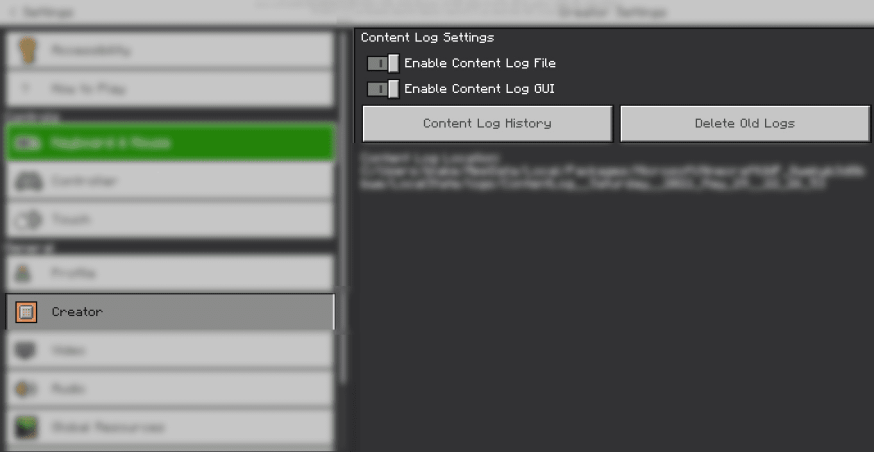

# 故障排除

/// details-info | 署名信息
- 该页面翻译自[https://wiki.bedrock.dev/guide/troubleshooting.html](https://wiki.bedrock.dev/guide/troubleshooting.html)
- 该页面仓库地址为[https://github.com/Bedrock-OSS/bedrock-wiki/blob/wiki/docs/guide/troubleshooting.md](https://github.com/Bedrock-OSS/bedrock-wiki/blob/wiki/docs/guide/troubleshooting.md)
- 该页面的版本为<!-- md:samp Bedrock-OSS/bedrock-wiki@60593ceb65e7bf8258290ccaa1d1bbd610062a0d -->
- 该页面的作者有：
    - <!-- md:samp @SirLich -->
    - <!-- md:samp @Joelant05 -->
    - <!-- md:samp @destruc7ion -->
    - <!-- md:samp @Dreamedc2015 -->
    - <!-- md:samp @MedicalJewel105 -->
    - <!-- md:samp @Luthorius -->
    - <!-- md:samp @SmokeyStack -->
///

为Minecraft基岩版创建附加包是一个相对简单的过程，*一旦你掌握了它*。第一次制作附加包通常是一个令人沮丧且容易出错的过程。本文档包含了一些修复这些棘手错误的技巧和窍门，以及最佳实践信息。

在跳入特定领域的故障排除技巧之前，请先阅读整个页面。

## 重新加载

首先，你应该始终尝试重新加载Minecraft。这意味着完全关闭游戏，然后重新打开。这可以捕捉到许多错误，尤其是那些与通过文件路径访问的资源相关的错误，例如纹理或战利品表。

## 环境

预防棘手错误的最佳方法是在正确的环境中工作。你应该查看[软件准备文档](../guide/software-preparation.md)以获取编辑器推荐。最重要的部分是获取一个JSON校验器（[或使用在线json校验器](https://jsonlint.com/)），并将你的包存储在`development_behavior_packs`和`development_resource_packs`中。

如果你的附加包在普通文件夹中，你可能会遇到“包缓存”问题，即你在一个位置编辑文件，但游戏仍在使用旧文件。

## 内容日志

/// warning | 请使用内容日志！
内容日志是你调试附加包的最佳工具。请不要跳过这一步！
///

/// tip
错误在多次反复运行时并不会被清除，因此你在内容日志中看到的错误可能是*之前运行的旧错误*。
///

“内容日志”是在你的包中发现的问题的列表。每次加载你的世界时，Minecraft都会生成此列表。它可以捕捉到诸如：
- 错误的纹理路径
- 拼写错误的组件
- 不正确的json结构

内容日志可以在`设置 > 创建者`中开启。内容日志将在游戏加载时显示，并且如果在游戏进行过程中发生更多错误，也会显示。

### 内容日志文件

内容日志以`.txt`格式保存在你的文件中：

-   _Windows_: `C:\Users\USERNAME\AppData\Local\Packages\Microsoft.MinecraftUWP_8wekyb3d8bbwe\LocalState\logs`
-   _Android:_ `/storage/emulated/0/Android/data/com.mojang.minecraftpe/files/games/com.mojang/logs`

## 使用原版资源

你应该下载原版资源和行为包。你可以在[这里](https://www.minecraft.net/en-us/addons/)找到原版资源和行为包。如果你遇到任何问题，可以与原版文件进行比较！

## JSON架构

JSON架构是文件验证的有价值工具。你可以在[这里](../meta/using-schemas.md)了解更多关于JSON架构的信息。

## 故障排除你的附加包

### 实体

[故障排除你的实体。](../entities/troubleshooting-entities.md){ .md-button }

### 物品

[故障排除你的物品。](../items/troubleshooting-items.md){ .md-button }

### 方块

[故障排除你的方块。](../blocks/troubleshooting-blocks.md){ .md-button }
