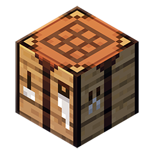
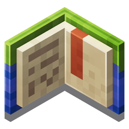

# 基岩维基

/// details-info | 署名信息
- 该页面翻译自[https://wiki.bedrock.dev/](https://wiki.bedrock.dev/)
- 该页面仓库地址为[https://github.com/Bedrock-OSS/bedrock-wiki/blob/wiki/docs/index.md](https://github.com/Bedrock-OSS/bedrock-wiki/blob/wiki/docs/index.md)
- 该页面的版本为<!-- md:samp Bedrock-OSS/bedrock-wiki@50ab5fbaefe22b02bc74f469da41b208efae13f4 -->
- 该页面的作者有：
    - <!-- md:samp @SirLich -->
    - <!-- md:samp @solvedDev -->
    - <!-- md:samp @sermah -->
    - <!-- md:samp @QuazChick -->
///

{ width=48 style="float: left;" }

这个维基是一个分享Minecraft基岩版技术特性的知识网站，包含文档、教程和一般的操作信息。

-    __新手指南__

    ---

    循序渐进的教程，旨在帮助你首次接触附加包。

    [:octicons-arrow-right-24: 开始阅读](./guide/introduction.md)

-    __Discord__

    ---

    加入我们的Discord服务器，了解附加包并向其他附加包创作者寻求帮助。

    [:octicons-arrow-right-24: 开始阅读](./discord.md)

-    __命令__

    ---
    
    [新手指南](./commands/intro-to-command-blocks.md) —
    了解命令方块的基础知识。
    
    [函数](./commands/mcfunctions.md) —
    开始使用函数，这是一种更快速、更强大的命令编码方式！

    [:octicons-arrow-right-24: 开始阅读](./commands/intro-to-command-blocks.md)

-    __方块__

    ---

    [新手指南](./blocks/blocks-intro.md) —
    创建你的第一个方块的“你好，世界！”指南。
    
    [方块组件](./blocks/block-components.md) —
    了解自定义方块的功能，例如碰撞。

    [:octicons-arrow-right-24: 开始阅读](./blocks/blocks-intro.md)

-    __实体__

    ---

    [新手指南](./entities/entity-intro-bp.md) —
    了解行为包实体文件的结构。
    
    [故障排除](./entities/troubleshooting-entities.md) —
    学习如何排除创建实体时常见问题，例如透明纹理。

    [:octicons-arrow-right-24: 开始阅读](./entities/entity-intro-bp.md)

-    __物品__

    ---

    [新手指南](./items/items-intro.md) —
    创建你的第一个物品的“你好，世界！”指南。
    
    [物品组件](./items/item-components.md) —
    了解自定义物品的功能，例如耐久度。

    [:octicons-arrow-right-24: 开始阅读](./items/items-intro.md)

-    __脚本__

    ---

    [新手指南](./scripting/starting-scripts.md) —
    了解Minecraft提供的脚本API基础知识。
    
    [自定义命令](./scripting/custom-command.md) —
    学习如何监听聊天事件以创建你自己的自定义命令！

    [:octicons-arrow-right-24: 开始阅读](./scripting/starting-scripts.md)

-    __世界生成__

    ---

    [新手指南](./world-generation/world-generation-intro.md) — 了解自定义结构、矿石、树木和其他生成特性的创建。

    [:octicons-arrow-right-24: 开始阅读](./world-generation/world-generation-intro.md)

-    __贡献__

    ---

    这个维基是由社区构建和维护的！如果你觉得可以改善维基，或有问题或反馈，请与我们联系。

    [:octicons-arrow-right-24: 开始阅读](./contribute.md)

