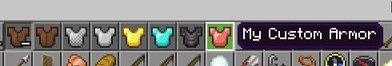
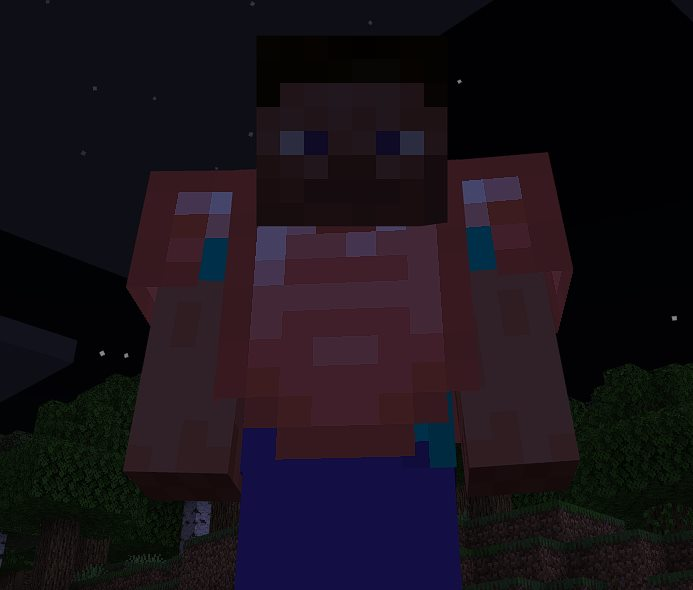
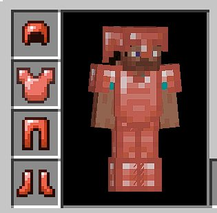

::: tip
强烈建议在开始本节内容之前，先浏览初学者指南中的 [Blockbench 建模与贴图](../guide/blockbench.md) 部分。
:::

制作自定义护甲出乎意料地简单，你只需要进行一些调整，因为需要添加几个文件，并且可能涉及一些贴图工作，但你可以根据需要在这里做得多或少。

## 胸甲

创建胸甲部分：

```json title="BP/items/my_chest.json"
{
    "format_version": "1.21.40",
    "minecraft:item": {
        "description": {
            "identifier": "wiki:my_chest",
            // 注意我们将其归类为装备类别
            "menu_category": {
                "category": "equipment",
                "group": "itemGroup.name.chestplate"
            }
        },
        "components": {
            // 我们在背包中使用的图标
            "minecraft:icon": "my_chest",
            // 给它命名
            "minecraft:display_name": {
                "value": "我的自定义护甲"
            },
            // 我们不希望它堆叠
            "minecraft:max_stack_size": 1,
            // 确保它只能接收胸甲槽的附魔
            "minecraft:enchantable": {
                "value": 10,
                "slot": "armor_torso"
            },
            // 我们希望它可修复，以及使用什么来修复它
            "minecraft:repairable": {
                "repair_items": [
                    {
                        "items": ["minecraft:stick"],
                        "repair_amount": "context.other->q.remaining_durability + 0.05 * context.other->q.max_durability"
                        // 一些复杂的 molang 表达式；只需复制即可
                    }
                ]
            },
            // 标记为可穿戴并放入胸部槽
            "minecraft:wearable": {
                "slot": "slot.armor.chest",
                "protection": 5
            },
            // 提供耐久度
            "minecraft:durability": {
                "max_durability": 200
            }
        }
    }
}
```

此时，你只需在 `RP/textures/item_texture.json` 中添加一个键为 `my_chest` 的物品纹理，你就可以开始了。如果你想按步骤操作，我们已经为你的护甲附加了一个默认的物品纹理。


<Button link="https://raw.githubusercontent.com/Bedrock-OSS/bedrock-wiki/wiki/docs/public/assets/images/tutorials/custom-armor/custom_chestplate.png">
    在这里下载纹理
</Button>

## 添加附加部件

此时你的物品将在游戏中出现并可穿戴，但没有任何外观。这是因为我们需要告知它如何处理附加装备，并提供一个纹理进行显示。

首先，你需要在你的 RP 中创建一个 `attachables` 文件夹（你可能已经有了）。

```json title="RP/attachables/my_chest.json"
{
    "format_version": "1.8.0",
    "minecraft:attachable": {
        "description": {
            "identifier": "wiki:my_chest",
            // 这两个是默认的且必需的
            "materials": {
                "default": "armor",
                "enchanted": "armor_enchanted"
            },
            "textures": {
                // 这是我们自定义的护甲纹理，接下来需要制作
                "default": "textures/models/armor/custom_main",
                // 这个纹理包含在原版 RP 中，用于附魔闪光
                "enchanted": "textures/misc/enchanted_actor_glint"
            },
            // 告诉它使用哪个几何体来渲染胸甲
            "geometry": {
                "default": "geometry.player.armor.chestplate"
            },
            // 告诉它隐藏胸部层，因为我们将显示我们的护甲
            "scripts": {
                "parent_setup": "v.chest_layer_visible = 0.0;"
            },
            // 告诉它使用哪个控制器（默认护甲控制器）
            "render_controllers": ["controller.render.armor"]
        }
    }
}
```

此时，我们需要确保为模型创建纹理，这些纹理位于 `RP/textures/models/armor` 中。然而，我们实际上需要两个纹理，因为一个是用于整体穿戴时的主护甲，另一个是用于单独穿戴腿甲时常覆盖部分靴子区域。

如果你没有创意，我们为本教程提供了一个重新着色的钻石护甲皮肤。只需“另存为”并将它们放入文件夹中。


<Button link="https://raw.githubusercontent.com/Bedrock-OSS/bedrock-wiki/wiki/docs/public/assets/images/tutorials/custom-armor/custom_main.png">
    在这里下载纹理
</Button>


<Button link="https://raw.githubusercontent.com/Bedrock-OSS/bedrock-wiki/wiki/docs/public/assets/images/tutorials/custom-armor/custom_legs.png">
    在这里下载纹理
</Button>

在现实中，你可能希望使用 Blockbench 或其他图像编辑程序来编辑纹理，并且最好在将它们添加到附加包之前查看它们在模型上的效果。
如果你现在进入游戏检查你制作的内容，你应该能够穿上你的胸甲，并为自己完成的工作感到自豪。





## 护腿

虽然单独的胸甲已经很好了，但你可能想要一整套，因此从这里开始，如果你为护靴制作另一个物品 JSON，如下所示。

```json title="BP/items/my_leggings.json"
{
    "format_version": "1.21.40",
    "minecraft:item": {
        "description": {
            "identifier": "wiki:my_leggings",
            "menu_category": {
                "category": "equipment",
                "group": "itemGroup.name.leggings"
            }
        },
        "components": {
            // 提供一个适用的物品纹理
            "minecraft:icon": "my_leggings",
            "minecraft:display_name": {
                "value": "我的自定义护腿"
            },
            "minecraft:max_stack_size": 1,
            // 确保附魔适用于腿部
            "minecraft:enchantable": {
                "value": 10,
                "slot": "armor_legs"
            },
            "minecraft:repairable": {
                "repair_items": [
                    {
                        "items": ["minecraft:stick"],
                        "repair_amount": "context.other->q.remaining_durability + 0.05 * context.other->q.max_durability"
                    }
                ]
            },
            // 确保可穿戴槽为腿部
            "minecraft:wearable": {
                "slot": "slot.armor.legs",
                "protection": 3
            },
            "minecraft:durability": {
                "max_durability": 200
            }
        }
    }
}
```

这很好，和之前一样，你需要添加自己的物品纹理，虽然这里有一个如果你想继续使用的话。


<Button link="https://raw.githubusercontent.com/Bedrock-OSS/bedrock-wiki/wiki/docs/public/assets/images/tutorials/custom-armor/custom_leggings.png">
    在这里下载纹理
</Button>

完成这里后，我们需要像这样创建附加文件：

```json title="RP/attachables/my_leggings.json"
{
    "format_version": "1.8.0",
    "minecraft:attachable": {
        "description": {
            "identifier": "wiki:my_leggings",
            // 注意这是和之前相同的
            "materials": {
                "default": "armor",
                "enchanted": "armor_enchanted"
            },
            "textures": {
                // 和之前相同
                "enchanted": "textures/misc/enchanted_actor_glint",
                // 由于我们使用护腿特定的纹理，这里不同
                "default": "textures/models/armor/custom_legs"
            },
            // 告诉它使用护腿几何体
            "geometry": {
                "default": "geometry.humanoid.armor.leggings"
            },
            // 隐藏腿部层，因为我们将在其上渲染护甲
            "scripts": {
                "parent_setup": "v.leg_layer_visible = 0.0;"
            },
            // 和之前相同
            "render_controllers": ["controller.render.armor"]
        }
    }
}
```

鉴于我们已经放入了所需的纹理，我们可以运行并立即看到我们的护腿。

## 头盔

这与胸甲类似，只需更改一些类别和槽，如下所示。

```json title="BP/items/my_helm.json"
{
    "format_version": "1.21.40",
    "minecraft:item": {
        "description": {
            "identifier": "wiki:my_helm",
            "menu_category": {
                "category": "equipment",
                "group": "itemGroup.name.helmet"
            }
        },
        "components": {
            "minecraft:icon": "my_helm",
            "minecraft:display_name": {
                "value": "我的自定义头盔"
            },
            "minecraft:max_stack_size": 1,
            // 头盔附魔槽
            "minecraft:enchantable": {
                "value": 10,
                "slot": "armor_head"
            },
            "minecraft:repairable": {
                "repair_items": [
                    {
                        "items": ["minecraft:stick"],
                        "repair_amount": "context.other->q.remaining_durability + 0.05 * context.other->q.max_durability"
                    }
                ]
            },
            // 可穿戴头部槽
            "minecraft:wearable": {
                "slot": "slot.armor.head",
                "protection": 3
            },
            "minecraft:durability": {
                "max_durability": 200
            }
        }
    }
}
```

如你所见，变化不大，我们只是更新类别/槽以适应头盔，然后添加附加文件（如果需要，以下是物品纹理）。


<Button link="https://raw.githubusercontent.com/Bedrock-OSS/bedrock-wiki/wiki/docs/public/assets/images/tutorials/custom-armor/custom_helmet.png">
    在这里下载纹理
</Button>

```json title="RP/attachables/my_helm.json"
{
    "format_version": "1.8.0",
    "minecraft:attachable": {
        "description": {
            "identifier": "wiki:my_helm",
            // 这两个是默认的且必需的
            "materials": {
                "default": "armor",
                "enchanted": "armor_enchanted"
            },
            "textures": {
                // 这是我们自定义的护甲纹理，接下来需要制作
                "default": "textures/models/armor/custom_main",
                // 这个纹理在我们的 RP 中实际上不存在
                // 但如果没有它会出错，所以保留
                "enchanted": "textures/misc/enchanted_actor_glint"
            },
            // 告诉它使用头盔的几何体
            "geometry": {
                "default": "geometry.player.armor.helmet"
            },
            // 告诉它隐藏头盔层，因为我们将在其上渲染护甲
            "scripts": {
                "parent_setup": "v.chest_layer_visible = 0.0;"
            },
            // 告诉它使用哪个控制器（默认护甲控制器）
            "render_controllers": ["controller.render.armor"]
        }
    }
}
```

完成后，你现在拥有了 3/4 套完整的套装，我们最好也介绍一下靴子，以便你了解所有类别等。

## 靴子

你已经了解了模式，所以让我们制作物品和附加 JSON 文件。

```json title="BP/items/my_boots.json"
{
    "format_version": "1.21.40",
    "minecraft:item": {
        "description": {
            "identifier": "wiki:my_boots",
            "menu_category": {
                "category": "equipment",
                "group": "itemGroup.name.boots"
            }
        },
        "components": {
            "minecraft:icon": "my_boots",
            "minecraft:display_name": {
                "value": "我的自定义靴子"
            },
            "minecraft:max_stack_size": 1,
            // 可附魔的脚部
            "minecraft:enchantable": {
                "value": 10,
                "slot": "armor_feet"
            },
            "minecraft:repairable": {
                "repair_items": [
                    {
                        "items": ["minecraft:stick"],
                        "repair_amount": "context.other->q.remaining_durability + 0.05 * context.other->q.max_durability"
                    }
                ]
            },
            // 脚部槽
            "minecraft:wearable": {
                "slot": "slot.armor.feet",
                "protection": 3
            },
            "minecraft:durability": {
                "max_durability": 200
            }
        }
    }
}
```

自定义靴子纹理，如果需要的话。


<Button link="https://raw.githubusercontent.com/Bedrock-OSS/bedrock-wiki/wiki/docs/public/assets/images/tutorials/custom-armor/custom_boots.png">
    在这里下载纹理
</Button>

```json title="RP/attachables/my_boots.json"
{
    "format_version": "1.8.0",
    "minecraft:attachable": {
        "description": {
            "identifier": "wiki:my_boots",
            // 这两个是默认的且必需的
            "materials": {
                "default": "armor",
                "enchanted": "armor_enchanted"
            },
            "textures": {
                // 这是我们自定义的护甲纹理，接下来需要制作
                "default": "textures/models/armor/custom_main",
                // 这个纹理在我们的 RP 中实际上不存在
                // 但如果没有它会出错，所以保留
                "enchanted": "textures/misc/enchanted_actor_glint"
            },
            // 告诉它使用靴子的几何体
            "geometry": {
                "default": "geometry.player.armor.boots"
            },
            // 告诉它隐藏靴子层，因为我们将在其上渲染护甲
            "scripts": {
                "parent_setup": "v.chest_layer_visible = 0.0;"
            },
            // 告诉它使用哪个控制器（默认护甲控制器）
            "render_controllers": ["controller.render.armor"]
        }
    }
}
```

就是这样，你现在拥有了一整套自定义护甲，可以自信地在游戏中炫耀，并且可以使用此作为基础，制作你在游戏中想要的任何其他护甲。

> 值得注意的是，我们在这里使用了两个独立的纹理，你也可以为每个附加部件使用一个纹理，但每个新纹理都会消耗内存，所以最好尽可能少用。因此，你应该最终拥有如下所示的内容，作为额外奖励，还有一节关于使用过滤器制作套装效果，这有点高级，但很有趣。



## 额外内容 - 制作套装效果

这有点高级，但假设你希望你的自定义护甲像 RPG 游戏中的套装一样。我们可以添加一些代码来检查是否装备了套装，并做一些很棒的事情。

请注意，对于效果，你可以使用 `tick.json` 和带有 `hasitem` 选择器参数的函数，以避免使用 `player.json`。

在此示例中，我们将只添加一个机会，将攻击者传送到附近的某个地方，并在控制台上显示一条提示信息。

由于我们希望在玩家受到攻击时触发，因此需要在 `player.json` 文件中添加一些逻辑。这是一个庞大的文件，由于它会覆盖默认的玩家组件等，我们不幸地需要确保它包含所有默认内容。

因此，与其包含整个 `player.json`，我只会包含需要添加到 `components` 和 `events` 部分的内容。如果你不知道 `player.json` 文件是什么，请在原版行为包中查找并将其复制到你的项目中。

首先，让我们在 `components` 部分添加伤害传感器组件，它会监听你受到伤害时并触发事件。

```json title="BP/entities/player.json#components"
"minecraft:damage_sensor": {
	"triggers": {
		"on_damage": {
			"filters": {
				"all_of": [
					{
						"test": "has_equipment",
						"subject": "self",
						// 域是身体部位，这里是头部
						"domain": "head",
						"operator": "==",
						// 要检查的物品标识符
						"value": "wiki:my_helm"
					},
					{
						"test": "has_equipment",
						"subject": "self",
						"domain": "torso",
						"operator": "==",
						// 值注意，你可以省略前缀对于 minecraft 内部物品，例如 stick
						"value": "wiki:my_chest"
					},
					{
						"test": "has_equipment",
						"subject": "self",
						"domain": "leg",
						"operator": "==",
						"value": "wiki:my_leggings"
					},
					{
						"test": "has_equipment",
						"subject": "self",
						"domain": "feet",
						"operator": "==",
						"value": "wiki:my_boots"
					}
				]
			},
			// 如果过滤器中的所有触发器匹配，则触发事件
			"event": "wiki:armor_sets.my_custom.taken_damage"
		},
		// 这意味着如果匹配检查，它仍然会应用伤害
		// 适用于忽略团队伤害或类似情况
		"deals_damage": true
	}
}
```

如注释所述，这里有很多内容，但实际上我们做的只是监听某些情况，然后确保只过滤我们关心的结果，然后触发一个事件。

> 事件可以命名为任何名称，但通常最好更加具体，以防你最终有多个相似事件等，这也有助于查找如果你有多个相关部分，例如我可以在 "armour_sets" 上搜索并找到所有相关事件。
> 然后完成后，在同一个文件中，我们决定如何处理该事件，将其放入 `events` 部分。

```json title="BP/entities/player.json#events"
"wiki:armor_sets.my_custom.taken_damage": {
	"randomize": [
		{
			"weight": 1,
			// 我们在这里使用一个序列，因为我们希望在一个实体上应用一个命令
			// 然后在我们自己身上应用另一个命令
			"sequence": [
				{
					// 这将获取攻击者/其他人，因为它在 damage_sensor 中触发事件时在上下文中
					"queue_command": {
						// 将实体传送到我们附近的位置
						"command": "spreadplayers ~~ 5 20 @s",
						// 在攻击者而不是我们自己上运行命令
						"target": "other"
					}
				},
				{
					"queue_command": {
						"command": "tellraw @s{\"rawtext\":[{\"text\":\"§a你的护甲发光，敌人消失了\"}]}"
					}
				}
			]
		},
		{
			// 虚拟权重，使其发生频率适中
			"weight": 20
		}
	]
}
```

就是这样，你可以根据需要调整这些部分，但最终你已经拥有了为护甲应用效果并检查是否装备了整个套装或检查其他装备的所有部分。

你还可以将装备检查从自己更改为其他对象，检查攻击你的玩家是否装备了某些物品，甚至检查你是否在攻击某种方块/实体，并根据情况做出不同的效果。我们这里没有直接涉及，但这里提供了一个足够的起点，让你开始并发挥创意。