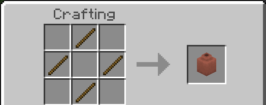

Minecraft基岩版允许我们添加自定义陶器碎片。本文将介绍如何创建它们。

## 注册碎片

陶器碎片由一个物品标签控制！具体来说是`"minecraft:decorated_pot_sherds"`。只需将此标签添加到您现有的物品中。如果您不知道如何制作自定义物品，请参考我们的[指南](/items/items-intro.md)。如果您不知道如何添加物品标签，请参考这篇[文章](/items/item-tags.md)。

现在我们已经注册了我们的碎片，可以通过将碎片放入工作台来测试它。如果您正确应用了标签，工作台应该会输出一个装饰陶罐！



然而，装饰陶罐仍然不会显示碎片本身。这是因为我们还没有告诉装饰陶罐要显示哪个图像！

## 显示碎片

要告诉游戏碎片应该显示哪个图像，我们需要编辑装饰陶罐的客户端实体文件。添加以下JSON文件：

<CodeHeader>RP/entity/decorated_pot.json</CodeHeader>

```json
{
    "format_version": "1.8.0",
    "minecraft:client_entity": {
        "description": {
            "identifier": "minecraft:decorated_pot",
            "textures": {
                "custom_item": "path/to/the/display"
            }
        }
    }
}
```

- `custom_item`是您自定义陶器碎片的标识符。将其替换为您的物品标识符。
- `path/to/the/display`指的是指向您显示的路径。由于这是一个引用路径，您可以将其指向`textures`文件夹中的任何图像。请注意，装饰陶罐不支持透明度。

如果您做对了所有步骤，您的装饰陶罐现在将显示您想要的碎片，而不是一个空白的陶罐！

**问：编辑客户端实体文件不会使我的附加包不兼容吗？**

**答：不会！客户端实体文件实际上是合并定义的。只要您的物品标识符是唯一的，其他附加包就不会覆盖它们！作为一个好习惯，请在您的标识符前加上您的命名空间。**