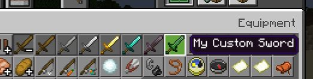
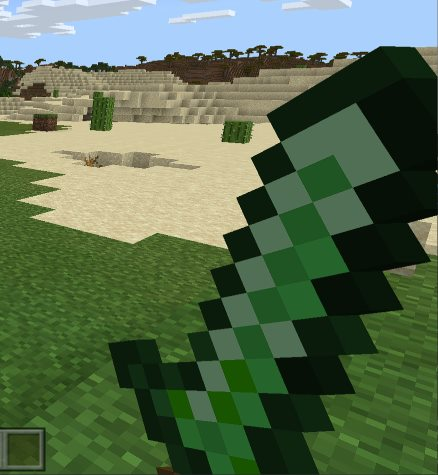
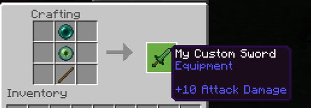

按照本指南创建一个自定义剑物品。你可以自行修改以创建任何你想要的武器！

如果你想为你的武器添加更多功能，可以查看[击中实体](/items/item-events#hit-entity)事件。

## 自定义剑物品

与其他物品教程一样，我们将首先制作一个简单的自定义剑，如下所示。

```json title="BP/items/my_sword.json"
{
    "format_version": "1.21.40",
    "minecraft:item": {
        "description": {
            "identifier": "wiki:my_sword",
            "menu_category": {
                "category": "equipment",
                "group": "itemGroup.name.sword"
            }
        },
        "components": {
            "minecraft:max_stack_size": 1,
            // 在第三人称视角中正确定位物品
            "minecraft:hand_equipped": true,
            "minecraft:durability": {
                "max_durability": 600
            },
            // 此武器对实体造成的额外伤害
            "minecraft:damage": 10,
            // 允许在“剑”槽中附魔
            "minecraft:enchantable": {
                "value": 10,
                "slot": "sword"
            },
            // 此纹理用于物品栏和手部模型
            "minecraft:icon": "my_sword",
            "minecraft:display_name": {
                "value": "我的自定义剑"
            },
            // 允许用木棍修复剑
            "minecraft:repairable": {
                "repair_items": [
                    {
                        "items": ["minecraft:stick"],
                        "repair_amount": "context.other->q.remaining_durability + 0.05 * context.other->q.max_durability"
                    }
                ]
            }
        }
    }
}
```

这至少足以将剑放入游戏中，我们仍然需要在资源包中注册图标，但这不是大问题，因为我们只需进入资源包文件夹并按如下方式输入即可。

```json title="RP/textures/item_texture.json"
{
    "resource_pack_name": "custom-weapon",
    "texture_name": "atlas.items",
    "texture_data": {
        "my_sword": {
            // 确保你在这里放置了名为 my_sword.png 的图标纹理
            "textures": "textures/items/my_sword"
        }
    }
}
```

如果你没有自己的纹理可以使用，这里有一个示例纹理，只需“另存为”并放入`RP/textures/items`目录中。

<WikiImage
    src="../assets/images/tutorials/custom-weapons/my_sword.png"
    alt="剑纹理"
    pixelated="true"
    width="128"
    class="my-4 mr-4"
/>

<Button link="https://raw.githubusercontent.com/Bedrock-OSS/bedrock-wiki/wiki/docs/public/assets/images/tutorials/custom-weapons/my_sword.png">
    下载纹理
</Button>

## 游戏内

现在我们有了包含物品 JSON 定义的行为包和包含纹理的资源包，我们可以创建一个新世界，并确保应用我们的附加包。

完成上述所有步骤后，进入创造模式，你应该能够通过名称找到你的剑，或者在剑类别下找到，如下所示。



然后，如果你将其放在手中，你应该在游戏中看到它，如下所示。



这并不难，对吧？现在你可以制作任意数量的自定义剑，不过如果你有兴趣，这里还有更多有趣的内容可以做。

## 工具类功能

你还可以混合其他组件，比如`minecraft:digger`，以便更快地破坏网或竹子，如下所示：

```json title="minecraft:item > components"
"minecraft:digger": {
    "use_efficiency": true,
    "destroy_speeds": [
        {
            "block": "minecraft:web",
            "speed": 15
        },
        {
            "block": "minecraft:bamboo",
            "speed": 10
        }
    ]
}
```

## 物品配方

你可能需要为其制作一个配方，这在之前的章节中已经涵盖，因为那里没有什么新内容，但如果你不确定，这里有一个示例配方，用于用末影之眼和末影珍珠制作剑。

```json title="BP/recipes/my_sword.json"
{
    "format_version": "1.21.40",
    "minecraft:recipe_shaped": {
        "description": {
            "identifier": "wiki:my_sword"
        },
        "tags": ["crafting_table"],
        "pattern": ["e", "E", "#"],
        "key": {
            "#": {
                "item": "minecraft:stick"
            },
            "E": {
                "item": "minecraft:ender_eye"
            },
            "e": {
                "item": "minecraft:ender_pearl"
            }
        },
        "result": {
            "item": "wiki:my_sword"
        },
        "unlock": [
            {
                "item": "minecraft:ender_eye"
            }
        ]
    }
}
```



如果你将其放入游戏中，那么你现在可以在游戏中制作你的剑，并希望你能继续制作任何其他自定义剑，甚至是弓或三叉戟。