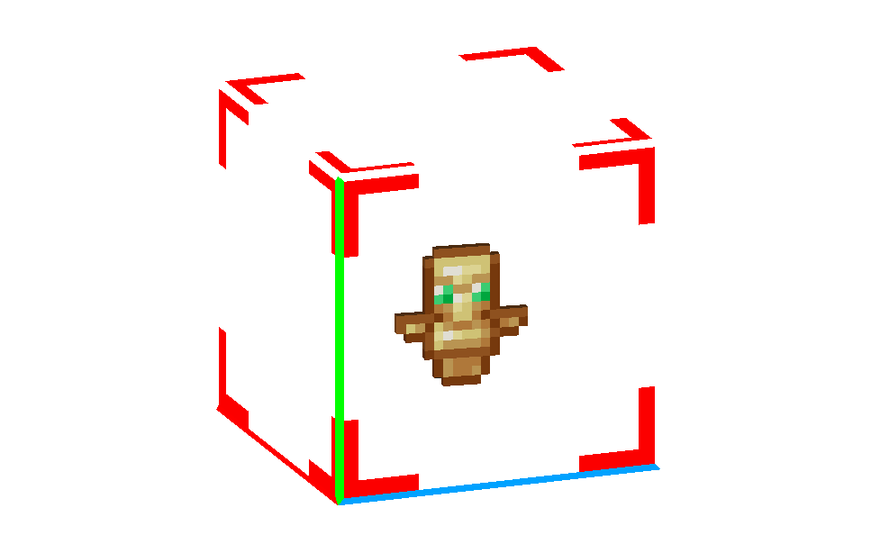

在游戏中生成物品就像掉落一样是相当常见的需求。本文将介绍通过多种方法实现这一目标，包括实体死亡、交互以及通用方法。

## /loot

迄今为止，生成物品的最简单方法是使用 /loot。格式如下：

```
/loot spawn ~ ~ ~ loot "entities/cow"
```

<CodeHeader>BP/loot_tables/entities/cow.json</CodeHeader>

```json
"minecraft:loot": {
	"table": "loot_tables/entities/cow.json"
}
```

## 实体死亡

另一种简单的生成物品的方法——通常也是最常见的方法——是在实体死亡时掉落物品。这是通过将 `minecraft:loot` 组件添加到实体并将其链接到相应的掉落表（以下示例中的 `forium`）来实现的，该掉落表包含你希望掉落的物品。

<CodeHeader>BP/entities/my_entity.json#components</CodeHeader>

```json
"minecraft:loot": {
	"table": "loot_tables/entities/forium.json"
}
```

## 虚拟实体死亡

我们可以在一个[虚拟实体](../entities/dummy-entities.md)上使用 `minecraft:loot`，该实体在生成时会死亡，从而创建一个 `drop_entity`。可以通过 `/summon wiki:drop_entity` 来召唤此实体以生成物品。这在死亡粒子或声音不是问题的情况下非常有用。

行为：

<CodeHeader>BP/entities/my_entity.json</CodeHeader>

```json
{
    "format_version": "1.16.0",
    "minecraft:entity": {
        "description": {
            "identifier": "wiki:drop_entity",
            "is_spawnable": true,
            "is_summonable": true,
            "is_experimental": false
        },

        "components": {
            // 使实体在生成时死亡
            "minecraft:health": {
                "value": 0
            },
            "minecraft:loot": {
                "table": "loot_tables/entities/some_loot.json"
            }
        }
    }
}
```

## 交互

以下是一个名为“box”的实体示例，它将在交互时掉落其内容。在 `spawn_items` 中的表链接到希望掉落的物品的掉落表。在这个特定的情况下，当与实体交互时，还会调用事件 `break_box`，添加一个移除盒子的组件组。

请注意，如果实体在交互时未被移除，则可以再次与其交互并生成物品。如果实体在交互后应保持存在，可以向实体添加 `cooldown` 参数，以防止在指定时间内进行交互。或者，可以调用一个事件来移除包含此 `minecraft:interact` 组件的组件组。

<CodeHeader>BP/entities/my_entity.json#components</CodeHeader>

```json
"minecraft:interact": {
	"interactions": [
		{
			"on_interact": {
				"filters": {
					"test": "is_family",
					"subject": "other",
					"value": "player"
				},
				"event": "break_box",
				"target": "self"
			},
			"swing": true,
			"spawn_items": {
				"table": "loot_tables/entities/box.json"
			}
		}
	]
}
```

## 通用方法

这是一种几乎可以用于任何场景的方法：实体死亡、基于动画的交互、一般物品掉落。此方法特别用于在没有任何死亡动画、声音或粒子的情况下掉落物品。

设置物品掉落需要几个部分：一个带有行为的新实体、一个相应的动画控制器、一个不可见实体的资源（请参阅虚拟实体教程）和一个掉落表。要在设置完成后生成物品，实体将在物品掉落的位置生成。如果希望掉落多个物品，可以为每个物品设置带有生成事件的组件组。

### 行为

使用 `minecraft:behavior.drop_item_for` 组件结合 `minecraft:navigation.walk` 组件生成物品，后者是前者正常工作的必要条件。请注意，以下的 `time_of_day_range` 参数并未初始化为文档中定义的内容，这是正常功能所必需的。如果希望在玩家距离较远时掉落物品，则必须将 `max_dist` 参数增加到适当的值。

这种行为似乎会在掉落物品时将生物推开。因此，召唤实体时应稍微高于地面（或在以下动画控制器中将其传送到上方），以避免物品在生成位置几块地方掉落。减小碰撞盒的大小也可能有所帮助。

<CodeHeader>BP/entities/my_entity.json#components</CodeHeader>

```json
"minecraft:navigation.walk": {},
"minecraft:behavior.drop_item_for": {
	"priority": 1,
	"max_dist": 16,
	"loot_table": "loot_tables/entities/forium.json",
	"time_of_day_range": [0.0, 1.0]
}
```

### 动画控制器

**以下动画控制器必须链接到实体**，以便在召唤时将其移除。或者，可以使用带有时间线的动画。如果你不确定如何操作，请参阅实体命令教程。

将实体传送到虚空不会产生死亡动画、声音或粒子。使用两个过渡以确保它不会在生成的同一刻被杀死。

<CodeHeader>BP/animation_controllers/my_entity.ac.json</CodeHeader>

```json
{
    "format_version": "1.10.0",
    "animation_controllers": {
        "controller.animation.drop_items.die": {
            "initial_state": "spawn",
            "states": {
                "spawn": {
                    "transitions": [
                        {
                            "delay": "1"
                        }
                    ]
                },
                "delay": {
                    "transitions": [
                        {
                            "die": "1"
                        }
                    ]
                },
                "die": {
                    "on_entry": ["/tp @s ~ -200 ~"]
                }
            }
        }
    }
}
```

## 结构方法

还有一种有趣的生成物品的方法——通过结构。
你可以用 `structure_void` 填充一个结构（这样在加载结构时不会替换方块），并将物品掉落到其中。
这种方法允许我们保留物品数据（例如耐久度）。
然后，你可以在任何时候和任何地方加载此结构。

