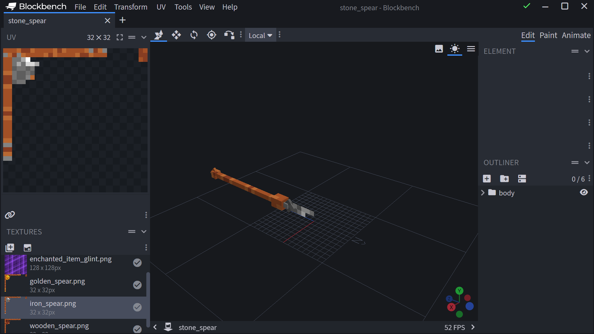
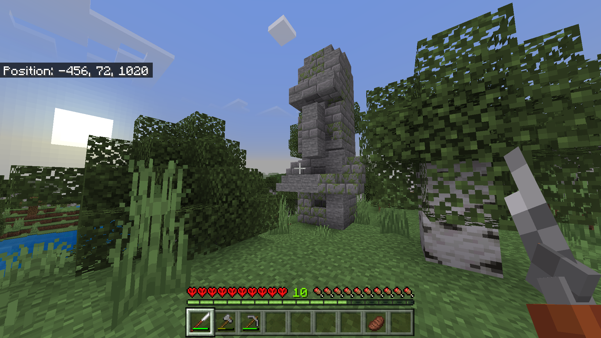
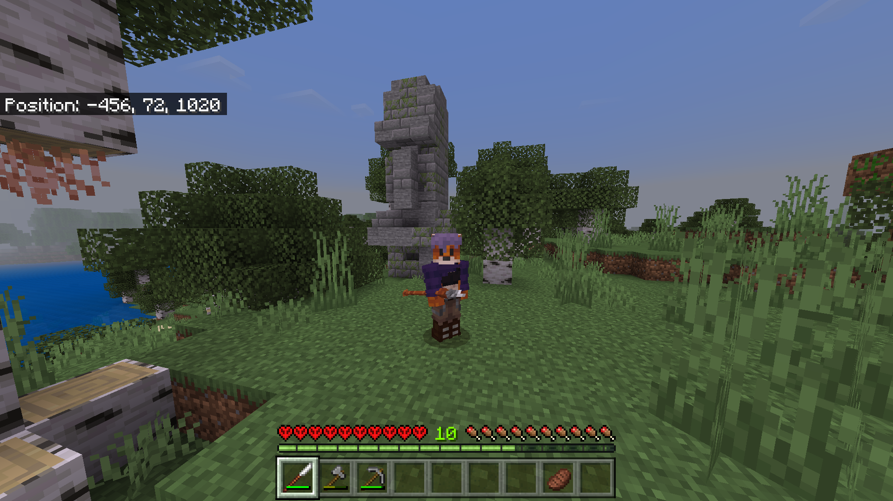

::: tip
强烈建议你对JavaScript和脚本API有基本的了解。
:::

::: warning
强烈建议你为本指南准备基本的纹理和模型。
:::

在开始之前，让我们确保你的文件结构已设置好：

<FolderView
	:paths="[
    'com.mojang/development_resource_packs/spear_RP/textures/items/spear.png',
    'com.mojang/development_resource_packs/spear_RP/textures/entities/spear.png',
    'com.mojang/development_resource_packs/spear_RP/entities/spear.json',
    'com.mojang/development_resource_packs/spear_RP/attachables/spear.json',
    'com.mojang/development_resource_packs/spear_RP/animations/spear_animation.json',
    'com.mojang/development_resource_packs/spear_RP/texts/en_US.lang',
    'com.mojang/development_resource_packs/spear_RP/manifest.json',
    'com.mojang/development_resource_packs/spear_RP/pack_icon.png',
    'com.mojang/development_behavior_packs/spear_BP/items/spear.json',
    'com.mojang/development_behavior_packs/spear_BP/entities/spear.json',
    'com.mojang/development_behavior_packs/spear_BP/pack_icon.png',
    'com.mojang/development_behavior_packs/spear_BP/manifest.json'
    ]"
></FolderView>

制作自定义长矛是一项非常简单的任务。然而，对Koala Boy来说并不简单。虽然涉及一些脚本，但它并不处理主要行为。

## 物品

显然，你需要一个物品来制作长矛，但我们不使用一些“基本”行为。让我们获取一个物品文件，并添加以下组件。我们从主要组件开始：

```json title="BP/items/spear.json"
{
    //使用持续时间是我们可以使用物品的最大时间。
    "minecraft:use_duration": 3600,
    //此组件赋予我们的长矛像弓一样“拉动”的能力
    "minecraft:throwable": {
        "min_draw_duration": 2,
        "max_draw_duration": 4,
        "scale_power_by_draw_duration": true
    },
    //拉动完成时射出的投射物
    "minecraft:projectile": {
        "projectile_entity": "wiki:thrown_iron_spear",
        "minimum_critical_power": 1.0
    },
    //长矛的耐久度。
    "minecraft:durability": {
        "max_durability": 125
    }
}
```

## 长矛投射物

我们可以安全地说，我们得到了长矛的重要组件。接下来我们转到投射物。这个投射物将是一个简单的实体，带有一些附加组件和一个运行时标识符，以获取正确的行为。

/// details-info | 投射物

```json title="BP/entities/spear.json"
{
    "format_version": "1.12.0",
    "minecraft:entity": {
        "description": {
            "identifier": "wiki:thrown_iron_spear",
            "is_spawnable": false,
            "is_summonable": true,
            "is_experimental": false,
            "runtime_identifier": "minecraft:snowball"
        },
        "component_groups": {
            "wiki:give": {
                "minecraft:instant_despawn": {}
            }
        },
        "components": {
            "minecraft:conditional_bandwidth_optimization": {
                "default_values": {
                    "max_dropped_ticks": 10,
                    "max_optimized_distance": 100,
                    "use_motion_prediction_hints": true
                }
            },
            "minecraft:hurt_on_condition": {
                "damage_conditions": [
                    {
                        "cause": "lava",
                        "damage_per_tick": 4,
                        "filters": {
                            "operator": "==",
                            "subject": "self",
                            "test": "in_lava",
                            "value": true
                        }
                    }
                ]
            },
            "minecraft:physics": {},
            "minecraft:projectile": {
                "anchor": 1,
                "gravity": 0.05,
                "hit_sound": "bow.hit",
                "offset": [0, -0.1, 0],
                "on_hit": {
                    "definition_event": {
                        "event_trigger": {
                            "event": "example:foo",
                            "target": "self"
                        }
                    },
                    "impact_damage": {
                        "damage": 7,
                        "destroy_on_hit": false,
                        "knockback": true,
                        "power_multiplier": 0.97,
                        "semi_random_diff_damage": false
                    },
                    "stick_in_ground": {
                        "shake_time": 0.35
                    }
                },
                "power": 3,
                "should_bounce": true,
                "stop_on_hurt": true
            },
            "minecraft:pushable": {
                "is_pushable": false,
                "is_pushable_by_piston": true
            }
        }
    }
}
```

///
这里是我们的简单投射物实体。我们缺少一个部分，使其成为有用的投射物。我们的玩家无法从地面上捡起它。为了做到这一点，我们需要事件和实体传感器：

```json title="BP/entities/spear.json"
{
    "components": {
        //实体传感器检测投射物是否在地面上，以及玩家是否靠近该实体。
        //当条件为真时将运行一个事件
        "minecraft:entity_sensor": {
            "event": "wiki:give",
            "event_filters": {
                "all_of": [
                    {
                        "subject": "other",
                        "test": "is_family",
                        "value": "player"
                    },
                    {
                        "subject": "self",
                        "test": "on_ground",
                        "value": true
                    }
                ]
            },
            "minimum_count": 1,
            "relative_range": false,
            "sensor_range": 0.7
        }
    },
    "events": {
        /*
        此事件将使我们的投射物消失，并给我们的玩家一个标签，我们将在脚本中使用。
        */
        "wiki:give": {
            "sequence": [
                {
                    "add": {
                        "component_groups": ["wiki:give"]
                    }
                },
                {
                    "randomize": [
                        {
                            "queue_command": {
                                "command": ["playsound random.pop @p", "tag @p add iron_spear"]
                            },
                            "weight": 90
                        }
                    ]
                }
            ]
        }
    }
}
```

完成我们的投射物实体后，是时候转到资源包了。

## 客户端实体

我们将为我们的投射物使用一个基本的客户端实体文件，并添加代码。

/// details-info | 客户端实体

```json title="RP/entities/spear.json"
{
    "format_version": "1.10.0",
    "minecraft:client_entity": {
        "description": {
            "identifier": "wiki:thrown_iron_spear",
            "materials": {
                "default": "entity_alphatest"
            },
            "textures": {
                "default": "textures/entity/iron_spear"
            },
            "animations": {
                "move": "animation.weapon.default_thrown"
            },
            "scripts": {
                "animate": ["move"]
            },
            "geometry": {
                "default": "geometry.stone_spear"
            },
            "render_controllers": ["controller.render.default"]
        }
    }
}
```

///

在我们的客户端实体文件中，你可能注意到绑定了动画。这个动画将使我们的投射物在飞行时旋转。

::: warning
确保你的实体模型与下面的图像相似！
:::



## 动画

我们为投射物使用的动画不是普通的实体动画。这个动画使用 [molang](https://bedrock.dev/docs/stable/Molang) 来定义旋转。

```json title="BP/animations/spear.json"
{
    "format_version": "1.8.0",
    "animations": {
        "animation.weapon.default_thrown": {
            "loop": true,
            "bones": {
                "body": {
                    //这是一些molang的内容。动画使用它根据当前角度旋转模型。
                    "rotation": ["-q.target_x_rotation", "-q.body_y_rotation", 0]
                }
            }
        }
    }
}
```

## 附加物

我们将使用三叉戟附加物，因为它已经包含了物品位置和使用动画。它应该看起来像这样：

```json title="BP/attachables/spear.json"
{
    "format_version": "1.10.0",
    "minecraft:attachable": {
        "description": {
            "identifier": "wiki:iron_spear",
            "materials": {
                "default": "entity_alphatest",
                "enchanted": "entity_alphatest_glint"
            },
            "textures": {
                "default": "textures/entity/iron_spear",
                "enchanted": "textures/misc/enchanted_item_glint"
            },
            "geometry": {
                "default": "geometry.stone_spear_item"
            },
            "animations": {
                "wield": "controller.animation.trident.wield",
                "wield_first_person": "animation.trident.wield_first_person",
                "wield_first_person_raise": "animation.trident.wield_first_person_raise",
                "wield_first_person_raise_shake": "animation.trident.wield_first_person_raise_shake",
                "wield_first_person_riptide": "animation.trident.wield_first_person_riptide",
                "wield_third_person": "animation.trident.wield_third_person",
                "wield_third_person_raise": "animation.trident.wield_third_person_raise"
            },
            "scripts": {
                "pre_animation": [
                    "v.charge_amount = math.clamp((q.main_hand_item_max_duration - (q.main_hand_item_use_duration - q.frame_alpha + 1.0)) / 10.0, 0.0, 1.0f);"
                ],
                "animate": ["wield"]
            },
            "render_controllers": ["controller.render.item_default"]
        }
    }
}
```

## 脚本

现在我们已经设置好了长矛，投掷时没有办法对其造成伤害。为此，我们将利用脚本API。

这个脚本非常简单，不需要太多脑力。

```js
import { world, ItemStack } from "@minecraft/server";
import { system } from "@minecraft/server";
//这可以防止世界崩溃
system.beforeEvents.watchdogTerminate.subscribe((data) => {
    data.cancel = true;
});

world.afterEvents.itemReleaseUse.subscribe((ev) => {
    //这是为了支持多人游戏
    for (const player of world.getPlayers()) {
        //获取玩家物品栏和持有物品的基本变量。
        let inv = player.getComponent("inventory").container;
        //我们的itemStack用于保存物品。这也保存了物品数据。
        const itemStack = inv.getItem(player.selectedSlot);
        //如果我们手中持有的物品是我们的长矛，则运行代码。
        if (itemStack?.typeId === "wiki:iron_spear") {
            var container = player.getComponent("inventory").container;
            //要给予的新物品。
            var newItem = new ItemStack("wiki:iron_spear");
            var oldItem = container?.getItem(player.selectedSlot);
            //这里是那个标签！
            player.removeTag("iron_spear");
        }
        //我们订阅一个tick事件，以检测何时我们拥有标签以及物品耐久度是否低于最大值。
        let e = system.runInterval(() => {
            if (
                player.hasTag("iron_spear") &&
                itemStack?.typeId === "wiki:iron_spear" &&
                itemStack?.getComponent("durability").damage <= 125
            ) {
                player.removeTag("iron_spear");
                //每次我们捡起物品时，给予我们保存的物品（newItem）+1耐久度。
                newItem.getComponent("durability").damage =
                    oldItem.getComponent("durability").damage + 1;
                container.setItem(player.selectedSlot, newItem);
                //当我们没有标签时，停止tick事件。
                if (!player.hasTag("iron_spear")) {
                    system.clearRun(e);
                }
            }
        });
    }
});
```

## 最终产品

按照本指南操作后，你应该在游戏中拥有自己的工作长矛。





示例包下载：

<Button link="https://github.com/Bedrock-OSS/wiki-addon/releases/download/download/custom_spear.mcaddon">
    💾 示例包
</Button>