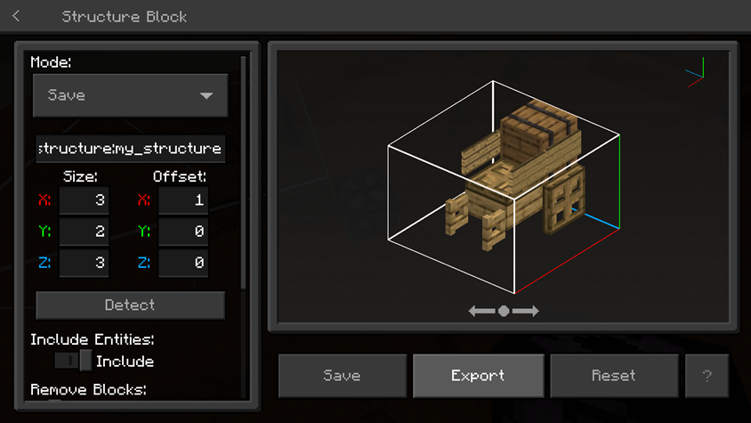
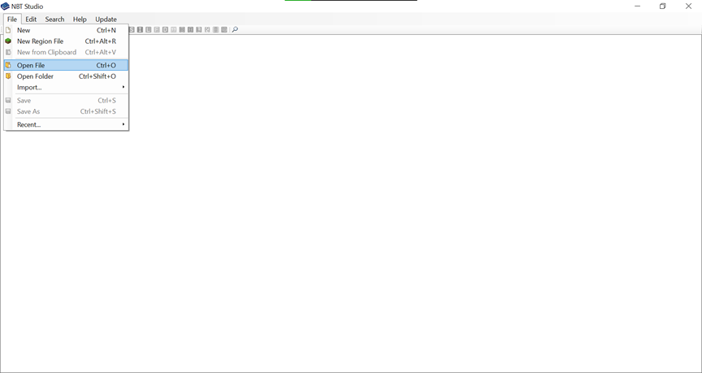
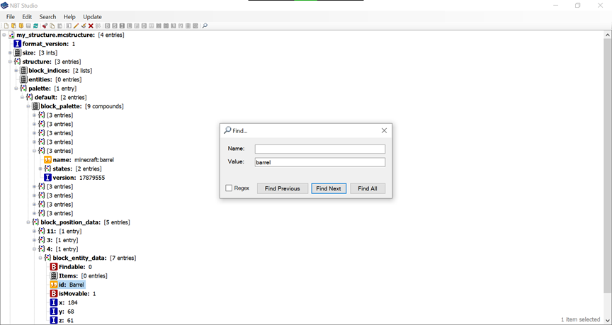
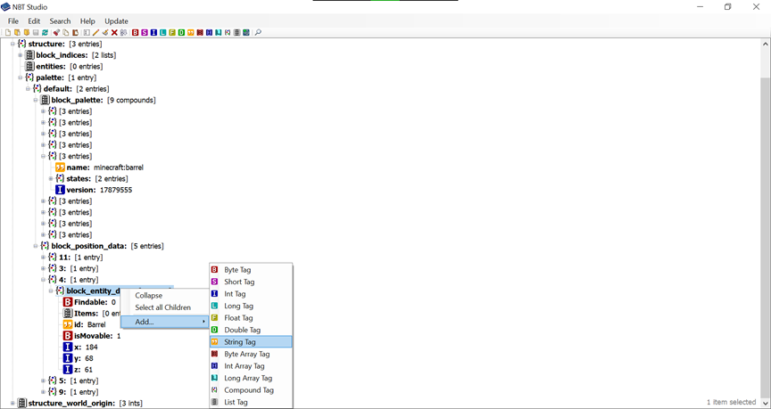
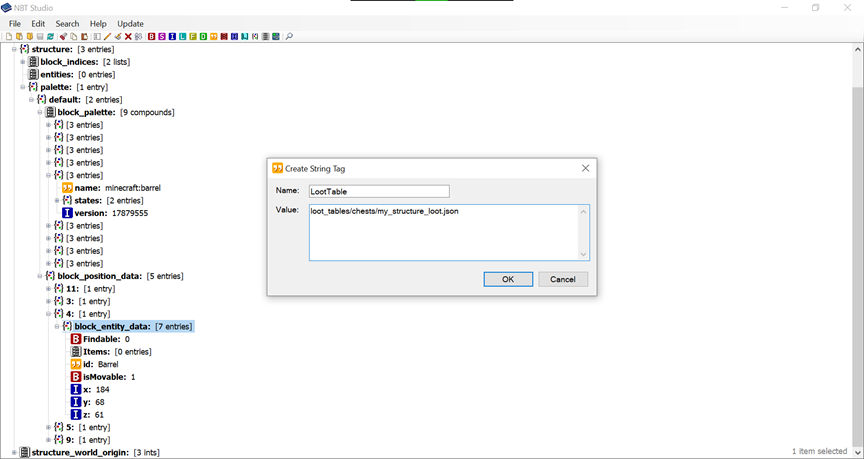
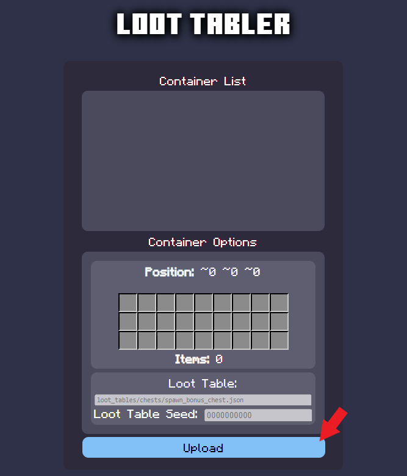
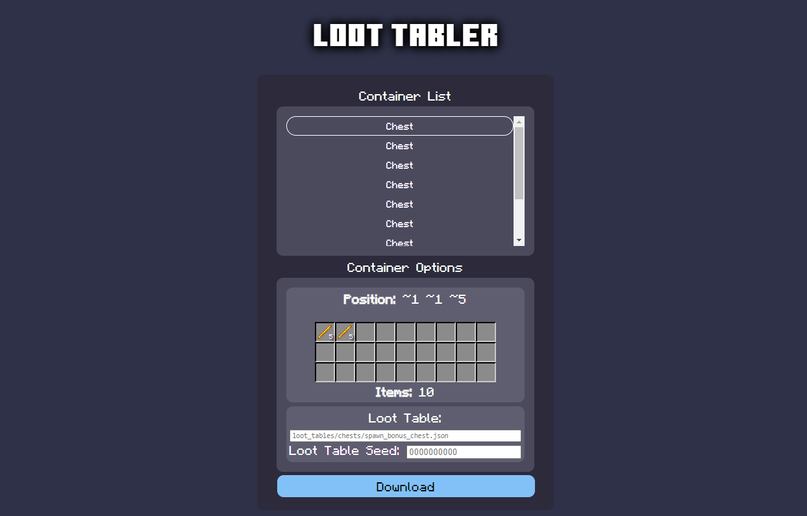
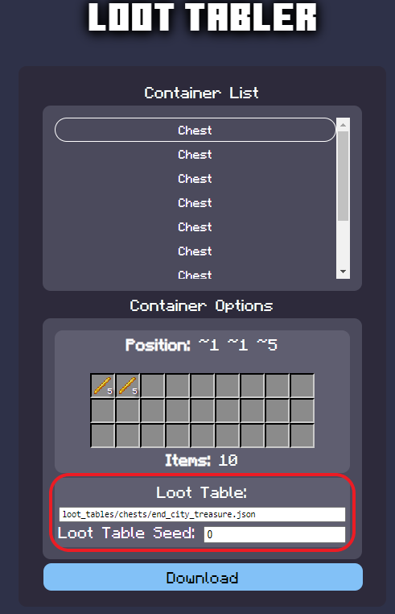
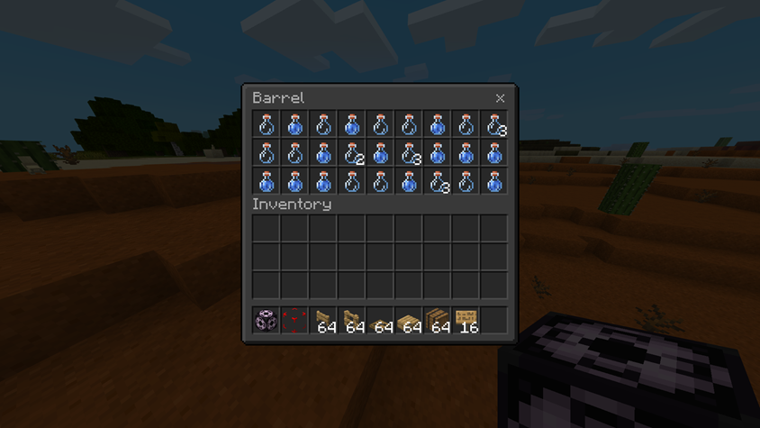

为结构中的容器添加战利品表非常简单，你需要一台电脑以及选择使用[NBT Studio](https://github.com/tryashtar/nbt-studio/releases/download/v1.14.1/NbtStudio.exe)（可执行文件）或[Loot Tabler](https://mcbe-essentials.github.io/structure-editor/loot-tabler)（浏览器应用程序）。

## 设置
### 创建战利品表

首先，创建目录`BP/loot_tables/chests`并在此处创建你的战利品表文件。

你可以在[初学者指南](../guide/loot-table.md)中学习如何制作战利品表。

```json title="BP/loot_tables/chests/my_structure_loot.json"
{
	"pools": [
		{
			"rolls": {
				"min": 8,
				"max": 10
			},
			"entries": [
				{
					"type": "item",
					"name": "minecraft:glass_bottle",
					"functions": [
						{
							"function": "set_count",
							"count": {
								"min": 4,
								"max": 6
							}
						}
					],
					"weight": 1
				},
				{
					"type": "item",
					"name": "minecraft:potion",
					"functions": [
						{
							"function": "set_count",
							"count": {
								"min": 4,
								"max": 6
							}
						}
					],
					"weight": 1
				}
			]
		}
	]
}
```

### 导出结构

创建完战利品表后，将你的结构导出到`BP/structures`。然后按照NBT Studio或Loot Tabler的步骤进行操作。



## NBT Studio（可执行文件）
### 软件准备

下载并启动[NBT Studio](https://github.com/tryashtar/nbt-studio/releases/download/v1.14.1/NbtStudio.exe)。

### 添加战利品表

启动NBT Studio并打开文件（Ctrl + O）。



查找你的容器（Ctrl + F）。



导航到你的容器，`block_position_data` > `block_entity_data`。添加一个字符串标签。



添加`LootTable`及战利品表的文件路径。



保存更改（Ctrl + S）。

## Loot Tabler（浏览器应用程序）

/// tip
要在移动设备上导出结构，[下载此包。](https://mcpedl.com/export-structure-button-android-addon/)
///

### 添加战利品表

打开网站并点击“上传”。选择你的结构文件。



在容器列表中找到你的容器，利用“容器选项”下显示的信息。



在“战利品表”下，输入战利品表的路径。如果你希望战利品随机生成，请将“战利品表种子”设置为空或`0`。如果你希望战利品表生成一致的内容，请输入特定值。



下载你的结构文件并将其放入`BP/structures`。

## 测试

加载你的结构并打开容器。

