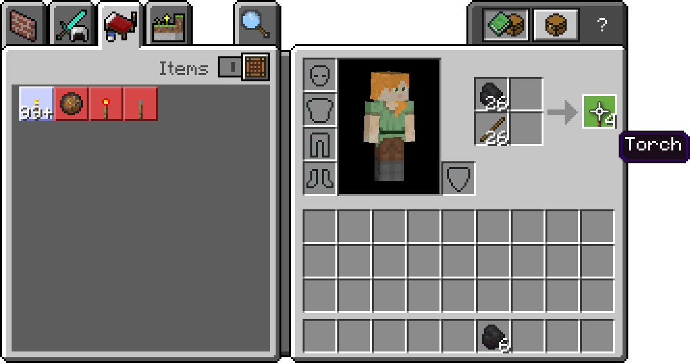
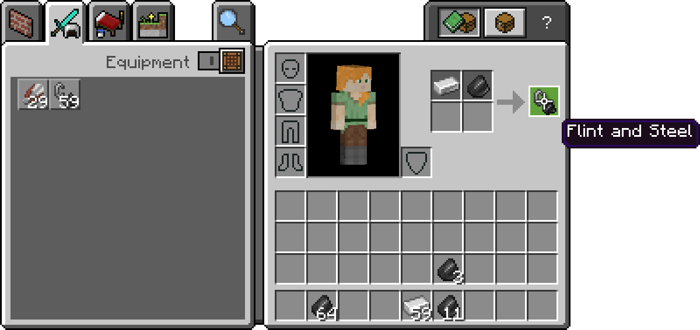
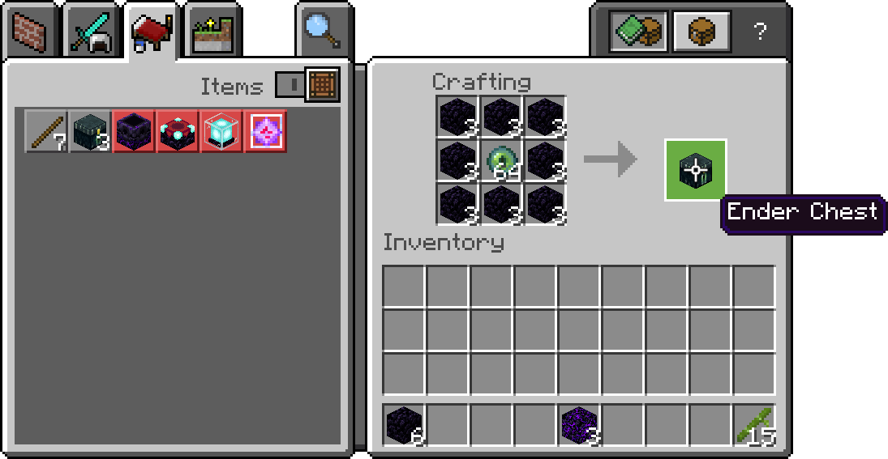
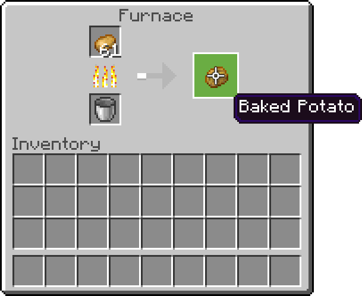
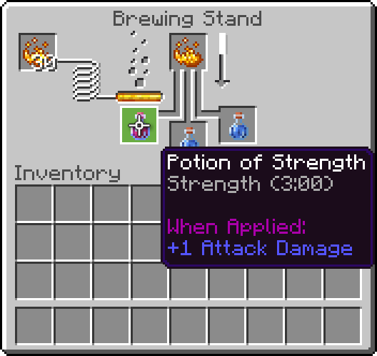
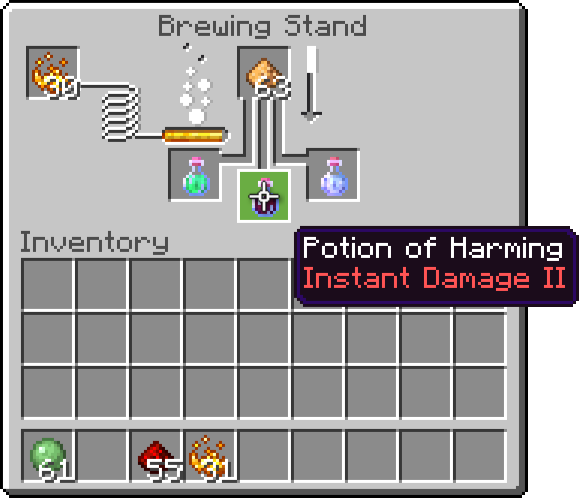

配方是处理多种物品交易的方式，特别是在工作台、熔炉、篝火和酿造架中发生的交易。



/// tip
铁砧的交互在[物品定义](/items/item-components)中处理，而不是通过配方文件。目前Loom交易不可用。
///

使用配方或其任何功能不需要启用实验切换。

### 注册

所有配方都存储在行为包根目录下的 `recipes` 文件夹中。文件可以根据需要命名并组织在任何文件夹层级下。

本文档中使用的路径结构如下：

<FolderView
	:paths="[
		'BP/recipes/crafting/weapons/cold_steel_sword.json',
		'BP/recipes/decorations/knobs/brass.json',
		'BP/recipes/covered_arch.json',
		'BP/recipes/magic/magic_ash.json',
		'BP/recipes/brewing/negative/paralysis.json',
		'BP/recipes/illumination_potion.json'
	]"
/>

例如，可以使用以下[形状配方](#shaped-recipes)来制作一把“冷钢剑”：

<CodeHeader>BP/recipes/crafting/weapons/cold_steel_sword.json</CodeHeader>
```json
{
	"format_version": "1.17.41",
	"minecraft:recipe_shaped": {
		"description": {
			"identifier": "wiki:cold_steel_sword"
		},
		"tags": ["crafting_table", "altar"],
		"pattern": [
			"X",
			"X",
			"I"
		],
		"key": {
			"X": "wiki:cold_steel",
			"I": "minecraft:stick"
		},
		"unlock": [
			{
				"item": "wiki:cold_steel"
			},
			{
				"item": "minecraft:wool",
				"data":  3
			},
			{
				"context": "PlayerInWater"
			}
		],
		"result": "wiki:cold_steel_sword"
	}
}
```

## 共享属性和结构

### 格式版本

[格式版本](../guide/format-version.md)用于版本化配方主体所使用的模式。它通过顶级的 `"format_version"` 属性提供。

<CodeHeader>#/</CodeHeader>
```json
"format_version": "1.17.41"
```

实际上，格式版本可以设置为任何值，甚至可以省略。

/// warning
强烈建议仍然包含格式版本，选择一个代表实际Minecraft版本的值以帮助代码的未来兼容性。考虑使用当前的发布版本或最后一个主要发布版本。
///

### 描述

在任何配方类型中必需的 `"description"` 对象，包含配方的标识符。

<CodeHeader>#/minecraft:recipe_shaped/</CodeHeader>
```json
"description": {
	"identifier": "wiki:cold_steel_sword"
}
```

它的唯一子项是必需的 `"identifier"` 属性，旨在在应用于世界的所有包中唯一标识配方。配方标识符没有命名空间要求，除了在单个包中没有两个完整的配方标识符相同。

/// warning
强烈建议使用命名空间。命名空间是其他附加包域的标准，并有助于逻辑上将配方限定在一个包内，减少玩家在世界中使用多个行为包时发生冲突的可能性。
///

### 标签

配方通过必需的 `"tags"` 数组属性与制作界面链接，必须放置在任何配方类型内。这些标签将使配方在使用 `minecraft:crafting_table` 组件的不同方块之间共享。当配方不包含 `crafting_table` 标签或任何原版标签，而是使用自定义方块的标签时，配方将仅与该自定义方块共享，而不会与工作台/切石机等共享。必须至少提供一个标签。

<CodeHeader>#/minecraft:recipe_shaped/</CodeHeader>
```json
"tags": ["crafting_table", "altar"]
```

原版接口通过标签公开每组配方类型。

制作：

-   `crafting_table`
-   `stonecutter`
-   `smithing_table`

/// warning | 注意
如果你想制作锻造配方，你需要在第二个槽中使用 `<namespace>:netherite_ingot`，虽然使用不同的标识符将不起作用。**在1.18.30之后，这将不再有效**。
///

烹饪和熔炼：

-   `furnace`
-   `blast_furnace`
-   `smoker`
-   `campfire`
-   `soul_campfire`

酿造：

-   `brewing_stand`

教育：

-   `material_reducer`

/// tip | 
此外，[自定义工作台](../blocks/block-components.md#crafting-table)可以声明自定义标签以供酿造配方使用。自定义烹饪和熔炼方块以及自定义酿造架当前不可用。
///

/// tip
要有效地禁用配方（有助于[覆盖](#overrides)先前的配方），将标签数组设置为 `[""]`。
///

### 配方解锁

Minecraft 1.20.30在游戏中添加了配方解锁功能。为了让你的配方使用此功能，你的 `manifest.json` 必须具有 `min_engine_version` 为 1.20.11（推荐使用1.20.30）。你还需要在配方中添加 `unlock` 数组及其对象。
```json
		"unlock": [
			{
				"item": "wiki:cold_steel" //解锁配方的物品
			},
			{
				"item": "minecraft:wool", //解锁配方的物品
				"data":  3
			},
			{
				"context": "PlayerInWater" //解锁配方的事件
			}
        ]
```
此数组中的每个对象包含 `"item"`，它告诉配方玩家需要在物品栏中拥有此物品才能解锁该配方。它还接受数据值。`"context"` 用于确定解锁此配方的事件。`"PlayerInWater"` 当玩家进入水中时将解锁此配方。这也是配方目前已知的唯一上下文。

### 物品描述符

使用配方涉及在多个属性中引用物品。物品可以以两种格式之一提供：字符串引用或物品对象。两种格式都有处理数据值的方式，但只有物品对象可以用于指定该物品的数量（可用于配方输出）。对于配方输入，如果未提供数据值，则任何具有该标识符下的数据值的物品都可以用于该输入。输出的数据值如果未明确提供，则默认为 `0`。不支持通过物品标签选择配方输入。

#### 字符串引用

通常，字符串引用只是该物品的命名空间和标识符组合：

<CodeHeader>#/minecraft:recipe_shapeless/ingredients/0</CodeHeader>
```json
"minecraft:planks"
```

字符串引用还支持在后缀中指定数据值：

<CodeHeader>#/minecraft:recipe_shapeless/ingredients/0</CodeHeader>
```json
"minecraft:planks:2"
```

#### 物品对象

物品对象是引用物品的更明确的构造。

<CodeHeader>#/minecraft:recipe_shapeless/ingredients/0</CodeHeader>
```json
{
	"item": "minecraft:planks",
	"data": 2,
	"count": 3
}
```

必需的 `"item"` 属性与字符串引用格式的功能相同。虽然有一个明确的数据字段可用，但 `"item"` 属性中的数据后缀字符串格式仍然受支持。然而，与后缀形式不同，`"data"` 可以接受Molang。这里的Molang在世界加载时评估一次，而不是每次制作尝试时。变量不能用于在配方的属性之间传递数据。此外，输入物品的性质无法查询。目前， `"data"` 属性中唯一已知的可用查询是 `q.get_actor_info_id`，用于通过其标识符查找实体孵蛋的ID：

<CodeHeader>#/minecraft:recipe_shapeless/result</CodeHeader>
```json
{
	"item": "minecraft:spawn_egg",
	"data": "q.get_actor_info_id('minecraft:chicken')"
}
```

可选的整数 `"count"` 属性可用于堆叠物品。默认值为 `1`。当前，设置计数仅在[制作](#crafting)和[熔炉](#heating)配方输出及[无形状配方成分](#ingredients)中起作用。在其他位置提供的计数将被忽略。

/// tip | 注意
如果为不堆叠的物品提供大于 `1` 的计数，将会抛出错误。没有办法强制单次返回配方输出，例如无形状配方或酿造混合中的那种，每次交易只能返回多个物品。
///

/// warning
尽管与贸易[表物品描述符](../loot/trade-tables.md#items)有相似之处，但配方物品描述符不能使用函数。
///

#### 标识符补充

配方中可用的其他标识符用于描述基础药水。

<CodeHeader>#/minecraft:recipe_brewing_mix/input</CodeHeader>
```json
"minecraft:potion_type:strength"
```

这些标识符在对象表示法中不可用，仅在字符串表示法中可用。持久药水和扩散药水的变体不可用。所有此类标识符遵循格式：<code>minecraft:potion_type:&lt;药水效果&gt;</code>，其中 <code>&lt;药水效果&gt;</code> 可以是以下之一：

-   `water`
-   `awkward`
-   `mundane`
-   `thick`
-   `healing`
-   `regeneration`
-   `swiftness`
-   `strength`
-   `harming`
-   `poison`
-   `slowness`
-   `weakness`
-   `water_breathing`
-   `fire_resistance`
-   `nightvision`
-   `invisibility`
-   `leaping`
-   `slow_falling`
-   `turtle_master`
-   `wither`

在支持的情况下，可以使用 `long_` 和 `strong_` 前缀来指定修改后的药水，例如 `minecraft:potion_type:strong_poison`。

## 制作

制作操作使用制作网格将输入立即转换为输出。有两种制作配方类型可用：[无形状配方](#shapeless-recipes)，其输入可以以任何方式排列，以及[形状配方](#shaped-recipes)，用于定义输入的严格排列。制作配方支持工作台和切石机：

<CodeHeader>#/minecraft:recipe_shapeless/</CodeHeader>
```json
"tags": ["crafting_table", "stonecutter"]
```

`"crafting_table"` 适用于原版工作台和玩家物品栏中的 2 × 2 制作网格。目前没有办法只选择其中一个而不选择另一个。制作配方还支持自定义标签，将配方链接到[自定义方块提供的制作网格](../blocks/block-components.md#crafting-table)。

### 无形状配方

无形状配方仅将一组输入绑定到制作网格上的单一输出。



<CodeHeader>BP/recipes/decorations/knobs/brass.json</CodeHeader>
```json
{
	"format_version": "1.17.41",
	"minecraft:recipe_shapeless": {
		"description": {
			"identifier": "wiki:brass_door_knob"
		},
		"group": "handles",
		"tags": ["construction_bench"],
		"ingredients": [
			"wiki:brass",
			{
				"item": "wiki:screw",
				"data": 2
			}
		],
		"unlock": [
			{
				"item": "wiki:cold_steel"
			},
			{
				"item": "minecraft:wool",
				"data":  3
			},
			{
				"context": "PlayerInWater"
			}
		],
		"result": {
			"item": "wiki:door_knob",
			"data": 3
		}
	}
}
```

#### 成分

必需的 `"ingredients"` 数组属性列出制作配方所需的输入物品。

<CodeHeader>#/minecraft:recipe_shapeless/</CodeHeader>
```json
"ingredients": [
	"wiki:brass",
	{
		"item": "wiki:screw",
		"data": 2
	}
]
```

每个条目都是一个[物品描述符](#item-descriptors)。如果成分提供了数量，则该数量必须在多个制作网格槽中表达。在单个网格槽中使用堆叠物品以生成产品是不支持的。如果制作所需的物品可用，但成分的数量大于使用的制作界面支持的数量，则配方将在配方书中自动不可用。

#### 无形状结果

无形状配方的输出使用必需的 `"result"` 属性表达，可以作为单个[物品描述符](#item-descriptors)或单个物品描述符数组进行表达。

<CodeHeader>#/minecraft:recipe_shapeless/</CodeHeader>
```json
"result": {
	"item": "wiki:door_knob",
	"data": 3
}
```

### 形状配方

形状配方强制在制作过程中使用的成分符合严格的形状。



<CodeHeader>BP/recipes/covered_arch.json</CodeHeader>
```json
{
	"format_version": "1.17.41",
	"minecraft:recipe_shaped": {
		"description": {
			"identifier": "wiki:covered_arch"
		},
		"tags": ["crafting_table"],
		"pattern": [
			"SSS",
			"I I",
			"I I"
		],
		"key": {
			"S": "wiki:cloth",
			"I": "wiki:support"
		},
		"unlock": [
			{
				"item": "wiki:cold_steel"
			},
			{
				"item": "minecraft:wool",
				"data":  3
			},
			{
				"context": "PlayerInWater"
			}
		],
		"result": [
			{
				"item": "wiki:covered_arch",
				
				"count": 3
			},
			"wiki:crafting_scrap"
		]
	}
}
```

#### 模式

必需的 `"pattern"` 数组属性建立配方所使用的形状。

<CodeHeader>#/minecraft:recipe_shaped/</CodeHeader>
```json
"pattern": [
	"SSS",
	"I I",
	"I I"
]
```

数组中的每个条目都是表示制作网格中一行的字符串。每个字符串中的每个字符代表该行中的一个槽。默认情况下，空格代表应为空的槽。

字符作为快捷方式，用于直观描述一个物品。每个不同的字符都与一个[键](#keys)匹配，决定该槽中应该存在什么物品。

/// tip
如果模式仅由空格组成，能够适应该模式大小的空制作界面将不断匹配该配方。玩家可能会无限制地获取制作输出，包括在按住Shift键检索结果时立即填满他们的物品栏。
///

##### 行标准化

模式网格最多必须是 3 × 3，但可以更小。如果字符串长度不匹配，Minecraft将自动扩展较短的字符串，意味着填充槽中有空格。以下两者是等效的：

<CodeHeader>#/minecraft:recipe_shaped/</CodeHeader>
```json
"pattern": [
	"MA",
	"IFI",
	"M"
]
```

<CodeHeader>#/minecraft:recipe_shaped/</CodeHeader>
```json
"pattern": [
	"MA ",
	"IFI",
	"M  "
]
```

/// tip | 注意
目前，没有任何制作网格，包括来自自定义方块的可配置制作网格，可能大于 3 × 3。如果表达的模式在当前制作界面中不可用，配方将在配方书中自动不可用。
///

##### 网格自由度

空格不会自动填充制作网格中剩余的任何槽。如果提供的模式小于正在使用的制作网格，模式可以在任何位置使用，只要结构和内容保持不变。例如，考虑以下工作台上的模式：

<CodeHeader>#/minecraft:recipe_shaped/</CodeHeader>
```json
"pattern": [
	"O"
	"OO"
]
```

"L" 形状不限于制作网格的左上角。以 3 × 3 网格为例，模式可以在以下任何配置中使用：

<Spoiler title="可能的配置">
*下划线代表空槽。*
```txt
O__
OO_
___
```
```txt
_O_
_OO
___
```
```txt
___
O__
OO_
```
```txt
___
_O_
_OO
```
</Spoiler>

要将放置限制在特定位置，请使用显式空格，这将在某些位置强制空槽。以下示例仅可在网格的左上角使用：

<CodeHeader>#/minecraft:recipe_shaped/</CodeHeader>
```json
"pattern": [
	"O  "
	"OO "
	"   "
]
```

##### 对称性

所有形状配方本质上都是水平对称的：

<CodeHeader>#/minecraft:recipe_shaped/</CodeHeader>
```json
"pattern": [
	"Z  ",
	" Z ",
	"  Z"
]
```

前述配方也可以被玩家当作设置为以下形式使用：

<CodeHeader>#/minecraft:recipe_shaped/</CodeHeader>
```json
"pattern": [
	"  Z",
	" Z ",
	"Z  "
]
```

#### 键

键通过必需的 `"key"` 对象属性为[模式](#patterns)中的字符提供意义，将键名称映射到[物品描述符](#item-descriptors)。

<CodeHeader>#/minecraft:recipe_shaped/</CodeHeader>
```json
"key": {
	"S": "wiki:cloth",
	"I": "wiki:support"
}
```

模式中出现的每个键都应在此处列出。键名称区分大小写。如果一个物品支持多种数据值且未提供数据值，则该标识符下的任何物品都可以用于该键。物品描述符中存在的任何 `"count"` 属性都会被忽略，并视为 `1`；制作网格槽中的堆叠物品一次只能消耗一个。

/// tip | 注意
可以使用 `U+0020` 到 `U+07FF` 之间的任何Unicode字符作为键名称。如果键名称有多个字符，仅考虑第一个字符。由于空格默认用于表示网格中的空槽，并且无法重新指定空槽的键，因此不建议将其用作键。
///

/// warning
如果模式中的字符未出现在键映射中，将被视为空格，即指定的空槽。
///

### 配方解锁
Minecraft 1.20.30在游戏中添加了配方解锁功能。为了让你的配方使用此功能，你的 `manifest.json` 必须具有 `min_engine_version` 为 1.20.11（推荐使用1.20.30）。你还需要在配方中添加 `unlock` 数组及其对象。
```json
		"unlock": [
			{
				"item": "wiki:cold_steel" //解锁配方的物品
			},
			{
				"item": "minecraft:wool", //解锁配方的物品
				"data":  3
			},
			{
				"context": "PlayerInWater" //解锁配方的事件
			}
		]
```
此数组中的每个对象包含 `"item"`，它告诉配方玩家需要在物品栏中拥有此物品才能解锁该配方。`"context"` 用于确定解锁此配方的事件。`"PlayerInWater"` 当玩家进入水中时将解锁此配方。这也是配方目前已知的唯一上下文。

#### 形状结果

形状制作配方的输出行为与[无形状对应物](#shapeless-results)非常相似。然而，与无形状配方的数组结果不同，形状制作配方的结果数组可以包含多个[物品描述符](#item-descriptors)。

<CodeHeader>#/minecraft:recipe_shaped/</CodeHeader>
```json
"result": [
	{
		"item": "wiki:covered_arch",
		"count": 3
	},
	"wiki:crafting_scrap"
]
```
数组中的第一个条目将被用作制作方块的可见输出。所有其他值在玩家从输出槽移除可见结果时会自动放入玩家的物品栏中。目前，似乎没有限制每次制作操作可以返回的物品数量。

/// tip | 注意
如果玩家的物品栏无法容纳任何物品，则这些物品将按从左到右、从上到下的顺序放置在制作表的输入槽中。然后，无法适应的任何物品将像玩家使用“丢弃物品”操作一样被抛出。
///

### 配方书

配方书自动索引并向玩家显示可用配方，智能地考虑无形状配方中的[成分数量](#ingredients)或形状配方中的[模式限制](#patterns)。当多个配方指向相同输出时，配方书使用其自己的优先级系统。

当比较的两个配方都是无形状配方时，以下规则按顺序决定优先级：

-   首个列出成分的 _较低_ 成分数量
-   更多的负 [优先级](#priority)
-   较低值的标识符字符串

对于形状配方，当按字符串比较时，“较小”的标识符始终具有更高优先级。

当比较形状配方和无形状配方时，使用无形状配方的比较规则；然而，形状配方的解释后的成分数量与其实际成分数量不同。确切的形状配方成分数量的确定方式尚不清楚。

### 分组

本节仅供参考。分组在原版定义的制作配方中存在，通过可选的 `"group"` 字符串属性给出。

<CodeHeader>#/minecraft:recipe_shaped/</CodeHeader>
```json
"group": "slingshots"
```

目前尚不清楚此属性是否有任何效果。可能会与[配方书](#recipe-book)一起使用。使用新的自定义分组或重新使用来自原版定义的分组似乎没有任何效果。

### 优先级

制作配方支持一个额外的属性用于处理输入冲突，即 `"priority"`，主要作为在多种配方可能适用的情况下的[决胜规则](#prioritization)。优先级直接在制作配方类型对象中提供。

<CodeHeader>#/minecraft:recipe_shaped/</CodeHeader>
```json
"priority": 2
```

优先级较低的制作配方优先级更高。因此，如果所有条件相同，优先级为 `0` 的配方将优先于优先级为 `1` 的配方。如果需要，优先级可以为负值。如果未提供 `"priority"`，则默认为 `0`。

## 加热

熔炉配方用于使用热源在一段时间内转换一个物品。稍有不当的命名，熔炉配方可用于任何涉及热源的界面，包括篝火。



<CodeHeader>BP/recipes/magic/magic_ash.json</CodeHeader>
```json
{
	"format_version": "1.17.41",
	"minecraft:recipe_furnace": {
		"description": {
			"identifier": "wiki:magic_ash"
		},
		"tags": ["soul_campfire"],
		"input": "wiki:bone_fragments",
		"output": {
			"item": "wiki:magic_ash",
			"count": 4
		}
	}
}
```

所有原版加热方块通过标签支持。

<CodeHeader>#/minecraft:recipe_furnace/</CodeHeader>
```json
"tags": ["furnace", "blast_furnace", "smoker", "campfire", "soul_campfire"]
```

### 加热交易

熔炉配方将恰好一个输入[物品描述符](#item-descriptors)绑定到一个输出物品描述符。

<CodeHeader>#/minecraft:recipe_furnace/</CodeHeader>
```json
"input": "wiki:bone_fragments"
"output": {
	"item": "wiki:magic_ash",
	"count": 4
}
```

输入中提供的任何计数都将被忽略。烹饪和熔炼配方的XP返回和燃料来源无法更改。加热物品所需的时间由所使用的方块设置，无法更改。

## 酿造

酿造配方用于使用另一个物品作为催化剂转换一个物品。有两种酿造配方类型可用：[酿造混合](#brewing-mixes)，不从输入到输出传递数据，以及[酿造容器](#brewing-containers)，会传递数据。

只有一个界面支持酿造配方：

<CodeHeader>#/minecraft:recipe_brewing_container/</CodeHeader>
```json
"tags": ["brewing_stand"]
```

### 酿造交易

酿造交易类似于[加热交易](#heating-transactions)，需要一个输入和输出，每个都指向单个[物品描述符](#item-descriptors)。然而，酿造配方还需要 `"reagent"` 属性作为催化剂，它也只能指向单个物品描述符。

<CodeHeader>#/minecraft:recipe_brewing_mix/</CodeHeader>
```json
"input": "wiki:flask",
"reagent": "wiki:jade",
"output": "wiki:insanity_resistance"
```

这些酿造属性中提供的计数值会被忽略。物品旨在一次转换一个物品。

/// warning
如果酿造配方的输入物品能够堆叠，则整个堆叠将在转换中被消耗。目前没有避免这一点的解决方法。
///

加热时间过去后，催化剂被消耗，输出物品直接替换输入物品。

/// warning
当前，无论是否指定了数据值，生成输出的可堆叠性都存在漏洞。特别是，输出与相同标识符和数据值的物品不兼容，无法堆叠。
///

### 酿造混合

酿造混合是简单的酿造配方，理论上设计用于将输入的数据值与输出的数据值隔离。



<CodeHeader>BP/recipes/brewing/negative/paralysis.json</CodeHeader>
```json
{
	"format_version": "1.17.41",
	"minecraft:recipe_brewing_mix": {
		"description": {
			"identifier": "wiki:paralysis_brew"
		},
		"tags": ["brewing_stand"],
		"input": "wiki:amberglass_flask",
		"reagent": "wiki:viporfly_poison",
		"output": "wiki:paralysis_brew"
	}
}
```

/// warning
不幸的是，分配的数据值对酿造混合配方是错误的。

一般来说，如果为输入提供了数据值，酿造配方将永远无法正常工作。唯一的例外是如果输入是以下之一：

-   `minecraft:potion`
-   `minecraft:splash_potion`
-   `minecraft:lingering_potion`
-   [药水标识符补充](#identifier-additions)

如果使用 `"data"` 属性格式为试剂指定了数据值，则当将具有给定标识符的任何物品作为该配方的试剂放置时，将进行酿造，无论数据值如何。然而，只有当正确的数据值匹配时，酿造才会成功。如果不匹配，酿造看似会成功，但输入不会被转换为输出；尽管酿造失败，试剂和部分下界之粉燃料仍然会被消耗。
///

### 酿造容器

酿造容器旨在将输入的数据值传递给转换后的输出。



<CodeHeader>BP/recipes/illumination_potion.json</CodeHeader>
```json
{
	"format_version": "1.17.41",
	"minecraft:recipe_brewing_container": {
		"description": {
			"identifier": "wiki:illumination_potion"
		},
		"tags": ["brewing_stand"],
		"input": "minecraft:potion",
		"reagent": "wiki:radiant_berries",
		"output": "wiki:illumination_potion"
	}
}
```

酿造容器比[酿造混合](#brewing-mixes)对其输入更严格。酿造容器配方仅允许以下物品类型：

-   `minecraft:potion`
-   `minecraft:splash_potion`
-   `minecraft:lingering_potion`
-   [药水标识符补充](#identifier-additions)

由于数据值在酿造容器配方中从输入传递到输出，因此 `"input"` 和 `"output"` 中分配的数据值将被忽略。

## 覆盖

与附加包中的所有域一样，行为包列表中的包顺序会影响Minecraft在游戏过程中选择使用哪些文件。列表中更高顺序的行为包条目优先于较低顺序的，包括基础原版包。

要覆盖较低顺序包中的配方，配方类型和标识符必须都匹配。覆盖文件可以以任何方式命名和定位——只有内容重要。配方中不接受部分覆盖；必须重新定义整个配方。

/// warning
覆盖仅在配方类型**完全匹配**时有效。在大多数情况下，类型不匹配会导致新配方与现有配方一起创建。

如果尝试构建一种将制作配方类型转换为另一种类型的覆盖，将会抛出错误。要规避此问题，首先将原版定义复制到包中。接下来，将该文件的 `"tags"` 设置为 `[""]`；这实际上禁用该配方。最后，设置一个新的文件作为另一种制作配方类型，选择不同的标识符以避免错误。
///

## 决胜优先级

在考虑[覆盖](#overrides)之后，如果多个配方基于输入可能适用，则使用以下决胜规则按顺序选择输出：

-   世界行为包列表中更高顺序包中声明的配方
-   如果是制作配方，较低值的[优先级属性](#priority)
-   如果是制作配方，优先[形状配方](#shaped-recipes)而非[无形状配方](#shapeless-recipes)
-   按字符串比较的“较小”标识符