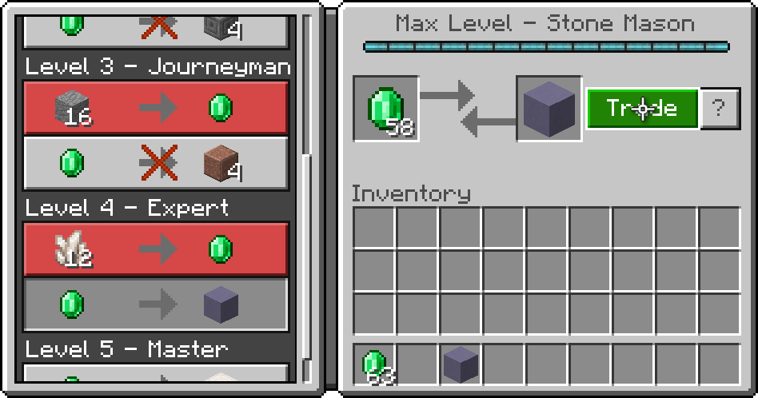

交易表代表实体进行物品交易交易的基本数据。交易表不是独立的；它们必须从[实体组件](https://bedrock.dev/docs/stable/Entities#minecraft%3Aeconomy_trade_table)中引用。利用交易表可用的随机化属性，即使所有实体实例都指向相同的交易表，交易报价、物品数量和成本计算也可能因实体实例而异。



交易表没有被标识或版本控制。像战利品表一样，交易表不支持 Molang，而是依赖于 JSON 结构，例如范围对象和[函数](#函数)。尽管不同，交易表仍然支持注释。

## 集成

交易表不代表主要的附加系统，如方块或生物群系。它们不是通过放置在特定文件夹中来注册的；相反，它们是被引用的（来自实体）。交易表可以放置在行为包的任何位置。

::: tip
建议遵循原版约定，将所有交易表放置在行为包的顶级 `trading` 目录下。然后，可以使用任何层级结构。
:::

<FolderView :paths="[
    'BP/trading/minister.json',
    'BP/trading/economy_trades/cleric_trades.json'
]" />

以下示例在整个文档中被引用和分析：

<Spoiler title="交易表文件示例">

```json title="BP/trading/minister.json"
{
    "tiers": [
        {
            "groups": [
                {
                    "num_to_select": 1,

                    "trades": [
                        {
                            "wants": [
                                {
                                    "item": "wiki:blessing_glyph",
                                    "quantity": {
                                        "min": 2,
                                        "max": 4
                                    },

                                    "price_multiplier": 0.5
                                },
                                {
                                    "item": "minecraft:book"
                                }
                            ],
                            "gives": [
                                {
                                    "item": "minecraft:enchanted_book",
                                    "functions": [
                                        {
                                            "function": "enchant_book_for_trading",

                                            "base_cost": 4,
                                            "base_random_cost": 12,
                                            "per_level_cost": 4,
                                            "per_level_random_cost": 8
                                        }
                                    ]
                                }
                            ],
                            "max_uses": 7,

                            "trader_exp": 3
                        },
                        {
                            "wants": [
                                {
                                    "item": "wiki:crystalline_spiritite",
                                    "quantity": 32,

                                    "price_multiplier": 0.125
                                }
                            ],
                            "gives": [
                                {
                                    "item": "wiki:exalted_blade",
                                    "functions": [
                                        {
                                            "function": "enchant_with_levels",

                                            "treasure": true,
                                            "levels": {
                                                "min": 15,
                                                "max": 25
                                            }
                                        }
                                    ]
                                }
                            ],
                            "max_uses": 2,

                            "reward_exp": false,
                            "trader_exp": 8
                        }
                    ]
                }
            ]
        },
        {
            "total_exp_required": 28,

            "trades": [
                {
                    "wants": [
                        {
                            "choice": [
                                {
                                    "item": "wiki:sacred_stones",
                                    "quantity": {
                                        "min": 4,
                                        "max": 6
                                    },

                                    "price_multiplier": 0.5
                                },
                                {
                                    "item": "wiki:blessed_beads",
                                    "quantity": {
                                        "min": 16,
                                        "max": 24
                                    },

                                    "price_multiplier": 0.5
                                }
                            ]
                        }
                    ],
                    "gives": [
                        {
                            "item": "wiki:aeleon_jewels",
                            "quantity": {
                                "min": 4,
                                "max": 6
                            }
                        }
                    ],
                    "max_uses": 2
                }
            ]
        }
    ]
}
```

</Spoiler>

## 结构

交易表以未版本化、无命名空间的对象表示。

```json title="#"
{
	"tiers": [
		{
			"groups": […]
		},
		{
			"total_exp_required": 28,

			"trades": […]
		}
	]
}
```

交易表使用[层级](#层级)来组织交易。层级通过顶级 `"tiers"` 数组属性定义。层级按顺序出现在交易界面中。

### 层级

层级充当可解锁的交易集，代表交易表中的最高分组级别。

```json title="#/tiers/0"
{
	"groups": […]
}
```

```json title="#/tiers/1"
{
	"total_exp_required": 28,

	"trades": […]
}
```

每个层级必须代表一组[交易](#交易)（作为 `"trades"`）或[交易组](#交易组)（作为 `"groups"`）；需要其中一个属性。如果指定了交易，该层级将显示所有这些交易。如果给出了组，则该层级将使用所有列出组的交易；每个组如何选择其交易取决于其配置。

::: tip 注意
如果在一个层级中同时给出了 `"trades"` 和 `"groups"`，则交易声明会被忽略，优先使用组。
:::

在一个层级内，交易按顺序出现在交易界面中。如果交易被分组，这些组也会按定义顺序出现，按组组织然后按交易组织。一个组中的交易在视觉上无法与其他组中的交易区分；只有层级在视觉上是分离和可识别的。

#### 经验要求

当 _交易者_ 达到经验阈值时，层级被解锁。每个交易者都有其自己的内部生命周期经验，与玩家交易时积累。每笔交易获得的经验量取决于该交易的[经验奖励](#交易者经验)。可选的 `"total_exp_required"` 属性指定交易者需要多少经验才能解锁该层级。

```json title="#/tiers/1/"
"total_exp_required": 28
```

默认情况下，所需的经验量设置为交易层级的索引。因此，第二层级需要交易者拥有 1 XP；第三层级需要 2 XP；依此类推。第一个层级总是自动解锁，[无论其设置的经验阈值如何](#初始层级经验)。

#### 层级解锁

层级按顺序解锁。当一个新层级被解锁时，后续层级会额外检查其阈值是否被当前 XP 满足。如果满足，它将被解锁并检查其后续层级，依此类推。当奖励的交易者经验足以解锁多个层级或者如果提供的初始经验在游戏正确更新时能够解锁后续层级时，会检查层级解锁。

::: tip 注意
由于层级是一次检查一个，如果由于某个层级的 XP 要求未满足而停止解锁，即使后续层级的 XP 要求已满足，也不会检查后续层级。
:::

##### 初始层级经验

对于第一个层级的非零经验阈值，会进行特殊处理。如果为负数，所有层级都会被解锁。如果大于 0，则交易者的初始经验被设置为提供的值。

::: warning
当初始层级的经验阈值为非零时，需要手动更新交易者的交易以反映其交易表的实际性质。在这种情况下，进行交易或关闭并重新打开交易界面将正确更新界面。最初，只有第一个层级可用，即使其他层级应该被解锁。
:::

##### 层级冻结

除[初始层级](#初始层级经验)外，可以在某个层级冻结交易：

```json title="示例层级冻结"
"total_exp_required": -1
```

当其前一个层级被解锁时，具有负 XP 要求的层级将立即解锁，[如预期](#层级解锁)。然而，玩家将无法继续解锁任何后续层级。

### 交易组

交易组是一种随机选择个别交易者应为某个层级使用哪些交易的方法。

```json title="#/tiers/0/groups/0"
{
	"num_to_select": 1,

	"trades": […]
}
```

用于选择的交易通过必需的 `"trades"` 数组给出；每个条目都是一个[交易](#交易)。对于每个交易者，该层级将选取该数量的交易。如果 `"num_to_select"` 为 `0`，则选择所有交易；这是默认值。

::: tip 注意
交易组不能嵌套以进行高级概率选择。
:::

::: tip
目前，无法进行随机选择计数。也不能按交易加权，但可以在数组中重复交易以有效增加其被选中的可能性。
:::

### 交易

交易表示交易者与玩家之间的交易。

```json title="#/tiers/0/trades/1"
{
	"wants": […],
	"gives": […],
	"max_uses": 2,

	"reward_exp": false,
	"trader_exp": 8
}
```

一旦交易被选为交易槽，它将不会发生根本性变化。只有在某些情况下，才可以修改[数量](#数量)。

::: tip
单独的交易定义不仅能影响交易本身。例如，实体可以[持有特定物品](https://bedrock.dev/docs/stable/Entities#minecraft%3Abehavior.trade_interest)以响应玩家持有某物品。
:::

#### 所需和给予的物品

基本的交易单位使用 `"wants"` 和 `"gives"` 声明；玩家用 `"wants"` 交换 `"gives"`。这两个属性必须是数组且为必需。

```json title="#/tiers/0/trades/1/"
"wants": […],
"gives": […]
```

一个交易可以有 1 到 2 个所需条目，必须有且仅有 1 个给予条目。任一数组的每个条目可以是一个[物品](#物品)或一个[选择](#选择)。

交易界面将根据所需物品的数量进行调整。在某些情况下，某些交易修改器，例如[数量修改的附魔函数](#数量修改的附魔函数)，仅影响第一个所需物品。

::: tip 注意
如果提供了一个包含物品和选择属性的条目对象，则仅考虑选择部分；物品部分将被忽略。
:::

#### 交易限制

交易者通常只能对单个交易执行设定次数的交易，之后需要补给。数字 `"max_uses"` 属性配置这一限制。

```json title="#/tiers/0/trades/1/"
"max_uses": 2
```

交易限制是每个交易特定的。一个交易的供应减少不会影响另一个交易，即使两个交易有相同的所需和给予物品。默认情况下，交易者能够执行单个交易 7 次，然后需要补给。

::: tip 注意
补给的行为由实体组件 (`"minecraft:trade_resupply": {}`) 处理。
:::

如果给定的值为 `0`，该交易将在交易界面中显示但无法使用。如果给定负值，该交易将永远不需要补给；它将无限次可用。

#### 玩家经验

可以使用可选的布尔属性 `"reward_exp"` 禁用针对 _玩家_ 的经验球。

```json title="#/tiers/0/trades/1/"
"reward_exp": false
```

默认情况下，`"reward_exp"` 为 true，玩家将会因交易获得一些经验。交易表内无法修改获得的经验量。

#### 交易者经验

当玩家完成交易时，交易者可能会获得经验。此属性是使用[层级](#层级)与交易者建立交易进展系统的关键。

```json title="#/tiers/0/trades/1/"
"trader_exp": 8
```

通过可选的数字属性 `"trader_exp"` 给出奖励给 _交易者_ 的经验量。默认情况下，交易者将获得 1 XP。

::: tip
对于非线性间隔的层级，通常交易者经验会在较高层级中增加。这样，较低层级的交易对升级的影响将小于较高层级的交易。
:::

### 选择

选择是用于随机选择用于交易的物品的简单对象。每个交易实例的交易者将通过均匀随机选择一个物品进行交易。

```json title="#/tiers/1/trades/0/wants/0"
{
	"choice": [
		{
			"item": "wiki:sacred_stones",
			…
		},
		{
			"item": "wiki:blessed_beads",
			…
		}
	]
}
```

选择仅包含必需的 `"choice"` 数组属性。数组中的每个条目都是一个[物品](#物品)。至少必须提供一个物品。

::: tip 注意
选择不能嵌套。
:::

::: tip
目前无法为给定物品指定权重，但可以通过在数组中重复某个物品来有效增加其被选中的可能性。
:::

### 物品

物品是交易的对象。它们的定义在所需和给予的物品之间是共享的，但根据使用的位置有一些不同的含义。

```json title="#/tiers/1/trades/0/wants/0/choice/0"
{
    "item": "wiki:sacred_stones",
    "quantity": {
        "min": 4,
        "max": 6
    },

    "price_multiplier": 0.5
}
```

```json title="#/tiers/0/groups/0/trades/1/gives/0"
{
    "item": "wiki:exalted_blade",
    "functions": [
        {
            "function": "enchant_with_levels",

            "treasure": true,
            "levels": {
                "min": 15,
                "max": 25
            }
        }
    ]
}
```

#### 物品引用

物品在交易中通过必需的 `"item"` 字符串属性进行引用。

```json title="#/tiers/1/trades/0/wants/0/choice/0/"
"item": "wiki:exalted_blade"
```

物品引用必须指向物品的标识符。可以在引用后缀中提供数据值：

```json title="示例数据赋值"
"item": "minecraft:log:2"
```

::: tip
数据值也可以使用 `set_data` 函数设置（更方便地随机化）。
:::

如果未为 _所需_ 物品指定数据值，则任何具有该标识符的物品都可以进行交易。如果未为 _给予_ 物品指定数据值，则默认为 `0`。

#### 数量

可选的 `"quantity"` 属性指定交易中所需或给予物品的数量。

```json title="#/tiers/1/trades/0/wants/0/choice/0/"
"quantity": {
	"min": 4,
	"max": 6
}
```

数量可以表示为整数文字或范围对象，如上所示。如果表示为范围，将在指定的最小值和最大值之间均匀随机选择一个值（包含边界）。如果未提供数量，物品数量默认为 1。

::: tip 注意
数量总是受堆叠大小的限制，并且只能影响交易中的单个槽。例如，无法强制要求单个槽中有 100 根木板（尽管可以使用 2 个 `"wants"`）或在一次交易中给予玩家 2 把不可堆叠的剑。
:::

#### 价格乘数

价格乘数决定了由于某些事件，物品的[基础数量](#数量)如何被改变。

```json title="#/tiers/1/trades/0/wants/0/choice/0/"
"price_multiplier": 0.5
```

`"price_multiplier"` 是可选的，默认为 `0`。存在两种使用价格乘数的系统：现代系统和传统系统。在现代系统中，给予的价格乘数只能影响交易中的第一个所需物品。在传统系统中，任何所需物品都可以受到影响。

##### 波动因素

交易价格因以下几个因素而波动：

-   增加的需求，当多个[补给](#交易限制)中交易相同物品时发生
-   最近被治愈，例如村民从僵尸村民中被治愈
-   在最近被治愈的交易者附近
-   与受到“村庄英雄”影响的玩家进行交易

价格乘数影响所有这些情况，除了使用新定价公式时玩家拥有“村庄英雄”，该公式使用固定值。

##### 成本计算

价格乘数直接且仅因某个交易的需求增加而影响成本的增加。默认情况下，需求为 0，且不能低于该值。交易的需求会叠加，当在该交易[耗尽后补给](#交易限制)时需求增加，如果在补给之间没有发生交易，需求会减少。

仅因需求导致的成本增加是线性的，每增加一次需求，成本基数增加一个比例，该比例由价格乘数给出。假设以下变量…

| 变量 | 意义                                                                             |
| ---- | -------------------------------------------------------------------------------- |
| _c_  | 总成本                                                                           |
| _p_  | 基础成本，包括[数量覆盖](#数量修改的附魔函数)                                   |
| _m_  | 价格乘数                                                                         |
| _d_  | 当前需求                                                                         |

…当不存在其他因素时，可以使用以下公式计算总成本：

_c_ = _p_ × (1 + _m_ × _d_)

::: tip 注意
其他情况还使用实体属性进行成本计算，这里不再提供。
:::

如果价格乘数为 `0`，在大多数情况下数量将保持不变（除了使用新定价公式时的“村庄英雄”修改器）。

::: tip 注意
负的价格乘数是可能的，但不能影响因[需求](#交易限制)而增加的成本；乘数将被有效地限制为 `0`。然而，负值会影响因交易者最近被治愈、交易者附近有最近被治愈的其他交易者，或使用传统定价公式与受到“村庄英雄”影响的玩家交易时的价格。
:::

#### 函数

函数用于修改物品的性质。可选的 `"functions"` 数组包含要应用于物品的函数集合。

```json title="#/tiers/0/groups/0/trades/1/gives/0/"
"functions": [
	{
		"function": "enchant_with_levels",

		"treasure": true,
		"levels": {
			"min": 15,
			"max": 25
		}
	}
]
```

交易表使用的函数与战利品表共享。当在所需物品声明中使用时，它们用于限制所需物品的性质。这样的函数限制只能影响第一个所需物品。

##### 通常不可用的函数

一般来说，函数在交易中表现良好；然而，以下函数在交易表中任何位置都不起作用：

-   `set_count`
-   `furnace_smelt`
-   `looting_enchant`
-   `trader_material_type`

::: tip 注意
`set_count` 的功能被[数量属性](#数量)取代。

`trader_material_type` 仅在一个原版交易表中见过，它理论上会根据实体的标记变体设置物品的数据值，但在任何自定义方式中似乎无法使用。
:::

##### 不可用的所需物品函数

一般来说，使用函数指定所需物品的属性将要求所提供的物品符合这些属性。然而，以下函数不会强制严格匹配，因此在所需物品上使用时没有效果：

-   `set_name`
-   `set_lore`
-   `set_damage`
-   `set_book_contents`
-   `random_dye`
-   `fill_container`

##### 数量修改的附魔函数

实际上有 2 个函数用于在作为给予物品时设置第一个 _所需物品_ 的数量，可能会覆盖所提供的[数量](#数量)：

-   `enchant_with_levels`
-   `enchant_book_for_trading`

::: tip 注意
尽管覆盖了数量，所有[修改后的交易价格](#波动因素)仍会正确调整。这些函数无法影响第二个所需物品的数量，即使使用传统成本公式也是如此。如果在 _所需物品_ 上使用这些函数，数量不会被覆盖。
:::

###### 使用附魔等级的函数

`enchant_with_levels` 随机附魔物品，仿佛通过附魔台附魔一样。

```json title="#/tiers/0/groups/0/trades/1/gives/0/functions/0"
{
    "function": "enchant_with_levels",

    "treasure": true,
    "levels": {
        "min": 5,
        "max": 25
    }
}
```

第一个所需物品的成本通过将此函数选择的等级值（如果为负则限制为 `0`）加到原始[数量](#数量)来确定。等级值从可选的 `"levels"` 属性计算得出。如果使用数字文字，则该值为选择的等级值。如果使用范围对象，如上所示，则在提供的最小值和最大值之间随机选择一个数字（包含边界）。然后，该随机数字作为选择的等级值。在上面的示例中，第一个所需物品的成本将增加 5 到 25。

###### 用于交易的附魔书函数

`enchant_book_for_trading` 仅用于交易。其属性组合决定第一个所需物品的成本。

```json title="#/tiers/0/groups/0/trades/0/gives/0/functions/0"
{
    "function": "enchant_book_for_trading",

    "base_cost": 4,
    "base_random_cost": 12,
    "per_level_cost": 4,
    "per_level_random_cost": 8
}
```

此函数仅设计用于书籍，随机选择所有可能的非诅咒附魔中的单个附魔，包括宝藏附魔。该函数不会适应当前物品。如果在书籍上使用，该附魔将始终成功应用；如果在其他可附魔物品上使用，可能无法成功附魔该物品。

::: tip 注意
推测，当失败时，函数会为不适用于该物品的附魔进行投掷，然后无法应用该无关附魔，从而导致物品未附魔。因此，非书籍物品附魔成功的概率与该物品适用的附娱乐的数量成比例。
:::

总成本由基础成本（与所投掷的附魔无关）和每级成本（取决于随机投掷）组成。所有成本配置属性都是可选的。

基础成本通过将起始值与随机投掷的值相加来计算。起始值由 `"base_cost"` 给出，默认为 `2`。随机投掷由 `"base_random_cost"` 提供，默认为 `4`。在为交易者生成交易时，将在 0 和 `"base_random_cost"` 之间均匀随机选择一个数字（包含边界）。

对于所选择附魔的每个等级，相同的过程也适用于基础成本计算：一个固定值加上均匀随机选择的值。在这种情况下，每级基础成本由 `"per_level_cost"` 给出，默认为 `3`，每级随机成本由 `"per_level_random_cost"` 给出，默认为 `10`。每级的随机投掷可能不同。

一旦基础成本和每级成本被计算出来，它们将被相加形成总成本。最后，如果选择的附魔是宝藏附魔，则成本将被加倍。通常情况下，该成本不会小于 1 或大于该物品的堆叠大小。无论交易者使用哪种定价系统，此公式始终适用。

::: warning
如果任一随机成本属性为负，似乎有 50-50 的机会成本将是提供的[数量](#数量)或该第一个所需物品的最大堆叠大小。
:::

::: tip
如果总的组合成本为负（假设未使用负随机成本属性），则使用提供的 [数量](#数量) 作为受影响所需物品的成本。例如，最简单的方式是：

```json title="示例基于数量的附魔书成本"
{
    "function": "enchant_book_for_trading",

    "base_cost": -1,
    "base_random_cost": 0,
    "per_level_cost": 0,
    "per_level_random_cost": 0
}
```

:::

##### 生成蛋交易绑定

`"set_actor_id"` 函数用于根据提供的实体标识符，通过 `"id"` 设置生成蛋的数据值。

```json title="示例生成蛋交易绑定"
{
    "function": "set_actor_id"
}
```

在交易表中，如果未提供 ID，则生成蛋将被分配为交易者的实体类型。

## 覆盖

因为交易表不使用数据内标识符，它们被简单地通过用新的交易表替换先前的交易表来覆盖。你可以在[此处](../concepts/overwriting-assets.md)了解更多关于[资产覆盖]的信息。

以下是每个交易者当前使用的原版交易表：

| 交易者           | 路径                                                       |
| ---------------- | ---------------------------------------------------------- |
| 石匠             | `BP/trading/economy_trades/stone_mason_trades.json`      |
| 农民             | `BP/trading/economy_trades/farmer_trades.json`           |
| 渔夫             | `BP/trading/economy_trades/fisherman_trades.json`        |
| 屠夫             | `BP/trading/economy_trades/butcher_trades.json`          |
| 牧羊人           | `BP/trading/economy_trades/shepherd_trades.json`         |
| 皮革工           | `BP/trading/economy_trades/leather_worker_trades.json`   |
| 书商             | `BP/trading/economy_trades/librarian_trades.json`        |
| 制图师           | `BP/trading/economy_trades/cartographer_trades.json`     |
| 牧师             | `BP/trading/economy_trades/cleric_trades.json`           |
| 工具匠           | `BP/trading/economy_trades/tool_smith_trades.json`       |
| 武器匠           | `BP/trading/economy_trades/weapon_smith_trades.json`     |
| 弓箭手           | `BP/trading/economy_trades/fletcher_trades.json`         |
| 装甲师           | `BP/trading/economy_trades/armorer_trades.json`          |
| 流浪商人         | `BP/trading/economy_trades/wandering_trader_trades.json` |

::: tip 注意
`trading` 文件夹中直接存在的其他交易表已经被弃用。目前只使用 `economy_trades` 子文件夹中的表。
:::

或者，可以更新交易者实体定义以指向新的交易表位置。