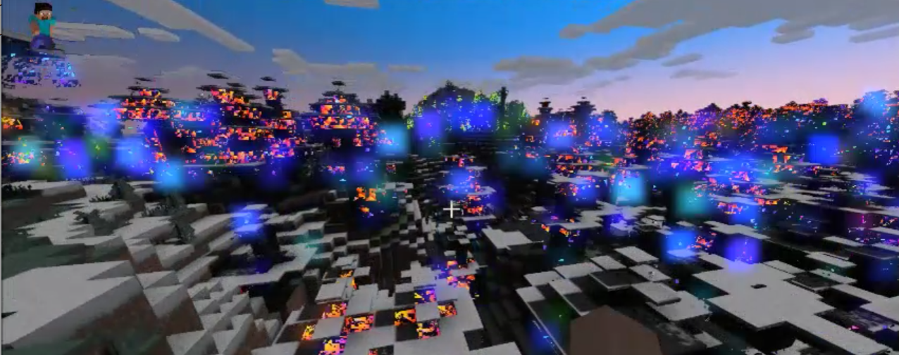
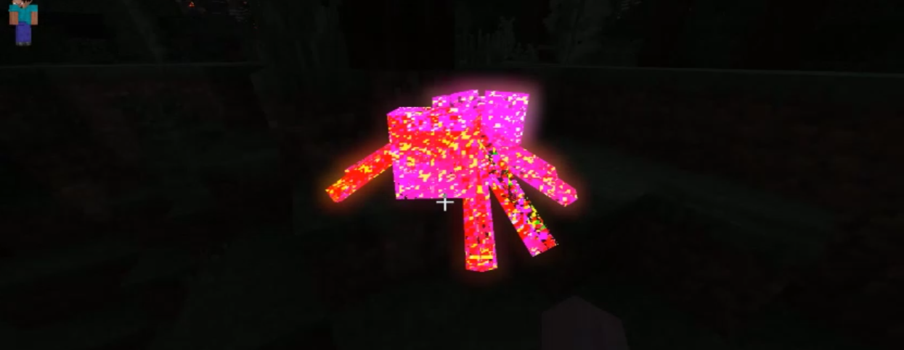

此次问答在 [Bedrock Add-Ons discord](https://discord.gg/uZF75ZxcJq) 上进行。六位Mojang/Microsoft员工加入我们，回答了关于延迟技术预览API的问题。问题来自社区。

:::warning
并非所有消息都被复制，有些内容经过编辑。如果你想查看全部内容，请加入上述Discord，并获取“events archive”角色。
:::

## 延迟渲染管线开发了多久

- **问**：延迟渲染管线开发了多久？在构建这个管线时遇到了哪些挑战？
- **答**：延迟渲染管线以各种形式自2020年开始开发。其中部分源自对RTX管线的优化，另一部分源自用于Minecraft Legends的管线。正式开发于2022年3月开始。

## 支持的平台

- **问**：是否有任何平台不被支持？
- **答**：目前尚未有官方宣布哪些平台会或不会被支持。如在其他讨论中提到的，我们旨在让延迟渲染在能够支持的设备上尽可能广泛可用，同时确保视觉效果和性能达到良好的游戏体验标准。

- **问**：我只在手机上玩Minecraft，光线追踪、着色器等看起来非常酷！但我从未能体验过😞 延迟照明会在Android设备上可用吗？
- **答**：是的！延迟预览目前在Android上可用，并可通过Beta计划获取。此外，Xbox、iOS和PC的预览版也已开放！

- **问**：延迟渲染在Chromebook上可用吗？
- **答**：我们暂时没有关于新平台何时可用的消息，但我们确实在测试并研究添加能够支持延迟渲染的其他平台。我们希望尽可能多的玩家能够体验新图形模式，并确保游戏体验的稳定性。

## 延迟渲染中的Molang

- **问**：请添加在global.json或任何其他文件中使用Molang查询的能力！这对于检测特定的月相和创建本地/独特的体验将非常有用！
- **答**：感谢建议，但目前我们没有关于Molang集成的消息。由于延迟渲染在性能等方面存在一些限制，我们必须考虑这些因素。

## 剩余功能

- **问**：延迟渲染还剩下多少功能？
- **答**：其他讨论串中有一些提示，但我在这里做个简要总结🙂
    目前正在开发的功能包括：色彩分级、水体照明及运动、次表面散射、反射，以及物品和粒子的纹理集支持。

## 优化

- **问**：我想知道何时开始对延迟渲染进行优化。aajabrams说会在所有延迟渲染功能实现后进行，但我不知道具体时间。
- **答**：AJ是对的，我们确实在努力实现所有功能后再进行优化。目前没有可分享的时间表，但这绝对在我们的路线图上！

## POM效果

- **问**：诸如视差映射（POM）等POM效果会被添加吗？
- **答**：目前我们没有关于POM技术的消息，但感谢你的建议！

## 延迟PBR

- **问**：你们能扩展延迟PBR的能力吗，例如次表面散射、多孔性、POM/细分等？
- **答**：这一问题已在多个地方回答，主要在这里：https://discord.com/channels/523663022053392405/1209533667224068188/1210658737103048805
- **答**：是的！我们将扩展当前模型，包括次表面散射的近似，以及为水体几何体启用独特的照明模型。水体将基于藻类含量等属性进行操作。

- **问**：“水体几何体的独特照明模型” 那么区块的POM/细分呢？
- **答**：目前我们没有关于POM/细分的计划。感谢你的建议！

## 超级超级图形包取消

- **问**：为什么超级超级图形包被取消了？
- **答**：这个[链接](https://www.minecraft.net/en-us/article/super-duper-graphics-pack-ceasing-development)可能仍然是关于SDGP发生了什么的最佳信息来源。

## 数据驱动渲染器文件夹

- **问**：渲染器文件夹会对我们在资源包中使用开放吗？这样可以允许许多独特的包和配置供创作者实验。
- **答**：不会开放渲染器文件夹本身，但随着时间的推移，我们会向资源包暴露更多的数据驱动功能。

## 最奇怪的错误

- **问**：在开发延迟渲染管线时，你们遇到过的最奇怪的渲染错误是什么？
- **答**：早期的间接镜面反射实验导致整个场景被照亮！
- **答**：我们还遇到NaN值被种子化并有时传播到整个世界。不要除以零，朋友们。😉
- **答**：那是谁~~Pokemon~~ Minecraft生物？
- **答**：没有截图，但另一个错误是我们有来自世界另一侧生物的幻影阴影！起初我们认为它们是具有隐形状态的生物，阴影只是需要隐藏，但相应的生物有时距离1000多个区块且没有隐形！最终是一个变换反转问题。追踪这个错误非常有趣。

## 太阳/月亮和点光源的光对比度和饱和度

- **问**：延迟渲染是否会增加所有光源的对比度和/或饱和度控制？例如，增加太阳/月亮颜色的对比度和/或饱和度，以获得更明亮和/或更具活力的颜色，或者增加颜色的饱和度以突出显示。
    
    我注意到太阳的颜色相当暗淡，即使更改色调映射也没有帮助。

- **答**：不是针对每个光源，而是像Veka提到的，我们会在整体场景上进行色调映射，并不仅限于对比度和饱和度。我们正在开发一个完整的HDR色彩分级套件，包括对比度、饱和度、增益、偏移和分割色调分级。此功能将在资源包中支持数据驱动。

## 焦点参数

- **问**：是否会为对象添加焦点模式？
- **答**：目前我们没有关于焦点或其他摄像机相关属性的消息。感谢你的建议！

## 可定制的云

- **问**：目前，云在延迟渲染中无法真正自定义，是否有计划添加体积云？
- **答**：目前没有关于云的计划，但感谢你的建议！这里还有很多可以探索的内容。

- **问**：延迟渲染会像SDGP那样有多个云层配置吗？这更像是美学方面的内容，可能适合某些包。
- **答**：感谢你的建议！目前没有关于云的最新消息。

## 延迟渲染是否有脚本化的计划

- **问**：当客户端API发布后，是否有计划为延迟渲染添加API，以便我们通过脚本进行操作？
- **答**：这个回答类似于我们关于Molang的回复：https://discord.com/channels/523663022053392405/1209532356403142656
    
    > 感谢建议，但目前我们没有关于Molang集成的消息。由于延迟渲染在性能等方面存在一些限制，我们必须考虑这些因素。

## 全局光照

- **问**：有没有计划实现某种形式的全局光照？例如，更准确的天空光、反射阳光或环境方块光。也许你们已经有特定的技术方案了？👀
- **答**：全局光照是一个非常广泛的主题，所以技术上答案是肯定的！更具体地说，我们正在添加基于IBL和屏幕空间的反射。我们内部讨论了许多其他形式的GI，但目前没有其他应用的消息可以分享。

## 图形团队是否完全专注于延迟渲染管线？

- **问**：这是间接询问我们是否终于可以获得某种非官方的确认，即我们明确要求在 <#1208794326361055324> 中不讨论的某个其他图形系统完全没有被团队开发。
    
    实际上也想知道在图形团队中有多少百分比专注于延迟渲染管线，考虑到同时RenderDragon基础引擎中有不少图形错误、怪癖和优化需要处理。

- **答**：不是的。图形团队负责DTP等项目，但也负责维护RenderDragon引擎以及核心游戏的渲染。我们确实有一个专门的工程师团队，完全专注于DTP。

## 准确的天空模型

- **问**：目前，延迟渲染使用的是香草风格的天空模型，将月亮和太阳的半球拼接在一起，这对于香草模式来说很好，但在延迟渲染中看起来不太美观，并在延迟渲染中拼接天空时造成了问题。
    你们有没有处理它的计划？
- **答**：感谢反馈！我们确实有一些天空的视觉错误和增强需要修复🙂。

## 独特的技术和功能

- **问**：有没有开发内部的图形技术，而不是依赖现有的解决方案？例如，延迟大气层看起来相当独特，是从头创建的还是已有模型的实现？
- **答**：我们采用的许多技术源自各种技术会议（如Siggraph、GDC等）上发表的白皮书和演讲，因此在技术上并不完全新颖（这在游戏行业的图形开发中通常是如此）。
    
    话虽如此，我们对许多技术进行了Minecraft特定的调整，以确保与香草光照的一致性（例如，光线衰减相似，对“方块感”的视觉强调，香草光照下黑暗的场景在延迟光照下也保持黑暗等）。
    
    还有一些新方法的机会（如地狱/末地维度的光照），但目前我们没有额外的信息可以分享。

## 延迟渲染上采样

- **问**：你们能实现其他可选的上采样技术（如AMD FSR或Intel XeSS）和像许多游戏那样实现的锐化滑块吗？
- **答**：感谢建议，这对性能可能有价值。我们会考虑这一点！

## 更好的水体

- **问**：延迟渲染目前仍使用预览中初始发布的默认水体，并且只有少数更改，那么是否会有额外的功能，如屏幕空间反射、堤岸光、波浪和水下效果，这些都比以前更好？
- **答**：是的！我们确实在更新水体照明模型和延迟渲染中的其他效果。这些都是很棒的建议，我们很乐意听到更多关于你希望在延迟预览中拥有哪些水体效果和控制的想法！
    **答**：这些都是很好的水体改进想法！很高兴告诉你，许多这些功能已经在我们的路线图上：堤岸光、噪声、体积光线、反射、折射。

- **问**：我知道我问得很多，但你们可能会考虑添加斯涅尔窗口（snell's window）？
- **答**：是的。😉

## 物品是否会获得材质支持？

- **问**：物品是目前延迟渲染中最后一个未获得官方PBR支持的**主要**内容。虽然通过一些变通方法（例如：附件，以及像MIAM1这样的工具）**可能**为物品赋予PBR功能，但我很好奇是否会保持这样，还是有计划最终为物品提供这些PBR功能。
- **答**：是的！这是我们正在努力的事情。别忘了粒子效果！它们也将获得PBR支持，可能比物品更快。

## 为每个包启用/禁用延迟图形选项？

- **问**：我想问是否有任何计划为每个包添加启用和禁用延迟图形的切换。
    由于着色器包对某些设备来说过于繁重，如果每个包有这样的选项会很好。
- **答**：延迟图形资源包将像其他资源包一样堆叠，位于堆栈上方的包将覆盖下方包的属性。你对包覆盖行为的描述是正确的！

## 有没有计划修复使用高度而不是均匀性的体积雾，使其致盲你？

- **问**：添加更多背景信息。当你设置雾时，如果使用高度参数而不是均匀，进入生物群系后，雾的浓度会达到最大，然后随着你深入逐渐淡化。这是故意为之还是一个错误？
- **答**：生物群系过渡的插值目前还不是很完善（你描述的情况可能是一个错误）。我们将在接近最终发布时改进过渡效果！

## 实体：聚光灯/点光源

- **问**：是否计划让实体参与？例如，根据条件为玩家闪光灯照明，发光的生物等。
    （我只是想象在Minecraft中通过雾气的致命公司风格的手电筒，感到兴奋lol）
- **答**：不，目前我们没有计划在实体上添加聚光灯或可附加的灯光。感谢你的建议！

## 延迟渲染发布时的可定制性

- **问**：鉴于游戏文件中有**许多**延迟渲染的配置，我们将来是否能够通过资源包完全编辑这些配置？
    另外，我在想未来是否会有更多的自定义选项（例如：更多的照明配置、渲染器配置等）。
- **答**：虽然我们不会公开所有内容，但我们仍在考虑扩展一些数据驱动的功能，以赋予创作者更多控制。你希望看到哪些具体的配置被公开，以便你拥有更多的创作控制？

## 重新加载资源包

- **问**：Bedrock版本是否会有F3+T功能？我觉得在不离开世界的情况下重新加载资源包的能力应该添加到Bedrock版本中，它从一开始就在Java版本中，但从未进入Bedrock版本。
- **答**：我们确实知道重新加载资源包很麻烦。这不是一个很好的开发流程。我们希望在这方面做一些改进，但目前没有具体的公告。这类事情相当复杂。

- **问**：在编辑器模式下的 `/reload all` 命令怎么样？（我甚至不确定这是否相关。）
- **答**：是的，我们有一些技术可以重新加载部分内容，但不是全部。是的，你的想法是对的，如果我们启用这些功能，编辑器会是我们实施的最安全场所。

## 基于标识符的配置

- **问**：更多的是一个功能请求，前缀是“是否有计划...”，但基于标识符的配置会非常有用。有时我希望根据游戏玩法改变照明配置。需要某个命令或脚本来切换配置。也许只是脚本。
    
    特别是定向光，我希望根据世界事件改变，因为世界事件可能会改变光照方式。例如，“世界毁灭者”boss应该改变主世界的光照方式。以下是这些基于标识符的文件的示例：
    
    ```json
    {
        "format_version": "1.20.80",
    
        "minecraft:directional_lights": {
            "description": { "identifier": "bao:world_destroyer_event" },
    
            "sun": {},
            "moon": {}
        }
    }
    ```
    
    然后类似于：
    
    ```swift
    /renderer lighting set bao:world_destroyer_event
    ```
    
    本质上，这将使用与雾相同的标识符概念，即不仅仅将它们映射到生物群系，而是作为独立的配置进行应用。

- **答**：是的！这是我们正在工作的内容，将在我们的照明和大气JSON中启用。标识符将非常类似于雾的标识方法。创作者应该预期，当此更改发布时，他们需要更新当前的PBR包以使用标识符，因为这是一个破坏性的模式更改。不过，这将是直接的，我们会提供指导。

## 基于维度的配置

- **问**：类似于 <https://discord.com/channels/523663022053392405/1210250265895243807>，我觉得如果块在每个维度都有3个PBR纹理和配置会很酷，一个用于每个维度。这将有助于增强每个维度的独特性。
    
    例如，根据维度发出不同颜色的点光源
    
    这类似于我的Molang帖子，但目前没有检测维度的Molang查询。

- **答**：我们目前正在开发每个生物群系提供独特配置的功能，我相信这将允许你为其他维度（如地狱或末地维度）配置独特的属性。
    
    目前，我们仍在探索其他维度中的照明工作，主要关注主世界！

- **答**：随着我们也在研究自定义生物群系和自定义维度（没有时间表或承诺，仅仅是列表上的事项），我们也会考虑创作者如何利用延迟渲染图形。

## 香草PBR

- **问**：Mojang是否计划为游戏中**庞大的**纹理集合发布PBR？作为一个“技术艺术家”开始使用PBR，如果只是使用别人的包来获取PBR，这不仅糟糕，因为数量庞大，还无法自行创建。
    
    （这不是对香草功能的请求。我认为团队有一些内部包用于测试延迟渲染。所以我更想问的是作为开发者资源。）

- **答**：不幸的是，我们近期没有计划分享用于测试的PBR资源包，对此我们深表歉意，因为现在测试确实不太容易。
    然而，你可以为全局照明文件中没有特定纹理集的所有块和实体设置默认值，这在某些情况下可能有帮助！

## 实时预览大气

- **问**：目前，作为创作者，在编写大气配置时无法实时预览更改。工作流程是：编辑json -> 重新加载世界 -> 观察更改。这个过程相当烦人，因为你无法立即看到更改，这使得了解json更改如何转换为大气视觉效果更加困难，也使迭代过程比必要的时间更长。
    
    如果我们能够实时预览不同的json配置和值如何影响大气效果，那会更好。是否有任何计划（你可以分享的），解决这个问题？例如，某种类型的游戏内大气编辑器，或< #1084090299120373760 >的插件？或者类似blockbench或snowstorm的官方（或非官方）独立工具/网络应用。如果像我这样的人想制作这样的工具，Bedrock的着色器代码使用有何条件或要求，特定的许可证？
    
- **答**：是的，我们听到了，并感受到了你的痛苦。🙏 我们确实打算将延迟技术预览与Bedrock编辑器更好地集成，以便创作者更轻松地自定义他们的包并实时查看更改。

## 预告片

- **问**：延迟渲染什么时候会有预告片？
- **答**：好问题！目前还太早考虑市场宣传材料。我们现在的重点是构建这些功能并获取你们的反馈！但我很想看到社区制作的预告片，偷偷提示！😄
- **答**：我经常在YouTube上搜索最新更新和社区包的视频！还有所有帮助其他人在自己设备上获取延迟预览的教程🙂

## 增加关键帧周期

- **问**：有计划在**多天**内自定义关键帧吗？（希望自上次测试以来没有变化。）我注意到之前关键帧限定在单一循环的白天。我希望可以根据月相变化定向光，但当我无法做到时感到失望。
    
    我认为周期可以根据关键帧对象中最大的解析时间键自动调整。例如，`7.5`将导致周期为8天，所有该关键帧对象中的时间都遵循该周期。
    
    本质上，这与动画自动根据最大的时间轴值设置总持续时间相似。不同之处在于，这些将被舍入到完整的一天。

- **答**：不幸的是，我们近期没有计划将关键帧扩展到单一白天之外的周期。但关于月相的想法非常棒，这是我之前没有想到的！