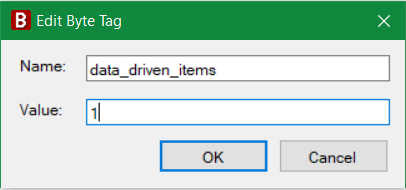
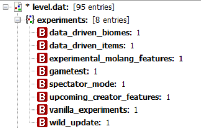

[结构]: /assets/images/nbt/structure.png  
[整数]: /assets/images/nbt/int.png  
[列表]: /assets/images/nbt/list.png  
[复合]: /assets/images/nbt/compound.png  
[字符串]: /assets/images/nbt/string.png  
[字节]: /assets/images/nbt/byte.png  

教育版是基岩版的一种变体，具有一些不同的功能和限制。出于安全原因，它不允许你在游戏中启用实验功能。

## 编辑NBT

::: 警告
在编辑NBT文件之前，请务必备份你的数据！

实验功能可能与每个设备不兼容，并可能导致你的世界出现意外行为。
:::

1. 从你的.mcworld、.mctemplate或com.mojang世界文件夹中提取level.dat。
2. 使用NBT编辑器（例如NBT Studio）打开该文件。
3. 选择第一个节点，即 ![][结构] level.dat。
4. 创建一个名为 ![][复合] experiments 的新复合标签。
5. 选择新节点并创建一个名为你需要的功能的 ![][字节] 字节，值为1，在1.18.32中可用的功能有：
    - data_driven_biomes
    - data_driven_items
    - experimental_molang_features
    - gametest
    - spectator_mode
    - upcoming_creator_features
    - vanilla_experiments
    - wild_update

最后，保存文件并将其放回世界包或目录中。

## 提示
教育版通常比经典基岩版落后一到两个版本，因此你总是可以提前知道哪些实验功能将被添加到稳定的游戏中，哪些将被修改或删除。如果你希望在课堂上使用该世界，请尽量只添加那些会随着时间持续存在的功能。