在进行此示例之前，首先需要全面了解NBT的美妙之处。请参见 _[深入了解NBT](../nbt/nbt-in-depth.md)_。
现在我们将逐步展示如何读取NBT，我们将读取的格式大致如下所示：

```json
"":{
    "myText":"My NBT text",
    "my Int32 Number":456,
}
```

当我们不知道该读取什么时，就读取下一个字节。

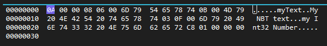

我们读取了什么？我们读取了数字10，这意味着我们将读取复合数据。我们还知道现在处于此文件的根元素属性，因此我们需要读取根元素属性的名称。名称是字符串，因此我们首先必须读取文本的字节长度，这由Int16 _(短整型)_ 表示。

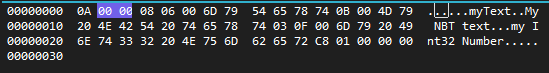

根元素属性的名称大小为零，因此我们不会再读取任何字节。我们不知道该读取什么，所以让我们再读取一个字节。

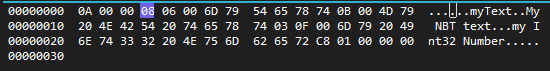

我们已经知道根复合中的下一个属性是字符串类型，但在读取属性值之前，我们首先读取其名称，该名称以字符串形式表示。因此，我们再读取2个字节以获取属性名称的字符串长度。

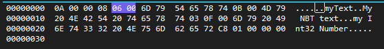

我们看到属性名称的长度为6字节。因此，让我们读取接下来的6个字节。

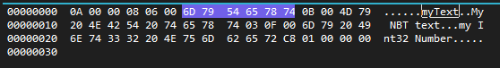

我们已经读取了属性的名称，可以使用UTF-8编码将其转换为文本形式，即：`myText`，然后记住我们的属性类型是字符串，因此我们重复这个过程。
我将再次读取下一个Int16（2个字节），以找出字符串值的长度。

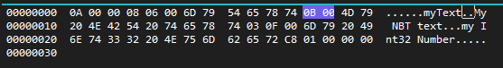

我们属性的字符串长度为0x0B，即11，因此再读取11个字节。

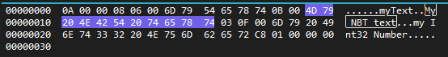

当我们通过UTF-8编码处理读取的字节时，它再次返回值：`My NBT text`，现在该怎么办？你不知道？那么读取下一个字节以找出下一步该做什么。

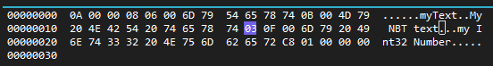

我们读取了类型3，类型3是Int16，包含4个字节。但在读取我们的数字之前，我们必须再次找到此属性的名称。那么？
读取接下来的两个字节以获取此属性名称的长度。

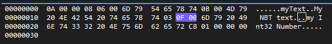

我们知道名称的长度为0x0f（15），让我们读取接下来的15个字节并通过UTF-8编码处理。

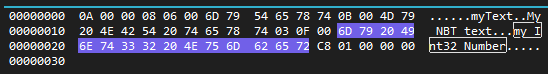

现在我们得到了这个属性的名称：`my Int32 Number`。接下来，让我们读取这个Int32 => 4个字节。

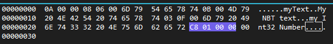

我们读取了一个Int32，其值为`0x01c8`（456）。
你又不知道下一步该怎么做？那么就读取下一个属性的类型，怎么样？1个字节。

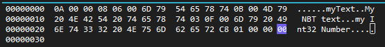

我们读取了0x00（一个空字节），这标志着根复合的结束。然后复合的读取结束，由于这是**_根_**复合，我们可以完全结束读取，整个NBT文件也已读取完毕。

### NBT示例文件

这是我们在此示例中使用的文件。

<Button link="../assets/nbt/nbt_example_file.nbt" download>
    下载NBT文件
</Button>

/// tip
重要事项 - 文件可能包含NBT基岩头，因此请注意可能出现这种情况。请参见 [深入了解NBT](../nbt/nbt-in-depth.md)>[NBT基岩头](../nbt/nbt-in-depth.md#bedrock-nbt-file-header)。 - 结束的空字节并不终止NBT的读取，而只是标记当前复合的结束。 - 所有读取的数字都需要使用小端格式读取，详见 [深入了解NBT](../nbt/nbt-in-depth.md)>[小端格式](../nbt/nbt-in-depth.md#little-endian)。 - 文件中的第一个根NBT元素只能是复合或列表。NBT文件中的根元素/属性也有自己的名称，尽管它通常是空的，但仍需要读取以避免复杂情况。
///