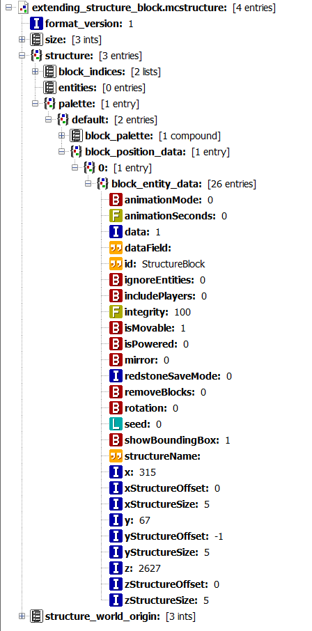
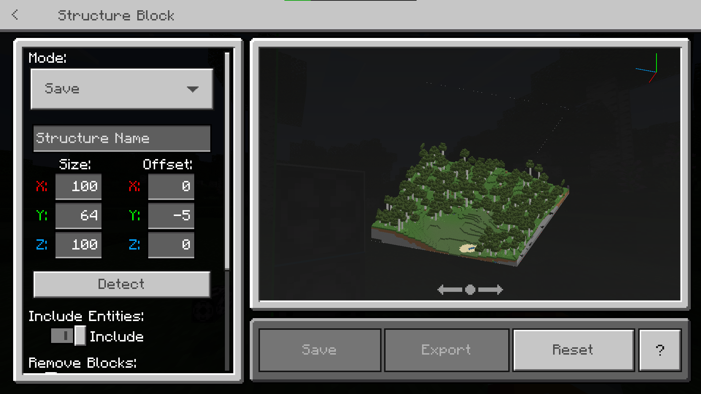

[structure]: /assets/images/nbt/structure.png
[int]: /assets/images/nbt/int.png
[list]: /assets/images/nbt/list.png
[compound]: /assets/images/nbt/compound.png
[string]: /assets/images/nbt/string.png

:::warning 已弃用
此方法在1.20.50更新后不再有效。
:::

默认情况下，Minecraft不允许您保存超过64x255x64大小的结构。在本指南中，您将学习如何扩展结构块的结构框大小。

## 编辑NBT

1. 将结构块放入结构中并导出。
2. 使用NBT编辑器（在本例中为NBT Studio）打开您的结构，并找到您的结构块。

如果您在结构中只有结构块，您将在此处找到其数据：

![][structure] extending_structure_block.mcstructure
> ![][compound] structure
> > ![][compound] palette
> > > ![][compound] default
> > > > ![][compound] block_position_data
> > > > > ![][compound] 0

3. 将`xStructureSize`、`yStructureSize`和`zStructureSize`的值设置为您想要的大小。
4. 保存结构并在游戏中加载。

## 提示

您可以通过按住Ctrl并点击鼠标滚轮将此结构块添加到您的物品栏中。建议在加载大型结构时使用结构加载动画（逐块放置），这将减少延迟。