:::danger 停止！

此脚本 API 不再受支持。请参阅新的 [脚本 API](../scripting/starting-scripts.md)。

:::

本教程将教你如何作为 Minecraft 基岩版（Windows 10）的脚本模组开发者开始和运行！

:::warning 自 1.17.40 版本起，脚本仅支持 Windows，不支持移动平台（Android/iOS）或主机设备。
:::

## 前提条件

1. Minecraft 基岩版（Windows 10）
2. 代码编辑器，如 [Visual Studio Code](https://code.visualstudio.com/)（虽然技术上记事本也足够，但接下来将假设使用 VSCode）
3. 基础的 Javascript 知识（本教程不会教授你如何用 Javascript 编码，假设你具备基础知识）

## 设置你的环境

### 找到 Minecraft 安装文件夹

你需要访问 Minecraft 的安装文件夹——这是我们将进行大部分工作的地方。你可以在此处找到它（将 `<USERNAME>` 替换为你的 Windows 10 用户名）：

`C:\Users\<USERNAME>\AppData\Local\Packages\Microsoft.MinecraftUWP_8wekyb3d8bbwe\LocalState\games\com.mojang`

你可能需要为此目录创建一个快捷方式，以便随着时间的推移开发更快。

我们最关注的子文件夹是：

- `development_behavior_packs`
- `development_resource_packs`
- `development_skin_packs`

这些文件夹是在开发过程中我们的附加包将存在的地方。
行为附加包包含服务器端代码，资源附加包包含客户端代码，皮肤附加包包含你游戏角色的皮肤。
你可能注意到还有一些其他文件夹名称非常相似：

- `behavior_packs`
- `resource_packs`
- `skin_packs`

这些文件夹是完整的 Minecraft 基岩版附加包放置的位置。
在本教程中，我们将只专注于创建一个行为附加包（而不是资源或皮肤附加包）。

### 设置 Visual Studio Code (VSCode)

让我们设置你的代码编辑器：

1. 在 `development_behavior_packs` 内创建一个名为 `HelloWorld` 的文件夹
2. 打开 Visual Studio Code (VSCode)
3. 转到 `文件 > 将文件夹添加到工作区...` 并选择新创建的 `HelloWorld` 文件夹

很好，一切都设置好了，现在我们可以开始工作了。😎

## 开始

从现在起，我们的所有工作将来自于上一部分创建的 `HelloWorld` 文件夹。
首先，创建一些新文件夹和文件。

在 `HelloWorld` 内，创建一个名为 `manifest.json` 的文件。
接下来，创建一个名为 `scripts` 的文件夹。
在该文件夹内，分别创建两个名为 `server` 和 `client` 的子文件夹。
在 `server` 文件夹内创建一个名为 `serverScript.js` 的文件。
同样，在 `client` 文件夹内创建一个名为 `clientScript.js` 的文件。

最后但同样重要的是，下载此图像并将其放置在 `HelloWorld` 文件夹中：


你的文件夹结构现在应如下所示：

```
/development_behavior_packs
    /HelloWorld
        > manifest.json
        > pack_icon.png
        /scripts
            /server
                > serverScript.js
            /client
                > clientScript.js
```

以下是每个文件的作用：

- `manifest.json`
    - manifest JSON 文件包含描述你的行为附加包及其资源连接方式的元数据。
- `pack_icon.png`
    - 此图像将在“创建新世界”界面的附加包列表旁显示。
- `serverScript.js`
    - 此 Javascript 文件是你编写所有在服务器端运行的代码的地方。
- `clientScript.js`
    - 此 Javascript 文件是你编写所有在客户端运行的代码的地方。

### “服务器端”和“客户端”有什么区别？

当我们说“客户端”或“服务器端”时，通常伴随着对游戏相关部分的直观理解。
毕竟，客户端是用户互动的部分，服务器端是用户连接进行多人游戏的地方。
简单，对吧？

事实证明，即使是这两个术语也可能存在一些歧义。
在这里，我们将“客户端”和“服务器端”四种可能的含义进行区分：

- 物理客户端
    - 物理客户端是每次你从 [Windows 10 商店启动 Minecraft](https://www.minecraft.net/en-us/store/minecraft-windows10) 时运行的整个程序。游戏图形和可交互生命周期期间运行的所有线程、进程和服务都是物理客户端的一部分。
- 物理服务器
    - 通常称为专用服务器，物理服务器是每次你启动任何不显示可玩 GUI 的 [bedrock_server.exe](https://www.minecraft.net/en-us/download/server/bedrock) 时运行的整个程序。
- 逻辑服务器
    - 逻辑服务器运行游戏逻辑：怪物生成、天气、更新物品栏、健康、AI 和所有其他游戏机制。逻辑服务器存在于物理服务器内，也可以在带有逻辑客户端的物理客户端内运行，作为单人世界。逻辑服务器总是在名为 Server Thread 的线程中运行。
- 逻辑客户端
    - 逻辑客户端是接受玩家输入并将其传递给逻辑服务器的部分。此外，它还从逻辑服务器接收信息并将其图形化地提供给玩家。逻辑客户端运行在 Client Thread 中，尽管通常会生成几个其他线程来处理音频和区块渲染批处理等内容。

我们的 `clientScript.js` 将在逻辑客户端内运行，并处理与玩家通过物理客户端看到的视觉世界交互的大部分内容。
我们的 `serverScript.js` 将在逻辑服务器内运行，并为你的较大附加包执行大部分繁重的工作。
大部分代码将编写在这里，因为这是最安全的（有时也是唯一的）方式来完成某些事情。

例如，我们不希望让任何人都在他们自己的客户端脚本中编写代码，让他们确切地知道世界中所有玩家的位置（例如，在 PvP 比赛中）或允许他们随意飞行/传送。
只有服务器脚本可以执行这些操作，这很有意义，因为服务器脚本是附加包中最受信任的资源。它知道一切并完成一切。

## manifest.json

回顾一下，你的 `manifest.json` 文件定义了你的行为附加包；它的名称、定义、作者、如何与其他行为/资源/皮肤附加包关联等。

将以下内容复制/粘贴到你的 `manifest.json` 中：

```json title=""
{
    "format_version": 2,
    "metadata": {
        "authors": ["<your-name>"],
        "url": "<your-github-repo-url>",
        "license": "TBD"
    },
    "header": {
        "name": "Hello World",
        "description": "Hello World scripting tutorial add-on!",
        "uuid": "<uuid-1>",
        "version": [0, 0, 1],
        "min_engine_version": [1, 14, 0]
    },
    "modules": [
        {
            "description": "Hello World behavior pack module",
            "type": "data",
            "uuid": "<uuid-2>",
            "version": [0, 0, 1]
        },
        {
            "description": "Hello World client scripts module",
            "type": "client_data",
            "uuid": "<uuid-3>",
            "version": [0, 0, 1]
        }
    ],
    "dependencies": []
}
```

替换：

- `<your-name>`
    - 用你的名字替换
- `<your-github-repo-url>`
    - 用你推送代码的 GitHub/GitLab 等仓库的 URL 替换

那么 `<uuid-1>`、`<uuid-2>` 和 `<uuid-3>` 是什么呢？
UUID 是什么？
UUID 是“通用唯一标识符”（Universally Unique Identifier）的缩写，意味着一个由字母和数字组成并用几个连字符分隔的高级字符串。
UUID 本身不具有任何独特的值——对于我们的用途，它们只是随机数字。
你可以通过像这样的网站生成 UUID，https://www.uuidgenerator.net/。
你可以选择 UUID 的版本 1 或版本 4；由你决定。
生成 3 个 UUID 并用它们替换 `<uuid-1>`、`<uuid-2>` 和 `<uuid-3>`。

### “metadata” 部分

标记为 `"metadata"` 的部分提供了关于你和你的代码仓库的信息。
你可以通过 `"authors"` 数组提供你的名字，`"url"` 提供你推送附加包代码的 GitHub/GitLab 等仓库的 URL，以及 `"license"` 来保护你的代码免受版权侵害。😈

### “header” 部分

标记为 `"header"` 的部分提供了关于你的附加包的信息，如附加包的 `"name"`、`"description"`、`"version"`（例如 `[0,0,1]` 表示 `版本 0.0.1`）以及 `"min_engine_version"`（这是你的附加包所针对的最低 Minecraft 版本，例如 `Minecraft v1.14.9`）。

### “modules” 部分

标记为 `"modules"` 的部分提供了将运行在服务器端（`"data"`）和客户端（`"client_data"`）的代码信息。
这里没有什么特别的——记得为它们生成不同的 UUID，当你增加附加包的版本时，也要在这里增加版本号。

### “dependencies” 部分

标记为 `"dependencies"` 的部分提供了此行为附加包所依赖的其他行为/资源/皮肤附加包的信息。
当用户在创建新世界时选择你的附加包，游戏将自动将此部分定义的所有其他附加包加载到你的新世界中（前提是这些附加包也已与之一起安装）。

例如，假设你创建了一个包含新方块、物品和合成配方的资源附加包，并希望确保每次用户加载你的附加包时都始终加载它。
如下所示：

```json title=""
"dependencies": [
  {
    "uuid": "<your-resource-packs-uuid>",
    "version": [0, 0, 1]
  }
]
```

你需要指定你的资源附加包的 UUID 和版本。
这样 Minecraft 就知道确切加载哪个附加包和哪个版本。
本教程中你不需要为此担心。

## 测试你的行为附加包

现在你有了有效的 `manifest.json` 和 `pack_icon.png`，你就拥有了 Minecraft 能识别和加载的最基本的行为附加包内容！
让我们打开 Minecraft 基岩版，看看会发生什么。

转到“创建新世界”，然后点击左下方“附加包”子菜单中的“行为附加包”按钮。

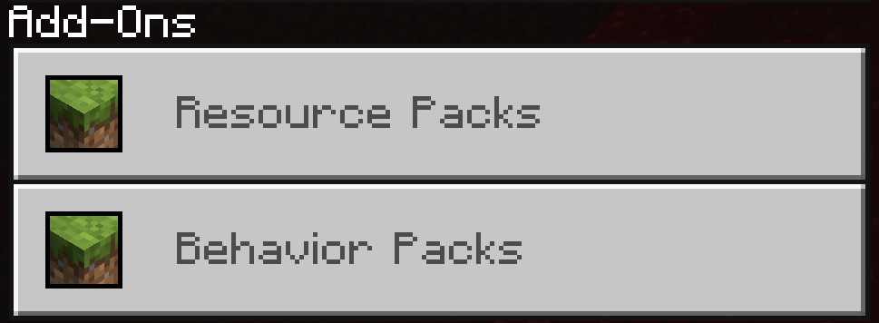

你的 Hello World 附加包应会出现在行为附加包列表中！

点击你的附加包应会出现一个标题为“激活”的按钮。点击它。

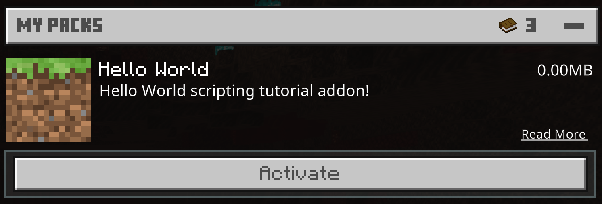

点击“激活”后，应该会出现一个标题为“关闭成就？”的弹出窗口。
由于某些原因，在加载附加包时必须关闭成就获取，因为附加包可能会使获取成就变得更容易。

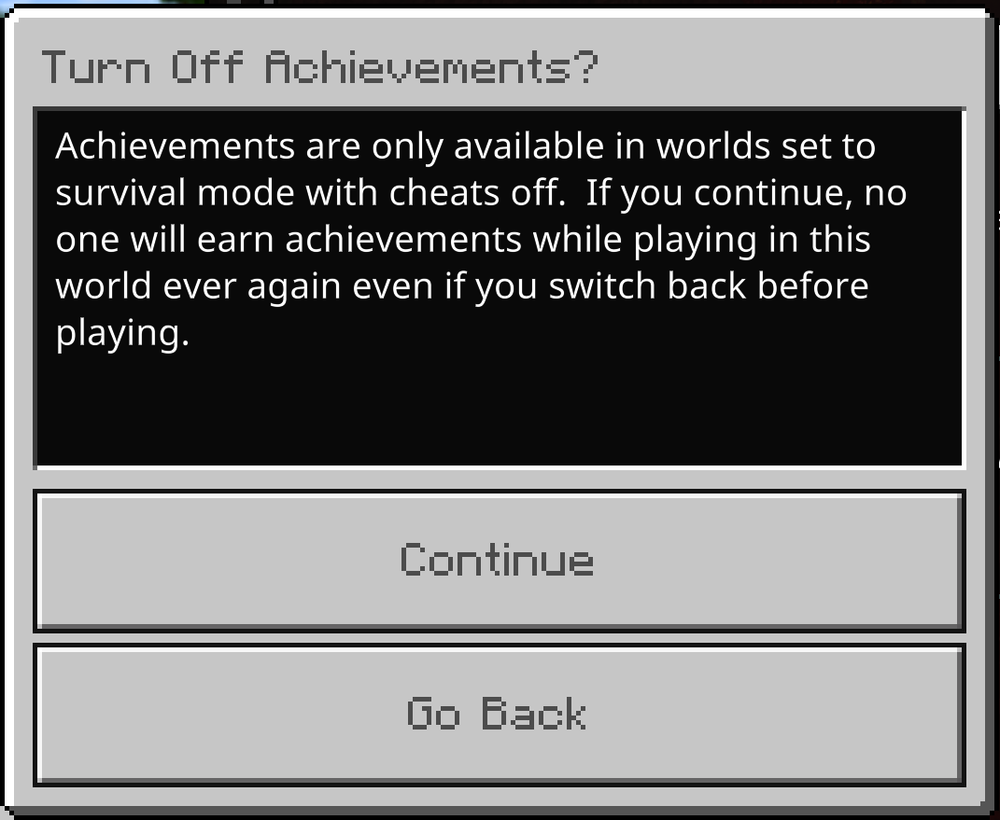

点击“继续”后，你的行为附加包应已移动到“已激活”部分！

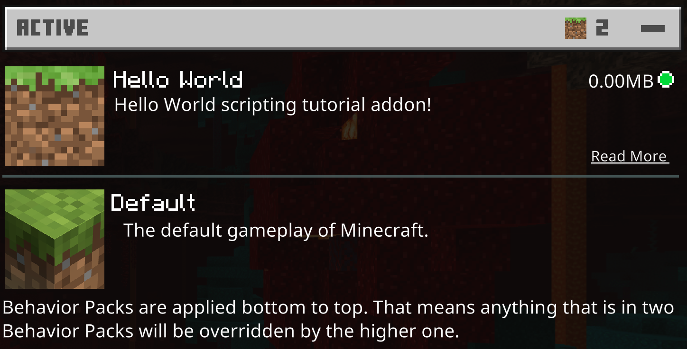

接下来最重要的部分是在“实验”下启用“附加模组功能”。
如果不启用此选项，你的脚本将根本无法运行！
向下滚动直到看到此切换按钮并将其打开。

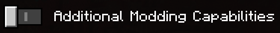

启用后，你将看到一个标题为“激活实验性游戏玩法？”的弹出窗口。
选择“继续”。

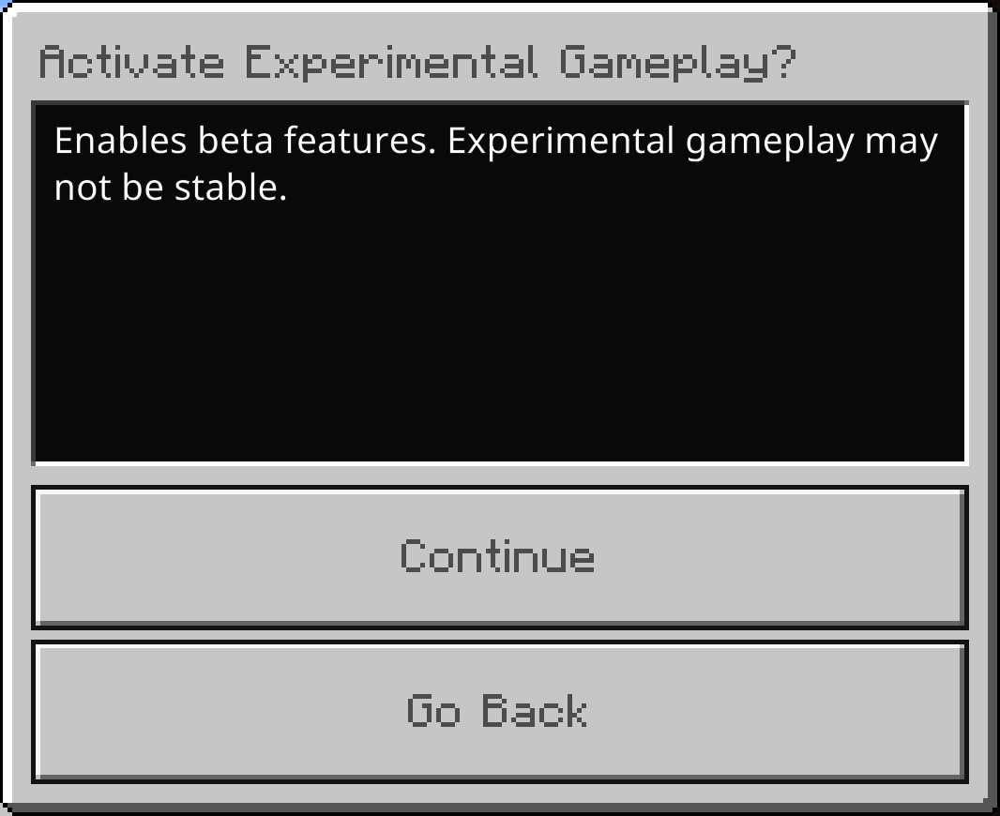

在这里，你可以切换任何其他让开发更容易的选项。
以下是我喜欢开启的一些选项。

世界选项：

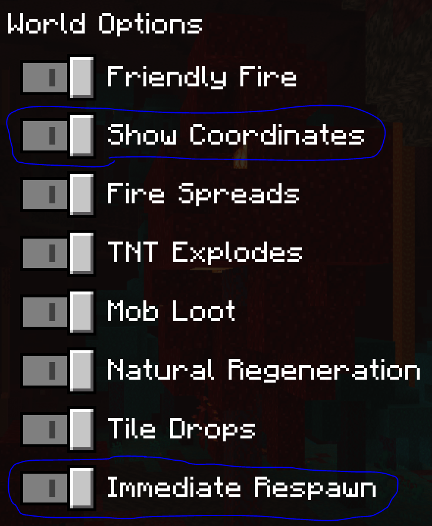

世界作弊：

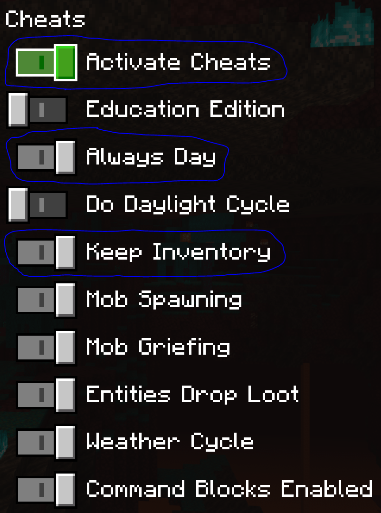

就这样吧！

现在你已选择在新世界中加载你的附加包，请点击“创建”并启动它！

当你的世界加载时，首先应该看到另一个标题为“启用脚本？”的弹出窗口。
这样每个人都明确知道在他们加入你的世界时将运行一些非官方代码。
这有助于让其他玩家为因附加包或你作为模组作者引入的随机 bug 做好准备 :)

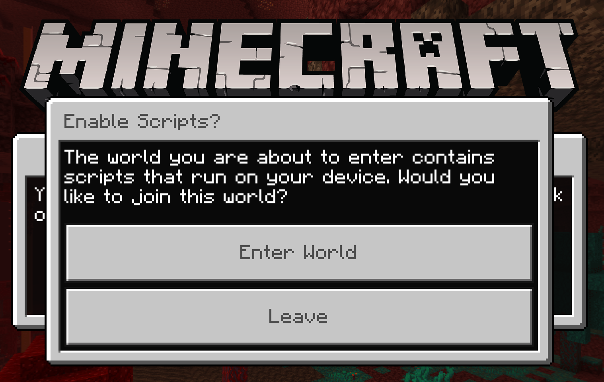

选择“进入世界”后，你将最终加入你的新 Minecraft 基岩版世界，并安装了最新的行为附加包，... 没有发生任何事情，哈哈。

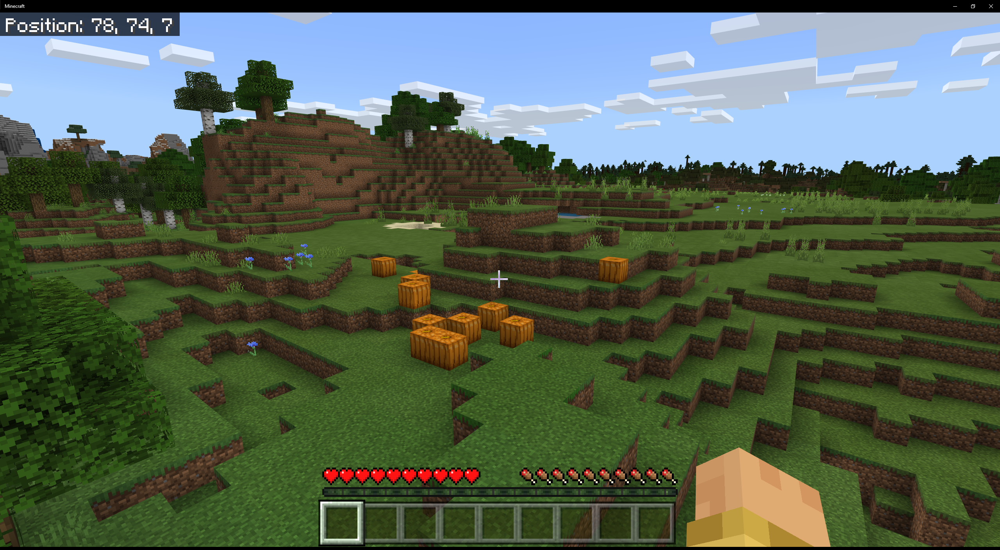

那是因为我们还没有编写代码！现在让我们来做吧——进入有趣的部分！

## serverScript.js

将以下内容复制并粘贴到你的 `serverScript.js` 文件中。

```js
// 这将脚本注册到 Minecraft 基岩版引擎的服务器端
const systemServer = server.registerSystem(0, 0);

// 当所有脚本完全加载后，服务器运行此方法
systemServer.initialize = function () {
    // 打开信息、警告和错误的日志记录
    const scriptLoggerConfig = this.createEventData("minecraft:script_logger_config");
    scriptLoggerConfig.data.log_errors = true;
    scriptLoggerConfig.data.log_information = true;
    scriptLoggerConfig.data.log_warnings = true;
    this.broadcastEvent("minecraft:script_logger_config", scriptLoggerConfig);

    // 注册事件数据，注册组件，注册查询，监听事件，. . .

    this.counter = 0;
};

// 服务器每秒运行 20 次此更新函数
systemServer.update = function () {
    // 每秒在世界聊天中打印一次 hello world
    this.counter++;
    if (this.counter === 20) {
        this.log("服务器！");
        this.counter = 0;
    }

    // 更新其他内容 . . .
};

// 当世界关闭时，服务器仅运行此方法
systemServer.shutdown = function () {
    // 清理内容 . . .
};

// 这是一个简化将数据记录到控制台的辅助函数。
systemServer.log = function (...items) {
    // 将每个参数转换为可读字符串并收集到数组中。
    const toString = (item) => {
        switch (Object.prototype.toString.call(item)) {
            case "[object Undefined]":
                return "undefined";
            case "[object Null]":
                return "null";
            case "[object String]":
                return `"${item}"`;
            case "[object Array]":
                const array = item.map(toString);
                return `[${array.join(", ")}]`;
            case "[object Object]":
                const object = Object.keys(item).map((key) => `${key}: ${toString(item[key])}`);
                return `{${object.join(", ")}}`;
            case "[object Function]":
                return item.toString();
            default:
                return item;
        }
    };

    // 将字符串数组项连接成一个字符串并打印到世界聊天中。
    const chatEvent = this.createEventData("minecraft:display_chat_event");
    chatEvent.data.message = items.map(toString).join(" ");
    this.broadcastEvent("minecraft:display_chat_event", chatEvent);
};
```

我在此服务器脚本的每个部分都做了详细注释，但我将深入探讨不同的区域。

### .registerSystem()

脚本顶部的第一行 `const systemServer = server.registerSystem(0, 0);` 是最关键的。
这将脚本注册到游戏的客户端或服务器线程。
一般而言，你会选择将脚本文件放在客户端或服务器文件夹中。
在这种情况下，它被注册到服务器线程。
要做到这一点，调用客户端或服务器上的 `registerSystem` 并提供你需要的 API 版本。

### .initialize()

`systemServer.initialize = function() {` 函数是系统注册后立即调用的第一个方法。
它将在世界开始时脚本加载时运行。
你可以用它来设置脚本的环境：注册自定义组件和事件，注册事件监听器等。
这将在世界准备好并添加玩家之前运行。
此函数应被用来初始化变量和设置事件监听器。
你不应在此时尝试生成或与任何实体互动！
最好避免与 UI 元素交互或向聊天窗口发送消息，因为此时玩家尚未准备好。

### .update()

`systemServer.update = function() {` 函数每个游戏刻（tick）调用一次。
服务器和客户端每秒刻（tick） 20 次。
这是获取、检查和响应组件变化的绝佳地点。

### .shutdown()

`systemServer.shutdown = function() {` 函数在 Minecraft 脚本引擎关闭时调用。
对于客户端，这发生在他们离开世界时；对于服务器，这是在最后一个玩家离开星球后。

### .log()

`systemServer.log = function(...items) {` 函数只是我设置的一个自定义函数，用于简化将数据记录到世界聊天中。
你可以创建任意数量的自定义函数并将它们绑定到 `systemServer` 对象。
只要确保不要覆盖其上预安装的任何方法。

### 测试服务器 Javascript 代码

为了保持本教程极其简单，这个服务器脚本提供的唯一实际功能是每秒在世界聊天中打印一次“服务器！”。
首先，我们使用 `.initialize()` 方法设置我们的 `counter` 变量。
然后，在 `.update()` 函数中，如果其值为 `20`，我们打印 `服务器！`，并递增 `counter`。
我们选择 `20` 是因为 `.update()` 函数每秒刻（tick） 20 次。
如果我们每个刻（tick）都打印一次消息，聊天将变成一片模糊！
我们不使用 `.shutdown()` 方法，因为我们使用的内容不需要清理。

现在我们了解了这个脚本的所有内容，让我们测试一下！
加载你之前创建的 Minecraft 世界！

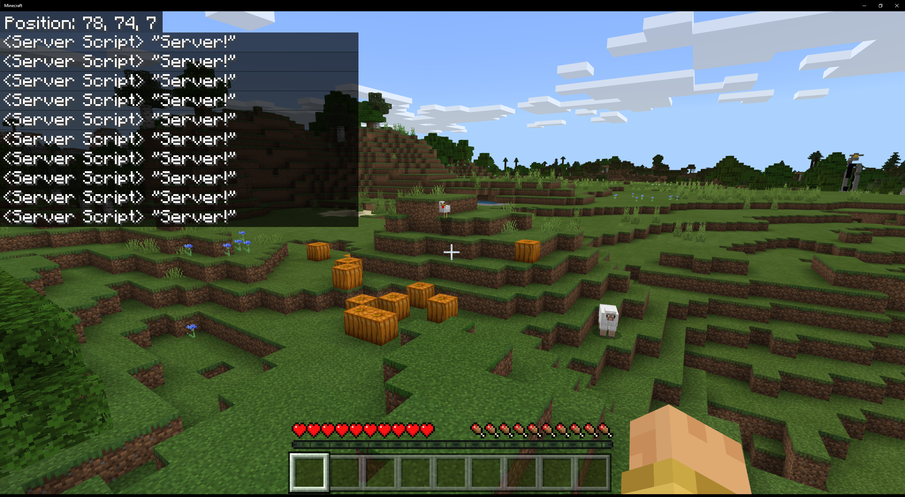

你应该会看到类似这样的内容！

现在，我们转到客户端 Javascript。

## clientScript.js

将以下内容复制并粘贴到你的 `clientScript.js` 文件中。我将在一会儿深入探讨其内容。

```js
// 这将脚本注册到 Minecraft 基岩版引擎的客户端
const systemClient = client.registerSystem(0, 0);

// 当所有脚本完全加载后，客户端运行此方法
systemClient.initialize = function () {
    // 打开信息、警告和错误的日志记录
    const scriptLoggerConfig = this.createEventData("minecraft:script_logger_config");
    scriptLoggerConfig.data.log_errors = true;
    scriptLoggerConfig.data.log_information = true;
    scriptLoggerConfig.data.log_warnings = true;
    this.broadcastEvent("minecraft:script_logger_config", scriptLoggerConfig);

    // 注册事件数据，注册组件，注册查询，监听事件，. . .

    this.counter = 0;
};

// 客户端每秒运行 20 次此更新函数
systemClient.update = function () {
    // 每秒在世界聊天中打印一次 hello world
    this.counter++;
    if (this.counter === 20) {
        this.log("客户端！");
        this.counter = 0;
    }

    // 更新其他内容 . . .
};

// 当世界关闭时，客户端仅运行此方法
systemClient.shutdown = function () {
    // 清理内容 . . .
};

// 这是一个简化将数据记录到控制台的辅助函数。
systemClient.log = function (...items) {
    // 将每个参数转换为可读字符串并收集到数组中。
    const toString = (item) => {
        switch (Object.prototype.toString.call(item)) {
            case "[object Undefined]":
                return "undefined";
            case "[object Null]":
                return "null";
            case "[object String]":
                return `"${item}"`;
            case "[object Array]":
                const array = item.map(toString);
                return `[${array.join(", ")}]`;
            case "[object Object]":
                const object = Object.keys(item).map((key) => `${key}: ${toString(item[key])}`);
                return `{${object.join(", ")}}`;
            case "[object Function]":
                return item.toString();
            default:
                return item;
        }
    };

    // 将字符串数组项连接成一个字符串并打印到世界聊天中。
    const chatEvent = this.createEventData("minecraft:display_chat_event");
    chatEvent.data.message = items.map(toString).join(" ");
    this.broadcastEvent("minecraft:display_chat_event", chatEvent);
};
```

你应该会看到 `clientScript.js` 和 `serverScript.js` 之间有许多相似之处。
它们之间的唯一区别在于我们将 `server` 替换为 `client` 。

- `systemServer` 变为 `systemClient`
- `this.log("Server!");` 变为 `this.log("客户端！");`

就这样吧！
重新加载你的 Minecraft 世界。

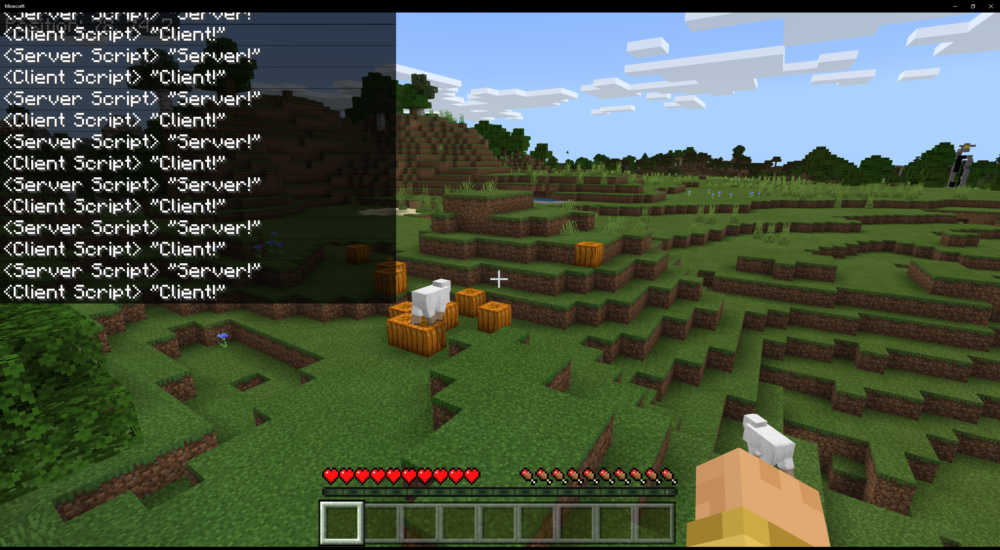

你应该会看到类似这样的内容！

游戏应每秒在聊天中打印“服务器！”和“客户端！”。

## 将你的行为附加包打包成一个附加包

那么，其他人如何玩你全新的、前所未见的 Minecraft 基岩版附加包呢？
微软创建了一种超级简单的方法，将你的行为附加包打包成一个单一文件。

### .mcpack

进入文件资源管理器并找到你的行为附加包。
记住，你可以在这里找到它（将 `<USERNAME>` 替换为你的 Windows 10 用户名）：

`C:\Users\<USERNAME>\AppData\Local\Packages\Microsoft.MinecraftUWP_8wekyb3d8bbwe\LocalState\games\com.mojang/development_behavior_packs/HelloWorld`

右键点击 `HelloWorld` 文件夹并将其压缩（选择发送到 > 压缩(zipped)文件夹）。
现在将文件扩展名[通过重命名文件]从 `.zip` 更改为 `.mcpack`。

当用户双击该文件时，它将自动由 Minecraft 打开并导入（将位于 `.../com.mojang/behavior_packs` 中）。
记住：1.17.30 版本中的一些实验性功能可能无法正常工作。

## 结束

如果你读到这里——恭喜！
你现在是官方的 Minecraft 基岩版模组开发者！

如果你想要本教程的源代码，可以在 [这里](https://github.com/Bedrock-OSS/wiki-addon/releases/download/download/legacy_scripting_hello_world.mcpack) 下载附加包。