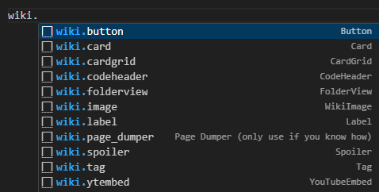

:::danger 秘密
这是开发者用于开发新功能和查找错误的特殊地方。如果这个地方看起来很乱，不用担心，它不需要看起来好看！
:::

嘿，你在这里做什么？你是怎么到这里的？快回去编辑维基吧！

## 引用

你可以使用 `>` 创建一个空格：

> 移动了？
>
> > 双重

实际上并没有移动

缩进效果类似于 `code`：

    实际上并没有移动

## 按钮

### 默认

<Button link="#buttons">一些文本</Button>

### 彩色

<Button link="#buttons" color="red">
    一些文本
</Button>

## 代码块

### 代码头

<CodeHeader>
    loooooooooooooooooooooooooooooooooooooooooooooooooooooooooooooooooooooooooooooooooooooooooooooooooooooooooooooooooooooooong.json
</CodeHeader>

```json
{
    "var": "一个非常非常非常looooooooooooooooooooooooooooooooooooooooooooooooooooooooooooooooooooooooooooooooooooooooooooooooooooooooooooooooooooooo长的值"
}
```

<CodeHeader>
    func
</CodeHeader>

```mcfunction
scoreboard players add @a joined 0


#在这里输入你的命令（示例）
tp @a[scores={joined=0}] 0 65 0


scoreboard players reset * joined
scoreboard players set @a joined 1

scoreboard objectives add world dummy
scoreboard players add initialised world 0


#在这里输入你的命令（示例）
execute if score initialised world matches 0 run say 新世界创建！


scoreboard players set initialised world 1
```

<CodeHeader>
    func
</CodeHeader>

```yaml
scoreboard players add @a joined 0


#在这里输入你的命令（示例）
tp @a[scores={joined=0}] 0 65 0


scoreboard players reset * joined
scoreboard players set @a joined 1

scoreboard objectives add world dummy
scoreboard players add initialised world 0


#在这里输入你的命令（示例）
execute if score initialised world matches 0 run say 新世界创建！


scoreboard players set initialised world 1
```

### 无行号

```json
{
    "var": "一个非常非常非常looooooooooooooooooooooooooooooooooooooooooooooooooooooooooooooooooooooooooooooooooooooooooooooooooooooooooooooooooooooo长的值"
}
```

## 注释

你能看到文本吗（看不到）？

<!-- 注释！👀 -->

## 容器

:::info 标题？
你可以像这样创建信息容器
:::

:::tip 标题？
你可以像这样创建提示容器
:::

:::warning 标题？
你可以像这样创建警告容器
:::

:::danger 标题？
你可以像这样创建危险容器
:::

## 文件夹视图

<FolderView :paths="[
    'path/to/folder/with/file.mcfunction',
    'path/to/file.json',
    'get/out/of/my/swamp.mcstructure'
]" />

## 二级标题

文本

### 三级标题

文本

#### 四级标题

文本

##### 五级标题

文本

###### 六级标题

文本

## 水平分隔线

一些文本...

---

...还有更多！

## 列表

### 已选中

-   [x] a
-   [x] b
-   [ ] c

### 有序

1. a
2. b
3. c

### 无序

-   a
-   b
-   c

## 代码片段

`Ctrl + Space`



## 剧透

<Spoiler title="Looooooooooooooooooooooooooooooooooooooooooooooooooooooooooooooooooooooooooooooooooooooooooooooooooooooooooooooooooooooooooong Title">

## Looooooooooooooooooooooooooooooooooooooooooooooooooooooooooooooooooooooooooooooong

### Looooooooooooooooooooooooooooooooooooooooooooooooooooooooooooooooooooooooooooooong

#### Looooooooooooooooooooooooooooooooooooooooooooooooooooooooooooooooooooooooooooooong

`somelongsinglecodeline:rjseut;lwkporiv;jr;oiU;OIRJB;OUBSOIU;LJ;OIJLj;fgdhokfdxhlpjklfjoijselvjlisue;vltjvzsa\dfhgz\dfgiuszehgiushezdgiuhsdghiksdaghkdsgaghkjsdhksdauhugkysdiuhiui`

</Spoiler>