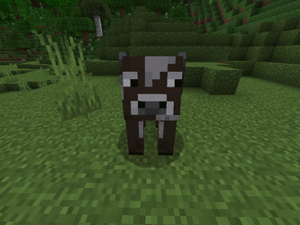

## 本页内容

在本页中，你将学习如何为实体制作动画纹理。动画纹理就像是方块的翻页纹理。

## 来源

本页内容基于[AgentMindStorm](https://www.youtube.com/channel/UC-ljddYkFdTQl-MVEaVvbuQ)的资料。

<YouTubeEmbed id="F6e-w1rCEi4" />

## 纹理

首先，我们需要为我们的实体绘制一些新的纹理帧。在本教程中，我们将以一头四处张望的牛为例。

<WikiImage
	src="../assets/images/visuals/animated-entity-texture/cow.png"
	alt="牛"
	width=180
/>

我们需要将纹理垂直排列，就像方块的翻页纹理一样。
在这种情况下，我们有4帧。

## 材料

在本指南中，我们需要修改材料。然而，由于渲染龙材料已经过时，因此**使用时请自行承担风险**。

要使用动画纹理，我们需要将实体材料更改为具有`USE_UV_ANIM`属性的材料。
我们可以简单地添加一个新材料：

```json title="RP/materials/entity.material"
{
    "materials": {
        "version": "1.0.0",
        "custom_animated:entity": {
            "+defines": ["USE_UV_ANIM"]
        }
    }
}
```

或者你可以将其添加到现有材料中，检查默认材料文件。

```json title=""
"+defines":[
    "USE_UV_ANIM"
]
```

<Button link="../assets/packs/visuals/animated-entity-texture/entity.material" download>
    下载默认的entity.material文件
</Button>

/// warning
并不是每个实体都这么简单！
一些实体有多个材料，如果你想让它的纹理动画化，你需要将此属性添加到该实体的所有材料中。
///

## 客户端实体文件

在继续之前，我们需要在客户端实体文件中定义一个新材料。

```json title="RP/entity/cow.json#description"
"materials": {
	"default": "custom_animated"
}
```

## 渲染控制器

在完成上述步骤后，我们需要编辑渲染控制器。

在这里，我们将添加`uv_anim`组件，并设置偏移和缩放属性：

```json title="RP/render_controllers/cow.render_controllers.json#controller.render.cow"
"uv_anim": {
    "offset": [ 0.0, "math.mod(math.floor(q.life_time * frames_per_second),frame_count) / frame_count" ],
    "scale": [ 1.0, "1 / frame_count" ]
}
```

其中`frames_per_second`是你希望在一秒内更改的帧数，`frame_count`是总帧数。
这个公式根据生命周期计算纹理的偏移和大小。

## 测试

现在，是时候测试你的创作了！



## 下载示例

<Button link="https://github.com/Bedrock-OSS/wiki-addon/releases/download/download/animated_entity_texture.mcpack">
    下载
</Button>