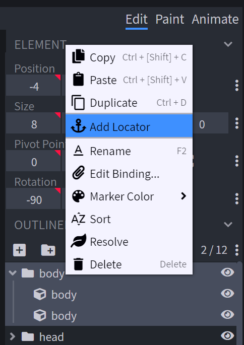
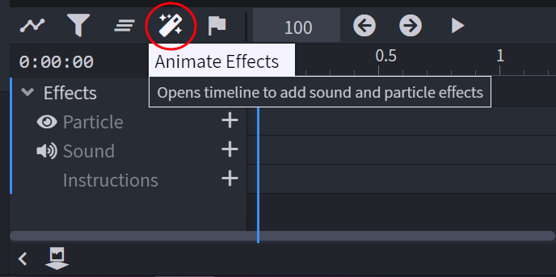
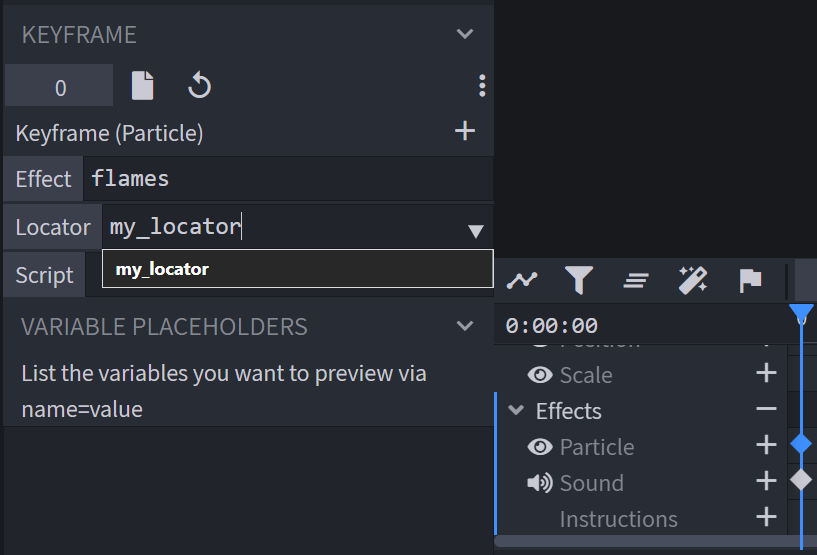
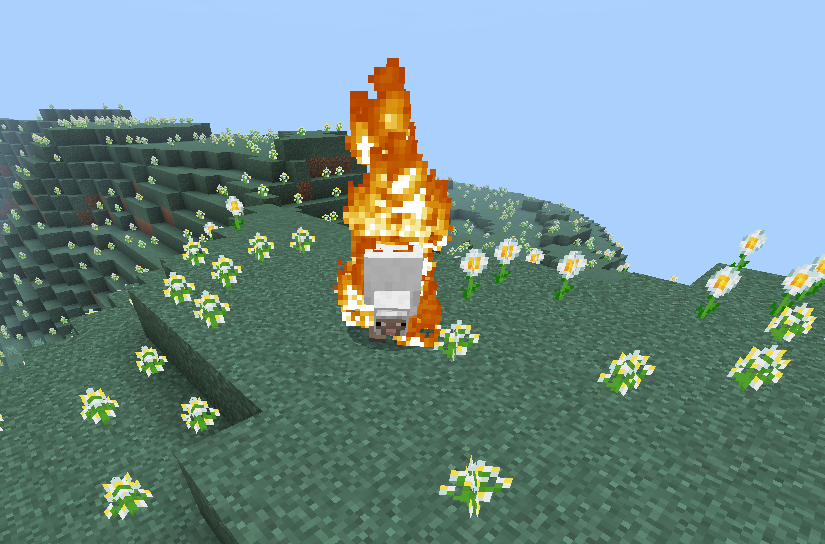

## 动画中的特效

有时候在动画中使用粒子或声音比在动画控制器中更简单。
动画中可以包含以下特效：

- 粒子
- 声音

### 粒子

Minecraft 粒子可以用于实体动画。例如，幻影有一个动画会不断发出 minecraft:phantom_trail 粒子。让我们尝试为我们实体的攻击动画添加一个粒子。

<CodeHeader>RP/entity/my_entity.json</CodeHeader>

```json
"particle_effects": {
	"flames": "minecraft:mobflame_emitter"
}
```

在这里，我们定义了一个将要使用的粒子的短名称。

你可以在 [这里](https://minecraft.wiki/w/Particles) 或 [这里](../particles/vanilla-particles.md) 找到粒子列表。

:::warning 警告！
并不是每个粒子都能在这里工作。如果遇到问题，请考虑尝试其他粒子。例如，使用这个粒子。
另外请注意，有些粒子会持续发射。
:::

### 声音

如果你想使用声音，你也需要进行定义。
你可以在 [ZapSplat](https://www.zapsplat.com/) 获取声音。

<CodeHeader>RP/entity/my_entity.json</CodeHeader>

```json
"sound_effects": {
	"meow": "mob.cat.meow"
}
```

:::warning 警告！
并不是每个声音都能在这里工作。如果遇到问题，请考虑尝试其他声音。例如，使用这个声音。
:::

## 为动画添加特效

你可以在主要动画或 Blockbench 中为动画添加粒子或声音。

### 主要

你需要在动画中添加以下内容：

<CodeHeader>RP/animations/my_animation.json#my.animation</CodeHeader>

```json
"particle_effects": {
    "0.0": {
        "effect": "flames",
        "locator": "" //你需要在模型中添加一个定位器
    }
}
```

<CodeHeader>RP/animations/my_animation.json#my.animation</CodeHeader>

```json
"sound_effects": {
    "0.0": {
        "effect": "meow"
	}
}
```

你可以同时调用多个粒子：

```json
"particle_effects": {
    "0.0": [
        {
            "effect": "particle_1",
            "locator": "locator_1"
    	},
	{
            "effect": "particle_2",
            "locator": "locator_2"
    	}
    ]
}
```

<Spoiler title="示例">

<CodeHeader>RP/animations/my_animation.json</CodeHeader>

```json
{
	"format_version" : "1.8.0",
	"animations" : {
		"animation.sheep.grazing" : {
			"animation_length" : 2.0,
			"loop" : true,
			"particle_effects": {
                "0.0": {
                    "effect": "flames",
                    "locator": "body"
                }
            },
			"sound_effects": {
    			"0.0": {
    			    "effect": "meow"
				}
			},
			"bones" : {
				"head" : {
					"position" : {
						"0" : [ 0.0, 0.0, 0.0 ],
						"0.2" : [ 0.0, -9.0, 0.0 ],
						"1.8" : [ 0.0, -9.0, 0.0 ],
						"2" : [ 0.0, 0.0, 0.0 ]
					},
					"rotation" : {
						"0.2" : {
							"post" : [ "180.0 * (0.2 + 0.07 * math.sin(q.key_frame_lerp_time * 1644.39))", 0.0, 0.0 ],
							"pre" : [ 36.0, 0.0, 0.0 ]
						},
						"1.8" : {
							"post" : [ 36.0, 0.0, 0.0 ],
							"pre" : [ "180.0 * (0.2 + 0.07 * math.sin(q.key_frame_lerp_time * 1644.39))", 0.0, 0.0 ]
						}
					}
				}
			}
		}
	}
}
```

</Spoiler>

### 在 Blockbench 中

首先为我们的粒子添加一个定位器。进入“编辑”部分，选择一个组，右键点击并选择“添加定位器”：



重命名并移动到你想要的位置。

然后进入“动画”部分，选择一个动画并点击魔法棒图标：



现在点击“+”以打开菜单并指定数据：



你可以以相同的方式将声音附加到动画上。

现在保存你的动画并启动游戏！



:::warning 警告！
目前（1.21.1）定位器在可附加物体上是有问题的。
:::

## 离屏更新

你可以在实体 RP 脚本中将 `"should_update_bones_and_effects_offscreen"` 设置为 `true`，以使粒子和声音特效在离屏时更新，默认情况下，如果实体未在显示中渲染，它们将停止播放。

<CodeHeader>RP/entity/my_entity.json#description</CodeHeader>

```json
"scripts": {
	"should_update_bones_and_effects_offscreen": true
}
```