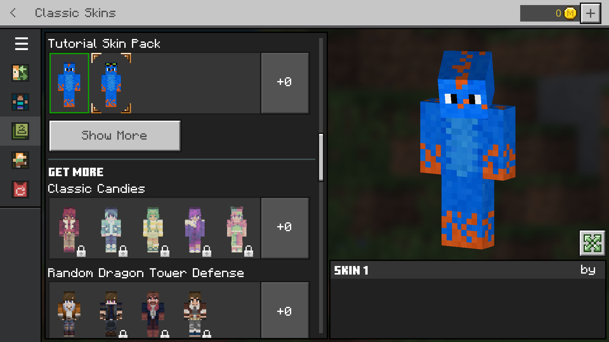
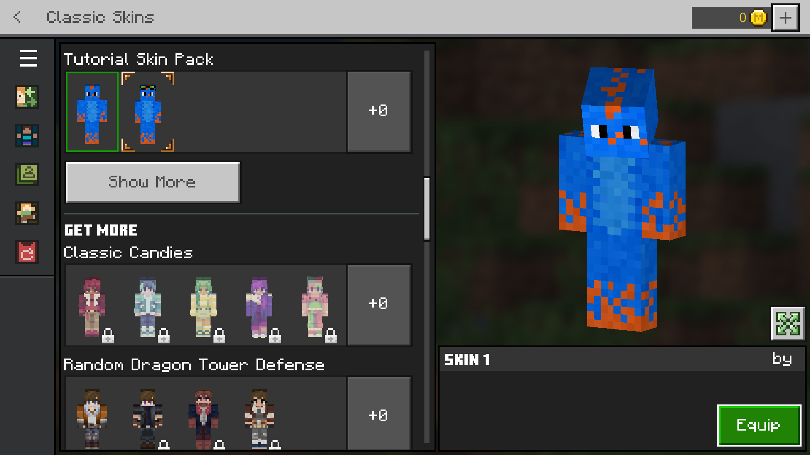

许多人错误地认为皮肤包只能由市场合作伙伴创建。其实不然！这是一个非常简单的过程，可以通过Python轻松实现完全自动化。但这还不是全部。让我们学习如何制作皮肤包吧！

:::warning
`development_skin_packs`似乎无法正常工作。您需要使用`skin_packs`文件夹，并在每次更改后重新加载Minecraft。
:::

## 需要什么

以下是所需的文件：

<FolderView
	:paths="[
    'com.mojang/skin_packs/my_skin_pack/texts/en_US.lang',
	'com.mojang/skin_packs/my_skin_pack/my_skin.png',
	'com.mojang/skin_packs/my_skin_pack/manifest.json',
	'com.mojang/skin_packs/my_skin_pack/skins.json'
]"
></FolderView>

## manifest.json

<CodeHeader>skin_packs/tutorial_skin_pack/manifest.json</CodeHeader>

```json
{
    "format_version": 2,
    "header": {
        "name": "教程皮肤包",
        "uuid": "bb9616eb-327c-4a81-9f00-064cae820cd5",
        "version": [1, 0, 0]
    },
    "modules": [
        {
            "type": "skin_pack",
            "uuid": "e4bc71b6-8f9b-4094-9d47-dc3824f8a3dc",
            "version": [1, 0, 0]
        }
    ]
}
```

-   `format_version`也可以是1，因为v2对皮肤包的影响不大。
-   `name`是显而易见的。然而，它并不是特别重要。
-   `uuid`和`version`我们已经很熟悉。清单中的两个UUID必须不同。您可以通过链接在[有用链接](../meta/useful-links.md)中的生成器生成它们。提醒一下，您不能使用相同的UUID两次。
-   `modules`中的`type`当然需要设置为`skin_pack`。

## skins.json

此文件用于定义皮肤的纹理和短名称。然而，大多数选项是硬编码或不可更改的。

<CodeHeader>skin_packs/tutorial_skin_pack/skins.json</CodeHeader>

```json
{
    "geometry": "geometry.json",
    "serialize_name": "教程皮肤包",
    "localization_name": "tutorial",
    "skins": [
        {
            "localization_name": "tutorial_skin_1",
            "geometry": "geometry.humanoid.custom",
            "texture": "goggled_gecko_no_goggles.png",
            "type": "free"
        },
        {
            "localization_name": "tutorial_skin_2",
            "geometry": "geometry.humanoid.customSlim",
            "texture": "goggled_gecko.png",
            "type": "free"
        }
    ]
}
```

-   `geometry`对象在每个对象中必须与示例代码相同。Mojang移除了通过皮肤包添加自定义几何体的能力，因为该功能被滥用。
-   `serialize_name`用于市场。
-   `localization_name`是包的标识符。**请勿在其他皮肤包中使用**，因为这会影响翻译。
-   `skins`数组，您在此定义每个皮肤。皮肤将在Minecraft中按此处定义的顺序显示。
    > -   `localization_name`将在.lang文件中使用。可以将其视为皮肤的标识符。
    > -   `geometry`您可以在这里使用`geometry.humanoid.custom`和`geometry.humanoid.customSlim`。
    > -   `texture`是位于主皮肤包文件夹中的图像文件的名称。
    > -   `type`仅供市场合作伙伴使用，保持为`free`，否则将被锁定。

## texts/en_US.lang

最后，我们将在`.lang`文件中定义皮肤包和每个皮肤的名称。当然，“en_US”可以替换为任何语言。

<CodeHeader>skin_packs/tutorial_skin_pack/texts/en_US.lang</CodeHeader>

```
skinpack.tutorial=教程皮肤包

skin.tutorial.tutorial_skin_1=皮肤 1
skin.tutorial.tutorial_skin_2=皮肤 2
```

第一行定义了包的名称。格式如下：

`skinpack.[包的localization_name]=实际包名称`

其他行定义了皮肤的名称：

`skin.[包的localization_name].[皮肤的localization_name]=实际皮肤名称`

完成了！现在，当您打开角色创建器时，您将看到可以选择的皮肤！

## 故障排除

如果您在MC版本低于1.18.30的情况下游戏，您可能会遇到“装备”按钮未显示的错误。您需要下载一个特殊的纹理包。



<Button link="../assets/packs/visuals/skin-packs/equip_button_fix.mcpack" download>
    下载装备按钮修复
</Button>

