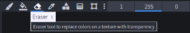
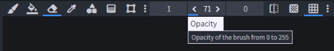
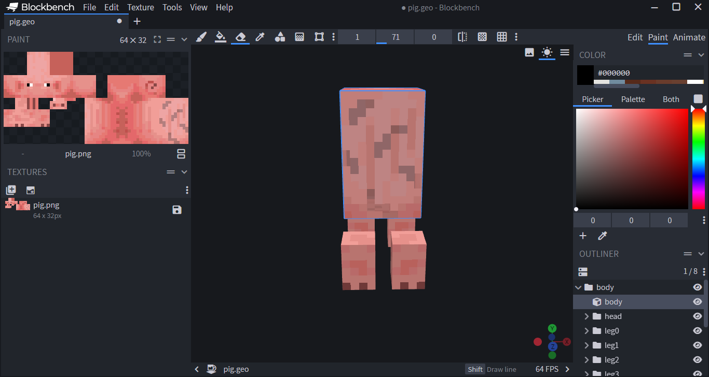
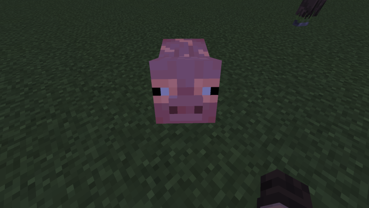

在本教程中，你将学习如何为实体制作发光纹理，类似于末影人的眼睛，通过使用材料和纹理。

## 纹理

要使实体的纹理发光，你需要在高级图像编辑器中打开你的纹理（这里使用 Blockbench），以半透明的方式擦除像素的 alpha 值。

- 打开你的实体纹理文件。

 _不要在意奇怪的骨骼旋转，Mojang 喜欢通过动画正确渲染模型。_

- 找到 __橡皮擦__ 工具，并将其不透明度/alpha 设置为较低的值，比如 71 或 23。





- 然后，擦除你希望发光的纹理部分。像素越不明显，发光效果越强，但请确保它不是 100% 擦除。



示例猪纹理：


## 材料

我们需要修改我们希望发光的生物的 `RP/entity/my_entity.entity.json` 文件。现在，找到 `"materials":{}` 并将值设置为 `"entity_emissive_alpha"`。（确保纹理已正确定义）。

```json title="RP/entity/pig.entity.json#description"
"materials": {
    "default": "entity_emissive_alpha"
}
```

<Spoiler title="示例猪实体文件">

```json title="RP/entity/pig.entity.json"
{
	"format_version": "1.10.0",
	"minecraft:client_entity": {
		"description": {
			"identifier": "minecraft:pig",
			"min_engine_version": "1.8.0",
			"materials": {
				"default": "entity_emissive_alpha" // 将 "pig" 替换为 "entity_emissive_alpha"
			},
			"textures": {
				"default": "textures/entity/pig/pig",
				"saddled": "textures/entity/pig/pig_saddle"
			},
			"geometry": {
				"default": "geometry.pig.v1.8"
			},
			"animations": {
				"setup": "animation.pig.setup",
				"walk": "animation.quadruped.walk",
				"look_at_target": "animation.common.look_at_target",
				"baby_transform": "animation.pig.baby_transform"
			},
			"scripts": {
				"animate": [
					"setup",
					{
						"walk": "q.modified_move_speed"
					},
					"look_at_target",
					{
						"baby_transform": "q.is_baby"
					}
				]
			},
			"render_controllers": ["controller.render.pig"],
			"spawn_egg": {
				"texture": "spawn_egg",
				"texture_index": 2
			}
		}
	}
}
```

</Spoiler>

## 测试

现在，启动 Minecraft 并打开启用了此资源包的世界。将时间设置为 _午夜_ 或找到附近的洞穴进行测试。实体应该如预期般发光。

