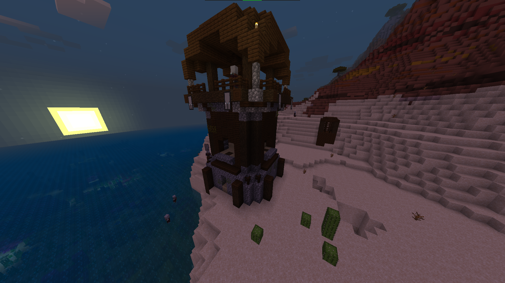
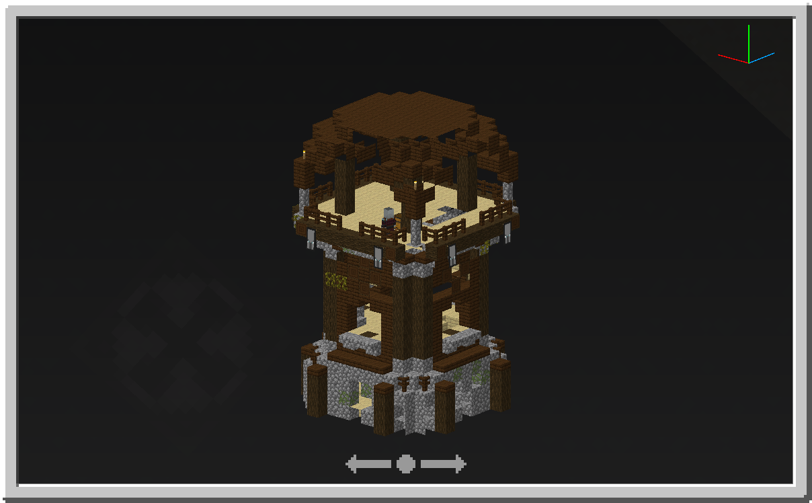
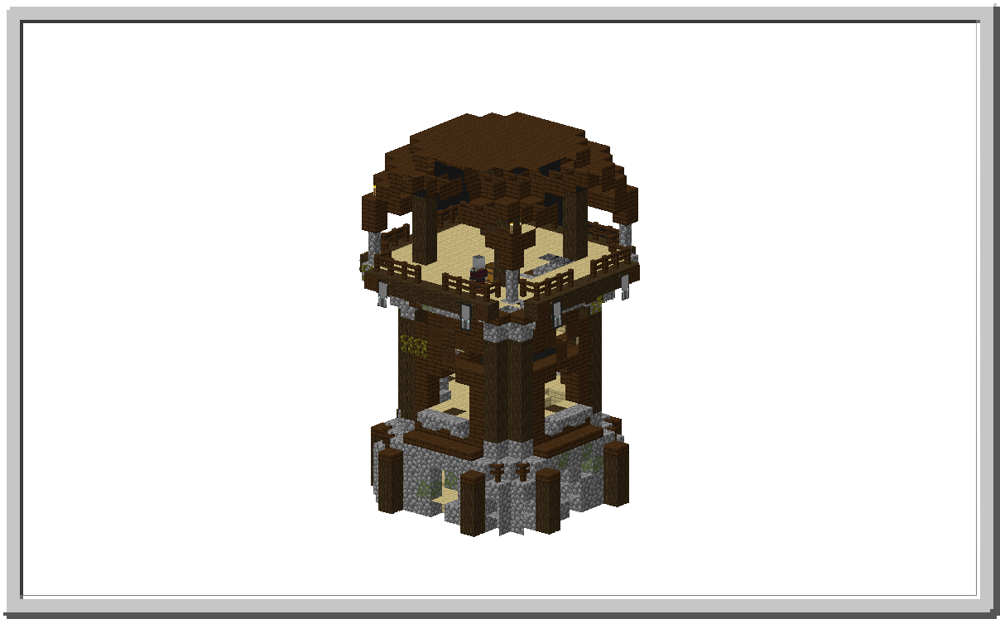
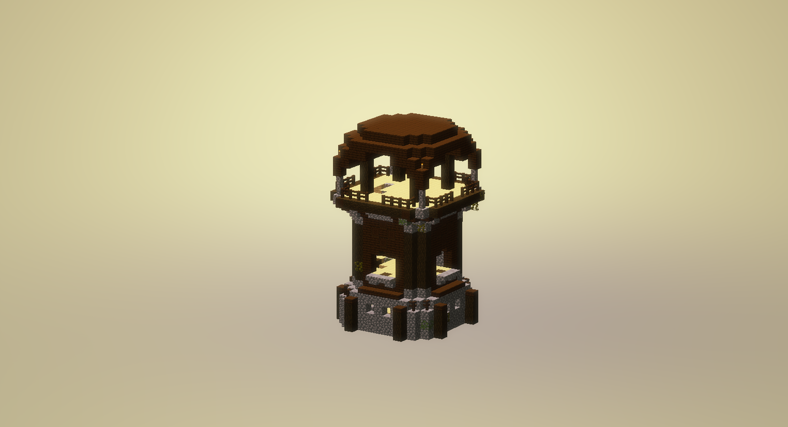

## 本页存在的原因

清晰地展示附加包的特性与展示质量同样重要。如果人们能够理解一个附加包及其特性，他们可能更愿意尝试使用它。本页将演示一种展示结构的方法。

## 展示方法

有很多方法可以向人们展示结构。你可以：

-   拍摄游戏内的结构截图。
-   在结构块中拍摄截图。
-   创建你结构的3D模型。

以下将以掠夺者前哨站结构为例展示这三种方法。

### 游戏内截图

这是最简单的方法，因为它快速且容易。它还允许你在世界的上下文中展示结构，但也有一些缺点。你可能需要找到一个合适的地方来拍摄截图，或者找到一个好的角度可能会很困难。

### 在结构块中

这种方法避免了在世界中截图的一些缺点，你可以完全专注于结构，而不会有其他方块干扰视线。

通过进行[JSON UI](../json-ui/json-ui-intro.md)编辑，你可以更改背景颜色并移除其他元素，以进一步改善这种方法。

### 渲染的3D对象

结构可以导出为3D模型。如果3D导出按钮对你无效，可以尝试应用3d-export-fix包。

<Button link="../assets/packs/visuals/structure-presentation/3d-export-fix-v2.mcpack" download>
    下载包
</Button>

<Button link="../assets/packs/visuals/structure-presentation/3d-export-fix.mcpack" download>
    下载包（1.19.30之前）
</Button>

这种方法主要适用于PC用户。你可以在Paint 3D中创建简单的渲染，或在Blender中进行更高级的渲染。在这种情况下，我们可以快速且简单地展示我们的结构。

⬇ 如果你有其他方法，请在下方贡献。