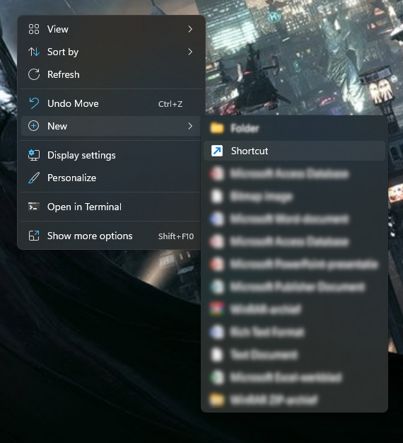
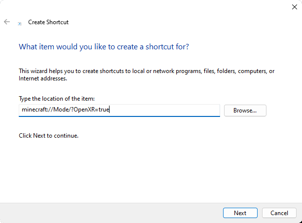
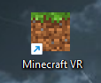
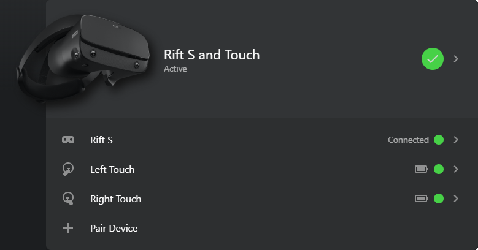

Minecraft虚拟现实曾可通过Oculus商店下载，但该版本已很长时间未更新。本文将向您展示如何在Windows PC上启用最新版本的Minecraft虚拟现实。

:::warning
如果您使用的是Playstation，则无需遵循本指南。
:::

## 创建桌面快捷方式

右键单击桌面并创建一个新的快捷方式：

位置填写为`minecraft://Mode/?OpenXR=true`。

您可以随意命名，最终您应该拥有一个如下所示的快捷方式：

## 在虚拟现实中打开Minecraft

首先确保您的头显已正确连接：

当您的头显设置完成后，就可以打开快捷方式了。

## 您的进度

-   [x] 设置Minecraft虚拟现实
-   [ ] 设置您的虚拟现实资源包
-   [ ] 创建自定义手部模型
-   [ ] 创建自定义客厅