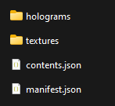
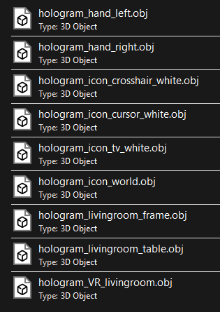
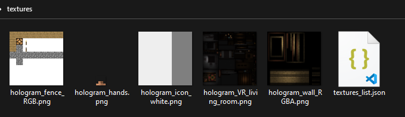

要开始制作你的附加包，你应该下载这个模板。
这个模板包含了制作VR包所需的所有资产。

<Button link="https://github.com/Bedrock-OSS/wiki-addon/releases/download/download/vr_template.mcpack">
    获取模板！
</Button>

/// warning
请勿删除模板中的 `contents.json` 和 `textures_list.json` 文件。
///

## 模板包含了什么？

模板包含两个可编辑的文件夹：`holograms` 和 `textures`，这些文件夹包含了VR对象的模型和纹理。

## 全息图

这个文件夹包含了Minecraft VR版本使用的所有模型，例如VR手部模型。

## 纹理

这个文件夹存储了所有模型的纹理。

## 将VR模板与自己的包合并

这个包依赖于 `contents.json` 和 `textures_list.json` 文件才能正常工作。你包中的所有资产，游戏将会使用的，都需要在其中定义。
如果你有两个相同的文件，你需要将它们合并。

## 你目前的进度

-   [x] 设置Minecraft VR
-   [x] 设置包
-   [ ] 编辑模型