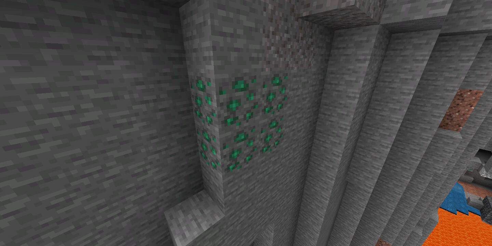
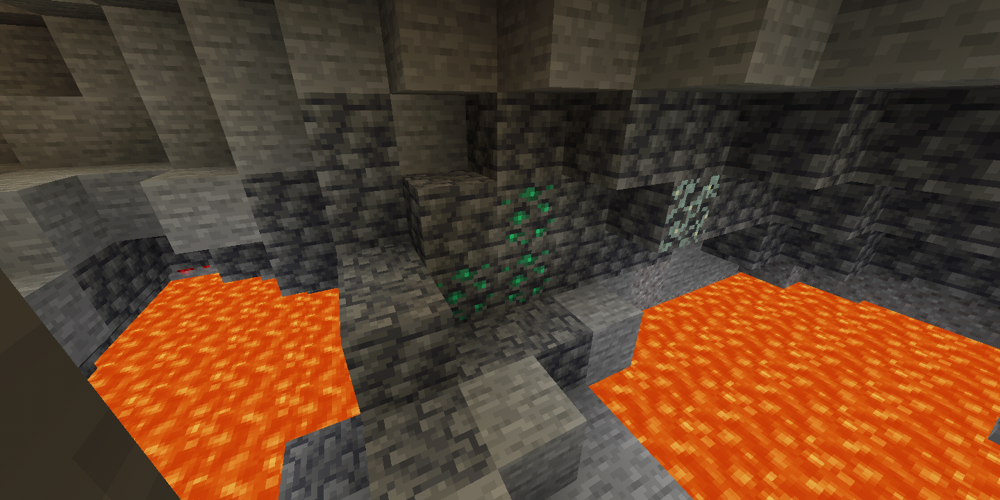

`ore_feature` 是基本但重要的地物！它们可以通过替换生成位置的方块来形成矿石簇。本教程将向您展示如何制作自然生成的矿物矿石。

使用地物和地物规则需要在您的世界设置中启用自定义生物群系的创建。如果您的方块没有生成，请确保它已启用！

:::tip
在本教程中，我将使用两个自定义方块，泰坦矿石和深层泰坦矿石。有关如何制作自定义方块的信息，请访问 [方块介绍](../blocks/blocks-intro.md) 页面。
:::

## 地物文件

<CodeHeader>BP/features/titanite_ore_feature.json</CodeHeader>

```json
{
	"format_version": "1.17.0",
	"minecraft:ore_feature": {
		"description": {
			"identifier": "wiki:titanite_ore_feature"
		},
		"count": 8, // 放置尝试次数
		"replace_rules": [
			{
				// 用泰坦矿石替换所有石头变体（安山岩、花岗岩和辉长岩）
				"places_block": "wiki:titanite_ore",
				"may_replace": ["minecraft:stone"]
			},
			{
				// 用深层泰坦矿石替换深层石
				"places_block": "wiki:deepslate_titanite_ore",
				"may_replace": ["minecraft:deepslate"]
			}
		]
	}
}
```

## 地物规则

<CodeHeader>BP/feature_rules/overworld_underground_titanite_ore_feature.json</CodeHeader>

```json
{
	"format_version": "1.13.0",
	"minecraft:feature_rules": {
		"description": {
			"identifier": "wiki:overworld_underground_titanite_ore_feature",
			"places_feature": "wiki:titanite_ore_feature" // 来自地物文件的标识符
		},
		"conditions": {
			"placement_pass": "underground_pass",
			"minecraft:biome_filter": [
				// 在整个主世界中分散矿石
				{
					"any_of": [
						{
							"test": "has_biome_tag",
							"operator": "==",
							"value": "overworld"
						},
						{
							"test": "has_biome_tag",
							"operator": "==",
							"value": "overworld_generation"
						}
					]
				}
			]
		},
		"distribution": {
			"iterations": 10, // 簇的放置尝试次数，而不是矿石方块
			"coordinate_eval_order": "zyx",
			"x": {
				"distribution": "uniform",
				"extent": [0, 16]
			},
			"y": {
				"distribution": "uniform", // 您可以使用 "triangle" 使矿石在范围中间更常见
				"extent": [
					0, // 矿石生成的最小 y 级别
					62 // 矿石生成的最大 y 级别
				]
			},
			"z": {
				"distribution": "uniform",
				"extent": [0, 16]
			}
		}
	}
}
```

## 测试

您可以通过探索洞穴来寻找矿石，但如果您的矿石稀有，您可以使用命令来检查它们是否正在生成。只需将此命令放入一个重复命令方块中，然后四处飞行：

-   `execute @a ~ ~ ~ fill ~8 ~8 ~8 ~-8 ~-8 ~-8 air 0 replace wiki:titanite_ore`

石矿：



深层矿石：

