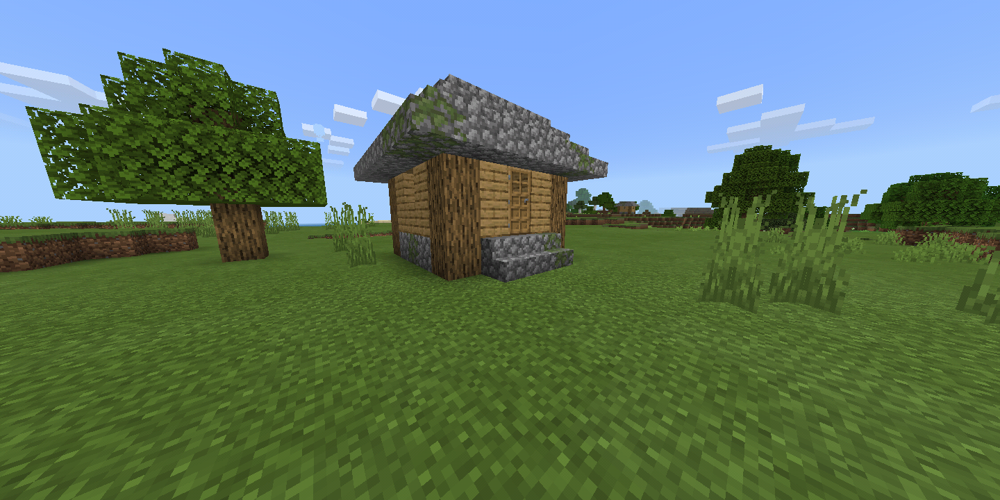
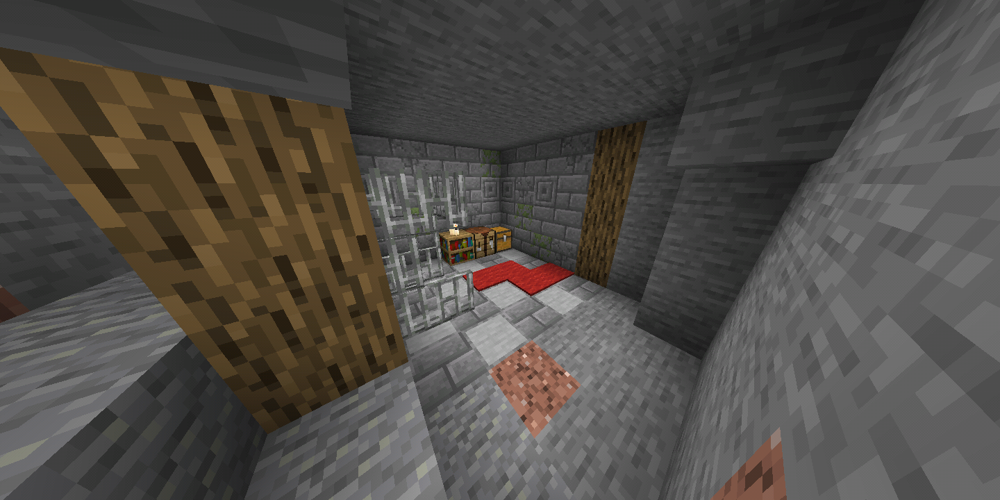
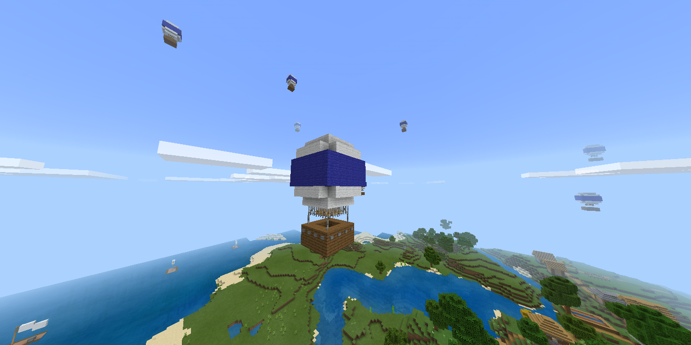
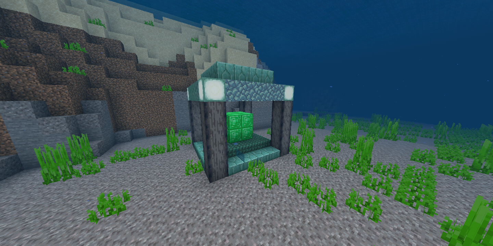
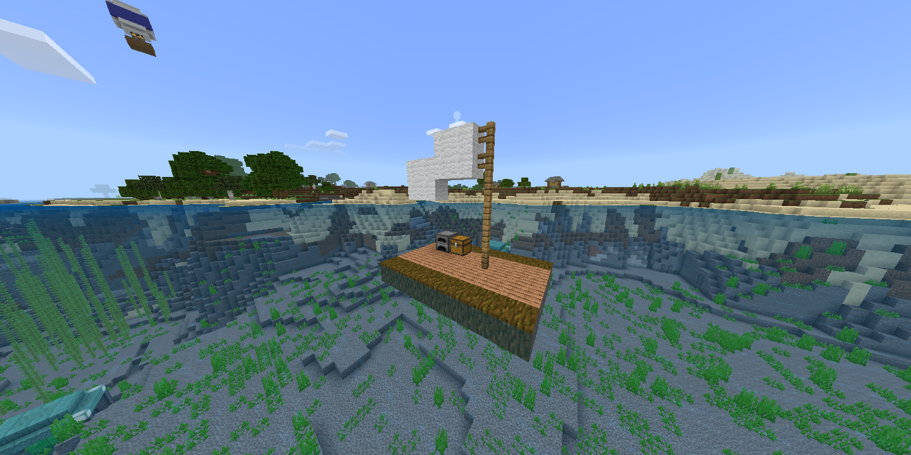

结构地物是最基本的地物之一。它在世界中放置导出的 `.mcstructure` 文件。
本教程将向你展示如何制作：

-   地面结构，

-   地下结构，

-   漂浮结构，

-   水下结构，以及

-   水面结构

:::tip
要在安卓设备上导出结构，请使用这个 [资源包](https://mcpedl.com/export-structure-button-android-addon/)
:::

确保将 `.mcstructure` 文件放在 `BP/structures/` 目录下！

## 地面结构

### 地物文件

```json title="BP/features/house_feature.json"
{
	"format_version": "1.13.0",
	"minecraft:structure_template_feature": {
		"description": {
			"identifier": "wiki:house_feature"
		},
		"structure_name": "mystructure:house",
		"adjustment_radius": 4,
		"facing_direction": "random",
		"constraints": {
			"grounded": {},
			"unburied": {},
			"block_intersection": {
				"block_allowlist": [
					"minecraft:air" //结构只能替换空气
				]
			}
		}
	}
}
```

### 地物规则

```json title="BP/feature_rules/plains_house_feature.json"
{
	"format_version": "1.13.0",
	"minecraft:feature_rules": {
		"description": {
			"identifier": "wiki:plains_house_feature",
			"places_feature": "wiki:house_feature"
		},
		"conditions": {
			"placement_pass": "first_pass",
			"minecraft:biome_filter": {
				"test": "has_biome_tag",
				"operator": "==",
				"value": "plains"
			}
		},
		"distribution": {
			"iterations": 1,
			"x": {
				"extent": [0, 16],
				"distribution": "uniform"
			},
			"y": "q.heightmap(v.worldx, v.worldz)", //在柱子的最高方块上生成地物
			"z": {
				"extent": [0, 16],
				"distribution": "uniform"
			},
			"scatter_chance": {
				"numerator": 1,
				"denominator": 25
			}
		}
	}
}
```



## 地下结构

### 地物文件

```json title="BP/features/bunker_feature.json"
{
	"format_version": "1.13.0",
	"minecraft:structure_template_feature": {
		"description": {
			"identifier": "wiki:bunker_feature"
		},
		"structure_name": "mystructure:bunker",
		"adjustment_radius": 4,
		"facing_direction": "random",
		"constraints": {
			"block_intersection": {
				"block_allowlist": [
					"minecraft:air", //使地物只能替换空气和石头
					"minecraft:stone"
				]
			}
		}
	}
}
```

### 地物规则

```json title="BP/feature_rules/overworld_bunker_feature.json"
{
	"format_version": "1.13.0",
	"minecraft:feature_rules": {
		"description": {
			"identifier": "wiki:overworld_bunker_feature",
			"places_feature": "wiki:bunker_feature"
		},
		"conditions": {
			"placement_pass": "first_pass",
			"minecraft:biome_filter": {
				"test": "has_biome_tag",
				"operator": "==",
				"value": "overworld"
			}
		},
		"distribution": {
			"iterations": 1,
			"x": {
				"extent": [0, 16],
				"distribution": "uniform"
			},
			"y": {
				"extent": [
					11,
					50 //使结构在y11到y50之间生成
				],
				"distribution": "uniform"
			},
			"z": {
				"extent": [0, 16],
				"distribution": "uniform"
			},
			"scatter_chance": {
				"numerator": 1,
				"denominator": 15
			}
		}
	}
}
```



## 漂浮地物

### 地物文件

```json title="BP/features/balloon_feature.json"
{
	"format_version": "1.13.0",
	"minecraft:structure_template_feature": {
		"description": {
			"identifier": "wiki:balloon_feature"
		},
		"structure_name": "mystructure:balloon",
		"adjustment_radius": 4,
		"facing_direction": "random",
		"constraints": {
			"block_intersection": {
				"block_allowlist": [
					"minecraft:air" //使结构只能替换空气
				]
			}
		}
	}
}
```

### 地物规则

```json title="BP/feature_rules/overworld_balloon_feature.json"
{
	"format_version": "1.13.0",
	"minecraft:feature_rules": {
		"description": {
			"identifier": "wiki:overworld_baloon_feature",
			"places_feature": "wiki:balloon_feature"
		},
		"conditions": {
			"placement_pass": "first_pass",
			"minecraft:biome_filter": {
				"test": "has_biome_tag",
				"operator": "==",
				"value": "overworld"
			}
		},
		"distribution": {
			"iterations": 1,
			"x": {
				"extent": [0, 16],
				"distribution": "uniform"
			},
			"y": {
				"extent": [
					100, //使结构在y100到y200之间生成
					200
				],
				"distribution": "uniform"
			},
			"z": {
				"extent": [0, 16],
				"distribution": "uniform"
			},
			"scatter_chance": {
				"numerator": 1,
				"denominator": 25
			}
		}
	}
}
```



## 水下结构

::: tip
对于水下结构，请确保将结构水淹，因为Minecraft不会自动将其水淹！
:::

### 地物文件

```json title="BP/features/aqua_temple_feature.json"
{
	"format_version": "1.13.0",
	"minecraft:structure_template_feature": {
		"description": {
			"identifier": "wiki:aqua_temple_feature"
		},
		"structure_name": "mystructure:aqua_temple",
		"adjustment_radius": 4,
		"facing_direction": "random",
		"constraints": {
			"block_intersection": {
				"block_allowlist": [
					"minecraft:water" //使结构只能替换水
				]
			}
		}
	}
}
```

### 地物规则

```json title="BP/feature_rules/ocean_aqua_temple_feature.json"
{
	"format_version": "1.13.0",
	"minecraft:feature_rules": {
		"description": {
			"identifier": "wiki:ocean_aqua_temple_feature",
			"places_feature": "wiki:aqua_temple_feature"
		},
		"conditions": {
			"placement_pass": "first_pass",
			"minecraft:biome_filter": {
				"test": "has_biome_tag",
				"operator": "==",
				"value": "ocean"
			}
		},
		"distribution": {
			"iterations": 1,
			"x": {
				"extent": [0, 16],
				"distribution": "uniform"
			},
			"y": "q.above_top_solid(v.worldx, v.worldz)", //将地物放置在柱子上最高的固体方块上，因此不会放置在水面上
			"z": {
				"extent": [0, 16],
				"distribution": "uniform"
			},
			"scatter_chance": {
				"numerator": 1,
				"denominator": 25
			}
		}
	}
}
```



## 水面结构

### 地物文件

```json title="BP/features/raft_feature.json"
{
	"format_version": "1.13.0",
	"minecraft:structure_template_feature": {
		"description": {
			"identifier": "wiki:raft_feature"
		},
		"structure_name": "mystructure:raft",
		"adjustment_radius": 4,
		"facing_direction": "random",
		"constraints": {
			"block_intersection": {
				"block_allowlist": [
					"minecraft:water", //使结构只能替换空气和水
					"minecraft:air"
				]
			}
		}
	}
}
```

### 地物规则

```json title="BP/feature_rules/ocean_raft_feature.json"
{
	"format_version": "1.13.0",
	"minecraft:feature_rules": {
		"description": {
			"identifier": "wiki:ocean_raft_feature",
			"places_feature": "wiki:raft_feature"
		},
		"conditions": {
			"placement_pass": "first_pass",
			"minecraft:biome_filter": {
				"test": "has_biome_tag",
				"operator": "==",
				"value": "ocean"
			}
		},
		"distribution": {
			"iterations": 1,
			"x": {
				"extent": [0, 16],
				"distribution": "uniform"
			},
			"y": 62, //使地物仅在y62生成，即Minecraft水位
			"z": {
				"extent": [0, 16],
				"distribution": "uniform"
			},
			"scatter_chance": {
				"numerator": 1,
				"denominator": 25
			}
		}
	}
}
```

