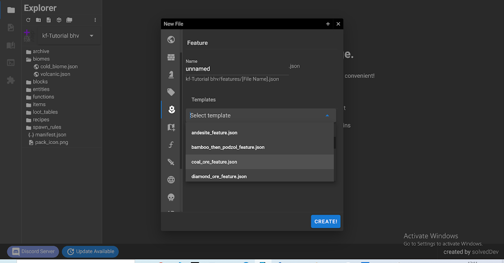
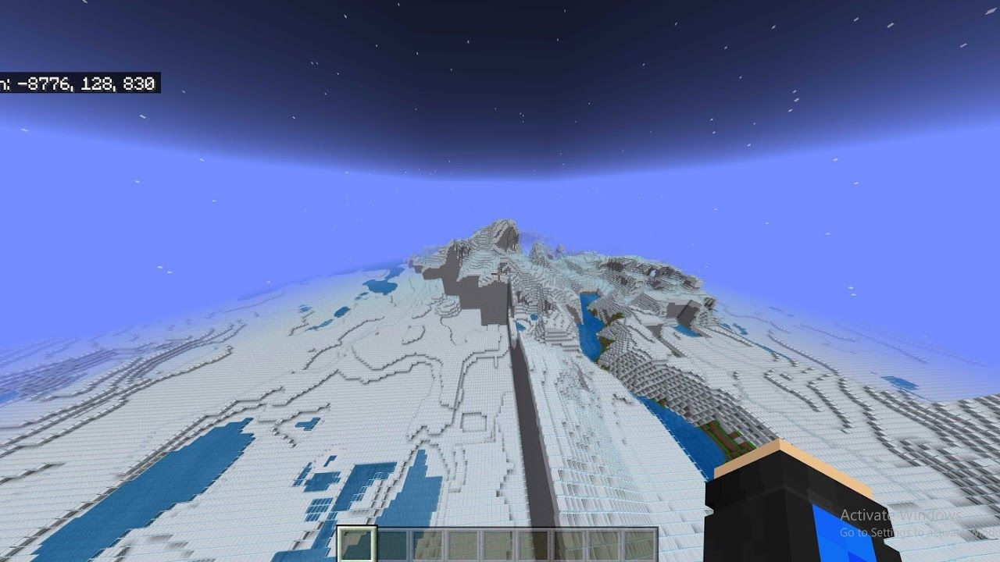
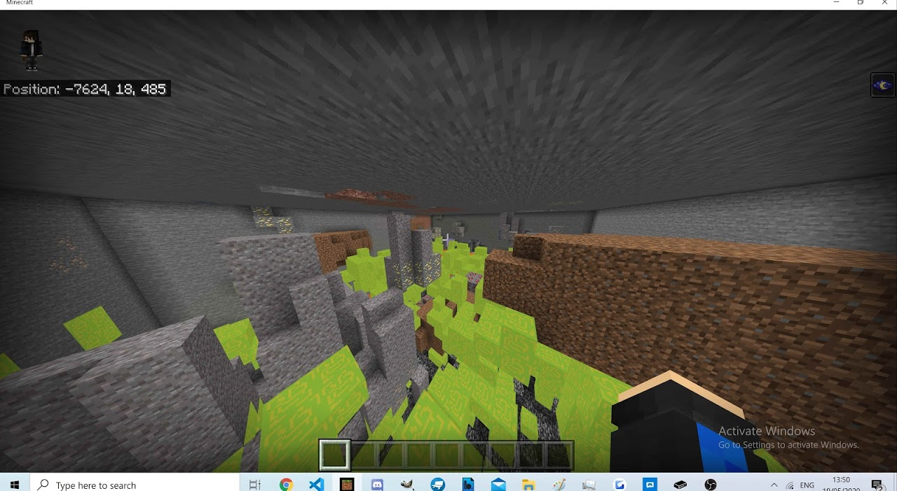

/// warning
本页面内容有些过时，信息有限。欲获取最新和最全面的信息，请查看本节中的其他页面。
///

你可以通过附加包更改世界的生成。在行为包中所需的文件夹包括：

`structures`、`features`、`feature_rules` 和 `biomes`。这非常直观：你可以在 `structures` 中存储来自（或用于）结构块的 `.mcstructure` 文件，在 `biomes` 中存放生物群系文件，在 `features` 中存放地物（如矿石），并在 `feature_rules` 中存放它们的生成规则。首先让我们来看看如何添加自定义生物群系。

_注意：使用 bridge. 创建生物群系可能更容易，这是一款用于创建附加包的可视化软件（也在链接和联系方式中链接），因为官方文档相当不完整。你还可以生成所有香草生物群系、地物和地物规则的示例文件以供参考，如下所示：_


_使用 bridge. 生成煤矿地物。_

然而，bridge. 并不是必需的。

---

## 自定义生物群系

```json title="BP/biomes/cold_biome.json"
{
    "format_version": "1.13.0",
    "minecraft:biome": {
        "description": {
            "identifier": "cold_biome"
        },
        "components": {
            "minecraft:climate": {
                "downfall": 0.7,
                "snow_accumulation": [0.6, 0.9],
                "temperature": 15.0
            },
            "minecraft:overworld_height": {
                "noise_params": [0.6, 0.9]
            },
            "minecraft:surface_parameters": {
                "sea_floor_depth": 7,
                "sea_floor_material": "minecraft:blue_ice",
                "foundation_material": "minecraft:cobblestone",
                "mid_material": "minecraft:concrete",
                "top_material": "minecraft:glass",
                "sea_material": "minecraft:water"
            },
            "minecraft:overworld_generation_rules": {
                "generate_for_climates": [
                    ["medium", 100],
                    ["warm", 100],
                    ["cold", 100]
                ]
            },
            "cold_biome": {}
        }
    }
}
```

-   将 `format_version` 设置为 1.13.0：这是当前发布版本中最新的生物群系文件版本。
-   `description` 只接受一个值：`identifier`。这要求**无命名空间**，并且**必须**与**文件名**相同。
    （如果你使用命名空间，例如 `wiki:cold_biome`，文件名需要仅匹配 ID，因此必须保持为 `cold_biome.json`。）
-   `components` 就是你所期待的：默认应用于生物群系的内容。让我们逐一查看：
    -   `minecraft:climate` 控制所有气候相关的内容。
    -   `downfall` 表示下雨或下雪的频率。0.0 表示绝对不下雨（如沙漠），1.0 表示持续下雨。
    -   `temperature` 用于定义诸如水冰冻和雨转为雪等现象。
    
    **你可以使用 bridge. 生成默认的生物群系文件以供参考。**
    
-   `overworld_surface` 控制生成的方块。
-   `floor_depth` 表示湖泊和河流向下延伸的深度（以方块为单位）。
-   `sea_floor_material` 定义在生成河流和湖床时使用的材料。
-   `foundation_material` 是在 y=5 到 y=50 之间大致使用的材料。例如，对于沙漠，它是石头。
-   `sea_material` 是在湖泊、河流、海洋等中显示液体时使用的材料。例如，在所有主世界生物群系中，这设置为 "minecraft:water"。
-   `top_material` 定义最高层级使用的材料。例如，平原使用草。
-   `mid_material` 是“顶层”和“基础层”之间的层。例如，平原使用泥土。
-   `overworld_height` 定义生物群系在地形上的外观。
    
    不要同时使用 `noise_type` 和 `noise_params`。`noise_params` 是一个数组，表示生物群系中允许的噪声的最高级别和最低级别。
    
    
    _使用 [0.1, 0.1] 和 [1.0, 1.0] 作为 noise_params 生成相同生物群系之间的不平滑过渡。_
    
-   如果你想使用 `noise_type`，你将看到几种预生成的噪声类型。你可能会从香草游戏中知道它们的外观。以下是列表：
    
    `beach`、`default`、`extreme`、`taiga`、`ocean`、`mountains`、`default_mutated`、`deep_ocean`、`lowlands`、`less_extreme`、`stone_beach`、`swamp`、`river`、`mushroom`。
    
-   `minecraft_world_generation_rules` 是所有组件中最重要的，尤其是 `generate_for_climates` 数组。基本上，游戏中有三种气候：“warm”、“medium”和“cold”。当世界被创建时，它们会被随机分配 [硬编码]。现在，你可以选择你的自定义生物群系在每种特定气候中生成的频率。如果你不提供任何内容，默认值为每种气候 0，该生物群系将不会生成。在示例中，每种气候的**权重**（数字越小，该生物群系在该气候中生成的机会越小，取代香草生物群系的概率越低）设置为 100 用于测试目的：这使得生物群系几乎在主世界的任何地方生成。然而，一旦测试完成，我会根据应该的方式平衡权重。例如，香草的 _desert_ 在 warm 气候中的权重为 3。
    
-   此组件还接受对象，如 `hills_transformation`、`mutate_transformation`、`shore_transformation`、`river_transformation`，但它们的含义对我来说尚不清楚。欢迎贡献。同样，`surface_meaterial_adjustments` 组件也是如此。
    
-   最后但同样重要的是，生物群系标签！它们非常简单但有用。你可以通过在 `components` 中添加以下格式的标签，设置任意多个香草或自定义标签：
    
  ```
    "tagName": {}
  ```
    
    然后，你可以在 _environment_sensors_、_filters_、_has_biome_ 测试、_spawn rules_ 等中测试你的标签。
    
    你的自定义生物群系现在完成！

---

## 地物和地物规则

注意：在 v.1.15Beta 中，可以使用 `structures` 文件夹中的 `.mcstructures` 代替 `features` 来通过 `feature_rules` 生成自定义结构。更多信息将在更新到达后提供。

地物和地物规则用于生成从矿石到草和花卉、植被到花岗岩或粘土斑块的一切。甚至可以使用它们创建自定义结构，但由于这非常繁琐，且在上述更新后会更容易，我们暂时不讨论。

现在，值得一提的是，生成自定义结构的最简单方法是 [这款自动生成器](https://machine-builder.itch.io/frg-v2) 由 [MACHINE_BUILDER](https://www.youtube.com/channel/UC8FBQgo4AWwKFX97h60NKOQ) 制作，你需要注意的是，这个工具有一个功能有限的免费版本，若要享受完整功能，请使用付费版本。然而，我们仍将学习一些其他的手动地物生成方法，因为某些东西如矿石生成为 `ore_feature` 要比 `structure_template_feature` 更为高效。

让我们为了教程的目的，将 `wiki:blocky` 自定义方块生成作为矿石。我将采取简单的方法，步骤如下：

1. 打开 _bridge._，选择你的附加包。
2. _添加新文件>features>diamond_ore 和 添加新文件>feature_rules>diamond_ore_。
3. 现在我将保存这些文件，并在代码编辑器中打开它们，进行必要的修改。

_如果你在安装 bridge. 时遇到问题，你完全可以轻松地从头编写文件或从其他地方复制文件。**获取香草文件的一处地方是 [示例包](https://www.minecraft.net/en-us/addons)，另一个更完整的地方是 [bridge. 的仓库](https://github.com/bridge.-core/bridge../tree/master/static/vanilla)**。_

## 地物

地物位于 `BP/features` 中，基本上是一组存储在游戏文件中的方块，可以通过 _feature_rule_ 进行放置。**地物的文件名必须与其标识符匹配**。

你可以在 [bedrock.dev/r/Features](https://bedrock.dev/r/Features) 找到它们的文档。

```json title="BP/features/blocky_ore_feature.json"
{
    "format_version": "1.13.0",
    "minecraft:ore_feature": {
        "description": {
            "identifier": "blocky_ore_feature"
        },
        "count": 8,
        "places_block": "wiki:blocky",
        "may_replace": [
            {
                "name": "minecraft:stone",
                "states": {
                    "stone_type": "andesite"
                }
            },
            {
                "name": "minecraft:stone",
                "states": {
                    "stone_type": "andesite_smooth"
                }
            },
            {
                "name": "minecraft:stone",
                "states": {
                    "stone_type": "diorite"
                }
            },
            {
                "name": "minecraft:stone",
                "states": {
                    "stone_type": "diorite_smooth"
                }
            },
            {
                "name": "minecraft:stone",
                "states": {
                    "stone_type": "granite"
                }
            },
            {
                "name": "minecraft:stone",
                "states": {
                    "stone_type": "granite_smooth"
                }
            },
            {
                "name": "minecraft:stone",
                "states": {
                    "stone_type": "stone"
                }
            }
        ]
    }
}
```

-   `minecraft_ore_feature` 是自动放置矿石的特定地物类型。每种地物类型都有其特定的语法。（还有 `single_block_feature` 可以放置单个方块而不是矿石群等）
-   `identifier` 在这种情况下不需要命名空间。命名空间是可选的，且不应添加到文件名中。
-   `count` 是矿石“群”的最大大小，或生成的实际矿石方块数量。
-   `places_block` 采用要放置的方块的标识符作为值。
-   `may_replace` 采用地物可以替换的所有方块作为参数。如果它生成在此处未包含的方块上，该方块将保持不变，不会被替换。

## 地物规则

**地物规则** 控制 _地物_（以及未来的 _结构_) 的放置位置和方式。

```json title="BP/feature_rules/overworld_underground_blocky_ore_feature.json"
{
    "format_version": "1.13.0",
    "minecraft:feature_rules": {
        "description": {
            "identifier": "overworld_underground_blocky_ore_feature",
            "places_feature": "blocky_ore_feature"
        },
        "conditions": {
            "placement_pass": "underground_pass",
            "minecraft:biome_filter": [
                {
                    "any_of": [
                        {
                            "test": "has_biome_tag",
                            "operator": "==",
                            "value": "overworld"
                        },
                        {
                            "test": "has_biome_tag",
                            "operator": "==",
                            "value": "overworld_generation"
                        }
                    ]
                }
            ]
        },
        "distribution": {
            "iterations": 100,
            "coordinate_eval_order": "zyx",
            "x": {
                "distribution": "uniform",
                "extent": [0, 16]
            },
            "y": {
                "distribution": "uniform",
                "extent": [0, 16]
            },
            "z": {
                "distribution": "uniform",
                "extent": [0, 16]
            }
        }
    }
}
```

-   `description`
    -   `identifier` 不需要命名空间，但文件名需要匹配。
    -   `places_feature` 采用由此规则控制的地物的标识符作为值。
-   `conditions`
    -   `placement_pass` 如何通过地物传递。
    -   `biome_filter` 用于测试地物将在哪些生物群系标签中生成，完全类似于生成规则。
-   `distribution`
    -   `iterations` 基本上是几率。我设置为 100 使其处处生成，但对于钻石矿石，这设置为 1。
    -   接下来的四个组件显示矿石将朝哪个方向“拖动”。
        _需要更多说明_
    
测试你的矿石是否生成的最简单方法是在低 y 级别使用以下命令：
`/fill ~15 ~5 ~15 ~-15 ~-15 ~-15 air 0 replace stone`。它会在选定区域内保留除石头以外的所有方块，如下所示：
    


是的，100 次“iterations”绝对太多了 ;)

建议继续查看其他地物和地物规则的香草文件以学习更多技术。然而，你刚刚学习的这些内容已经足以创建大多数需要生成的内容。

---

## 自定义结构

截至 MCBE v1.16.20，**可以生成自定义生成的结构**。
生成结构的一种简单方法是使用前面提到的 [这款](https://machine-builder.itch.io/frg-v2) 自动生成器，由 MACHINE_BUILDER 制作，它会为你的结构生成所需的三个文件：`feature_rules/mystructure.feature_rule.json`、`feature_rules/mystructure.feature.json` 和 `structures/mystructure.mcstructure`。你可以在 Minecraft 中使用结构块了解更多关于定义 `.mcstructures` 的信息 [这里](../nbt/mcstructure.md)。

---

现在你有了你的 `.mcstructure`，是时候编写你的 `feature` 和 `feature rule` 了。后者与矿石类似（参见本文开头）。让我们继续**地物**部分。

-   记住，命名空间不是必需的，且文件名必须匹配标识符，排除命名空间。因此，如果你有一个标识符为 `wiki:myfeaturerule` 或仅 `myfeaturerule` 的地物规则，文件名在两种情况下都可以是 `myfeaturerule.json`。
    
    下面是 [Features Documentation](https://bedrock.dev/r/Features#minecraft:structure_template_feature) 中的一个代码示例：
    
    <CodeHeader></CodeHeader>
    
  ```json
    {
        "format_version": "1.13.0",
        "minecraft:structure_template_feature": {
            "description": {
                "identifier": "wiki:hot_air_balloon_feature"
            },
            "structure_name": "wiki:hot_air_balloon",
            "adjustment_radius": 8,
            "facing_direction": "random",
            "constraints": {
                "unburied": {},
                "block_intersection": {
                    "block_whitelist": ["minecraft:air"]
                }
            }
        }
    }
  ```
    
    -   `structure_name` 是结构的标识符，即你通过结构块保存的标识符。
    
    就这些了！现在你可以在世界中生成你自己的自定义结构。

---

---

## 你目前的进展

**你已经完成了：**

-   [x] 创建了你的第一个生物群系。
-   [x] 让你的第一个矿石自然生成。
-   [x] 学会使用 bridge. 进行香草文件的生成和引用。
-   [x] 了解了其他自定义生成方法。
-   [x] 创建了自定义结构。