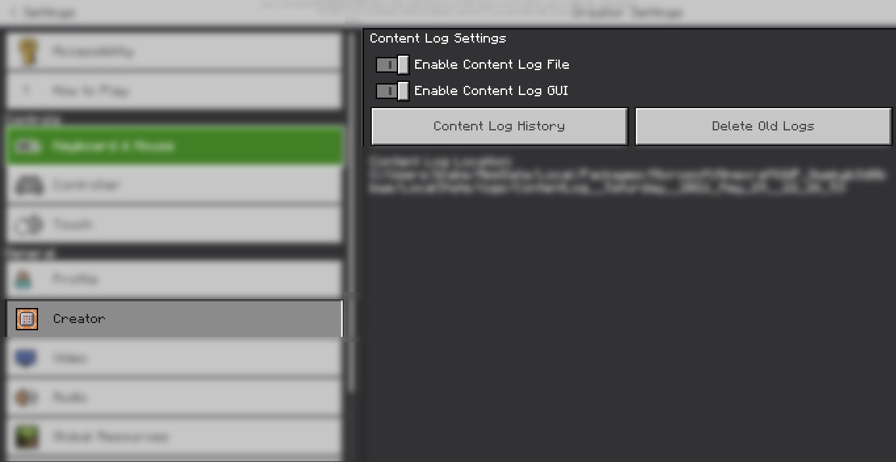

# 常见问题

/// details-info | 署名信息
- 该页面翻译自[https://bridge-core.github.io/editor-docs/faq/](https://bridge-core.github.io/editor-docs/faq/)
- 该页面仓库地址为[https://github.com/bridge-core/bridge-core.github.io/blob/master/content/docs/editor-docs/faq/index.md](https://github.com/bridge-core/bridge-core.github.io/blob/master/content/docs/editor-docs/faq/index.md)
- 该页面的版本为<!-- md:samp bridge-core/bridge-core.github.io@fed8371a2a1932a9198022081e482a9ee902b75a -->
- 该页面的作者有：
    - <!-- md:samp @7dev7urandom -->
///

bridge. Discord中经常被问到许多问题，本文档将逐一解答。

## 如何在游戏中使用自定义命令？

你无法在游戏中使用自定义命令；bridge.中的自定义命令仅在编辑器内使用（如函数、物品、动画、动画控制器、实体），因为它们会被编译成普通命令。

## 在bridge.中编辑动画后，它停止工作了。为什么？

这是一个已知的问题，涉及bridge.如何处理数组和对象。当对象和动画之间存在歧义且两者都是有效选项时，自动类型检测会失败。解决方案：不要在bridge.中使用Blockbench编辑动画；使用文本编辑器手动修复损坏的动画。

在bridge. v2中不存在此问题。

## bridge.出现异常行为，我该怎么办？

请确认你的bridge.版本是最新的，然后在**<!-- md:samp #bugs -->**（于bridge. Discord中）报告此问题，具体说明版本、问题以及出现问题时你在做什么。我们会尽快回复你。如果你有GitHub账户，建议在此处提交问题：
[https://github.com/bridge-core/bridge./issues/new/choose](https://github.com/bridge-core/bridge./issues/new/choose)

## bridge.自动补全有问题。

按照报告bridge.异常行为的相同步骤进行操作。

## 如何卸载全局插件？

你可以通过点击工具栏中的“帮助”操作并选择“打开全局插件文件夹”选项，来打开存储全局插件的文件夹。然后，你可以删除<!-- md:samp plugins -->文件夹中的各个子文件夹来移除插件。

## 我的实体在游戏中存在，但不可见。

这可能由多种原因引起，例如渲染控制器中的错误、几何体引用问题或纹理路径定义不正确。欲获得更深入的帮助，请查看[此实体故障排除指南](https://wiki.bedrock.dev/knowledge/troubleshooting.html)。

## 我的附加包无法工作。为什么？

附加包无法正常工作的原因有很多。在你在bridge. Discord的附加包帮助频道提问之前，请先开启内容日志并检查任何错误。

## 如何启用内容日志？

在*Minecraft*设置中的创作者部分，有两个选项：“启用内容日志GUI”和“启用内容日志文件”。我们建议在测试时同时启用这两个选项。

## 如何制作脚本GUI？

目前没有相关教程，但Mojang已发布一个使用GUI的示例包。你可以在此处获取该包：[https://aka.ms/minecraftscripting_turnbased](https://aka.ms/minecraftscripting_turnbased)

## 是否有针对……的相关教程？

你可以查看bridge. Discord中的<!-- md:samp #addon-guides -->。如果那里没有相关内容，文档（[https://bedrock.dev](https://bedrock.dev)）可能会有所帮助。如果你仍然需要帮助，请在可用的<!-- md:samp #addon-help -->频道中提问。

## 我是否需要针对……启用实验性玩法？

自1.16.0版本起，以下内容需要启用实验性玩法：

- 生物群系
- 地物
- 地物规则
- 脚本

## 我的实体在应该透明的地方纹理显示为黑色。

当你使用不支持透明度的材质时，会导致此问题。

`skeleton`和`entity_alphatest`都支持透明度，当遇到此问题时可以使用它们。

## bridge.和bridge. v2有什么区别？

bridge.是一个本地程序，而bridge. v2是一个可安装的网络应用（PWA），目前可用于Chrome（桌面版）和Microsoft Edge。bridge. v2提供了多种改进，包括原始JSON编辑器、新的用户界面、皮肤包支持、新的编译器架构取代了缓存系统等等。bridge. v2已支持越来越多的扩展程序，此外，大多数最近发布的扩展程序目前仅适用于bridge. v2。

## bridge.是否支持移动设备？

是的，[bridge. v2](https://editor.bridge-core.app)支持移动设备。然而，你需要手动下载你的项目以保存进度，因为bridge. v2需要一种移动浏览器不支持的API进行自动存储。