# 入门指南

/// details-info | 署名信息
- 该页面翻译自[https://bridge-core.github.io/editor-docs/getting-started/](https://bridge-core.github.io/editor-docs/getting-started/)
- 该页面仓库地址为[https://github.com/bridge-core/bridge-core.github.io/blob/master/content/docs/editor-docs/getting-started/index.md](https://github.com/bridge-core/bridge-core.github.io/blob/master/content/docs/editor-docs/getting-started/index.md)
- 该页面的版本为<!-- md:samp bridge-core/bridge-core.github.io@8caeff80ed2defedbd4d771e8b81e654f19b7dda -->
- 该页面的作者有：
    - <!-- md:samp @joelant05 -->
///

## 设置bridge.

要开始使用bridge.，你首先需要打开它。bridge. v2是一个PWA（渐进式网页应用），这意味着它可以在支持的浏览器中使用，也可以安装到你的系统中。要访问bridge. v2，请前往[https://editor.bridge-core.app](https://editor.bridge-core.app)。

安装bridge.的步骤如下：

-   在创建你的第一个项目后，你可以点击侧边栏中的**安装应用**提示。
-   点击URL栏右侧的安装按钮。
-   在第一步设置中选择安装应用。

当你第一次打开bridge.时，你会看到一个设置屏幕，你需要按照以下4个简单的步骤进行操作。

1. 安装bridge.可以获得更好的体验，并且可以在离线情况下使用bridge.！

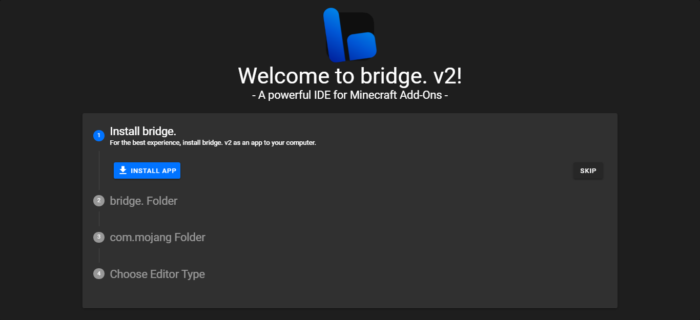

2. 选择bridge.应该存储其项目的文件夹。这个文件夹不能是你的`com.mojang`文件夹或者包含系统文件的任何文件夹。确保在弹出的提示中授予权限。

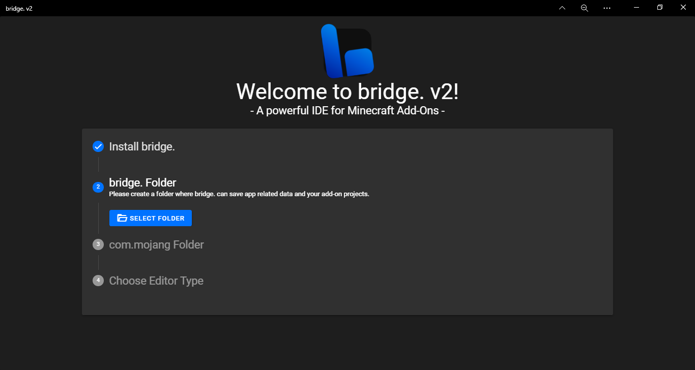

3. 将你的`com.mojang`文件夹链接到bridge.，通过将它从Minecraft目录（`C:\Users\<USER>\AppData\Local\Packages\Microsoft.MinecraftUWP_8wekyb3d8bbwe\LocalState\games\com.mojang`）拖拽过来。这一步是可选的，可以跳过，但是如果你这样做，你的项目将不会自动编译到你的Minecraft开发包文件夹。确保在弹出的提示中授予权限。

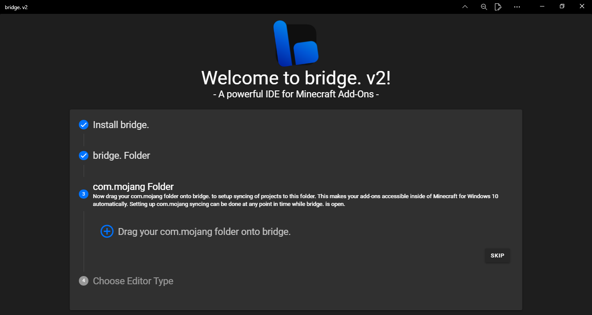

4. 选择你的编辑器类型。你可以选择使用[树状编辑器](#树状编辑器)或者[代码编辑器](#代码编辑器)。

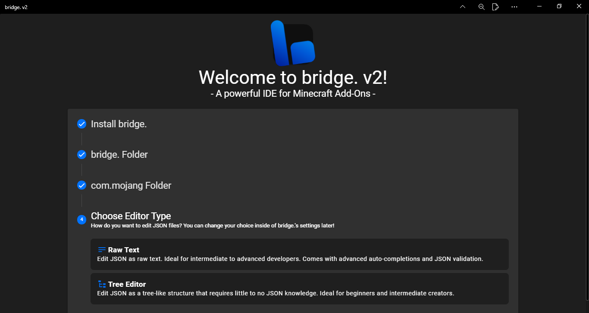

## 创建一个项目

要开始使用bridge.创建附加包，你需要创建一个项目。

使用bridge.，创建新项目非常简单。
如果这是你的第一个项目并且你刚刚设置好bridge.，项目创建窗口将自动出现。否则，要打开项目创建窗口，点击欢迎屏幕上快速操作菜单的**新建项目**按钮，或者点击侧边栏上的第一个按钮打开**项目**窗口，然后在窗口的右上角点击**新建项目**。

在这里，你可以根据你的喜好自定义你的包。你可以修改：

-   你的项目应该包含的包类型。
-   你希望你的项目使用哪些实验性的游戏玩法开关。
-   在项目创建时在你的包中创建的单个文件。
-   你的项目的名称和描述。
-   你的项目的作者。
-   你的项目的包图标。
-   你的项目的目标Minecraft版本。
-   项目的命名空间。**在你的包中使用的标识符的前缀，比如`minecraft`之于`minecraft:apple`**

还有一些开关可以启用/禁用一些功能，比如将RP（资源包）注册为BP（行为包）的依赖项。

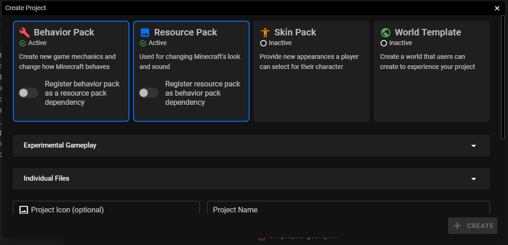

完成以上步骤后，你可以点击**创建！**，bridge.将会设置所有必要的项目文件。

## 创建文件

bridge.支持创建Minecraft支持的**所有**文件。
你可以通过点击新建文件按钮，或者按 ++ctrl+n++ 在你的行为包、资源包、皮肤包或世界模板中创建一个文件。

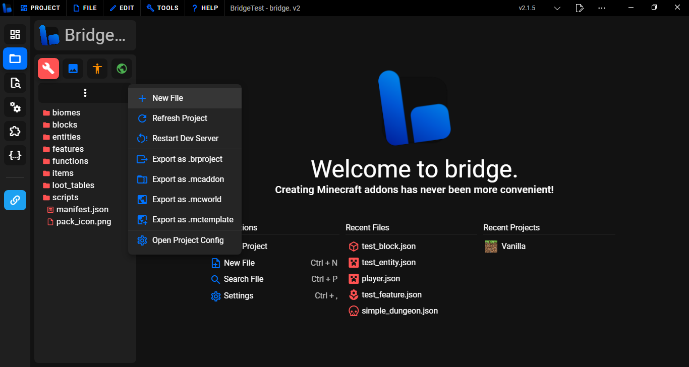

这样做会打开新建文件窗口。在这个窗口中，你会看到一个侧边栏，它让你可以选择所有可能创建的文件类型。

_记住，你可以滚动侧边栏或搜索以查看更多你可以创建的文件类型！_

bridge.的预设窗口包含多个类别：

-   方块 - 不同类型的方块的模板。
-   实体 - 不同类型的实体的模板。
-   物品 - 不同类型的物品的模板。
-   简单文件 - 允许你创建单个文件。
-   皮肤 - 允许你向皮肤包添加皮肤。

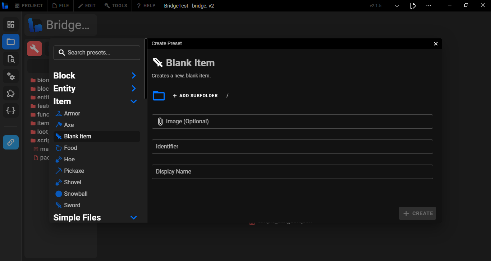

一旦你选择了一个文件，你会看到你需要输入一个标识符/文件名，可能还需要输入其他输入，这取决于你试图创建的文件类型。

完成以上步骤后，点击**创建！**，预设将被创建，所有创建的文件将被打开。

## 编辑文件

文件可以通过在包资源管理器侧边栏中打开它们进行编辑。此外，你也可以将一个文件拖拽到bridge.上，这样会给你一个编辑文件或将其添加到你的项目的选项。

### JSON

当你用bridge.打开一个JSON文件时，它将在代码视图编辑器或树状视图编辑器中打开。两者都包括彩色的语法高亮、自动补全、跳转到定义等功能！

#### 代码编辑器

代码视图编辑器是一种更传统的编辑方式，它允许你在文件中输入任何你想要的内容。它的编辑体验类似于VSCode，但是包含了bridge.提供的所有其他神奇的工具和功能。

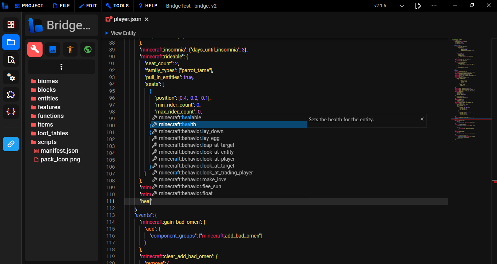

#### 树状编辑器

树状编辑器类似于bridge. v1中的编辑器，推荐对JSON知识不太了解的用户使用，因为你不会犯语法错误。

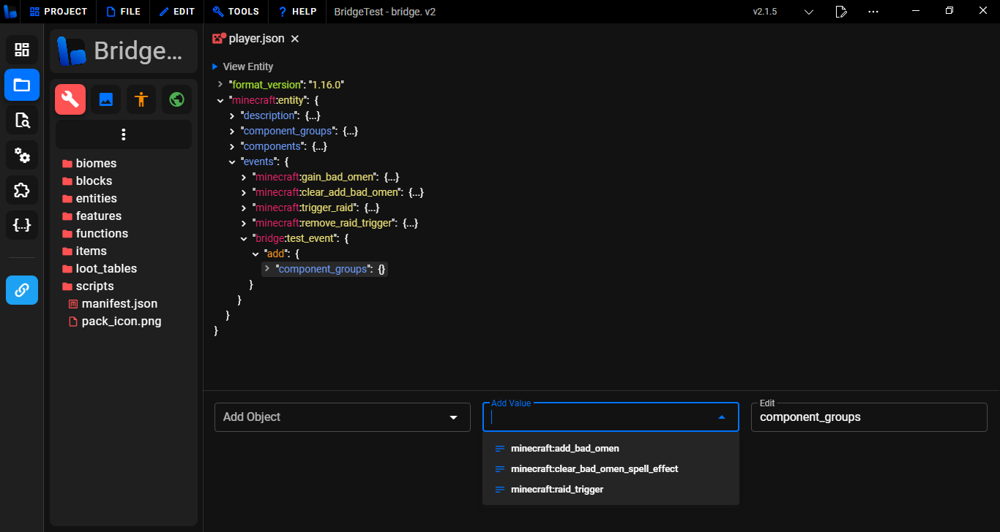

### 其他文件类型

bridge.还支持打开和编辑其他文件类型，包括：

### <!-- md:samp .mcfunction -->

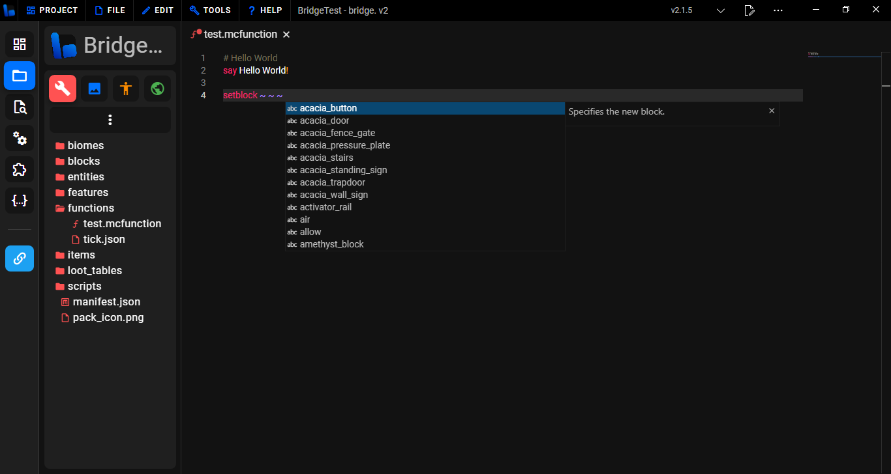

### <!-- md:samp .js -->

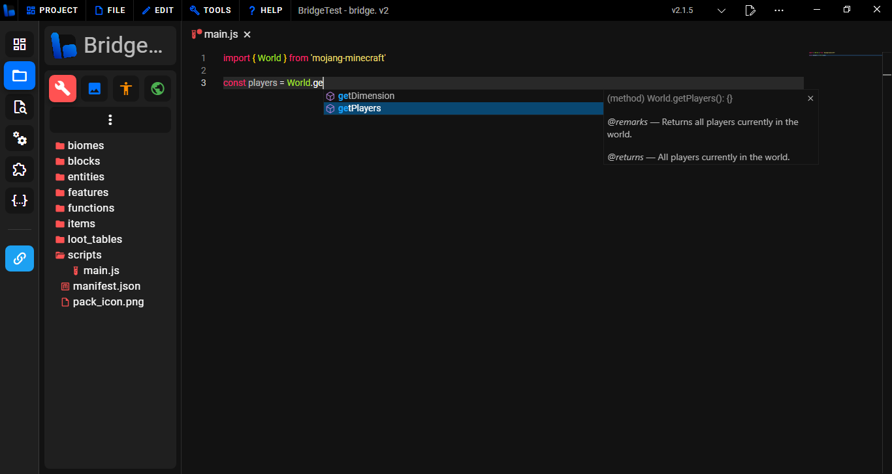

## 独特的编辑功能

bridge.包含许多工具和功能，可以使你的开发体验更快捷、更轻松！

### 文件预览

文件预览是一个功能，它允许你在bridge.内部查看不同的功能，比如预览实体并查看它们的碰撞箱和乘骑位置，甚至是粒子，它具有热重载功能，这意味着在粒子文件中所做的更改会立即反映在预览中。

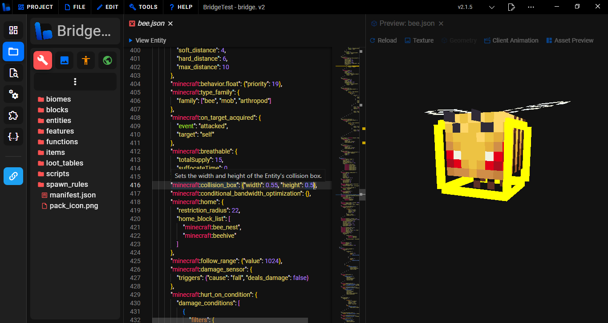

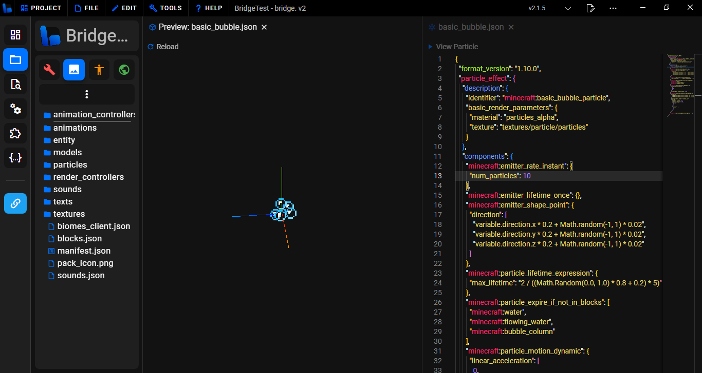

### 跳转到定义

bridge.包含“跳转到定义”数据，可以让你快速地在相关数据的文件之间跳转。

例如：

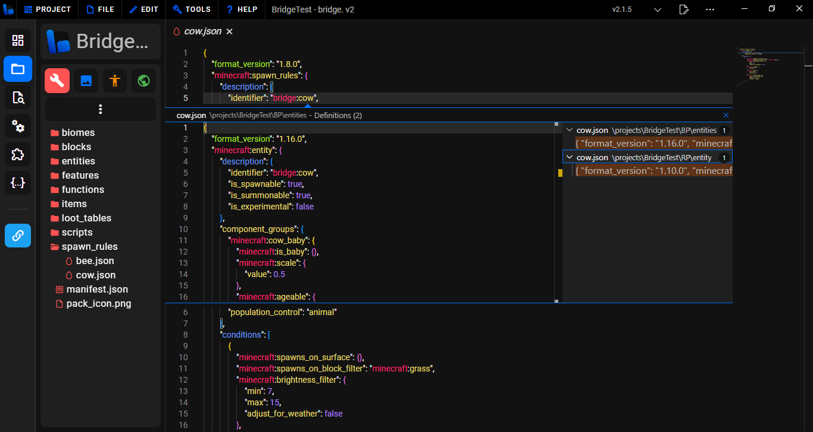

在这里，找到了与生成规则匹配标识符的实体行为文件。

### 自定义语法

bridge.有许多不同的自定义语法能力。它的专用编译器使得在项目中添加自定义语法更加容易。你甚至可以创建你自己的[编译器插件](../../extension/compiler-plugins.md)！

内置的自定义语法包括：

-   [自定义组件](../../extension/custom-components.md)
-   [自定义命令](../../extension/custom-commands.md)
-   [自定义molang](../../extension/custom-molang.md)

在扩展商店中还有更多可用的选项！

## 自定义bridge.

bridge.提供了一个扩展API，允许你自定义用户界面，添加新的标签类型、预设、主题等等！

你可以[创建你自己的扩展](../../extension/index.md)，或者从扩展商店下载其他创作者制作的扩展。
你可以通过点击侧边栏上的**扩展**按钮找到它。从这里你可以下载一系列的扩展来修改和增强你的bridge.体验。

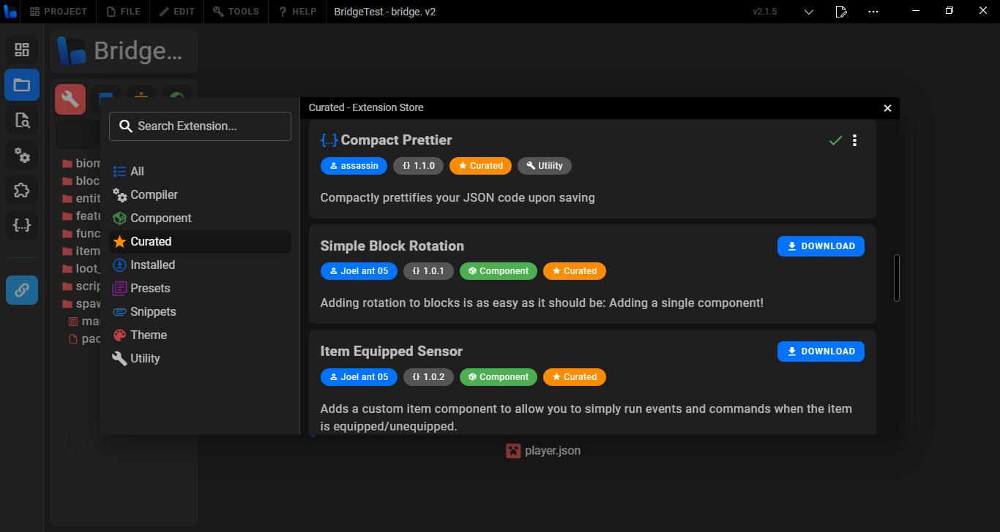

## 需要帮助？

-   加入[官方的bridge. Discord服务器](https://discord.gg/jj2PmqU)！
-   查看[非官方的Minecraft基岩版文档](https://bedrock.dev)
-   在[非官方基岩版Wiki](https://wiki.bedrock.dev)中了解更多关于创建附加包的信息
-   访问[官方的Minecraft基岩版创作者文档](https://docs.microsoft.com/en-us/minecraft/creator)

更多有用的链接可以在[这里](https://wiki.bedrock.dev/knowledge/useful-links.html)找到。